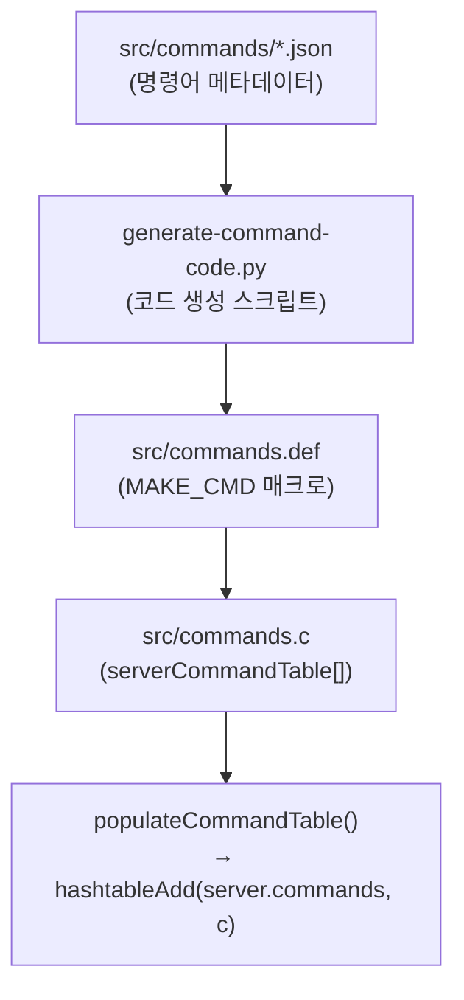
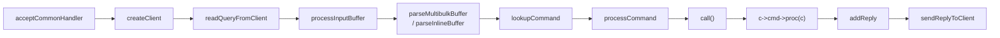

# Why?

Valkey(또는 Redis)를 사용할 때 대부분의 개발자는 `SET`, `GET`, `ECHO` 같은 명령어를 클라이언트 라이브러리를 통해 호출한다. 명령어가 어떻게 서버에 도달하고 실행되는지는 알 필요가 없다 — 라이브러리가 RESP 직렬화와 소켓 통신을 모두 감추기 때문이다.

그런데 만약 Valkey에 새 명령어를 추가하고 싶다고 가정해보자. 가장 직관적인 접근은 `src/server.c`에 함수를 하나 작성하고 어딘가에서 호출하는 것이다. C 프로젝트에서 기능을 추가할 때 함수 작성 → 호출 등록이 일반적인 패턴이므로, 이렇게 생각하는 것은 자연스럽다.

그러나 이 접근은 동작하지 않는다. Valkey는 함수 이름을 직접 호출하는 것이 아니라, 서버 시작 시 **command hashtable**에 등록된 명령어만 실행한다[^V2]. 즉, 함수를 작성하는 것과 별도로 명령어를 이 hashtable에 등록하는 과정이 필요하며, 그 등록은 JSON 정의에서 시작하여 코드 생성 스크립트를 거쳐 자동으로 이루어진다.

이전 글[^V1]에서는 RESP 프로토콜과 robj, 인코딩 전환까지 Valkey의 데이터 구조를 추적했다. 이번 글에서는 관점을 바꿔 **명령어의 생명주기**를 추적한다. `ECHOTONY`라는 커스텀 명령어를 TDD로 추가하면서, JSON 정의에서 `c->cmd->proc(c)` 실행까지의 전체 경로를 코드 수준에서 따라간다.

| 주제 | 해결하는 질문 |
|------|-------------|
| 명령어 등록 4단계 | 새 명령어를 어디에 어떻게 정의하는가? |
| MAKE_CMD 매크로 | JSON 필드가 서버 내부에서 어떤 역할을 하는가? |
| 실행 흐름 7단계 | 클라이언트 요청이 함수 호출까지 어떤 경로를 거치는가? |
| TDD 추가 실습 | 위 구조가 실제로 동작하는지 어떻게 검증하는가? |

글의 전반부(What)에서는 명령어 등록 구조와 실행 흐름을 분석하고, 후반부(How)에서는 TDD 사이클로 실제 명령어를 추가하며 전반부의 구조가 실제로 동작하는지 검증한다.

# What? — 명령어 처리 파이프라인

## 명령어 등록 — JSON 정의에서 command hashtable 까지의 4단계 🗂️

Valkey에서 `ECHO abc`를 실행하면 서버는 `echoCommand` 함수를 즉시 호출한다. 이 동작을 보면, 서버 내부에 `"echo"` → `echoCommand`라는 매핑이 존재한다고 추측할 수 있다. 가장 단순한 구현은 `if-else` 분기나 switch 문으로 명령어 이름을 비교하는 것이다 — 명령어 수가 적다면 이것으로 충분하기 때문이다.

그러나 Valkey는 200개 이상의 명령어를 지원하며, 사용자가 모듈로 명령어를 추가할 수도 있다. 이 규모에서 선형 탐색은 O(n) 비용이 요청마다 발생한다. 실제로 Valkey는 서버 시작 시 모든 명령어를 **command hashtable**에 O(1) lookup이 가능하도록 미리 등록한다[^V2]. 등록 과정은 네 단계를 거친다.



각 단계의 역할은 다음과 같다.

| 단계 | 파일 | 역할 |
|------|------|------|
| 1 | `src/commands/*.json` | 명령어 이름, arity, flags, ACL 등을 JSON으로 선언[^V3] |
| 2 | `utils/generate-command-code.py` | JSON을 읽어 `commands.def` C 코드를 자동 생성 |
| 3 | `src/commands.def` | `MAKE_CMD(...)` 매크로로 명령어 메타데이터와 함수 포인터를 정의 |
| 4 | `populateCommandTable()` | 서버 시작 시 `serverCommandTable[]`을 순회하며 `server.commands` hashtable에 등록[^V4] |

핵심은 JSON 정의 하나가 서버의 command hashtable까지 자동으로 연결된다는 것이다. 그런데 JSON에서 생성된 `MAKE_CMD` 매크로에는 정확히 어떤 정보가 들어갈까? 이 구조를 이해해야 커스텀 명령어의 JSON 필드를 올바르게 결정할 수 있다.

## MAKE_CMD 매크로 — 명령어 메타데이터의 구조 🔬

`commands.def`에 생성되는 `MAKE_CMD` 매크로가 단순한 이름-함수 매핑이라고 생각할 수 있다. 서버가 명령어를 찾아 실행하기만 하면 되므로, 이름과 함수 포인터 두 가지면 충분할 것처럼 보인다.

그러나 실제 `MAKE_CMD`에는 이름과 함수 포인터 외에도 arity, flags, ACL 카테고리 등 다양한 메타데이터가 포함된다. 이 정보들이 없으면 서버는 인자 수 검증, 권한 검사, 클러스터 리다이렉트 등을 수행할 수 없기 때문이다.

다음 코드는 `ECHO` 명령어의 `MAKE_CMD` 구조를 보여준다.

```c
// src/commands.def
{MAKE_CMD("echo",           // name: lookup에 쓰이는 명령어 이름
  "Returns the given string.", // summary
  "O(1)",                   // complexity
  "1.0.0",                  // since
  ...,
  echoCommand,              // function: c->cmd->proc(c)에서 호출
  2,                        // arity: 명령어 이름 포함 인자 수 (ECHO message)
  CMD_LOADING|CMD_STALE|CMD_FAST,  // flags
  ACL_CATEGORY_CONNECTION|ACL_CATEGORY_FAST, // ACL
  NULL, ECHO_Keyspecs, 0,   // key specs (없음)
  NULL, 1),                 // ← numargs: arguments 배열의 길이
 .args = ECHO_Args},
```

각 필드의 역할은 다음과 같다.

| 필드 | 값 | 의미 |
|------|------|------|
| name | `"echo"` | `lookupCommand()`에서 hashtable key로 사용 |
| function | `echoCommand` | 실제 실행될 C 함수 포인터 |
| arity | `2` | 명령어 이름 포함 인자 수. 음수면 "최소" 의미 (예: `-3` → 3개 이상)[^V5] |
| flags | `CMD_LOADING\|CMD_STALE\|CMD_FAST` | 서버 상태별 실행 가능 여부 |
| ACL | `ACL_CATEGORY_CONNECTION\|FAST` | 권한 검사 카테고리[^V6] |
| keyspecs | `0` | 키 인자 없음 |

여기까지 명령어가 어떻게 정의되고 등록되는지를 확인했다. 그러나 등록된 명령어가 클라이언트 요청에 의해 어떻게 찾아지고 실행되는지는 아직 모른다. 등록 과정을 아무리 이해해도, 런타임에 요청이 들어왔을 때 hashtable에서 꺼내져 실행되는 경로를 모르면 커스텀 명령어가 실제로 호출되는 전체 그림을 파악할 수 없다.

## 명령어 실행 흐름 — 소켓 수신에서 응답 전송까지의 7단계 🔄

클라이언트가 `ECHO abc`를 보내면 서버는 즉시 `echoCommand`를 호출하는 것처럼 보인다. 이 관찰만으로는 내부에 단 하나의 함수 호출이 있다고 생각할 수 있다 — 소켓에서 읽고, 바로 실행하는 단순한 구조를 상상하기 쉽다.

그러나 실제로는 소켓 수신부터 응답 전송까지 7단계를 거친다. 네트워크 프로토콜 파싱, 인증/ACL 검사, 클러스터 리다이렉트 판단 등이 실행 전에 먼저 수행되어야 하기 때문이다.



| 단계 | 함수 | 핵심 동작 |
|------|------|----------|
| 1. 연결 수락 | `acceptCommonHandler()` → `createClient()` | client 객체 생성, read 이벤트 핸들러 등록 |
| 2. 데이터 수신 | `readQueryFromClient()` → `readToQueryBuf()` | 소켓에서 데이터를 읽어 client query buffer에 저장 |
| 3. 프로토콜 파싱 | `parseMultibulkBuffer()` / `parseInlineBuffer()` | RESP 프로토콜[^V7] 파싱 → `c->argc`, `c->argv[]` 채움 |
| 4. 명령어 Lookup | `lookupCommand()` → `hashtableFind()` | 앞서 등록된 `server.commands` hashtable에서 `c->cmd` 연결 |
| 5. 검증 | `processCommand()` | 인증, ACL, arity, cluster redirect 등 검사[^V8] |
| 6. 실행 | `call()` → `c->cmd->proc(c)` | 실제 명령어 함수 호출[^V9] |
| 7. 응답 | `addReply()` → `sendReplyToClient()` | 응답 버퍼에 쌓고 소켓으로 전송 |

모든 명령어는 결국 6단계의 `c->cmd->proc(c)` 한 줄로 실행된다. 커스텀 명령어를 추가한다는 것은, 이 `proc`에 연결될 함수를 작성하고 command hashtable에 등록하는 것이다.

4단계의 `lookupCommand()`가 `server.commands` hashtable을 검색한다는 점이 중요하다. 이 hashtable은 앞 절에서 다룬 `populateCommandTable()`이 서버 시작 시 채운 것이다. 즉, 등록 구조(앞 두 절)와 실행 흐름(이 절)이 hashtable 한 지점에서 만난다.

이 구조를 이해했으므로, 이제 실제로 명령어를 추가하면서 각 단계가 동작하는지 검증할 차례다. 단순히 "구현하고 실행해보기"가 아니라, TDD 사이클을 통해 등록 전에는 lookup이 실패하고, 등록 후에는 성공하는 것을 단계적으로 확인한다.

# How? — echoTony 를 TDD 로 추가하기

## 테스트 작성 — 구현 전에 실패부터 확인 (RED) 🔴

TDD에서는 구현 전에 실패하는 테스트를 먼저 작성한다. 실패를 먼저 확인하는 이유는, 테스트가 올바른 조건을 검증하고 있는지를 증명하기 위해서다 — 항상 통과하는 테스트는 아무것도 검증하지 않는다.

다음 코드는 기존 `ECHO` 테스트 패턴을 보여준다. Valkey 테스트 프레임워크는 Tcl 기반이며[^V10], 명령어를 실행하고 결과를 비교하는 단순한 구조를 따른다.

```tcl
// tests/unit/other.tcl
test {Coverage: ECHO} {
    assert_equal bang [r ECHO bang]  // ← r 은 valkey-cli 호출을 추상화한 함수
}
```

이 패턴을 그대로 따라 `ECHOTONY` 테스트를 추가한다.

```tcl
test {Coverage: ECHOTONY} {
    assert_equal bang [r ECHOTONY bang]
}
```

테스트를 실행하면 `ECHOTONY` 명령어가 command hashtable에 존재하지 않으므로 실패한다.

```
r ECHOTONY bang
→ ERR unknown command 'ECHOTONY'
```

이 실패는 예상된 것이다. 앞 절에서 다룬 4단계 Lookup에서 `hashtableFind()`가 `"echotony"`를 찾지 못했기 때문이다. 이제 이 테스트를 통과시키기 위해 명령어를 등록하고 구현한다.

## 명령어 정의 — JSON 에서 commands.def 까지 📝

앞서 명령어 등록의 시작점이 `src/commands/*.json`이라는 것을 확인했다. 새 명령어를 추가하려면 이 디렉토리에 JSON 파일을 생성하는 것이 첫 단계다.

다음 코드는 `src/commands/echotony.json`의 내용이다. 기존 `echo.json`[^V3]을 복제하고 이름과 함수명을 변경한 것이다.

```json
{
    "ECHOTONY": {
        "summary": "Returns the given string.",
        "complexity": "O(1)",
        "group": "connection",
        "since": "8.1.0",
        "arity": 2,
        "function": "echoTonyCommand",  // ← commands.def의 MAKE_CMD function 필드가 됨
        "command_flags": ["LOADING", "STALE", "FAST"],
        "acl_categories": ["CONNECTION", "FAST"],
        "reply_schema": {
            "description": "The given string",
            "type": "string"
        },
        "arguments": [
            { "name": "message", "type": "string" }
        ]
    }
}
```

`arity: 2`는 명령어 이름을 포함해 인자가 정확히 2개라는 의미다(`ECHOTONY message`). 이후 코드 생성 스크립트를 실행하여 `commands.def`를 갱신한다.

```bash
python3 utils/generate-command-code.py
```

`commands.def`에 다음 항목이 자동 생성된다.

```c
// src/commands.def (자동 생성됨)
{MAKE_CMD("echotony","Returns the given string.","O(1)","8.1.0",
  ..., echoTonyCommand, 2,  // ← 이 함수 포인터가 c->cmd->proc에 연결됨
  CMD_LOADING|CMD_STALE|CMD_FAST,
  ACL_CATEGORY_CONNECTION|ACL_CATEGORY_FAST,
  ...), .args=ECHOTONY_Args},
```

이 시점에서 `commands.def`에는 `echoTonyCommand`라는 함수 포인터가 선언되었지만, 해당 함수의 구현은 아직 존재하지 않는다. 컴파일하면 링커가 undefined symbol 오류를 발생시킨다.

## 함수 구현 — proc 에 연결될 C 함수 작성 🔧

`MAKE_CMD`의 `function` 필드에 `echoTonyCommand`가 지정되었으므로, 이 이름의 함수를 작성해야 한다. `src/server.h`에 선언을 추가한다.

```c
// src/server.h
void echoCommand(client *c);
void echoTonyCommand(client *c);  // ← 추가
```

다음 코드는 `echoTonyCommand`의 전체 구현이다. 기존 `echoCommand`[^V11]와 동일하게, 클라이언트가 보낸 메시지를 RESP bulk string으로 그대로 돌려준다.

```c
// src/server.c:4982
void echoTonyCommand(client *c) {
    addReplyBulk(c, c->argv[1]);  // ← argv[0]은 "ECHOTONY", argv[1]이 실제 메시지
}
```

함수 본문이 `addReplyBulk` 한 줄인 이유는, 파싱과 lookup이 이미 상위 파이프라인에서 완료되었기 때문이다. `proc`에 도달하는 시점에서 `c->argv`는 채워져 있고, 함수는 비즈니스 로직만 담당한다.

- `c->argv[0]`은 명령어 이름(`ECHOTONY`)
- `c->argv[1]`은 첫 번째 인자(메시지)
- `addReplyBulk()`는 RESP bulk string 형태로 응답 버퍼에 쓴다[^V12]

`populateCommandTable()`이 이 함수 포인터를 command hashtable에 등록하고, 런타임에 `lookupCommand()`가 이를 찾아 `c->cmd->proc`에 연결한다. 앞 절의 실행 흐름에서 6단계 `c->cmd->proc(c)`가 호출하는 함수가 바로 이것이다.

## 빌드 및 테스트 통과 (GREEN) 🟢

```bash
make -j$(sysctl -n hw.ncpu)
./runtest --single unit/other
```

```
[ok]: Coverage: ECHOTONY (0 ms)
```

테스트가 통과한다. RED에서 실패했던 `hashtableFind()`가 이제 `echoTonyCommand`를 찾아 `c->cmd->proc(c)`로 실행하고, `addReplyBulk()`가 메시지를 응답 버퍼에 쓴 뒤 클라이언트로 전송한 것이다. What 절에서 다룬 등록 → lookup → 실행 → 응답 파이프라인이 실제로 동작함이 확인된다.

## 수동 검증 — valkey-cli 로 직접 확인 💻

자동화된 테스트를 통과했지만, 실제 클라이언트-서버 상호작용을 직접 관찰하면 파이프라인의 각 단계가 더 명확하게 보인다. `valkey-cli`로 확인한다.

```
127.0.0.1:6379> ECHOTONY abc
"abc"
127.0.0.1:6379> ECHOTONY "hello world"
"hello world"
```

받은 내용이 RESP bulk string으로 그대로 돌아온다. 소켓 수신부터 응답 전송까지, What 절에서 분석한 전체 경로가 단일 명령어 추가로 검증되었다.

# 마무리

명령어 하나를 추가하는 과정은 다음 경로를 관통한다.

```
JSON 정의 → commands.def 생성 → serverCommandTable 등록
  → hashtable lookup → c->cmd->proc(c) 실행 → addReply 응답
```

`ECHOTONY`는 가장 단순한 명령어지만, 이 과정을 통해 Valkey가 명령어를 **등록하고, 찾고, 실행하고, 응답하는** 전체 파이프라인을 코드 수준에서 추적할 수 있었다. 핵심 구조를 정리하면 다음과 같다.

- 명령어 정의는 JSON에서 시작하여 코드 생성을 거쳐 자동으로 hashtable에 등록된다
- 모든 명령어 실행은 `c->cmd->proc(c)` 한 줄로 귀결되며, 파싱/인증/검증은 상위 파이프라인이 처리한다
- TDD의 RED → GREEN 사이클은 등록 전/후의 lookup 성공 여부를 정확히 검증한다

다음 단계로는 key를 다루는 명령어(`GET`, `SET`처럼 DB lookup이 필요한 명령어)나 subcommand가 있는 명령어(`CLIENT INFO` 같은 구조)를 추가하면 Valkey 내부를 더 깊이 이해할 수 있다.

[^V1]: Valkey 내부 해부: RESP, robj, 자료구조 인코딩 전환. </posts/valkey-내부-해부-resp-robj-자료구조-인코딩-전환>
[^V2]: `populateCommandTable()`은 `initServer()`에서 호출된다. <https://github.com/valkey-io/valkey/blob/unstable/src/server.c#L3388-L3412>
[^V3]: Valkey 명령어 JSON 정의 예시 (`echo.json`). <https://github.com/valkey-io/valkey/blob/unstable/src/commands/echo.json#L1-L25>
[^V4]: `server.commands`와 `server.orig_commands` 두 hashtable이 존재한다. 전자는 현재 이름 기준, 후자는 `rename-command` 영향을 받지 않는 원래 이름 기준이다. <https://github.com/valkey-io/valkey/blob/unstable/src/server.c#L3388-L3400>
[^V5]: Valkey COMMAND 문서 — arity 필드 설명. <https://valkey.io/commands/command/>
[^V6]: Valkey ACL 카테고리 목록. <https://valkey.io/topics/acl/>
[^V7]: Valkey RESP (Serialization Protocol) 공식 명세. <https://valkey.io/topics/protocol/>
[^V8]: `processCommand()`는 인증, ACL, arity 검사 외에도 cluster redirect, pub/sub 상태, 트랜잭션 큐잉 등을 처리한다. <https://github.com/valkey-io/valkey/blob/unstable/src/server.c#L4200-L4350>
[^V9]: `call()` 함수 내부에서 `c->cmd->proc(c)`가 호출되는 지점. <https://github.com/valkey-io/valkey/blob/unstable/src/server.c#L3912-L3920>
[^V10]: Valkey 테스트 프레임워크는 Tcl 기반이며, `tests/unit/` 디렉토리에 단위 테스트가 위치한다. <https://github.com/valkey-io/valkey/tree/unstable/tests>
[^V11]: 기존 `echoCommand` 구현. <https://github.com/valkey-io/valkey/blob/unstable/src/server.c#L4978-L4980>
[^V12]: `addReplyBulk()`는 `networking.c`에 정의되어 있으며, RESP bulk string 형식(`$<len>\r\n<data>\r\n`)으로 응답을 작성한다. <https://github.com/valkey-io/valkey/blob/unstable/src/networking.c#L850-L865>
