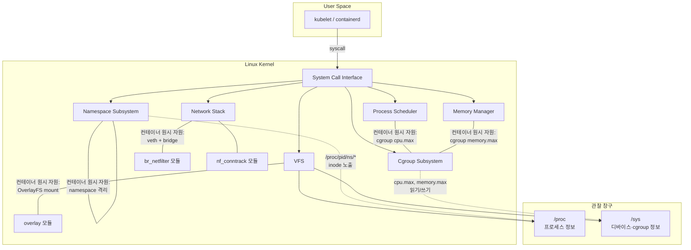
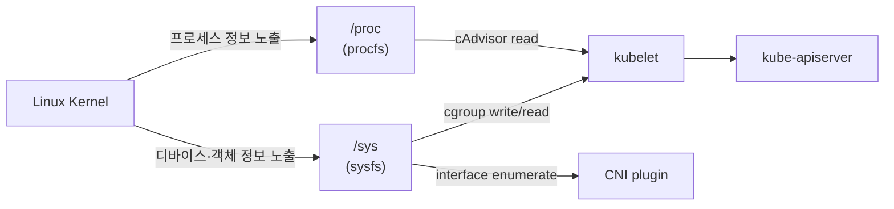
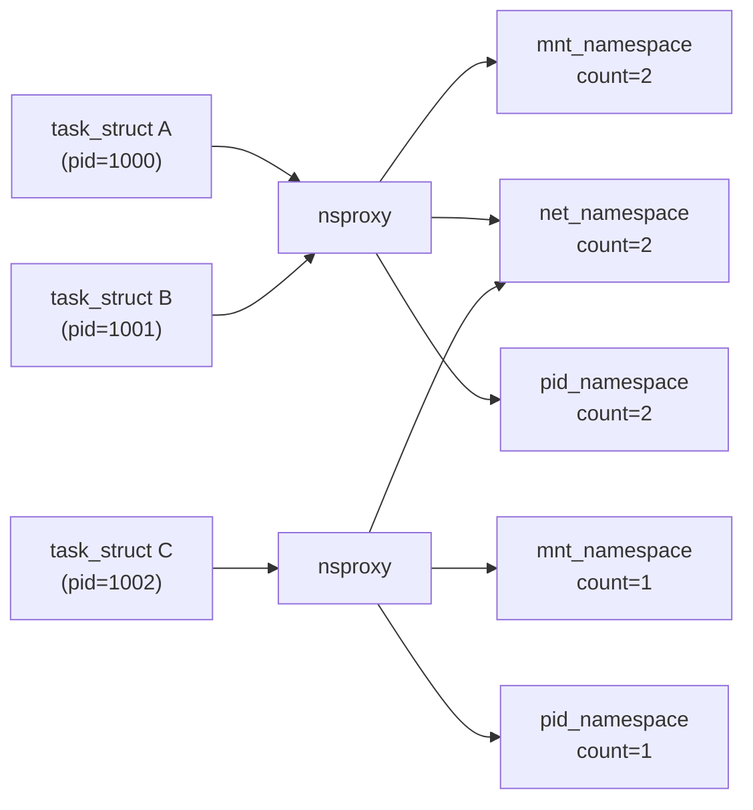
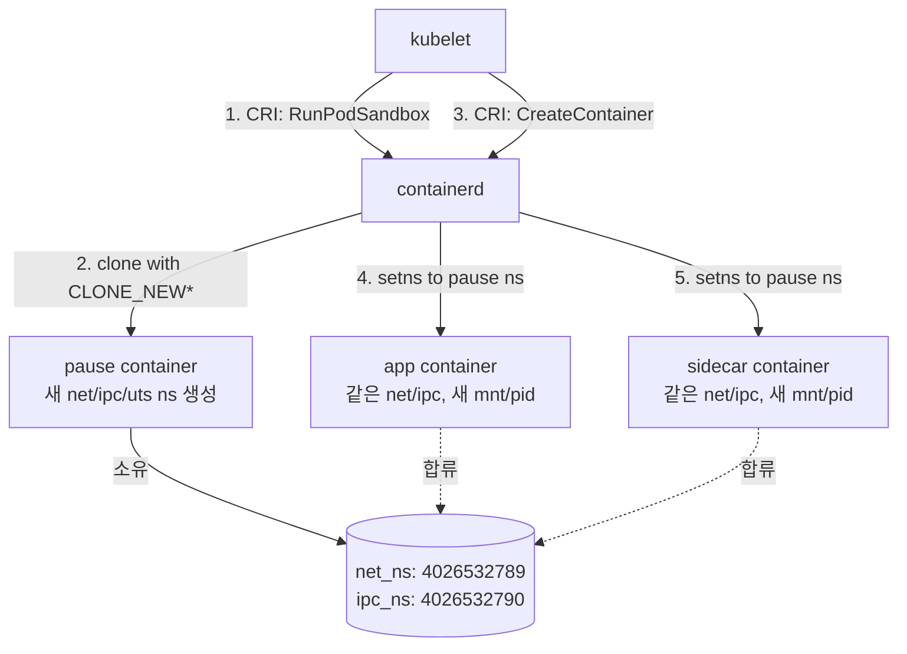
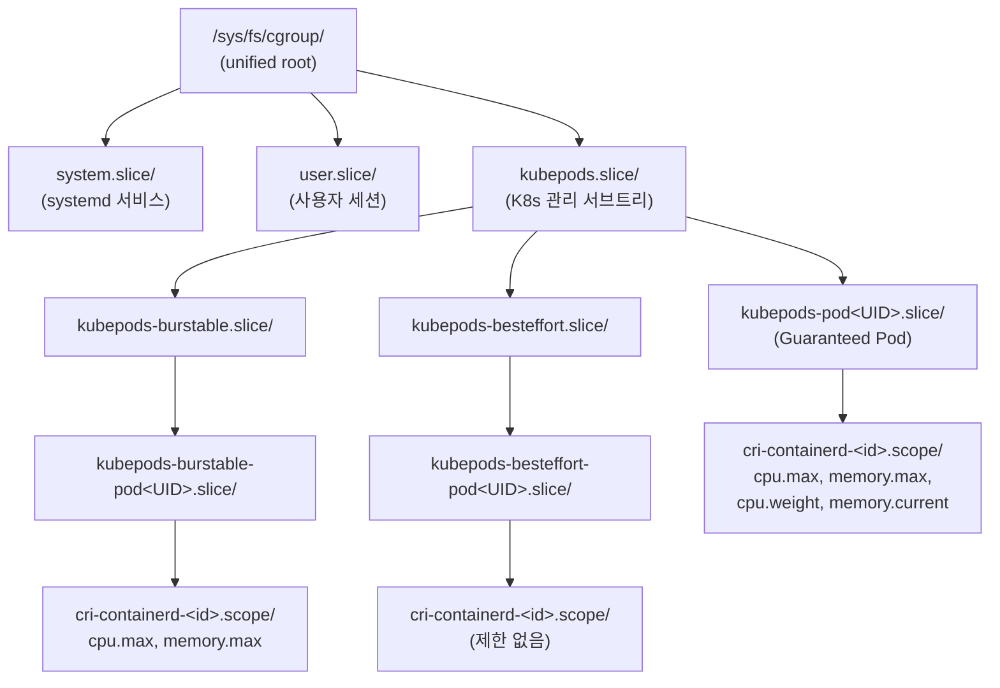
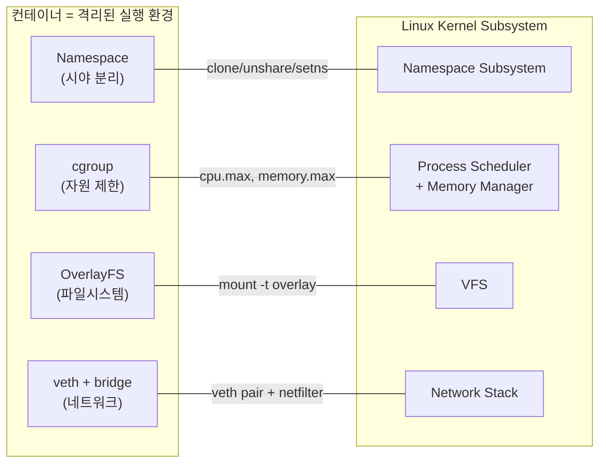
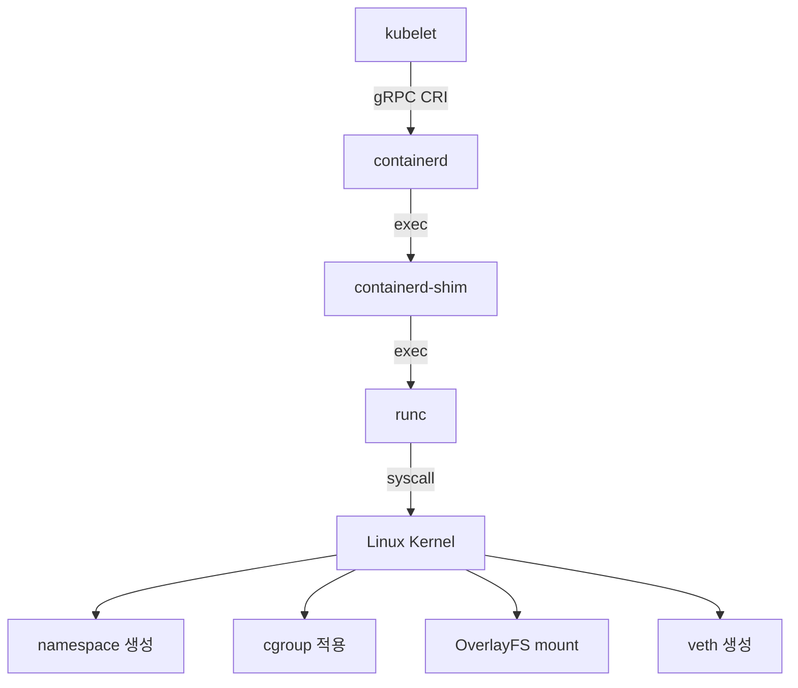

# Why? 왜 배움?

K8s 를 운영하다 보면 한 가지 장면이 반복된다.

Pod 가 `OOMKilled` 로 재시작되는데, `kubectl describe` 에는 exit code 137 만 찍혀 있다.

CPU 사용률은 정상인데 API 응답이 간헐적으로 느려진다.

Pod 는 뜨는데 Service IP 로 접근이 안 된다.

이런 상황에서 "컨테이너를 재시작하면 되지 않나?" 로 넘어가는 경우가 많다.

그러나 재시작으로 해결되지 않는 순간이 오면 근본적인 질문이 남는다.

> _"컨테이너는 정확히 무엇으로 만들어져 있는가?"_

컨테이너는 VM 이 아니다.

별도의 커널을 띄우지 않는다.

호스트 Linux 커널이 이미 제공하는 네 가지 원시 자원 — namespace, cgroup, OverlayFS, veth — 을 조합한 것이 컨테이너의 전부다.

| 원시 자원         | 해결하는 문제                                                     | 핵심 메커니즘                        |
| ----------------- | ----------------------------------------------------------------- | ------------------------------------ |
| **Namespace**     | 프로세스 간 충돌 — 시야를 분리하여 서로의 존재를 보지 못하게 한다 | `clone(2)`, `unshare(2)`, `setns(2)` |
| **cgroup**        | 자원 독점 — CPU, 메모리 사용량에 상한을 건다                      | `/sys/fs/cgroup/` 디렉토리 트리      |
| **OverlayFS**     | 의존성 오염 — 읽기 전용 이미지 레이어 위에 쓰기 레이어를 올린다   | Copy-on-Write 파일시스템             |
| **veth + bridge** | 네트워크 격리 — 독립된 네트워크 스택과 가상 인터페이스를 제공한다 | veth pair, Linux bridge, netfilter   |

이 사실을 알면, 앞의 세 장면의 원인을 특정할 수 있다.

exit code 137 은 `128 + 9 = SIGKILL` 이며[^L1], 이것은 cgroup 의 `memory.max` 를 초과했을 때 커널의 OOM Killer 가 보내는 신호다.

cgroup 을 이해하면 `dmesg -T` 와 `/sys/fs/cgroup/.../memory.events` 로 원인을 즉시 특정할 수 있다.

CPU 가 정상인데 느려지는 현상은 cgroup 의 `cpu.max` 에 의한 CFS Throttling 이다.

`cpu.stat` 의 `nr_throttled / nr_periods` 비율을 확인하면 쓰로틀 심각도를 정량적으로 판단할 수 있다.

Service IP 접근 불가는 `br_netfilter` 커널 모듈이 로드되지 않아 bridge 트래픽이 netfilter 를 거치지 못하는 경우가 대부분이다.

이처럼 커널 원시 자원을 이해하면 컨테이너 장애의 원인을 _추측이 아닌 추적_ 으로 풀 수 있다.

이 지식은 매니지드 K8s 를 사용하더라도 동일하게 적용된다.

클라우드가 숨기는 것은 _설정_ 이지, 장애 시 작동하는 _메커니즘_ 이 아니기 때문이다.

### 이 편의 구조

이 편에서는 커널의 전체 구조와 관찰 도구부터 시작해, 네 원시 자원을 하나씩 해부하고, 마지막으로 OCI 와 CRI 라는 두 표준이 이를 어떻게 "컨테이너" 로 포장하는지 추적한다.

각 절에서 개념을 다룬 직후 인라인 실습으로 검증하며, How 절에서는 네 원시 자원을 직접 조합하여 K8s/Docker 없이 컨테이너를 만드는 종합 실습을 수행한다.

---

# What

---

## 절 1: 커널 지도 — Core Subsystem 과 Kernel Module 로 구성한 커널 전체 구조 🗺️

### 커널 아키텍처의 두 영역

namespace, cgroup 같은 개별 원시 자원을 다루기 전에 먼저 커널의 전체 구조와 관찰 도구를 파악해야 한다.
왜냐하면 커널 구조를 알아야 각 원시 자원이 커널의 어디에 위치하는지 파악할 수 있고, 관찰 도구(`/proc`, `/sys`)를 알아야 이후 실습에서 각 자원의 상태를 직접 확인할 수 있기 때문이다.

Linux 커널은 크게 두 영역으로 나뉜다.
**Core Kernel Subsystem** 과 **Kernel Module** 이다.

Core Kernel Subsystem 은 시스템 부팅과 유지에 필수적인 기능을 담당한다[^L2].
아래 표의 각 서브시스템이 이후 절에서 다룰 원시 자원들과 어떻게 연결되는지 주목하면 전체 그림이 잡힌다.

| 서브시스템        | 역할                                                                                                                                                     |
| ----------------- | -------------------------------------------------------------------------------------------------------------------------------------------------------- |
| Process Scheduler | 프로세스에 CPU 를 할당한다. `cpu.weight` 로 우선순위를, `cpu.max` 로 상한을 제어한다. Pod 의 `requests.cpu` 가 cgroup 을 통해 이 서브시스템으로 전달된다 |
| Memory Manager    | RAM 할당과 회수를 관리한다. 메모리 부족 시 OOM Killer 가 발동한다. Pod 의 `limits.memory` 가 cgroup 을 통해 전달된다                                     |
| VFS               | 여러 파일시스템 구현체에 대한 공통 인터페이스다. 모든 것을 파일로 처리할 수 있게 하며, 커널 상태는 `/proc`, 디바이스 상태는 `/sys` 로 노출한다[^L3]      |
| Network Stack     | 소켓, TCP/IP 프로토콜 처리, netfilter 를 포함한다. kube-proxy 가 설정한 iptables 규칙은 이 서브시스템의 netfilter 에 등록된다                            |
| IPC               | 같은 Pod 는 같은 IPC namespace 를 공유하여 shared memory 로 데이터를 교환한다. 서로 다른 Pod 는 IPC namespace 가 격리되어 분리된다                       |
| Namespace         | 프로세스 그룹마다 독립된 시야를 부여한다. 컨테이너는 namespace 로 격리된 프로세스다                                                                      |
| Cgroup            | 프로세스 그룹 단위로 자원 사용량을 측정하고 제한한다                                                                                                     |

보안과 안정성을 위해 kubelet, containerd 는 user space 에 배치된다.
이들은 System Call Interface 를 통해 커널에 요청하여 cgroup 과 namespace 를 조작한다[^L4].
즉, 컨테이너를 만드는 주체는 kubelet 이나 containerd 이지만, 실제 격리를 수행하는 주체는 커널이다.

커널의 Core Subsystem 과 Kernel Module, 그리고 이들이 컨테이너의 어떤 원시 자원에 대응하는지를 전체 구조도로 정리하면 다음과 같다.



Kernel Module 은 필요할 때 동적으로 로드되는 부가 기능이다.
Core Subsystem 과 달리 항상 메모리에 상주하지 않으며, `modprobe` 로 로드하고 `lsmod` 로 현재 로드된 모듈을 확인한다[^L5].

| 모듈 분류      | 주요 모듈                      | 역할                                                                              |
| -------------- | ------------------------------ | --------------------------------------------------------------------------------- |
| FileSystem     | `overlay`                      | containerd 이미지 레이어를 하나의 파일시스템으로 합쳐 컨테이너 rootfs 를 생성한다 |
| Netfilter      | `br_netfilter`, `nf_conntrack` | bridge 트래픽의 iptables 경유, 연결 추적을 처리한다                               |
| Network Driver | `ip_vs`                        | IPVS 기반 로드밸런싱을 제공한다                                                   |

### `/proc` 와 `/sys` — 커널 상태의 관찰 창구

커널 전체 구조를 파악했으니, 이제 이 커널의 상태를 들여다보는 방법을 알아야 한다.
커널은 자신의 상태를 두 가상 파일시스템으로 노출한다.
둘 다 디스크에 실체가 없으며, 커널이 메모리에서 즉석으로 생성하는 인터페이스라는 점에서 일반 파일과 다르다.

**procfs (`/proc`)** 는 1992 년 Linux 0.96 부터 존재한 가상 파일시스템이며, 프로세스의 상태와 커널 런타임 정보를 노출한다[^L6].

```bash
$ ls /proc/
1  2  3  ...  cpuinfo  meminfo  mounts  net  sys  uptime  ...
```

숫자 디렉토리는 각 프로세스의 PID 다.
`/proc/<pid>/` 안에는 해당 프로세스의 주요 정보가 파일로 노출된다.

| 경로                    | 내용                                                                 |
| ----------------------- | -------------------------------------------------------------------- |
| `/proc/<pid>/cmdline`   | 프로세스를 실행한 명령어                                             |
| `/proc/<pid>/status`    | 메모리 사용량, 상태, UID 등                                          |
| `/proc/<pid>/cgroup`    | 프로세스가 속한 cgroup 경로                                          |
| `/proc/<pid>/ns/`       | 프로세스가 속한 namespace 들의 inode                                 |
| `/proc/<pid>/fd/`       | 프로세스가 연 파일 디스크립터들                                      |
| `/proc/<pid>/mountinfo` | 프로세스가 보는 마운트 정보 (mount ID, parent ID, mount source 포함) |

이후 Namespace 절과 cgroup 절에서 확인할 모든 데이터의 출발점이 `/proc/<pid>/ns/` 와 `/proc/<pid>/cgroup` 이다.
다시 말해, 이 두 경로를 읽을 줄 알아야 컨테이너의 격리 상태와 자원 제한을 직접 확인할 수 있다.

kubelet 의 cAdvisor 역시 이 경로를 활용한다.
cAdvisor 는 `/proc/<pid>/stat` 과 `/proc/<pid>/cgroup` 을 주기적으로 읽어 메트릭을 수집하며[^L7], `kubectl top pod` 의 메트릭이 이 값에서 비롯된다.

**sysfs (`/sys`)** 는 커널 2.6 (2003) 에 도입된 가상 파일시스템이며, 디바이스 트리, 드라이버, 커널 서브시스템의 객체 모델을 노출한다[^L8].

```bash
$ ls /sys/
block  bus  class  dev  devices  firmware  fs  kernel  module  power
```

K8s 가 가장 많이 사용하는 sysfs 경로는 두 곳이다.

- `/sys/fs/cgroup/` — cgroup v2 unified hierarchy 의 루트다. `cpu.max`, `memory.max` 같은 파일에 숫자를 쓰는 것으로 자원 제한이 적용된다.
- `/sys/class/net/` — 각 인터페이스 디렉토리 안에 MTU, MAC 주소, 통계가 파일로 노출된다. CNI 플러그인이 만든 가상 인터페이스 (`cali*`, `cilium*`, `flannel.1` 등) 를 확인할 수 있다.



정리하면, procfs 는 프로세스를, sysfs 는 디바이스/객체를 다룬다.
kubelet 은 namespace 와 프로세스 정보를 읽기 위해 `/proc` 를, cgroup 정보를 읽고 쓰기 위해 `/sys` 를 주기적으로 사용한다.

### 실습 1: /proc 과 /sys 둘러보기

지금까지 `/proc` 와 `/sys` 라는 관찰 도구의 개념을 다뤘지만, 실제로 어떤 값이 나오는지는 직접 보지 않으면 추상으로 남는다.
이 실습에서는 현재 셸 프로세스의 커널 정보를 `/proc` 와 `/sys` 를 통해 직접 확인하고, 이후 namespace/cgroup 실습의 기반이 되는 관찰 명령을 손에 익힌다.

```bash
# 자기 자신의 PID 와 cgroup 확인
echo "내 PID: $$"
cat /proc/$$/cgroup
# 출력 예: 0::/user.slice/user-1000.slice/...

# namespace inode 확인 — 8개의 심링크가 보인다
ls -la /proc/$$/ns/
# 출력 예:
# lrwxrwxrwx 1 user user 0 ... cgroup -> 'cgroup:[4026531835]'
# lrwxrwxrwx 1 user user 0 ... ipc -> 'ipc:[4026531839]'
# lrwxrwxrwx 1 user user 0 ... mnt -> 'mnt:[4026531841]'
# lrwxrwxrwx 1 user user 0 ... net -> 'net:[4026531992]'
# lrwxrwxrwx 1 user user 0 ... pid -> 'pid:[4026531836]'
# lrwxrwxrwx 1 user user 0 ... time -> 'time:[4026531834]'
# lrwxrwxrwx 1 user user 0 ... user -> 'user:[4026531837]'
# lrwxrwxrwx 1 user user 0 ... uts -> 'uts:[4026531838]'

# cgroup 트리 확인
ls /sys/fs/cgroup/
cat /sys/fs/cgroup/cgroup.controllers
# 출력 예: cpuset cpu io memory hugetlb pids rdma misc

# 네트워크 인터페이스 정보
ls /sys/class/net/
cat /sys/class/net/lo/mtu
```

`/proc/$$/ns/` 에서 8개의 심링크가 보이는가?
이것이 다음 절에서 다룰 namespace 에 해당한다.
각 심링크 뒤의 숫자 (예: `net:[4026531992]`) 가 namespace 의 inode 번호이며, 이 번호로 두 프로세스가 같은 namespace 에 속하는지 판별한다.

관찰 도구까지 확인했다.
그런데 관찰 도구만으로는 격리가 어떻게 만들어지는지 알 수 없다.
아직 모르는 것은 `/proc/$$/ns/` 에 있는 8개의 namespace 가 구체적으로 무엇이고, 어떤 메커니즘으로 격리를 만드는가이다.
다음 절에서 이 namespace 의 정체를 다룬다.

---

## 절 2: Namespace — task_struct 의 nsproxy 를 통해 분리한 프로세스 시야 👁️

### 격리 문제의 역사

운영체제에서 프로세스들은 기본적으로 같은 파일시스템, 같은 네트워크 스택, 같은 PID 공간을 공유한다.
이 공유는 효율적이지만, 여러 테넌트가 한 시스템을 쓰는 멀티 테넌시 환경에서는 곧바로 문제가 된다.
한 테넌트의 프로세스가 다른 테넌트의 파일을 보거나, 같은 포트를 선점하거나, 서로의 프로세스를 kill 할 수 있기 때문이다.

Unix 계열은 이 격리 문제를 단계적으로 풀어 왔다.
`chroot(2)` 가 1979 년에 파일시스템 루트를 분리했고, FreeBSD `jail(8)` 이 2000 년에 네트워크와 프로세스 가시성까지 분리했으며, Solaris Zones 가 2004 년에 OS-level virtualization 을 구현했다[^L9].

Linux 가 이 흐름에 합류한 것이 **namespace** 다.
2002 년 mount namespace 부터 시작해 단계적으로 추가되었고, 2013 년 user namespace 도입으로 컨테이너의 토대가 갖춰졌다.

핵심 발상은 다음과 같다.

> **프로세스 그룹마다 서로 다른 시야를 갖게 한다.**

같은 커널 위에서 동작하지만, A 그룹은 B 그룹의 프로세스를 볼 수 없다.
A 가 보는 `/`, `lo` 인터페이스, hostname 은 B 의 것과 완전히 다른 객체다.

### 8 가지 namespace

현재 (Linux 5.6 이후) 커널은 8 종류의 namespace 를 제공한다[^L10].
각 namespace 가 격리하는 대상이 서로 다르므로, 컨테이너는 이 중 필요한 조합을 골라 사용한다.

| Namespace  | clone flag        | 격리 관심사                                        | 도입          |
| ---------- | ----------------- | -------------------------------------------------- | ------------- |
| **MNT**    | `CLONE_NEWNS`     | 어떤 파일시스템이 어디에 마운트되어 있는가         | 2.4.19 (2002) |
| **UTS**    | `CLONE_NEWUTS`    | hostname, domainname                               | 2.6.19        |
| **IPC**    | `CLONE_NEWIPC`    | System V IPC, POSIX message queue                  | 2.6.19        |
| **PID**    | `CLONE_NEWPID`    | 프로세스 ID 공간                                   | 2.6.24        |
| **NET**    | `CLONE_NEWNET`    | 네트워크 인터페이스, IP, 라우팅, 방화벽 규칙, 포트 | 2.6.29        |
| **USER**   | `CLONE_NEWUSER`   | UID/GID 매핑                                       | 3.8 (2013)    |
| **CGROUP** | `CLONE_NEWCGROUP` | `/proc/self/cgroup` 의 가상화된 view               | 4.6           |
| **TIME**   | `CLONE_NEWTIME`   | `CLOCK_MONOTONIC`, `CLOCK_BOOTTIME`                | 5.6           |

이 표를 실제 현상과 연결하면 다음과 같다.
`hostname` 이 호스트와 다른 것은 UTS namespace 때문이고, `ps aux` 가 컨테이너 안에서 자기 자신만 보는 것은 PID namespace 때문이며, `iptables -L` 이 호스트 규칙을 안 보는 것은 NET namespace 때문이다.

### 커널의 namespace 표현 구조

namespace 가 무엇을 격리하는지 알았으니, 이제 커널이 이 격리를 내부적으로 어떻게 표현하는지 살펴보자.

Linux 커널에서 모든 프로세스는 `task_struct` 구조체로 표현된다[^L11].
이 구조체에 `struct nsproxy *nsproxy` 필드가 있고, `nsproxy` 는 8 종류의 namespace 객체에 대한 포인터를 모두 가진다[^L12].

```c
// linux/include/linux/nsproxy.h (단순화)
struct nsproxy {
    atomic_t count;
    struct uts_namespace    *uts_ns;
    struct ipc_namespace    *ipc_ns;
    struct mnt_namespace    *mnt_ns;
    struct pid_namespace    *pid_ns_for_children;
    struct net              *net_ns;
    struct time_namespace   *time_ns;
    struct cgroup_namespace *cgroup_ns;
};
```

각 namespace 는 자신만의 자료구조와 reference counter 를 가진 독립된 커널 객체다.
같은 namespace 객체를 가리키는 `task_struct` 가 하나도 남지 않으면 reference count 가 0 이 되어 그 namespace 는 파괴된다.

> **마지막 프로세스가 죽으면 그가 속해 있던 namespace 도 함께 사라진다.**

이 규칙이 뒤에 나올 pause container 의 존재 이유와 직결된다.



위 다이어그램에서 task A 와 B 는 같은 mount/net/pid namespace 를 공유하고, task C 는 mount 와 pid 는 다르지만 net 은 같이 쓴다.
이 구조가 Pod 의 정의와 직결되는데, 그것을 이해하려면 먼저 namespace 를 다루는 시스템 콜부터 짚어야 한다.

### 세 개의 시스템 콜

사용자 공간에서 namespace 를 다루는 시스템 콜은 세 개다[^L13].
모든 컨테이너 런타임 — runc, crun, containerd-shim, podman — 이 이 세 개를 호출한다.

**`clone(2)`** — 새 프로세스를 만들 때 `CLONE_NEW*` 플래그를 OR 로 묶어 전달하면, 해당 종류의 새 namespace 를 함께 만든다.

```c
int flags = CLONE_NEWPID | CLONE_NEWNS | CLONE_NEWNET
          | CLONE_NEWUTS | CLONE_NEWIPC | CLONE_NEWCGROUP;
pid_t child = clone(child_fn, stack, flags | SIGCHLD, args);
```

위 한 호출로 새 프로세스는 자기만의 PID 공간, 마운트 네임스페이스, 네트워크 스택, hostname, IPC 공간, cgroup view 를 가지게 된다.

**`unshare(2)`** — 현재 프로세스가 지금 속한 namespace 에서 떨어져 나와 새 namespace 로 들어간다[^L14].
fork 없이 자기 자신의 시야를 바꾸며, `unshare(1)` 명령이 이를 직접 호출한다.

**`setns(2)`** — `/proc/<pid>/ns/<type>` 의 file descriptor 를 받아 이미 존재하는 다른 namespace 에 합류한다[^L15].
`nsenter(1)` 명령어가 내부에서 이를 사용한다.
K8s 사이드카 컨테이너가 메인 컨테이너의 namespace 에 합류하는 메커니즘도 이것이다.

세 시스템 콜의 차이를 정리하면, `clone()` 은 새 프로세스 + 새 namespace, `unshare()` 는 기존 프로세스 + 새 namespace, `setns()` 는 기존 프로세스 + 기존 namespace 합류다.

### `/proc/<pid>/ns/` 와 inode 식별

커널은 각 namespace 에 inode 번호를 부여하고, `/proc/<pid>/ns/<type>` 이라는 가상 파일로 노출한다.

```bash
$ readlink /proc/self/ns/net
net:[4026531992]
$ readlink /proc/self/ns/pid
pid:[4026531836]
```

두 프로세스가 같은 namespace 에 속하는지 확인하려면 두 inode 번호를 비교하면 된다.
같은 숫자면 같은 시야를 공유하고, 다른 숫자면 완전히 분리된 세계다.

### Pod 와 pause container

> **Pod 는 같은 network namespace 와 IPC namespace 를 공유하지만, mount namespace 와 PID namespace 는 (기본적으로) 분리된 컨테이너들의 그룹이다.**

앞서 "마지막 프로세스가 죽으면 namespace 도 사라진다" 는 규칙을 다뤘다.
이 규칙이 Pod 에서 문제가 되는 이유는, Pod 안의 컨테이너가 OOM 으로 재시작될 때 namespace 가 함께 사라질 수 있기 때문이다.

K8s 는 이 문제를 영원히 살아있는 프로세스를 두는 것으로 해결한다.
그것이 **pause container** 다[^L16].

```c
// kubernetes/build/pause/linux/pause.c (핵심부 단순화)
int main(int argc, char **argv) {
    sigaction(SIGINT, &sa, NULL);
    sigaction(SIGTERM, &sa, NULL);
    sigaction(SIGCHLD, &sa_chld, NULL);
    for (;;) pause();   // 무한 대기
}
```

`pause(2)` 시스템 콜에 영원히 묶여 있는 이 프로세스가 Pod 의 namespace 를 유지하는 anchor 역할을 한다.
Pod 시작 시 가장 먼저 만들어지는 컨테이너가 이것이며, 다른 모든 컨테이너는 이 pause 컨테이너의 namespace 에 `setns()` 로 합류한다.



이를 종합하면 Pod 의 정의는 다음과 같다.
**inode 가 같은 namespace 를 공유하는 컨테이너 그룹, 그리고 그 namespace 를 유지하는 pause anchor.**

### 실습 2: unshare 로 PID namespace 만들기, inode 비교

지금까지 namespace 의 구조와 시스템 콜을 개념적으로 다뤘지만, 실제로 namespace 를 만들고 inode 를 비교해 보지 않으면 추상으로 남는다.
이 실습에서는 `unshare` 로 새 PID namespace 를 직접 만들고, inode 비교를 통해 namespace 분리가 실제로 일어나는지 검증한다.

우선 PID namespace 격리부터 확인하자.

```bash
# 호스트에서 보이는 프로세스 수
ps aux | wc -l
# 출력 예: 120

# PID namespace 분리
sudo unshare --pid --fork --mount-proc bash

# 새 셸 안에서
ps aux
# bash 와 ps 자신만 보인다 (2개)
echo $$
# 1 — 새 namespace 의 init 프로세스
exit
```

새 namespace 안에서 PID 가 1 인 것이 보이는가?
이것이 Namespace 절에서 다룬 "프로세스 그룹마다 서로 다른 PID 공간을 갖게 한다" 는 원리에 해당한다.
컨테이너 안에서 `kill 1` 이 컨테이너를 종료시키는 이유가 바로 이것이다.
해당 프로세스가 새 PID namespace 의 init (PID 1) 이기 때문이다.

다음으로 namespace inode 를 비교한다.

```bash
# 셸 A (호스트)
readlink /proc/$$/ns/net
# 출력: net:[4026531992]

# 셸 B (호스트, 다른 터미널)
readlink /proc/$$/ns/net
# 출력: net:[4026531992]  — 같은 inode, 같은 net namespace

# 셸 C — net namespace 분리
sudo unshare --net bash
readlink /proc/$$/ns/net
# 출력: net:[4026532XXX]  — 다른 inode
ip link show
# lo (DOWN) 만 보인다. 호스트의 eth0 은 보이지 않는다
exit
```

셸 A 와 B 에서 같은 숫자가 나온 것은 두 프로세스가 같은 net namespace 에 속하기 때문이다.
반면 셸 C 에서 다른 숫자가 나온 것은 `unshare --net` 이 새 net namespace 를 만들었기 때문이다.
이것이 "같은 namespace 에 속하면 같은 inode 를 공유한다" 는 원리를 확인한 것이다.

시야는 분리했다.
그러나 namespace 만으로는 한 가지 문제가 해결되지 않는다.
한 프로세스가 CPU 와 메모리를 독점하는 것을 namespace 로는 막을 수 없기 때문이다.
이 자원 독점 문제를 해결하려면 프로세스 그룹 단위로 자원 사용량을 제한하는 메커니즘이 필요하며, 다음 절에서 이를 담당하는 cgroup 을 다룬다.

---

## 절 3: cgroup v2 — unified hierarchy 와 controller 를 활용한 자원 제한 🎛️

### cgroup 의 필요성

namespace 가 시야를 분리하는 도구라면, cgroup 은 자원을 제한하는 도구다.
이 구분이 중요한 이유는, namespace 만으로는 한 컨테이너가 호스트의 모든 CPU 와 메모리를 독점하는 것을 막을 수 없기 때문이다.

cgroup (control group) 은 2007 년 Google 의 Paul Menage 와 Rohit Seth 가 개발해 2.6.24 커널에 머지되었으며, 프로세스 그룹 단위로 자원을 측정하고 제한하는 표준 메커니즘이다[^L17].

### v1 의 한계와 v2 의 통합

cgroup v1 은 자원 종류마다 별도의 hierarchy 를 가졌다.

```
/sys/fs/cgroup/cpu/        <- CPU 전용 hierarchy
/sys/fs/cgroup/memory/     <- memory 전용 hierarchy
/sys/fs/cgroup/blkio/      <- blkio 전용 hierarchy
```

이 구조에서는 동일한 프로세스 그룹에 대해 CPU 와 메모리 정책을 일관되게 적용하기 어려웠다.
예를 들어, CPU hierarchy 와 memory hierarchy 에서 프로세스 그룹의 경계가 달라질 수 있었기 때문이다.

cgroup v2 는 **unified hierarchy** 로 이 문제를 해결했다[^L18].
모든 controller 가 단 하나의 트리를 공유하므로, 하나의 디렉토리 경로로 프로세스 그룹의 모든 자원을 일관되게 관리할 수 있다.

```
/sys/fs/cgroup/                          <- 단 하나의 트리
├── cgroup.controllers
├── cgroup.subtree_control
├── kubepods.slice/                      <- K8s 관리 서브트리
│   ├── kubepods-besteffort.slice/
│   ├── kubepods-burstable.slice/
│   └── kubepods-pod<UID>.slice/
│       └── cri-containerd-<id>.scope/
│           ├── cpu.max
│           ├── memory.max
│           └── ...
```

K8s v1.35 부터 cgroup v1 은 더 이상 지원되지 않으며, kubelet 이 cgroup v1 노드에서는 시작을 거부한다[^L19].

### `/sys/fs/cgroup/` 의 핵심 파일들

cgroup v2 에서 새 디렉토리를 만드는 것이 새 cgroup 을 만드는 것이며, 그 안의 파일에 숫자를 쓰는 것이 자원 제한을 설정하는 것이다.
이 파일 기반 인터페이스가 cgroup 의 핵심이므로, 주요 파일의 역할을 알아야 이후 실습에서 값을 읽고 쓸 수 있다.

| 파일                 | 의미                                                                    |
| -------------------- | ----------------------------------------------------------------------- |
| `cgroup.procs`       | 속한 PID 목록. PID 를 echo 하면 해당 프로세스가 이 cgroup 으로 이동한다 |
| `cgroup.controllers` | 활성화된 controller 목록                                                |
| `cpu.max`            | CPU 제한. `<quota> <period>` (us 단위)                                  |
| `cpu.weight`         | 상대적 가중치 (1-10000, 기본 100)                                       |
| `cpu.stat`           | CPU 사용량 통계                                                         |
| `memory.max`         | 메모리 hard limit (바이트)                                              |
| `memory.high`        | soft limit. 초과 시 회수 압력                                           |
| `memory.current`     | 현재 사용량                                                             |
| `memory.events`      | OOM, 회수 이벤트 카운터                                                 |

### CPU 제한의 정확한 의미

`cpu.max` 의 형식은 `quota period` 다.

```bash
$ cat /sys/fs/cgroup/kubepods.slice/.../cpu.max
50000 100000
```

이 두 숫자는 "100000 us (= 100 ms) 의 주기마다 50000 us (= 50 ms) 만큼만 CPU 를 쓸 수 있다" 는 뜻이다.
즉 0.5 코어에 해당한다.

K8s Pod spec 의 `cpu: 500m` 이 이 두 숫자로 변환된다.
`m` 은 milli (1/1000 코어) 이며, `500m = 0.5 코어 = 50000/100000` 이다[^L20].
이 변환은 kubelet 의 `cgroupManager` 가 담당한다.

### Memory 제한과 OOM Killer

`memory.max` 는 바이트 단위의 hard limit 이다.
이 값을 초과하면 커널은 두 단계를 거친다.

1. **메모리 회수 시도** — 페이지 캐시 회수, swap out 등
2. **OOM Killer 발동** — 회수로도 해결되지 않으면 해당 cgroup 안의 프로세스를 SIGKILL 로 종료[^L21]

여기서 중요한 점은, cgroup OOM 은 해당 cgroup 안의 프로세스만 대상으로 하며, 호스트의 다른 프로세스를 건드리지 않는다는 것이다.
이것이 한 Pod 의 OOM 이 다른 Pod 에 영향을 주지 않는 이유다.

Why 에서 다룬 OOMKilled exit code 137 을 여기서 회수한다.
exit code 137 은 `128 + 9` 로 해석되며, 9 는 SIGKILL 시그널 번호이고 128 은 시그널에 의한 비정상 종료를 나타내는 오프셋 규약이다.
따라서 `kubectl describe pod` 에서 `Last State: Terminated, Exit Code: 137` 이 보이면, 그것은 해당 컨테이너의 cgroup 이 `memory.max` 를 초과해 OOM Killer 가 SIGKILL 을 보낸 결과다.

```bash
sudo dmesg -T | grep -i "killed process"
sudo journalctl -k | grep -i "memory cgroup out of memory"
```

### CPU Throttling

CPU 는 메모리와 달리 초과해도 프로세스가 죽지 않는다.
quota 를 다 쓴 프로세스는 다음 period 가 시작될 때까지 대기 상태로 들어가며, 이를 **throttling** 이라 한다.

CFS (Completely Fair Scheduler) 의 Bandwidth Control 이 이 메커니즘을 담당한다[^L22].

```bash
$ cat /sys/fs/cgroup/kubepods.slice/.../cpu.stat
usage_usec 12345678
nr_periods 1234
nr_throttled 56
throttled_usec 789012
```

| 필드             | 의미                       |
| ---------------- | -------------------------- |
| `usage_usec`     | 사용한 총 시간 (us)        |
| `nr_periods`     | 총 주기 횟수               |
| `nr_throttled`   | Throttling 발생 횟수       |
| `throttled_usec` | Throttling 된 총 시간 (us) |

`nr_throttled` 가 `nr_periods` 의 10% 이상을 넘기면 CPU 부족 신호다.
Why 에서 언급한 "Pod 가 죽지는 않지만 응답이 느려진다" 는 증상이 바로 이 throttling 이며, 에러 로그 없이 성능이 저하되기 때문에 `cpu.stat` 을 직접 확인하지 않으면 원인을 찾기 어렵다.

### K8s Resources 와 cgroup 매핑

| K8s spec                           | cgroup v2 파일              | 의미                    |
| ---------------------------------- | --------------------------- | ----------------------- |
| `resources.requests.cpu: 500m`     | `cpu.weight` (가중치 변환)  | 상대적 우선순위         |
| `resources.limits.cpu: 1`          | `cpu.max` = `100000 100000` | hard limit              |
| `resources.requests.memory: 128Mi` | (scheduler 가 사용)         | 스케줄링 결정용         |
| `resources.limits.memory: 256Mi`   | `memory.max` = `268435456`  | hard limit, 초과 시 OOM |

cgroup v2 unified hierarchy 의 전체 트리 구조를 한 그림으로 정리하면 다음과 같다.



### QoS Class

K8s 는 위 값의 조합으로 Pod 의 QoS Class 를 자동 결정한다[^L23].
이 분류가 중요한 이유는, 노드에 메모리 압박이 생겼을 때 kubelet 이 어떤 Pod 를 먼저 퇴거시킬지 결정하는 기준이 되기 때문이다.

| 조건                                                       | QoS Class      |
| ---------------------------------------------------------- | -------------- |
| 모든 컨테이너에 `requests` = `limits` 가 양쪽 자원 다 설정 | **Guaranteed** |
| 일부 자원에 `requests` 만 또는 `requests < limits`         | **Burstable**  |
| 어떤 자원도 `requests`/`limits` 미설정                     | **BestEffort** |

노드에 메모리 압박이 생기면 kubelet 은 BestEffort -> Burstable -> Guaranteed 순으로 Pod 를 evict 한다.

```
/sys/fs/cgroup/kubepods.slice/
├── kubepods-besteffort.slice/      <- BestEffort Pod
├── kubepods-burstable.slice/       <- Burstable Pod
└── (Guaranteed Pod 는 직접 kubepods.slice 아래)
```

### 실습 3: cgroup 디렉토리 만들고 cpu.max/memory.max 제한, OOM 재현

지금까지 cgroup 의 구조와 CPU/메모리 제한 메커니즘을 개념적으로 다뤘지만, 직접 cgroup 디렉토리를 만들고 프로세스를 넣어보지 않으면 파일 기반 인터페이스가 어떻게 동작하는지 체감하기 어렵다.
이 실습에서는 cgroup 디렉토리를 직접 만들어 CPU 와 메모리 제한을 적용하고, OOM Kill 을 재현하여 exit code 137 의 전체 경로를 검증한다.

우선 cgroup 을 생성하자.

```bash
# 새 cgroup 생성 — 디렉토리를 만드는 것이 cgroup 을 만드는 것이다
sudo mkdir -p /sys/fs/cgroup/lab-test
ls /sys/fs/cgroup/lab-test/
# cpu.max, memory.max 등 파일이 자동 생성된 것을 확인
```

CPU 제한을 적용한다.

```bash
# 0.2 코어로 제한 (20ms / 100ms)
echo "20000 100000" | sudo tee /sys/fs/cgroup/lab-test/cpu.max

# stress-ng 프로세스를 이 cgroup 에 넣고 실행
sudo bash -c "echo \$\$ > /sys/fs/cgroup/lab-test/cgroup.procs; \
  exec stress-ng --cpu 1 --timeout 30s"

# 다른 터미널에서 top 으로 확인
# stress-ng 가 약 20% CPU 만 사용하는 것이 보이는가?
# cgroup 절에서 다룬 "quota 를 다 쓰면 다음 period 까지 대기" 동작이 확인된다
```

메모리 제한과 OOM Kill 을 재현한다.

```bash
# 100MB 로 메모리 제한
echo "104857600" | sudo tee /sys/fs/cgroup/lab-test/memory.max

# 200MB 를 할당 시도 — OOM Kill 이 발생해야 한다
sudo bash -c "
  echo \$\$ > /sys/fs/cgroup/lab-test/cgroup.procs
  stress-ng --vm 1 --vm-bytes 200M --timeout 10s
"
# "Killed" 메시지 출력

echo $?
# 137 = 128 + 9 (SIGKILL)

# 커널 로그에서 OOM 이벤트 확인
sudo dmesg -T | grep -i "memory cgroup out of memory" | tail

# cgroup 이벤트 카운터 확인
sudo cat /sys/fs/cgroup/lab-test/memory.events
# oom 1   oom_kill 1
```

exit code 가 137 인 것이 보이는가?
이것이 바로 Why 에서 다룬 "exit code 137 은 memory.max 초과 -> OOM Killer -> SIGKILL" 의 전체 경로를 수작업으로 재현한 것이다.
`memory.events` 의 `oom_kill 1` 이 커널이 실제로 OOM Kill 을 수행했음을 증명한다.

정리한다.

```bash
sudo rmdir /sys/fs/cgroup/lab-test
```

시야도 잘랐고 자원도 잘랐다.
그러나 이것만으로는 격리된 프로세스가 실행 가능한 환경이 되지 않는다.
실행 가능한 환경이 되려면 프로세스에게 독립된 rootfs (루트 파일시스템) 를 제공해야 하기 때문이다.
다음 절에서 이 rootfs 를 효율적으로 구성하는 OverlayFS 를 다룬다.

---

## 절 4: OverlayFS — lowerdir 과 upperdir 을 결합한 CoW 파일시스템 📁

### 컨테이너 이미지의 본질

앞선 절에서 namespace 로 시야를, cgroup 으로 자원을 격리했다.
그런데 격리된 프로세스에게 독립된 파일시스템을 제공하지 않으면 호스트의 파일을 그대로 보게 되어 진정한 격리가 되지 않는다.

OCI 이미지는 여러 개의 tar 아카이브 (layer) 의 순서 있는 묶음이다[^L24].
각 레이어는 직전 레이어로부터의 변경분만 담고 있다.

```
nginx 이미지의 레이어 (예시)
├── layer 1: ubuntu:22.04 베이스 파일들
├── layer 2: apt 로 nginx 설치한 변경분
├── layer 3: nginx 기본 설정 파일들
└── layer 4: ENTRYPOINT 등 메타데이터
```

이 레이어들을 하나의 파일시스템처럼 합쳐주는 것이 컨테이너 런타임의 역할이며, Linux 에서 가장 널리 쓰이는 구현이 **OverlayFS** 다.

### 네 디렉토리의 역할

OverlayFS 는 네 종류의 디렉토리로 동작한다[^L25].

| 디렉토리     | 역할                                                          |
| ------------ | ------------------------------------------------------------- |
| **lowerdir** | 읽기 전용 베이스 (이미지 레이어들). 여러 개 쌓을 수 있다      |
| **upperdir** | 쓰기 가능한 상위층. 컨테이너 안의 모든 변경이 여기로 기록된다 |
| **workdir**  | OverlayFS 내부 동작용 임시 영역                               |
| **merged**   | 위 셋이 합쳐져 보이는 최종 마운트 지점                        |

핵심 동작 규칙은 다음과 같다.

- **읽기**: upperdir 에 파일이 있으면 그것을, 없으면 lowerdir 들을 위에서부터 차례로 검색
- **쓰기**: 항상 upperdir 에 기록
- **수정**: lowerdir 의 파일을 수정하면 먼저 upperdir 로 복사 (Copy-on-Write) 한 뒤 수정
- **삭제**: lowerdir 의 파일을 삭제하면 upperdir 에 whiteout 특수 파일을 만들어 삭제된 것으로 표시

> **여러 컨테이너가 같은 이미지를 쓸 때, lowerdir 는 한 번만 디스크에 있으면 된다.**

이 사실이 의미하는 바는 다음과 같다.
100 개의 nginx 컨테이너가 떠도 lowerdir 는 디스크에 한 벌만 있고, 각자 자기만의 upperdir 에 변경분만 쌓는다.
이것이 컨테이너가 VM 보다 디스크 사용량이 적은 핵심 이유 중 하나다.

### containerd snapshotter 와 OverlayFS

containerd 는 이미지 관리를 snapshotter 라는 추상으로 다룬다[^L26].
기본 snapshotter 는 `overlayfs` 이며, 이미지 pull 시 다음 과정을 거친다.

1. 레지스트리에서 각 레이어 (gzip 된 tar) 를 다운로드
2. 압축 해제하여 `/var/lib/containerd/io.containerd.snapshotter.v1.overlayfs/snapshots/<id>/fs/` 에 저장
3. 컨테이너 생성 시 위 디렉토리들을 lowerdir 로, 새 디렉토리를 upperdir 로 사용해 OverlayFS mount

호스트에서 직접 확인할 수 있다.

```bash
$ mount | grep overlay
overlay on /run/containerd/.../rootfs type overlay
  (rw,relatime,
   lowerdir=/.../snapshots/123/fs:/.../snapshots/124/fs,
   upperdir=/.../snapshots/125/fs,
   workdir=/.../snapshots/125/work)
```

### 실습 4: mount -t overlay, CoW 확인, Docker 컨테이너와 비교

지금까지 OverlayFS 의 네 디렉토리 구조와 Copy-on-Write 규칙을 개념적으로 다뤘다.
그러나 실제로 마운트하고 파일을 수정해 보지 않으면 lowerdir 원본이 정말 변하지 않는지, upperdir 에 변경분이 정말 기록되는지 확신할 수 없다.
이 실습에서는 OverlayFS 를 직접 마운트하고, Copy-on-Write 동작을 확인한 뒤, Docker 컨테이너의 overlay 마운트와 비교한다.

우선 디렉토리를 만들고 마운트하자.

```bash
mkdir -p /tmp/ovl/{lower1,lower2,upper,work,merged}

echo "from lower1" > /tmp/ovl/lower1/file-a.txt
echo "from lower2" > /tmp/ovl/lower2/file-b.txt
echo "lower1 wins" > /tmp/ovl/lower1/file-b.txt

sudo mount -t overlay overlay \
  -o lowerdir=/tmp/ovl/lower1:/tmp/ovl/lower2,\
upperdir=/tmp/ovl/upper,workdir=/tmp/ovl/work \
  /tmp/ovl/merged

ls /tmp/ovl/merged/
# file-a.txt  file-b.txt

cat /tmp/ovl/merged/file-b.txt
# "lower1 wins" — lower1 이 lower2 보다 우선
```

lower1 의 file-b.txt 가 lower2 의 것을 가린 것이 보이는가?
이것이 바로 OverlayFS 절에서 다룬 "lowerdir 들을 위에서부터 차례로 검색" 규칙의 물리적 실체다.

Copy-on-Write 동작을 확인한다.

```bash
echo "modified" >> /tmp/ovl/merged/file-a.txt

cat /tmp/ovl/lower1/file-a.txt
# "from lower1" — 원본 변경 없음

cat /tmp/ovl/upper/file-a.txt
# "from lower1\nmodified" — 변경분은 upper 에 기록
```

lower1 의 원본이 그대로인 것이 보이는가?
수정 시 lowerdir 의 파일이 upperdir 로 복사된 뒤 수정된 것이다.
이것이 Copy-on-Write 이며, 여러 컨테이너가 같은 이미지 레이어를 공유할 수 있는 이유다.

Docker 컨테이너의 overlay 마운트와 비교한다.

```bash
docker run -d --name web nginx
mount | grep overlay | head -2
# Docker 가 만든 overlay 마운트도 동일한 lowerdir/upperdir/workdir 구조

docker rm -f web
sudo umount /tmp/ovl/merged
rm -rf /tmp/ovl
```

파일시스템까지 갖춰졌다.
그러나 격리된 프로세스가 외부와 통신하려면 독립된 네트워크 스택이 있어야 한다.
namespace 로 네트워크를 분리하면 `lo` 인터페이스 하나만 남은 빈 공간이 되므로, 여기에 가상 인터페이스를 넣고 연결하는 메커니즘이 필요하다.
다음 절에서 이 네트워크 원시 자원을 다룬다.

---

## 절 5: 네트워크 원시 자원 — veth, bridge, netfilter 로 구성한 Pod 네트워크 🌐

### net namespace 에 의한 네트워크 격리

격리의 마지막 축은 독립된 네트워크 스택이다.

새 net namespace 안에는 기본적으로 `lo` (loopback) 인터페이스 하나만 있고, 그것조차 처음에는 DOWN 상태다.
호스트의 `eth0` 도, 호스트의 `iptables` 규칙도 새 namespace 안에서는 존재하지 않는다.

이 빈 공간에 인터페이스를 넣고 IP 를 부여하고 라우팅을 설정하는 것이 컨테이너 네트워킹의 본질이다.
K8s 에서는 CNI 플러그인이 이 작업을 담당하며, 사용하는 Linux 커널 기능은 다음 셋이다.

### veth pair — 가상 이더넷 페어

`veth` (virtual ethernet) 는 항상 쌍으로 만들어지는 가상 인터페이스다[^L27].
한쪽 끝으로 들어간 패킷이 반드시 다른 쪽 끝으로 나온다.
물리적 이더넷 케이블의 양쪽 끝이라고 생각하면 된다.

```bash
# veth pair 생성
sudo ip link add veth-host type veth peer name veth-pod

# 한쪽을 컨테이너 namespace 로 이동
sudo ip link set veth-pod netns <pod-netns>
```

이 한 쌍으로 호스트 namespace 와 컨테이너 namespace 사이의 연결이 만들어진다.
CNI 플러그인이 Pod 를 만들 때 가장 먼저 하는 일이 바로 이 veth pair 생성이다.

### bridge — 가상 L2 스위치

veth 만으로는 한 컨테이너와 호스트 사이만 연결할 수 있다.
그렇다면 같은 노드의 여러 Pod 가 서로 통신하려면 어떻게 해야 하는가?
물리 네트워크에서 여러 장비를 연결할 때 스위치를 쓰듯, 가상 네트워크에서도 가상 스위치가 필요하다.
Linux 의 **bridge** 가 그 역할을 한다[^L28].

```bash
sudo ip link add cni0 type bridge
sudo ip link set cni0 up
sudo ip link set veth-host-pod1 master cni0
sudo ip link set veth-host-pod2 master cni0
```

`cni0` bridge 를 통해 pod1 과 pod2 가 같은 L2 세그먼트에 놓인다.

### netfilter — 패킷 처리의 hook 시스템

**netfilter** 는 Linux 커널 네트워크 스택의 5 개 hook 지점에서 패킷을 가로채 검사하고 변형하는 프레임워크다[^L29].
5 hook (`PREROUTING`, `INPUT`, `FORWARD`, `OUTPUT`, `POSTROUTING`) 위에 iptables, nftables, kube-proxy, Calico, Cilium 이 규칙을 등록한다.

K8s 에서 가장 자주 쓰이는 netfilter 동작 두 가지는 다음과 같다.

- **DNAT (Destination NAT)** in PREROUTING — Service ClusterIP 로 들어온 패킷을 실제 Pod IP 로 변환한다
- **MASQUERADE (Source NAT)** in POSTROUTING — Pod 가 외부로 나갈 때 출발지 IP 를 노드 IP 로 변환한다

### nf_conntrack — 연결 추적

netfilter 가 NAT 를 수행하려면 어떤 패킷이 어떤 연결에 속하는가를 기억해야 한다.
왜냐하면 요청 패킷의 목적지를 변환했으면, 응답 패킷이 돌아올 때 출발지를 원래대로 복원해야 하기 때문이다.
이 일을 하는 것이 **nf_conntrack** 모듈이다[^L30].

```bash
$ sudo conntrack -L | head
tcp  6  86399  ESTABLISHED src=10.244.0.5 dst=10.96.0.1 sport=51234 dport=443
  src=10.244.0.10 dst=10.244.0.5 sport=8443 dport=51234
```

K8s 클러스터에서 `net.netfilter.nf_conntrack_max` 값이 부족하면 connection drop 이 발생한다.

### K8s 필수 커널 파라미터

K8s 클러스터 부트스트랩 시 반드시 켜야 하는 설정이다.

```bash
# /etc/sysctl.d/k8s.conf
net.ipv4.ip_forward = 1
net.bridge.bridge-nf-call-iptables = 1
net.bridge.bridge-nf-call-ip6tables = 1
```

```bash
sudo modprobe br_netfilter
```

`ip_forward = 1` 이 꺼져 있으면 노드는 자기 IP 가 아닌 패킷을 forward 하지 않는다[^L31].
K8s 는 노드가 Pod 들의 게이트웨이 역할을 해야 하므로 반드시 켜져 있어야 한다.

`br_netfilter` + `bridge-nf-call-iptables = 1` 은 bridge (L2) 위의 패킷도 iptables (L3) 규칙을 거치게 강제한다.
이 설정이 없으면 bridge 를 통과하는 패킷이 iptables 의 NAT 규칙을 우회하게 되므로, K8s 의 Service NAT 가 동작하지 않는다.

Why 에서 언급한 "Service 접근 불가" 증상이 바로 이 두 파라미터의 미설정에서 발생한다.
Pod 는 정상이지만 Service IP 가 작동하지 않거나 노드 간 통신이 끊기는 증상이 나타난다.

### 실습 5: veth pair 만들고 bridge 연결, ping 테스트

지금까지 veth, bridge, netfilter 를 개념적으로 다뤘다.
그러나 가상 네트워크를 직접 구성해 보지 않으면 "한쪽 끝으로 들어간 패킷이 다른 쪽으로 나온다" 는 설명이 실감나지 않는다.
이 실습에서는 두 개의 net namespace 를 만들고 veth pair 로 연결한 뒤, bridge 를 통해 통신이 되는지 직접 검증한다.

우선 namespace 와 veth pair 를 만들자.

```bash
# net namespace 생성
sudo ip netns add red
sudo ip netns add blue

# veth pair 생성
sudo ip link add veth-red type veth peer name veth-blue
sudo ip link set veth-red  netns red
sudo ip link set veth-blue netns blue

# IP 부여 및 활성화
sudo ip -n red  addr add 10.0.0.1/24 dev veth-red
sudo ip -n blue addr add 10.0.0.2/24 dev veth-blue
sudo ip -n red  link set veth-red  up
sudo ip -n blue link set veth-blue up
sudo ip -n red  link set lo up
sudo ip -n blue link set lo up

# red -> blue ping
sudo ip netns exec red ping -c 2 10.0.0.2
# PING 10.0.0.2 (10.0.0.2) 56(84) bytes of data.
# 64 bytes from 10.0.0.2: icmp_seq=1 ttl=64 time=0.045 ms
```

응답이 오는 것이 보이는가?
이것이 바로 veth pair 절에서 다룬 "한쪽 끝으로 들어간 패킷이 반드시 다른 쪽 끝으로 나온다" 는 원리의 물리적 실체다.
CNI 플러그인이 Pod 마다 이와 동일한 작업을 수행한다.

bridge 를 추가하여 세 번째 namespace 와의 통신을 확인할 수도 있다.

```bash
# bridge 생성
sudo ip link add br0 type bridge
sudo ip link set br0 up
sudo ip addr add 10.0.0.254/24 dev br0

# 새 namespace 와 veth pair
sudo ip netns add green
sudo ip link add veth-green-h type veth peer name veth-green
sudo ip link set veth-green netns green
sudo ip -n green addr add 10.0.0.3/24 dev veth-green
sudo ip -n green link set veth-green up
sudo ip -n green link set lo up
sudo ip link set veth-green-h master br0
sudo ip link set veth-green-h up

# bridge 에서 green 으로 ping
ping -c 2 10.0.0.3

# 정리
sudo ip netns delete red
sudo ip netns delete blue
sudo ip netns delete green
sudo ip link delete br0
```

네 원시 자원이 모두 나왔다.
namespace 로 시야를 분리하고, cgroup 으로 자원을 제한하고, OverlayFS 로 파일시스템을 구성하고, veth/bridge/netfilter 로 네트워크를 연결한다.

그런데 이 네 원시 자원을 매번 수작업으로 조합할 수는 없다.
표준 없이 각 도구가 제각각 조합하면 런타임을 교체할 때마다 방식이 달라져 호환성이 깨지기 때문이다.
이 문제를 해결하기 위해 원시 자원 조합 방식을 표준화한 것이 OCI 와 CRI 이며, 다음 절에서 이를 다룬다.

---

## 절 6: OCI 와 CRI — 원시 자원 조합을 표준화한 컨테이너 인터페이스 📐

### 컨테이너 = 4 원시 자원의 조합

지금까지 다룬 네 원시 자원이 합쳐져서 하나의 컨테이너가 되는 관계를 구조도로 보면 다음과 같다.



### 두 표준의 역할 구분

namespace, cgroup, OverlayFS, veth 라는 원시 자원을 조합해 컨테이너를 만드는 방법은 처음에는 도구마다 제각각이었다.
Docker, LXC, rkt, podman 이 각자의 방식으로 같은 일을 했고, 그 결과 특정 도구에 종속되는 문제가 발생했다.

이 혼란을 정리한 것이 두 표준이다.

- **OCI (Open Container Initiative)** — 이미지의 형식과 런타임이 따라야 할 규약의 표준[^L32]
- **CRI (Container Runtime Interface)** — kubelet 과 컨테이너 런타임 사이의 gRPC 인터페이스 표준[^L33]

두 표준의 관계를 먼저 짚으면, OCI 는 "컨테이너를 어떻게 만들고 실행하는가" 를 정의하고, CRI 는 "오케스트레이터가 런타임에게 어떻게 명령하는가" 를 정의한다.

### OCI — 이미지와 런타임의 양면

OCI 는 두 spec 으로 나뉜다.

**OCI Image Spec** — 컨테이너 이미지의 형식을 정의한다[^L34].

```
이미지 = manifest + config.json + 여러 layer (tar.gz)
```

이 spec 덕분에 Docker Hub 에 push 한 이미지를 containerd, podman, crio 모두 동일하게 읽을 수 있다.

**OCI Runtime Spec** — 이미지가 압축 해제된 rootfs 와, namespace, cgroup, capability, mount 를 지정한 `config.json` 을 받아 컨테이너를 실행한다[^L35].

이 spec 의 참조 구현이 **runc** 다.

```bash
runc run my-container
# 같은 디렉토리에 config.json 과 rootfs/ 가 있어야 한다
```

### CRI — kubelet 과 런타임의 약속

OCI 가 "런타임이 컨테이너를 어떻게 만드는가" 의 표준이라면, CRI 는 "kubelet 이 런타임에게 어떻게 지시하는가" 의 표준이다.
K8s 1.5 (2016) 에 도입되었고, kubelet 이 어떤 컨테이너 런타임이든 같은 방식으로 다룰 수 있게 만들었다[^L33].

CRI 는 gRPC 기반이며 두 서비스로 나뉜다.

- **RuntimeService** — 컨테이너와 sandbox (Pod) 의 라이프사이클
- **ImageService** — 이미지 pull, list, remove

| RPC                                 | 의미                                            |
| ----------------------------------- | ----------------------------------------------- |
| `RunPodSandbox`                     | Pod 의 namespace 를 만들고 pause container 시작 |
| `CreateContainer`                   | sandbox 안에 새 컨테이너 spec 생성              |
| `StartContainer`                    | 컨테이너 실행                                   |
| `StopContainer` / `RemoveContainer` | 종료와 정리                                     |
| `ListContainers`                    | 현황 조회                                       |

### kubelet -> containerd -> runc -> kernel 사다리



각 층의 책임은 다음과 같다.

- kubelet — 어떤 Pod 가 어디에 있어야 하는가를 판단하고 CRI 로 명령을 내린다
- containerd — CRI 명령을 OCI 호출로 번역한다
- runc — OCI config 를 시스템 콜로 번역한다
- 커널 — 시스템 콜을 받아 실제 격리/마운트/네트워크를 수행한다

이 사다리를 알면 Pod 가 안 뜰 때 어느 층에서 막혔는지 계층별로 추적할 수 있다.
kubelet 수준의 문제인지, containerd 수준인지, runc 수준인지, 커널 수준인지를 구분하는 것이다.
확인 순서는 `kubectl describe pod` -> `crictl ps -a` -> `journalctl -u containerd` -> `dmesg` 다.

이 편의 완결이다.
단일 노드 위에서 커널의 네 원시 자원이 OCI/CRI 표준을 통해 컨테이너라는 추상으로 조합되는 전체 경로를 다루었다.
다음 편에서는 이 컨테이너들을 여러 노드에 걸쳐 관리하는 kubelet 과 Pod 의 신원 체계를 다룬다.

---

# How — 종합 실습

What 의 각 절에서 개별 원시 자원을 실습했다.
그러나 개별 실습만으로는 네 원시 자원이 실제로 어떻게 결합되어 하나의 컨테이너가 되는지 체감하기 어렵다.
이 장에서는 네 원시 자원이 실제로 조합되는 전체 흐름을 종합 확인한다.

모든 실습은 Multipass 위의 단일 Ubuntu 22.04 VM 에서 수행한다[^L36].

## 환경 준비

```bash
# Multipass 설치 (Mac)
brew install --cask multipass

# VM 생성
multipass launch --name k8s-lab \
  --cpus 2 --memory 4G --disk 20G 22.04

# VM 진입
multipass shell k8s-lab
```

```bash
# VM 안에서 패키지 설치
sudo apt update
sudo apt install -y \
    util-linux iproute2 procps bridge-utils \
    docker.io stress-ng jq containerd debootstrap

sudo usermod -aG docker $USER
newgrp docker

sudo modprobe br_netfilter
sudo modprobe overlay
sudo sysctl -w net.ipv4.ip_forward=1
sudo sysctl -w net.bridge.bridge-nf-call-iptables=1
```

---

## 종합 실습 1: 수작업 컨테이너 만들기 (K8s/Docker 없이)

지금까지 namespace, cgroup, OverlayFS, 네트워크 원시 자원을 각각 개별적으로 다뤘다.
그러나 이들을 하나로 결합해 보지 않으면 "컨테이너 = 커널 기능의 조합" 이라는 명제가 추상으로 남는다.
이 실습에서는 커널 명령만으로 컨테이너를 만들어, Docker 나 K8s 없이도 격리된 실행 환경이 구성됨을 직접 검증한다.
unshare + mkdir cgroup + mount overlay + pivot_root 네 단계를 거친다.

### Step 1 — rootfs 준비 (debootstrap 으로 최소 Ubuntu)

```bash
sudo mkdir -p /tmp/container/{rootfs,upper,work,merged}

# 최소 Ubuntu rootfs 생성
sudo debootstrap --variant=minbase jammy /tmp/container/rootfs http://archive.ubuntu.com/ubuntu
```

### Step 2 — OverlayFS 마운트

```bash
sudo mount -t overlay overlay \
  -o lowerdir=/tmp/container/rootfs,\
upperdir=/tmp/container/upper,\
workdir=/tmp/container/work \
  /tmp/container/merged
```

### Step 3 — cgroup 생성 및 자원 제한

```bash
sudo mkdir -p /sys/fs/cgroup/manual-container
echo "50000 100000" | sudo tee /sys/fs/cgroup/manual-container/cpu.max
echo "134217728" | sudo tee /sys/fs/cgroup/manual-container/memory.max
# 128MB 메모리, 0.5 코어 CPU
```

### Step 4 — namespace 분리 + pivot_root + cgroup 적용

```bash
sudo unshare --pid --fork --mount --net --uts --ipc bash -c '
  # cgroup 에 자신을 등록
  echo $$ > /sys/fs/cgroup/manual-container/cgroup.procs

  # hostname 변경
  hostname manual-container

  # 새 root 로 전환
  mount --bind /tmp/container/merged /tmp/container/merged
  cd /tmp/container/merged
  mkdir -p old_root
  pivot_root . old_root

  # proc 마운트
  mount -t proc proc /proc

  # 이전 루트 언마운트
  umount -l /old_root
  rmdir /old_root

  # 격리된 환경에서 셸 실행
  exec /bin/bash
'
```

격리된 셸 안에서 확인한다.

```bash
# 새 컨테이너 안에서
hostname
# manual-container

ps aux
# bash 와 ps 만 보인다

ls /
# Ubuntu 최소 파일시스템

cat /proc/self/cgroup
# 0::/manual-container

exit
```

Docker 도 K8s 도 없이 커널 명령 네 개로 컨테이너가 만들어졌다.
namespace 로 시야를 분리하고, cgroup 으로 자원을 제한하고, OverlayFS 로 rootfs 를 구성하고, pivot_root 로 파일시스템을 전환했다.
이것이 "컨테이너는 VM 이 아니라 커널 기능의 조합이다" 라는 이 편의 핵심 명제를 직접 증명한 것이다.

정리한다.

```bash
sudo umount /tmp/container/merged 2>/dev/null
sudo rmdir /sys/fs/cgroup/manual-container 2>/dev/null
sudo rm -rf /tmp/container
```

---

## 종합 실습 2: containerd/crictl 로 CRI 사다리 추적

수작업 컨테이너로 원시 자원의 조합을 확인했다.
그렇다면 실제 컨테이너 런타임은 이 작업을 어떻게 자동화하는가?
이 실습에서는 `ctr` (containerd native 도구) 과 `crictl` (CRI 도구) 의 차이를 확인하여, OCI/CRI 절의 두 인터페이스 분리를 실습으로 검증한다.

### ctr 로 컨테이너 실행 (OCI 시점)

```bash
# containerd 가 동작 중인지 확인
sudo systemctl status containerd

# 이미지 pull
sudo ctr image pull docker.io/library/alpine:latest

# 컨테이너 실행
sudo ctr run --rm -t docker.io/library/alpine:latest ctr-test sh
# 셸 안에서 hostname, ps, exit 확인 후 나간다
```

`ctr` 은 containerd 의 native API 를 직접 호출한다.
CRI 를 거치지 않으므로, kubelet 이 사용하는 경로와는 다른 경로다.

### crictl 로 CRI 시점 확인

```bash
# crictl 설치
VERSION="v1.30.0"
curl -L "https://github.com/kubernetes-sigs/cri-tools/releases/download/${VERSION}/crictl-${VERSION}-linux-amd64.tar.gz" \
  | sudo tar -C /usr/local/bin -xz

cat <<EOF | sudo tee /etc/crictl.yaml
runtime-endpoint: unix:///run/containerd/containerd.sock
image-endpoint: unix:///run/containerd/containerd.sock
EOF

# CRI 시점에서 Pod 와 컨테이너 조회
sudo crictl pods
sudo crictl ps -a
```

`ctr` 은 containerd 의 native 도구이고, `crictl` 은 CRI gRPC 인터페이스를 통해 질의하는 도구다.
kubelet 은 `crictl` 과 동일한 gRPC 경로를 사용한다.
이것이 OCI/CRI 절에서 다룬 "CRI 명령을 OCI 호출로 번역한다" 는 계층 분리의 물리적 실체다.

---

## 종합 실습 3: K8s Pod 의 커널 원시 자원 역추적 (k3s single node)

종합 실습 1 에서 수작업으로 컨테이너를 만들었고, 종합 실습 2 에서 containerd 의 두 인터페이스를 확인했다.
이제 마지막으로, 실제 K8s 환경에서 Pod 를 띄우고 그 Pod 안에서 네 원시 자원 모두를 역추적하여, 이 편에서 다룬 모든 개념이 실제로 동작하는지 종합 검증한다.

### k3s 설치

```bash
curl -sfL https://get.k3s.io | sh -
sudo chmod 644 /etc/rancher/k3s/k3s.yaml
export KUBECONFIG=/etc/rancher/k3s/k3s.yaml

kubectl get nodes
# NAME      STATUS   ROLES                  AGE   VERSION
# k8s-lab   Ready    control-plane,master   ...   v1.xx
```

### Pod 배포

```bash
kubectl run trace-lab --image=nginx --restart=Never \
  --overrides='{
    "spec": {
      "containers": [{
        "name": "trace-lab",
        "image": "nginx",
        "resources": {
          "requests": {"cpu": "100m", "memory": "64Mi"},
          "limits": {"cpu": "200m", "memory": "128Mi"}
        }
      }]
    }
  }'

kubectl wait --for=condition=Ready pod/trace-lab --timeout=60s
```

### 원시 자원 1 — Namespace 역추적

```bash
# 컨테이너 PID 확인
POD_ID=$(sudo crictl pods --name trace-lab -q)
CTR_ID=$(sudo crictl ps --pod $POD_ID -q)
PID=$(sudo crictl inspect $CTR_ID | jq .info.pid)
echo "Container PID on host: $PID"

# 호스트와 컨테이너의 namespace inode 비교
echo "--- Host ---"
sudo readlink /proc/1/ns/net /proc/1/ns/pid /proc/1/ns/mnt

echo "--- Container ---"
sudo readlink /proc/$PID/ns/net /proc/$PID/ns/pid /proc/$PID/ns/mnt
# net, pid, mnt 모두 다른 inode — 격리 확인

# pause container 와 app container 의 net namespace 비교
PAUSE_PID=$(sudo crictl inspect $(sudo crictl ps --pod $POD_ID --name POD -q 2>/dev/null || echo "") 2>/dev/null | jq .info.pid 2>/dev/null)
if [ -n "$PAUSE_PID" ] && [ "$PAUSE_PID" != "null" ]; then
  echo "--- Pause ---"
  sudo readlink /proc/$PAUSE_PID/ns/net
  echo "--- App ---"
  sudo readlink /proc/$PID/ns/net
  # 같은 inode — pause 와 app 이 net namespace 를 공유
fi
```

### 원시 자원 2 — cgroup 역추적

```bash
# 컨테이너의 cgroup 경로
sudo cat /proc/$PID/cgroup
# 0::/kubepods/...

# cgroup 경로에서 cpu.max 와 memory.max 확인
CGROUP_PATH=$(sudo cat /proc/$PID/cgroup | cut -d: -f3)
echo "cpu.max:"
sudo cat /sys/fs/cgroup${CGROUP_PATH}/cpu.max
# 20000 100000  (200m = 0.2 코어)

echo "memory.max:"
sudo cat /sys/fs/cgroup${CGROUP_PATH}/memory.max
# 134217728  (128Mi)

echo "cpu.stat:"
sudo cat /sys/fs/cgroup${CGROUP_PATH}/cpu.stat
```

cpu.max 가 `20000 100000` 인 것이 보이는가?
이것이 바로 cgroup 절에서 다룬 "K8s 의 `cpu: 200m` 이 `20000/100000` 으로 변환된다" 의 물리적 실체다.

### 원시 자원 3 — OverlayFS 역추적

```bash
# 컨테이너의 마운트 정보
sudo cat /proc/$PID/mountinfo | grep overlay
# ... overlay overlay rw,relatime,lowerdir=...,upperdir=...,workdir=...

# upperdir 에 파일 쓰기 테스트
sudo nsenter -t $PID -m -- sh -c 'echo "test" > /tmp/overlay-test.txt'

# upperdir 에서 확인
UPPER=$(sudo cat /proc/$PID/mountinfo | grep overlay | sed 's/.*upperdir=\([^,]*\).*/\1/')
sudo ls $UPPER/tmp/
# overlay-test.txt — CoW 로 upperdir 에 기록된 것 확인
```

### 원시 자원 4 — 네트워크 역추적

```bash
# 컨테이너의 네트워크 인터페이스
sudo nsenter -t $PID -n ip addr show
# eth0 에 Pod IP 가 보인다

# 호스트에서 veth pair 의 다른 쪽 끝 확인
sudo nsenter -t $PID -n cat /sys/class/net/eth0/iflink
IFLINK=$(sudo nsenter -t $PID -n cat /sys/class/net/eth0/iflink)
ip link | grep "^${IFLINK}:"
# vethXXXX 가 보인다 — 이것이 호스트 측 veth 끝

# iptables NAT 규칙 확인
sudo iptables -t nat -L KUBE-SERVICES -n 2>/dev/null | head -5
```

네 원시 자원 모두를 한 Pod 에서 역추적했다.
namespace 의 inode 분리, cgroup 의 cpu.max/memory.max, OverlayFS 의 lowerdir/upperdir, veth pair 의 호스트-컨테이너 연결이 모두 확인되었다.

### 정리

```bash
kubectl delete pod trace-lab
/usr/local/bin/k3s-uninstall.sh

# VM 종료 (호스트에서)
# multipass delete k8s-lab && multipass purge
```

이 편 전체를 한 Pod 안에서 종합 검증했다.
커널의 네 원시 자원 (namespace, cgroup, OverlayFS, veth) 이 OCI/CRI 표준을 통해 kubelet -> containerd -> runc -> kernel 사다리로 조합되어 컨테이너가 된다.

다음 편에서는 이 컨테이너들을 한 노드 위에서 관리하는 kubelet 과 Pod 의 신원 체계를 다룬다.

---

# Reference

[^L1]: Linux Programmer's Manual — `signal(7)`. SIGKILL 은 시그널 번호 9 이며 프로세스를 즉시 종료한다. <https://man7.org/linux/man-pages/man7/signal.7.html>

[^L2]: Linux Kernel Documentation — Kernel Architecture Overview. <https://docs.kernel.org/admin-guide/index.html>

[^L3]: Linux Programmer's Manual — Virtual File System (VFS). <https://docs.kernel.org/filesystems/vfs.html>

[^L4]: Linux Programmer's Manual — `syscalls(2)`. System Call Interface 를 통해 user space 에서 kernel 기능을 호출한다. <https://man7.org/linux/man-pages/man2/syscalls.2.html>

[^L5]: Linux Programmer's Manual — `modprobe(8)`. 커널 모듈을 동적으로 로드한다. <https://man7.org/linux/man-pages/man8/modprobe.8.html>

[^L6]: Linux Programmer's Manual — `proc(5)`. <https://man7.org/linux/man-pages/man5/proc.5.html>

[^L7]: Kubernetes Documentation — cAdvisor. kubelet 에 내장되어 컨테이너 메트릭을 수집한다. <https://kubernetes.io/docs/concepts/cluster-administration/system-metrics/>

[^L8]: Linux Programmer's Manual — `sysfs(5)`. <https://man7.org/linux/man-pages/man5/sysfs.5.html>

[^L9]: Linux Programmer's Manual — `namespaces(7)`. namespace 격리의 역사와 개요. <https://man7.org/linux/man-pages/man7/namespaces.7.html>

[^L10]: Michael Kerrisk. _Namespaces in operation_ (LWN.net 7-part series). <https://lwn.net/Articles/531114/>

[^L11]: Linux kernel source: `include/linux/sched.h`. task_struct 는 프로세스를 표현하는 핵심 구조체다. <https://github.com/torvalds/linux/blob/master/include/linux/sched.h>

[^L12]: Linux kernel source: `include/linux/nsproxy.h`. nsproxy 는 8 종류의 namespace 포인터를 가진다. <https://github.com/torvalds/linux/blob/master/include/linux/nsproxy.h>

[^L13]: Linux Programmer's Manual — `clone(2)`. <https://man7.org/linux/man-pages/man2/clone.2.html>

[^L14]: Linux Programmer's Manual — `unshare(2)`. <https://man7.org/linux/man-pages/man2/unshare.2.html>

[^L15]: Linux Programmer's Manual — `setns(2)`. <https://man7.org/linux/man-pages/man2/setns.2.html>

[^L16]: Ian Lewis. _The Almighty Pause Container_. <https://www.ianlewis.org/en/almighty-pause-container>

[^L17]: Linux Kernel Documentation — Control Group v2. <https://docs.kernel.org/admin-guide/cgroup-v2.html>

[^L18]: Linux Kernel Documentation — cgroup v2 unified hierarchy. 모든 controller 가 단 하나의 트리를 공유한다. <https://docs.kernel.org/admin-guide/cgroup-v2.html#organizing-processes-and-threads>

[^L19]: Kubernetes Documentation — Migrating to cgroup v2. <https://kubernetes.io/docs/concepts/architecture/cgroups/>

[^L20]: Kubernetes Documentation — Managing Resources for Containers. CPU 단위 `m` (milli) 의 정의. <https://kubernetes.io/docs/concepts/configuration/manage-resources-containers/>

[^L21]: Linux Kernel Documentation — Memory Controller OOM. cgroup 메모리 초과 시 OOM Killer 발동 메커니즘. <https://docs.kernel.org/admin-guide/cgroup-v2.html#memory-interface-files>

[^L22]: Linux Kernel Documentation — CFS Bandwidth Control. <https://docs.kernel.org/scheduler/sched-bwc.html>

[^L23]: Kubernetes Documentation — Pod Quality of Service Classes. <https://kubernetes.io/docs/concepts/workloads/pods/pod-qos/>

[^L24]: OCI Image Specification. <https://github.com/opencontainers/image-spec>

[^L25]: Linux Kernel Documentation — Overlay Filesystem. <https://docs.kernel.org/filesystems/overlayfs.html>

[^L26]: containerd Documentation — Snapshotters. <https://github.com/containerd/containerd/tree/main/docs>

[^L27]: Linux Programmer's Manual — `veth(4)`. <https://man7.org/linux/man-pages/man4/veth.4.html>

[^L28]: Linux Foundation Wiki — Linux Bridge. <https://wiki.linuxfoundation.org/networking/bridge>

[^L29]: netfilter.org — netfilter framework documentation. <https://www.netfilter.org/documentation/>

[^L30]: Linux Kernel Documentation — nf_conntrack. 연결 추적 모듈. <https://www.kernel.org/doc/html/latest/networking/nf_conntrack-sysctl.html>

[^L31]: Linux Kernel Documentation — IP Sysctl. ip_forward 파라미터. <https://docs.kernel.org/networking/ip-sysctl.html>

[^L32]: Open Container Initiative — Runtime Specification. <https://github.com/opencontainers/runtime-spec>

[^L33]: Kubernetes Documentation — Container Runtime Interface (CRI). <https://kubernetes.io/docs/concepts/architecture/cri/>

[^L34]: OCI Image Specification — Image Manifest. <https://github.com/opencontainers/image-spec/blob/main/manifest.md>

[^L35]: OCI Runtime Specification — Configuration. config.json 의 구조. <https://github.com/opencontainers/runtime-spec/blob/main/config.md>

[^L36]: Multipass Documentation — Canonical. <https://multipass.run/docs>
