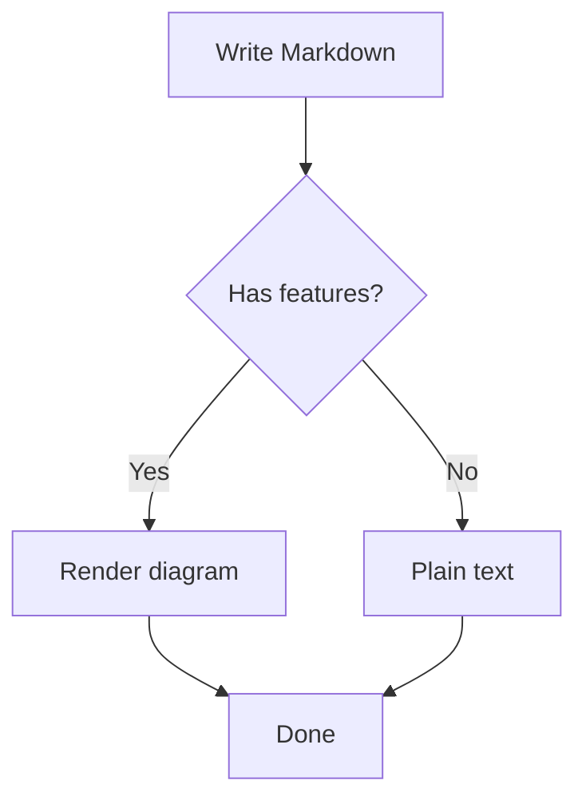
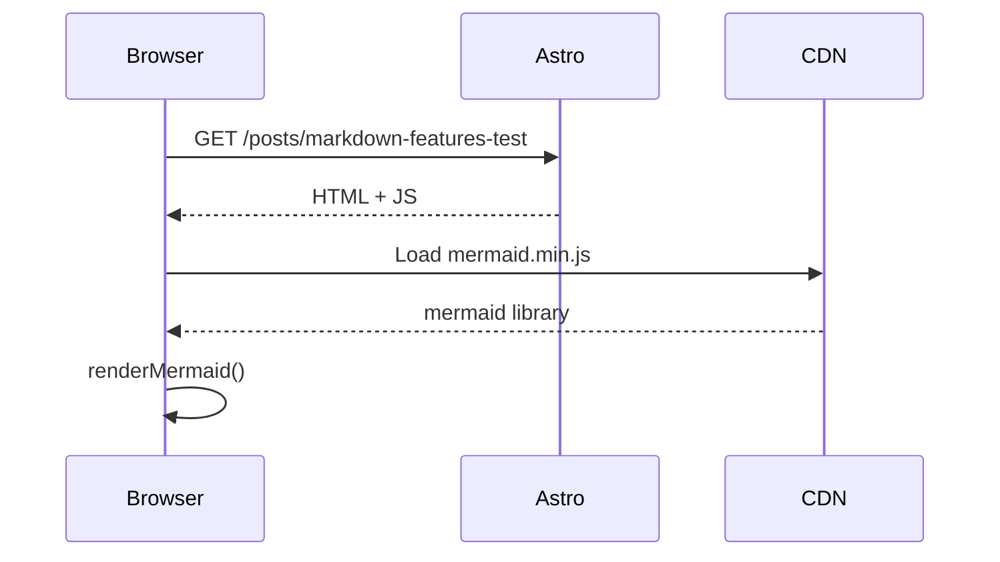

## Introduction

This post exercises every markdown feature supported by this blog. Use it to verify that footnotes, math, mermaid diagrams, GFM extensions, and syntax-highlighted code all render correctly.

## Footnotes

Regular footnote reference[^1] and another one[^2].

Inline note: this is an important point^[This note lives inline and needs no separate definition].

[^1]: This is the first footnote definition at the bottom of the document.
[^2]: Second footnote — supports **bold** and `code`.

## Math Equations

Inline math: the area of a circle is $A = \pi r^2$.

Block math (sum of squares):

$$
\sum_{i=1}^{n} i^2 = \frac{n(n+1)(2n+1)}{6}
$$

Euler's identity:

$$
e^{i\pi} + 1 = 0
$$

## Mermaid Diagram

### Flowchart



### Sequence Diagram



## GFM Tables

| Language   | Paradigm      | Typed  | Garbage Collected |
|------------|---------------|--------|-------------------|
| Go         | Imperative    | Yes    | Yes               |
| TypeScript | Multi-paradigm| Yes    | Yes               |
| Rust       | Systems       | Yes    | No (RAII)         |
| Python     | Multi-paradigm| No     | Yes               |

## Task Lists

- [x] Install remark-gfm
- [x] Install remark-math
- [x] Install rehype-katex
- [x] Add mermaid CDN loader
- [ ] Write more blog posts
- [ ] Add comments support

## Code Blocks

### Go

```go
package main

import "fmt"

func fibonacci(n int) int {
    if n <= 1 {
        return n
    }
    return fibonacci(n-1) + fibonacci(n-2)
}

func main() {
    for i := range 10 {
        fmt.Printf("fib(%d) = %d\n", i, fibonacci(i))
    }
}
```

### TypeScript

```typescript
interface Post {
  slug: string;
  title: string;
  date: Date;
  tags: string[];
  draft: boolean;
}

function filterPublished(posts: Post[]): Post[] {
  return posts.filter((p) => !p.draft);
}

function sortByDate(posts: Post[]): Post[] {
  return [...posts].sort((a, b) => b.date.getTime() - a.date.getTime());
}

export { filterPublished, sortByDate };
```

### Bash

```bash
#!/usr/bin/env bash
set -euo pipefail

BLOG_DIR="${HOME}/dev/tonys-blog"

echo "Building blog..."
cd "$BLOG_DIR"
npm run build

echo "Build complete. Artifacts in dist/"
ls -lh dist/
```

## Blockquotes

> "The art of programming is the art of organizing complexity."
> — Edsger W. Dijkstra

Nested blockquote:

> Outer quote.
>
> > Inner quote with **emphasis** and a `code span`.

## Headings for ToC Testing

### Sub-section A

Content under sub-section A.

#### Deep section A.1

Content nested at h4 level.

#### Deep section A.2

Another h4 section.

### Sub-section B

Content under sub-section B.

#### Deep section B.1

Last h4 for ToC depth testing.

## Conclusion

All features demonstrated above should render without errors. If mermaid diagrams appear as code blocks, ensure `MermaidInit.astro` is included in the layout. If math does not render, check that `rehype-katex` and the KaTeX CSS are loaded.
