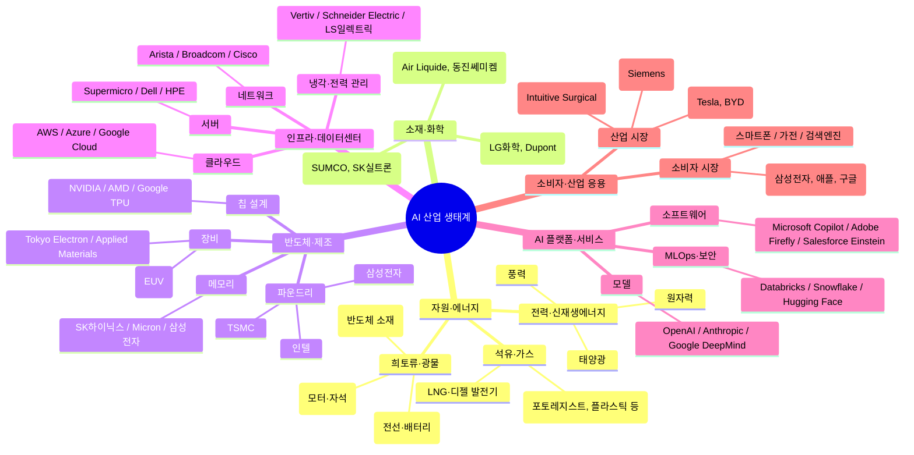

# Why ? 🤔

내 주식의 100% 는 모두 IT 종목에 있다. 특히 AI/양자에 몰려있다. 전문가 수준은 아니더라도 내가 알고 있는 지식이 이 쪽이다보니, 뉴스를 보면 어떤 의도로 기업이 어떻게 움직이고 있는지를 알 수 있다.

또한 이 쪽 시장은 소형주가 로켓처럼 치고 올라가는 경우가 100번에 1번 정도 있다보니 대형주 혹은 ETF 비중이 100% 이다.

반면 다른 종목이나 아예 처음 보는 소형주에 대해서는 문외한이다. 특히 어떤 것을 살펴봐야하고 어떤 식으로 접근하는지를 모른다. 이에 따라 어떻게 분석을 하면 좋을지에 대한 스터디 노트를 남겨보고자 한다.

# What ? 📊

### 왜 새로운 종목/기업을 투자하려는가?

> 내가 알고 있는 지식의 바운더리 내에서 가장 자신있는 주식에 장기 투자하는 게 수익률이 좋지 않나?

자신있는 주식에 대한 장기 투자와 새로운 종목/기업에 대한 공부는 평생 한 우물만 팔 것이냐 아니면 옆 자리 우물을 조금씩 파서 우물의 넓이를 넓힐 것이냐 의 차이라고 정리할 수 있다.

투자는 개발을 배우는 것과 비슷하다. DB 만 완전히 정복했다고해서, DB 를 잘 안다고 말할 수 없다. 인프라, 네트워크, 내부 프로세스 처리과정, 커널 원리 등등을 복합적으로 이해해야만 비로소 DB 를 제대로 활용할 수 있다고 자부할 수 있으며 관련 지식들을 쌓으면 쌓을 수록 더욱 깊게 알 수 있다.

이렇듯 종목이나 기업들 또한 네트워크망처럼 연결되어있다. 가령 AI 산업은 아래의 마인드맵과 같이 연결되어있다.

예를 들어 보자. 만약 엔비디아가 GPU 를 많이 생산하게된다면 어떤 연쇄작용이 발생할까?

다음과 같이 가정을 해볼 수 있다.

- 엔비디아가 GPU를 많이 팔면 → TSMC의 수율이 올라가고
- GPU를 더 효율적으로 쓰기 위해 → HBM 수요가 폭발하고
- HBM 생산을 위해 → SK하이닉스, 삼성전자가 설비 증설을 하고
- 서버·클라우드 확장을 위해 → Supermicro, AWS가 수익을 냄

결과론적으로 주식은 정치 뿐 아니라 종목/기업 간에도 연결되어있기에 본인이 아는 것뿐만 아니라 모르는 종목/기업들의 경계를 점차 확장해나가야할 필요성이 있다.

### 피터린치와 같은 거물들은 AI 와 같은 새로운 종목에 투자를 안 하는 걸로 보이는데 왜 그럴까?

[https://www.investopedia.com/articles/stocks/06/peterlynch.asp?utm_source=chatgpt.com](https://www.investopedia.com/articles/stocks/06/peterlynch.asp?utm_source=chatgpt.com)
정확히 "왜?" 는 밝히지 않았지만, GPT 의 추론에 의해 아래와 같이 정리할 수 있는 것으로 보인다.

- 위 마인드맵 예시와 같이 하나의 산업에 얽혀있는 것들이 너무 많음
- 닷컴 버블, NFT 시장과 같이 예측 가능 범주의 종목이 아님
- 기술 변화가 너무 빨라서 정보 비대칭이 너무 큼

### 새로운 종목에 대해 공부할 때

1. **시장 규모 및 유동성**
2. **섹터(산업) 및 업황 동향**
3. **밸류에이션(Valuation)의 상태**
4. **모멘텀 요인 및 시장 심리**
5. **리스크 요인**
6. **대형주 여부 판단 기준**
7. **향후 성장 스토리와 기대 요인**
8. **시장 비교 및 상대적 위치**
9. **배당/환원정책** (특히 안정주일 경우)
10. **시간축(투자기간) 고려**

### 새로운 기업에 대해 공부할 때

1. **비즈니스 모델 구조**
2. **시장과 산업의 위치**
3. **재무상태 및 재무지표**
4. **경영진 및 거버넌스(지배구조)**
5. **미래 전략 및 성장 로드맵**
6. **기업의 경쟁력 및 위협 요소**
7. **시장에서 기업이 갖는 브랜드/평판**
8. **배당/환원 정책 및 주주친화성**
9. **밸류에이션 및 투자매력**
10. **외부환경 및 거시적 요인**
11. **이해관계자 관계(Stakeholder Relations)**
12. **시나리오 분석**
13. **투자출발/탈출 기준 설정**
14. **정보의 출처 및 신뢰성**
15. **윤리적/사회적 측면**

# How ? 🛠️

> 실제로 토스와 같이 목표 기업을 잡아보고 분석을 해보자.

### 새로운 종목에 대해 공부할 때

- [ ] **시장 규모 및 유동성**
- [ ] **섹터(산업) 및 업황 동향**
- [ ] **밸류에이션(Valuation)의 상태**
- [ ] **모멘텀 요인 및 시장 심리**
- [ ] **리스크 요인**
- [ ] **대형주 여부 판단 기준**
- [ ] **향후 성장 스토리와 기대 요인**
- [ ] **시장 비교 및 상대적 위치**
- [ ] **배당/환원정책** (특히 안정주일 경우)
- [ ] **시간축(투자기간) 고려**

### 새로운 기업에 대해 공부할 때

- [ ] **비즈니스 모델 구조**
- [ ] **시장과 산업의 위치**
- [ ] **재무상태 및 재무지표**
- [ ] **경영진 및 거버넌스(지배구조)**
- [ ] **미래 전략 및 성장 로드맵**
- [ ] **기업의 경쟁력 및 위협 요소**
- [ ] **시장에서 기업이 갖는 브랜드/평판**
- [ ] **배당/환원 정책 및 주주친화성**
- [ ] **밸류에이션 및 투자매력**
- [ ] **외부환경 및 거시적 요인**
- [ ] **이해관계자 관계(Stakeholder Relations)**
- [ ] **시나리오 분석**
- [ ] **투자출발/탈출 기준 설정**
- [ ] **정보의 출처 및 신뢰성**
- [ ] **윤리적/사회적 측면**

[^1]: 모르는 종목 내 걸로 만드는 3단계 <https://contents.tossinvest.com/article/digest/41515?utm_source=referral_button_digest_content>

[^2]: 재무 제표 모르면 주식투자 절대로 하지마라 <https://product.kyobobook.co.kr/detail/S000001937724>

[^3]: Peter Lynch, *One Up on Wall Street* — "투자자가 가장 잘 아는 분야에서 먼저 기회를 찾으라"는 원칙을 설명한다.
