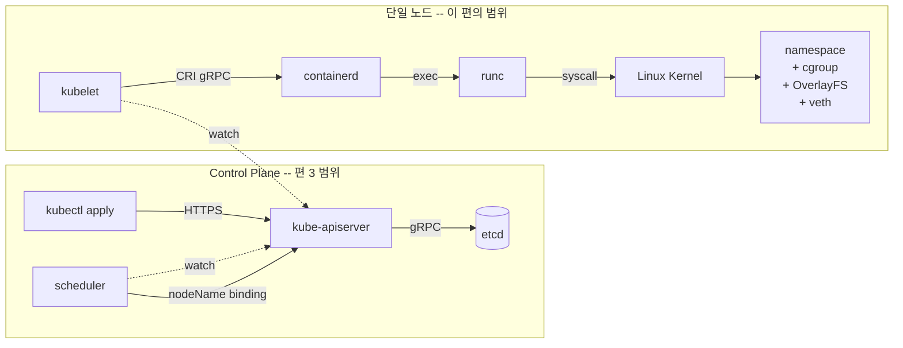
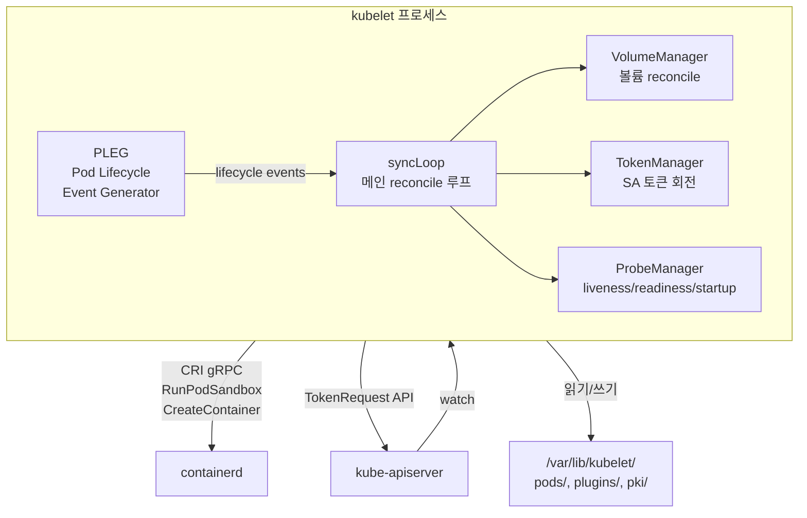
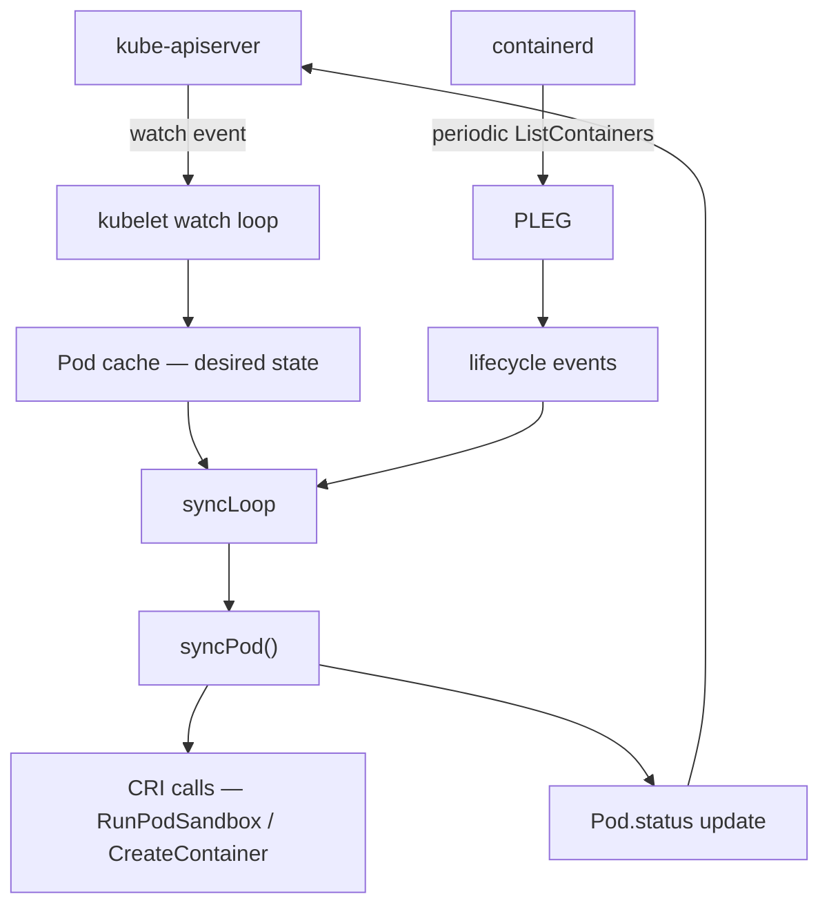
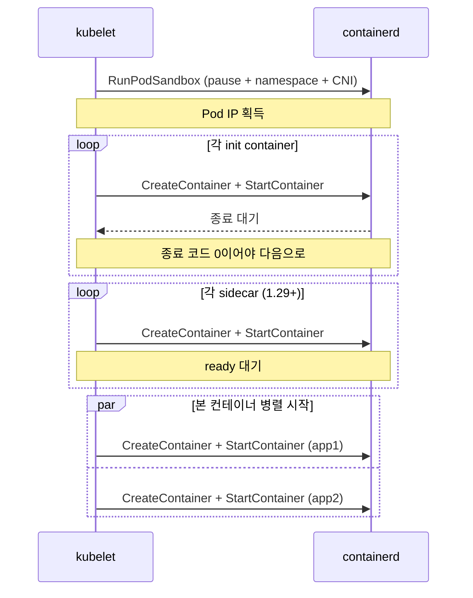
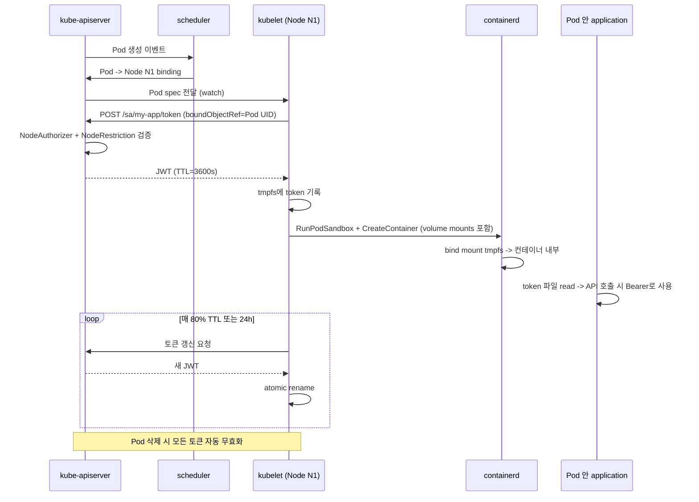
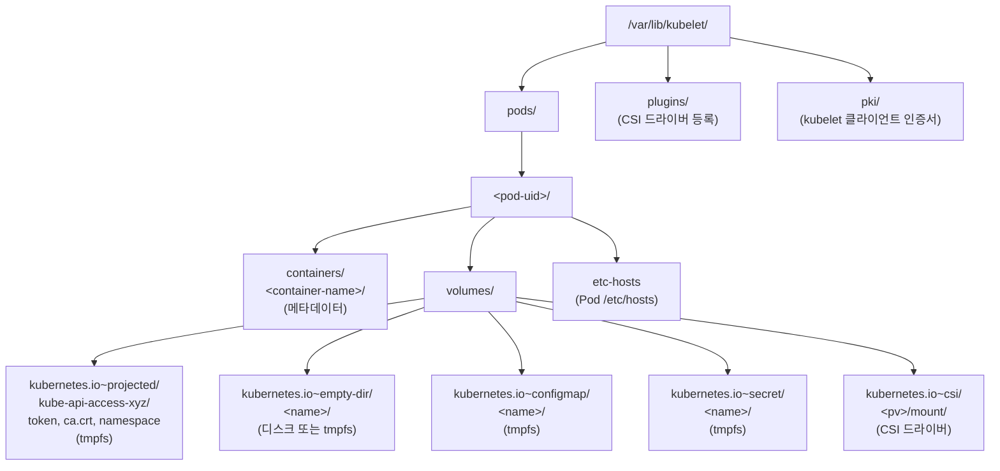
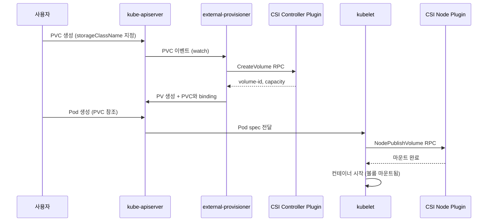

# Why?

편 1 에서 namespace, cgroup, OverlayFS, veth 라는 네 가지 커널 원시 자원이 컨테이너의 전부임을 확인했다.

그러나 K8s 를 운영하면서 실제로 마주하는 문제는 _커널 원시 자원 자체_ 가 아니다.

Pod 가 `Pending` 에 머물러 있는데 이유를 모르겠다.

ServiceAccount 토큰이 만료되어 Pod 안의 애플리케이션이 API server 호출에 실패한다.

PVC 를 마운트했는데 컨테이너 안에서 빈 디렉토리만 보인다.

이 문제들의 공통점은, 커널 원시 자원을 _조합하여 Pod 로 만드는 과정_ 에서 발생한다는 것이다.

그 조합을 담당하는 것이 **kubelet** 이라는 단일 데몬이다.

kubelet 은 모든 K8s 노드에서 돌아가는 _유일한_ K8s 컴포넌트다.

API server 나 etcd 는 control plane 에만 존재하지만, kubelet 만은 워커 노드를 포함한 모든 노드에서 반드시 실행된다.

K8s 의 추상 (desired state) 을 물리적 현실 (actual state) 로 변환하는 _단 하나의 지점_ 이 kubelet 이기 때문이다.



kubelet 이 내부적으로 무엇을 어떤 순서로 하는지 모르면, Pod 장애 시 어디를 봐야 하는지 판단할 수 없다.

반대로 kubelet 의 동작을 이해하면, 다음과 같은 상황에서 정확한 진단이 가능해진다.

- Pod 가 `Pending` 에 머물 때 — kubelet 의 reconcile 루프에서 어느 단계가 막혔는지 `journalctl -u kubelet` 로그에서 특정할 수 있다.
- ServiceAccount 토큰 문제 — TokenRequest API 의 `boundObjectRef` 가 Pod UID 에 묶여 있으므로, Pod 삭제 시 토큰이 즉시 무효화되는 메커니즘을 이해하고 대처할 수 있다.
- 볼륨 마운트 실패 — `/var/lib/kubelet/pods/<UID>/volumes/` 디렉토리 구조에서 어떤 볼륨 타입이 어느 경로에 마운트되는지 추적할 수 있다.

### 이 편의 구조

이 편에서는 kubelet 이 Pod 를 만드는 전체 경로를 따라간다.

reconcile 루프에서 시작해, sandbox 생성, ServiceAccount 토큰 발급, projected volume 마운트, 일반 볼륨과 CSI, 헬스 체크까지 — 각 단계가 직전 단계의 결과를 입력으로 받는 인과 사슬로 구성된다.

각 절에서 개념을 다룬 직후 인라인 실습으로 검증하며, How 절에서는 Pod 생성부터 토큰 마운트까지의 전체 경로를 종합적으로 추적한다.

# What?

## kubelet의 reconcile 루프 — syncLoop와 PLEG가 desired state를 actual state로 수렴시키는 이중 경로 🔄

kubelet 내부의 주요 컴포넌트와 외부 연결의 관계를 구조도로 보면 다음과 같다.



kubelet은 모든 K8s 노드에서 실행되는 유일한 K8s 컴포넌트다[^N1].

API server, etcd, scheduler는 control plane 노드에만 존재하지만, kubelet만은 워커 노드를 포함한 모든 노드에서 반드시 실행된다. kubelet이 K8s의 추상을 물리적 현실로 변환하는 단 하나의 지점이기 때문이다.

API server는 etcd에 "이 Pod가 노드 N1에 있어야 한다"라는 desired state만 기록하고, scheduler는 배치 대상 노드를 결정할 뿐이다.

그 desired state를 받아 실제로 컨테이너를 띄우고 볼륨을 마운트하고 네트워크를 설정하는 것은 해당 노드의 kubelet이다.

그렇다면 kubelet은 desired state를 어떻게 전달받는가?

### Watch와 informer

kubelet은 시작 시 API server에 자기 노드에 스케줄된 Pod 목록과 그 변경 사항을 요청하는 long-polling을 건다.

이것이 K8s의 모든 컴포넌트가 사용하는 watch 메커니즘이다[^N2].

API server는 etcd에서 변경이 생길 때마다 watch 클라이언트에 이벤트를 push한다.

kubelet은 이 이벤트를 받아 내부 캐시에 desired state를 유지한다.

이 캐시가 구축되면 reconcile이 가능해진다.

캐시 위에 `syncLoop`라는 메인 루프가 돌면서 현재 노드의 actual state와 비교하기 때문이다.

### syncPod — Pod 한 개의 reconcile

`syncLoop`가 한 Pod에 대해 호출하는 함수가 `syncPod`다[^N3].

`syncPod`는 다음 단계를 차례로 수행한다.

1.

Pod가 새로 생성되었는가 — sandbox 생성 2.

컨테이너 spec이 변경되었는가 — 해당 컨테이너 재시작 3.

컨테이너가 죽었는가 — restartPolicy에 따라 재시작 4.

헬스 체크 결과 갱신 — readiness가 바뀌면 endpoint 업데이트 트리거 5.

상태를 API server에 보고 — `Pod.status` 업데이트

이 다섯 단계가 모든 Pod에 대해 매 초 단위로 반복된다.

### PLEG — Pod Lifecycle Event Generator

그런데 watch 이벤트만으로는 모든 상태 변화를 감지할 수 없다.

컨테이너가 OOM으로 갑자기 죽는 경우처럼, API server를 거치지 않는 상태 변화가 존재하기 때문이다. kubelet이 이런 변화를 감지하는 또 다른 경로가 PLEG다.

PLEG는 별도 고루틴에서 주기적으로 (기본 1초) containerd에 `ListContainers`를 호출해 현재 노드의 모든 컨테이너 상태를 가져온다[^N4].

직전 스냅샷과 비교해 상태가 변한 컨테이너가 있으면 이벤트를 발행한다.

`ContainerStarted`, `ContainerDied`, `ContainerRemoved` 같은 이벤트가 `syncLoop`로 전달되어 `syncPod` 호출을 트리거한다.



watch (변경 알림)와 PLEG (주기적 점검) 이중 경로가 함께 동작하면서 desired state와 actual state의 차이를 감지하고 좁힌다.

### 실습 1: kubelet journal 로그에서 syncPod 추적

지금까지 reconcile 루프의 구조를 개념적으로 다뤘지만, kubelet이 내부적으로 어떤 단계를 거치는지는 로그를 직접 보지 않으면 추상으로 남는다.

이 실습에서는 Pod 생성 시 kubelet이 남기는 syncPod 관련 로그를 확인하여, watch 이벤트 수신부터 PLEG 이벤트 발행까지의 흐름이 실제로 어떻게 나타나는지 관찰한다.

우선 k3s 노드에 접속하여 journal 관찰을 준비하자.
k3s가 없다면 kubeadm 클러스터의 kubelet journal을 대신 사용해도 된다.

```bash
# 다른 셸에서 k3s journal 관찰 시작
sudo journalctl -u k3s -f \
  | grep -iE "syncPod|SyncLoop|PLEG" &
JOURNAL_PID=$!

# Pod 생성
kubectl run sync-test --image=alpine -- sleep 60
sleep 5

# Pod 삭제
kubectl delete pod sync-test --grace-period=0 --force
sleep 3
kill $JOURNAL_PID 2>/dev/null
```

로그에서 SyncLoop 이벤트 수신 후 syncPod가 호출되는 시간 순서가 보이는가?

PLEG 이벤트가 ContainerStarted, ContainerDied 순서로 발행되는 것도 확인할 수 있다.

watch + PLEG 이중 경로가 실제로 동작하는 것을 확인할 수 있다.

syncPod가 새 Pod를 발견하면 가장 먼저 수행하는 작업이 sandbox 생성이다.

그러나 sandbox가 구체적으로 무엇이고, 편 1에서 다룬 namespace와 어떻게 연결되는지는 아직 다루지 않았다. sandbox를 이해하려면 kubelet이 containerd에 보내는 CRI 호출의 2단계 구조를 알아야 하며, 다음 절에서 이를 다룬다.

## Pod sandbox와 컨테이너 생성 — RunPodSandbox와 CreateContainer가 CRI 2단계 호출로 Pod를 구성하는 구조 🏗️

syncPod가 새 Pod를 감지하면 가장 먼저 sandbox를 만든다.

왜 컨테이너를 바로 만들지 않고 sandbox라는 중간 단계가 필요한가?

Pod 안의 여러 컨테이너가 동일한 네트워크와 IPC namespace를 공유해야 하기 때문이다. sandbox가 그 공유 namespace를 먼저 확보하는 역할을 한다.

### 1단계 — RunPodSandbox

containerd에 sandbox 생성을 명령한다[^N5].

containerd는 이 호출에 대해 다음을 수행한다.

1. pause container 이미지 (보통 `registry.k8s.io/pause:3.10`) pull — 캐시되어 있으면 skip
2.

새 namespace (net, ipc, uts, 선택적으로 pid) 생성 3. pause container를 해당 namespace 안에서 실행 4.

CNI 플러그인을 호출해 net namespace에 인터페이스 설정 (편 4에서 다룸)

이 시점에 Pod는 IP를 갖게 된다.

`kubectl get pod -o wide`의 IP가 채워지는 순간이다.

pause container가 sandbox에 해당한다.

편 1에서 다룬 namespace가 프로세스가 하나도 없으면 파괴된다는 규칙을 떠올리면, pause container의 존재 이유가 명확해진다.

pause container는 아무 일도 하지 않지만 namespace를 유지하는 앵커 역할을 한다[^N6].

이 앵커가 있으므로, 앱 컨테이너가 죽었다가 재시작되더라도 namespace는 pause container가 살아있는 한 보존된다.

### 2단계 — CreateContainer x N

sandbox가 준비되었으므로 이제 그 위에 실제 컨테이너를 올린다.

각 컨테이너 (init, app, sidecar) 마다 이 호출이 일어난다.

containerd는 다음을 수행한다.

1.

컨테이너 이미지 pull (필요 시) 2.

OverlayFS 마운트로 rootfs 준비 3. sandbox의 namespace에 합류 (`setns()`) 한 새 컨테이너 spec 생성 4. cgroup 적용 (CPU/memory 제한) 5. `StartContainer` 호출 시 실제 프로세스 실행

3번이 핵심이다.

새 namespace를 만드는 것이 아니라, sandbox의 기존 namespace에 합류한다.

이것이 편 1에서 다룬 `setns()` 시스템 콜의 K8s 측 실체다.

### init, sidecar, app container의 실행 순서

K8s Pod spec에는 세 종류의 컨테이너 슬롯이 있다[^N7].

| 슬롯              | 설명                                                                      |
| ----------------- | ------------------------------------------------------------------------- |
| `initContainers`  | Pod 시작 시 순차적으로 실행되어 종료 코드 0을 반환해야 다음으로 넘어간다  |
| sidecar container | 1.29부터 native 지원. `restartPolicy: Always`인 init container로 정의한다 |
| `containers`      | 본 컨테이너.                                                              |

모두 병렬로 시작한다 |



각 컨테이너는 모두 같은 sandbox의 net/ipc namespace에 합류하므로, 같은 Pod 안에서는 `localhost`로 서로 통신할 수 있다.

### 실습 2: crictl로 sandbox와 container 분리 확인, pause container PID 추적

지금까지 sandbox와 컨테이너가 CRI에서 별개의 객체라는 것을 개념적으로 다뤘지만, 실제로 분리되어 있는지 확인하지 않으면 Pod 내부 네트워크 문제나 컨테이너 재시작 시 namespace 보존 여부를 진단할 근거가 없다.

이 실습에서는 crictl을 사용해 sandbox와 container의 분리 구조를 직접 확인하고, pause container와 app container의 net namespace inode가 동일한지 추적하여 namespace 공유가 실제로 일어나는지 검증한다.

우선 테스트 Pod를 하나 생성하자.
crictl이 없다면 `sudo k3s crictl`로 대체할 수 있다.

```bash
# 테스트 Pod 생성
kubectl run sandbox-test --image=alpine -- sleep 3600
kubectl wait --for=condition=Ready pod/sandbox-test --timeout=60s

# sandbox 목록 — 각 Pod마다 하나의 sandbox가 존재한다
crictl pods | head -5

# 특정 sandbox 안의 컨테이너 목록
SANDBOX=$(crictl pods --name sandbox-test -q)
crictl ps --pod $SANDBOX
```

sandbox ID 아래에 app container가 묶여 있는 것이 보이는가?

편 1에서 다룬 pause container가 namespace anchor로 동작하는 구조가 확인된다.

```bash
# pause container의 PID 확인
PAUSE_ID=$(crictl ps --pod $SANDBOX -q --name POD)
crictl inspect $PAUSE_ID | grep -i pid | head -3

# pause container와 app container의 net namespace가 동일한지 확인
APP_ID=$(crictl ps --pod $SANDBOX -q --name sandbox-test)
PAUSE_PID=$(crictl inspect $PAUSE_ID | python3 -c "import sys,json; print(json.load(sys.stdin)['info']['pid'])")
APP_PID=$(crictl inspect $APP_ID | python3 -c "import sys,json; print(json.load(sys.stdin)['info']['pid'])")

sudo readlink /proc/$PAUSE_PID/ns/net
sudo readlink /proc/$APP_PID/ns/net
# 두 출력이 동일한 inode를 가리킨다
```

inode가 동일하다는 것은 편 1의 namespace 절에서 다룬 nsproxy가 같은 net_namespace 객체를 참조한다는 뜻이다.

```bash
kubectl delete pod sandbox-test
```

여기까지로 컨테이너는 띄었다.

그러나 Pod 안의 앱이 API server를 호출하려면 "나는 누구다"를 증명할 신원이 필요하다. sandbox와 컨테이너만으로는 이 신원 문제가 해결되지 않는다.

## ServiceAccount와 TokenRequest — kubelet이 TokenRequest API로 Pod에 시간 제한 JWT를 발급하는 신원 부여 메커니즘 🎫

sandbox가 만들어지고 컨테이너가 시작되었지만, 안의 애플리케이션이 kube-apiserver와 통신하려면 한 가지가 더 필요하다.

왜냐하면 kube-apiserver는 모든 요청에 대해 신원과 권한을 검증하기 때문이다[^N8].

따라서 Pod 안의 프로세스에는 "나는 이 ServiceAccount다"라고 증명할 신원이 반드시 필요하다.

### ServiceAccount — namespace 단위의 신원

ServiceAccount는 namespace 안에서 "누구"를 표현하는 객체다[^N9].

만들지 않아도 모든 namespace에는 `default` ServiceAccount가 자동 존재한다.

```yaml
apiVersion: v1
kind: ServiceAccount
metadata:
  name: my-app
  namespace: production
```

Pod가 어떤 ServiceAccount의 신원으로 동작할지는 spec에서 지정한다.

명시하지 않으면 같은 namespace의 `default`가 자동 사용된다.

```yaml
apiVersion: v1
kind: Pod
spec:
  serviceAccountName: my-app
  containers:
    - name: app
      image: my-app:1.0
```

ServiceAccount 객체 자체에는 비밀번호도 키도 없다.

그렇다면 Pod가 이 신원을 실제로 증명하는 방법은 무엇인가?

그것이 TokenRequest API다.

### TokenRequest API — 시간 제한된 JWT 발급

K8s v1.21부터 GA된 `BoundServiceAccountTokenVolume` 이후, ServiceAccount 신원은 TokenRequest API를 통해 발급되는 시간 제한된 JSON Web Token (JWT)으로 증명된다[^N10].

v1.22 이전에는 ServiceAccount마다 만료 없는 Secret 토큰을 묶어 두었으나, 만료가 없다는 것은 유출 시 영구적으로 악용 가능하다는 뜻이므로 보안 문제로 폐기되었다[^N11].

핵심은 다음과 같다.

> 토큰은 Pod가 살아있는 동안만 유효하며, 해당 Pod만 사용할 수 있다.

TokenRequest API는 ServiceAccount의 subresource로 호출된다.

```bash
# kubelet이 내부적으로 수행하는 호출 형태
POST /api/v1/namespaces/production/serviceaccounts/my-app/token

{
  "spec": {
    "audiences": ["https://kubernetes.default.svc"],
    "expirationSeconds": 3600,
    "boundObjectRef": {
      "kind": "Pod",
      "name": "my-app-pod-abc123",
      "uid": "550e8400-e29b-41d4-a716-446655440000"
    }
  }
}
```

발급된 토큰의 핵심 claim은 다음과 같다.

| Claim                                       | 의미                                                         |
| ------------------------------------------- | ------------------------------------------------------------ |
| `iss`                                       | 발행자 (보통 `https://kubernetes.default.svc.cluster.local`) |
| `sub`                                       | `system:serviceaccount:<namespace>:<name>`                   |
| `aud`                                       | 이 토큰의 수신자 — 누가 이 토큰을 받아도 되는가              |
| `exp`                                       | 만료 시각 (epoch)                                            |
| `kubernetes.io.pod.name` / `pod.uid`        | 이 토큰이 묶인 Pod (boundObjectRef)                          |
| `kubernetes.io.serviceaccount.name` / `uid` | ServiceAccount 정체                                          |

`boundObjectRef`가 핵심이다.

토큰 claim 안에 Pod의 UID가 박혀 있으므로, kube-apiserver가 토큰을 검증할 때 해당 Pod가 여전히 존재하는지까지 확인한다[^N12].

Pod가 삭제되면 그 UID는 재사용되지 않으므로, 이전 토큰은 즉시 무효가 된다.

### kubelet의 TokenRequest 호출 권한

Pod 안의 애플리케이션이 직접 TokenRequest를 호출하는 것이 아니다.

kubelet이 Pod를 대신해 자기 자신의 클라이언트 인증서로 호출한다.

그렇다면 kubelet이 아무 Pod의 토큰이나 발급할 수 있다면 보안 문제가 되지 않는가?

이 호출의 안전성을 두 메커니즘이 보장한다[^N13].

- **NodeAuthorizer** — kubelet이 자기 노드에 스케줄된 Pod의 ServiceAccount에 한해서만 TokenRequest를 호출할 수 있도록 권한을 제한한다.
- **NodeRestriction (admission)** — `boundObjectRef`가 반드시 자기 노드의 Pod를 가리키도록 강제한다.

다른 노드의 Pod 신원을 탈취하려는 시도를 차단한다.

이 두 메커니즘 덕분에 노드 한 대가 침해되더라도 그 노드 위의 Pod 신원만 영향을 받고, 클러스터 전체로 권한 상승이 일어나지 않는다.

### 실습 3: Pod의 JWT 디코딩, boundObjectRef의 Pod UID 일치 확인, Pod 삭제 후 토큰 무효화

지금까지 boundObjectRef가 토큰을 특정 Pod에 묶는 보안 장치라고 다뤘지만, claim 구조를 직접 열어보지 않으면 이것이 단순한 메타데이터인지 실질적 보안 장치인지 구분할 수 없다.

이 실습에서는 Pod에 자동 주입된 JWT를 디코딩하여 boundObjectRef의 Pod UID가 실제 Pod UID와 일치하는지 확인한 뒤, Pod 삭제 후 토큰이 즉시 무효화되는지까지 검증한다.

우선 테스트 Pod를 생성하자.

**Step 1 — Pod 생성과 토큰 파일 확인**

```bash
kubectl run probe --image=alpine -- sleep 3600
kubectl wait --for=condition=Ready pod/probe --timeout=60s

# 자동 주입된 projected volume 확인
kubectl get pod probe -o yaml | grep -A 25 'volumes:'
```

`kube-api-access-xxxxx`라는 projected volume이 사용자가 적지 않았는데도 자동으로 주입된 것이 보인다.

이것은 ServiceAccount admission controller가 모든 Pod에 자동 주입한 것이다[^N14].

```bash
kubectl exec probe -- \
  ls /var/run/secrets/kubernetes.io/serviceaccount/
# ca.crt  namespace  token
```

**Step 2 — JWT 디코딩**

```bash
TOKEN=$(kubectl exec probe -- \
  cat /var/run/secrets/kubernetes.io/serviceaccount/token)

echo $TOKEN | cut -d. -f2 \
  | base64 -d 2>/dev/null | python3 -m json.tool
```

출력에서 `kubernetes.io.pod.uid`를 확인한다.

```bash
kubectl get pod probe -o jsonpath='{.metadata.uid}'
```

두 값이 일치한다.

이 일치가 boundObjectRef가 토큰을 특정 Pod에 묶고 있음을 보여준다.

**Step 3 — Pod 삭제 후 토큰 무효화**

```bash
TOKEN=$(kubectl exec probe -- \
  cat /var/run/secrets/kubernetes.io/serviceaccount/token)

kubectl delete pod probe

# 구 토큰으로 API server 호출 시도
curl -sk -H "Authorization: Bearer $TOKEN" \
  https://localhost:6443/api/v1/namespaces \
  -w "
HTTP %{http_code}
" | tail
# 401 Unauthorized — boundObjectRef의 Pod UID가 더 이상 존재하지 않는다
```

Pod가 삭제되는 순간 토큰이 무효화되는 것은 boundObjectRef 검증의 직접적 결과다.

토큰이 발급됐다.

그런데 이 토큰을 어떻게 Pod 안의 파일로 전달하는가? kubelet이 TokenRequest로 받은 JWT를 컨테이너 안에서 파일로 접근할 수 있게 만드는 메커니즘이 필요하며, 그것이 바로 projected volume이다.

## Projected Volume — 다중 출처를 tmpfs에 합성하여 컨테이너에 전달하는 볼륨 타입 📂

TokenRequest API로 발급된 JWT를 Pod 안에서 파일로 접근하게 만드는 메커니즘이 projected volume이다.

이 볼륨은 서로 다른 출처의 데이터를 한 디렉토리로 모아서 마운트한다[^N15].

왜 여러 출처를 합쳐야 하는가?

Pod가 API server와 통신하려면 토큰뿐 아니라 CA 인증서와 namespace 정보도 함께 필요하기 때문이다.

기본 ServiceAccount 자동 마운트의 실제 형태는 다음과 같다.

사용자가 직접 적지 않아도 admission controller가 자동 주입한다.

```yaml
volumes:
  - name: kube-api-access-xyz12
    projected:
      defaultMode: 420
      sources:
        - serviceAccountToken:
            expirationSeconds: 3607
            path: token
        - configMap:
            name: kube-root-ca.crt
            items:
              - key: ca.crt
                path: ca.crt
        - downwardAPI:
            items:
              - path: namespace
                fieldRef:
                  fieldPath: metadata.namespace
```

이 볼륨이 컨테이너 안에 마운트되면 Pod 안의 프로세스는 다음 세 파일을 한 디렉토리에서 본다.

| 파일                                                      | 출처                             |
| --------------------------------------------------------- | -------------------------------- |
| `/var/run/secrets/kubernetes.io/serviceaccount/token`     | TokenRequest API (1시간 TTL JWT) |
| `/var/run/secrets/kubernetes.io/serviceaccount/ca.crt`    | ConfigMap (`kube-root-ca.crt`)   |
| `/var/run/secrets/kubernetes.io/serviceaccount/namespace` | Pod metadata (downwardAPI)       |

세 파일은 세 가지 다른 출처에서 오지만, projected volume이 이를 한 디렉토리에 묶어준다.

이 덕분에 애플리케이션은 한 디렉토리만 읽으면 API server 통신에 필요한 모든 것을 얻을 수 있다.

### /var/lib/kubelet/pods/\<UID\>/volumes/ 구조

그렇다면 이 파일들은 호스트의 어디에 저장되는가? kubelet은 호스트의 다음 경로에 토큰을 tmpfs로 기록하고, 이를 컨테이너의 mount namespace에 bind mount한다[^N16].

```
/var/lib/kubelet/pods/<pod-uid>/volumes/kubernetes.io~projected/<vol-name>/token
```

### tmpfs에 쓰는 이유 — 보안

토큰은 디스크가 아니라 tmpfs (메모리 기반 파일시스템)에 기록된다.

이것이 보안상 중요한 이유는, 노드가 재부팅되거나 Pod가 사라지면 토큰은 흔적 없이 사라지기 때문이다.

설령 메모리 덤프로 토큰을 추출하더라도, 해당 토큰의 `boundObjectRef`가 삭제된 Pod UID를 가리키므로 kube-apiserver가 이를 거부한다.

### kubelet의 토큰 회전 — atomic rename으로 갱신

토큰의 기본 TTL은 1시간이다.

그렇다면 1시간이 지나면 Pod는 API server와 통신할 수 없게 되는가?

그렇지 않다. kubelet의 서비스 어카운트 토큰 매니저가 백그라운드에서 모든 활성 토큰을 추적하기 때문이다[^N17].

다음 두 조건 중 하나에 해당하면 선제적으로 TokenRequest를 다시 호출해 갱신한다.

> 토큰의 나이 > TTL의 80% 또는 토큰의 나이 > 24시간

새 토큰이 발급되면 같은 projected volume의 같은 경로에 atomic하게 덮어쓴다.

이 atomic 갱신은 임시 파일에 쓴 뒤 `rename(2)` 시스템 콜로 교체하는 방식이다[^N18].

`rename(2)`는 POSIX에서 같은 파일시스템 안의 rename을 atomic하게 보장한다.

projected volume의 tmpfs 안에서 임시 파일 생성과 rename이 모두 일어나므로 같은 파일시스템 조건이 충족된다.

이 atomic 보장 덕분에 컨테이너 안에서 깨진 토큰이 보이는 순간이 없다.

애플리케이션은 주기적으로 파일을 다시 읽기만 하면 된다.

공식 문서가 권장하는 패턴은 5분마다 다시 읽기다.

K8s 클라이언트 라이브러리 (client-go, fabric8 등)는 이 폴링을 내장하고 있다.

### 전체 흐름

지금까지 다룬 ServiceAccount -> TokenRequest -> Projected Volume -> 토큰 회전의 전체 흐름을 한 그림으로 정리한다.



### v1.35 변경점과 미래 방향

K8s v1.35 (Timbernetes, 2025년 12월)[^N19] 자체가 ServiceAccount 메커니즘을 크게 바꾸지는 않았다.

그러나 두 가지 관련 흐름이 있다.

**Structured Authentication Configuration GA** — kube-apiserver의 외부 OIDC 인증 설정이 다중 provider와 풍부한 claim mapping을 지원하는 구조화된 config로 바뀌었다.

외부 인증 통합이 정리되었다는 의미이며, ServiceAccount JWT 흐름 자체는 그대로다.

**Pod Certificates (KEP 4317) Beta 승격** — Pod마다 X.509 클라이언트 인증서를 발급받는 메커니즘이 alpha (1.34) -> beta (1.35)로 올라왔다[^N20].

`PodCertificateRequest` API를 통해 short-lived 인증서를 받고, projected volume의 새 source `podCertificate`로 마운트한다.

JWT가 적합하지 않은 워크로드 (mTLS가 필요한 service mesh 등)에서 토큰 기반 + 인증서 기반 양방향 신원 증명이 가능해진다.

현재까지 압도적으로 흔한 형태는 여전히 ServiceAccount + TokenRequest + Projected Volume 조합이며, 이 절의 흐름이 v1.35 클러스터에서도 그대로 작동한다.

### 실습 4: /var/lib/kubelet/pods/ 디렉토리 탐험, tmpfs 마운트 확인

지금까지 kubelet이 토큰을 tmpfs에 기록하고 bind mount로 컨테이너에 전달한다고 다뤘지만, 실제 호스트 파일시스템에서 이 구조를 직접 확인하지 않으면 볼륨 마운트 실패나 토큰 갱신 문제를 호스트 레벨에서 추적할 수 없다.

이 실습에서는 /var/lib/kubelet/pods/ 디렉토리 구조를 탐색하고, projected volume이 실제로 tmpfs로 마운트되어 있는지 검증한다.

우선 테스트 Pod를 생성하자.

```bash
kubectl run tmpfs-test --image=alpine -- sleep 3600
kubectl wait --for=condition=Ready pod/tmpfs-test --timeout=60s

POD_UID=$(kubectl get pod tmpfs-test -o jsonpath='{.metadata.uid}')

# kubelet이 Pod에 대해 생성한 디렉토리 구조
sudo find /var/lib/kubelet/pods/$POD_UID -maxdepth 3 -type d
```

`volumes/kubernetes.io~projected/` 디렉토리가 보인다.

```bash
# 토큰 파일 위치
sudo find /var/lib/kubelet/pods/$POD_UID -name token -type f

# tmpfs 마운트 확인
mount | grep "/var/lib/kubelet/pods/$POD_UID" | head -3
```

출력에 `tmpfs`가 보이는가?

직전에 다룬 "토큰은 디스크가 아니라 메모리에 기록된다"는 설명이 확인된다.

```bash
kubectl delete pod tmpfs-test
```

여기까지로 projected volume이라는 특수 타입을 다뤘다.

그런데 projected volume은 토큰과 설정 데이터를 전달하는 데 특화된 타입일 뿐이다.

실제 운영 환경에서는 emptyDir, configMap, PVC 등 다양한 볼륨 타입이 사용되며, 이들이 마운트되는 메커니즘은 projected volume과 다르다.

이 다른 볼륨들이 어떻게 마운트되는지 알아야 CSI 볼륨 마운트 실패를 진단할 수 있으며, 다음 절에서 이를 다룬다.

## Volume 마운트와 CSI — VolumeManager가 Attach, Mount, SetUp 3단계로 볼륨을 준비하는 reconcile 루프 📦

projected volume 외의 일반적 볼륨 마운트 메커니즘을 다룬다.

왜 별도로 다뤄야 하는가? projected volume은 kubelet이 자체적으로 tmpfs에 데이터를 합성하지만, PVC처럼 외부 스토리지를 사용하는 볼륨은 노드에 attach하고 파일시스템을 mount하는 추가 단계가 필요하기 때문이다.

### /var/lib/kubelet/pods/ — kubelet의 데이터 디렉토리

kubelet이 노드 위에 Pod와 관련된 모든 상태를 기록하는 디렉토리는 한 곳이다[^N21].

이 디렉토리의 전체 구조를 구조도로 정리하면 다음과 같다.



| 경로                                                            | 내용                      |
| --------------------------------------------------------------- | ------------------------- |
| `/var/lib/kubelet/pods/<pod-uid>/containers/`                   | 각 컨테이너의 메타데이터  |
| `/var/lib/kubelet/pods/<pod-uid>/volumes/kubernetes.io~<type>/` | 마운트된 모든 볼륨        |
| `/var/lib/kubelet/pods/<pod-uid>/etc-hosts`                     | Pod의 /etc/hosts          |
| `/var/lib/kubelet/plugins/`                                     | CSI 드라이버 등록         |
| `/var/lib/kubelet/pki/`                                         | kubelet 클라이언트 인증서 |

각 볼륨 타입은 `kubernetes.io~<type>` 형식의 디렉토리 아래 들어간다.

### VolumeManager의 세 단계

kubelet 안의 VolumeManager도 reconcile 루프다.

절 1에서 다룬 syncLoop와 마찬가지로, desired state (spec의 volumes)와 actual state (실제 마운트된 것)를 비교해 차이를 좁힌다[^N22].

동작은 다음 세 단계로 구성된다.

1. **Attach** — (필요 시) 외부 스토리지 (예: AWS EBS)를 노드에 attach
2. **Mount** — 노드의 글로벌 마운트 경로에 파일시스템 마운트
3. **SetUp** — 컨테이너의 mount namespace에 bind mount

Attach는 클러스터 차원의 책임 (controller-manager)이고, Mount와 SetUp은 노드 차원의 책임 (kubelet)이다.

이 책임 분리를 이해해야 볼륨 마운트 실패 시 문제가 클러스터 레벨인지 노드 레벨인지 판단할 수 있다.

### 볼륨 타입별 동작 차이

| 볼륨 타입                 | 데이터 출처        | 호스트 저장 위치                          | 영속성   |
| ------------------------- | ------------------ | ----------------------------------------- | -------- |
| `emptyDir`                | 비어있는 디렉토리  | `kubernetes.io~empty-dir/<name>/`         | Pod 수명 |
| `emptyDir.medium: Memory` | 비어있는 tmpfs     | 메모리                                    | Pod 수명 |
| `hostPath`                | 호스트의 임의 경로 | 사용자 지정 경로                          | 영구     |
| `configMap`               | etcd의 ConfigMap   | `kubernetes.io~configmap/<name>/` (tmpfs) | Pod 수명 |
| `secret`                  | etcd의 Secret      | `kubernetes.io~secret/<name>/` (tmpfs)    | Pod 수명 |
| `projected`               | 다중 출처 합성     | `kubernetes.io~projected/<name>/` (tmpfs) | Pod 수명 |
| `persistentVolumeClaim`   | CSI 드라이버       | `kubernetes.io~csi/<pv>/mount`            | PV 수명  |

비밀 데이터 (`secret`, `projected`, `configMap`)는 모두 tmpfs에 기록된다.

따라서 노드의 디스크를 물리적으로 검사해도 토큰이나 패스워드가 발견되지 않는다.

### bind mount — 컨테이너에 볼륨을 노출하는 방법

kubelet이 위 경로에 데이터를 준비한 뒤 컨테이너 안에서 보이게 하는 방법은 bind mount다.

bind mount는 기존 디렉토리를 다른 경로에 같은 디렉토리처럼 mount하는 Linux 기능이다[^N23].

```bash
mount --bind /var/lib/kubelet/pods/<UID>/volumes/kubernetes.io~projected/kube-api-access-xyz \
  /var/lib/containerd/.../<container-rootfs>/var/run/secrets/kubernetes.io/serviceaccount
```

같은 inode를 가리키는 두 경로일 뿐, 데이터가 복제되지 않는다.

### CSI — 외부 스토리지가 K8s와 만나는 표준

K8s 초기에는 모든 스토리지 드라이버 (AWS EBS, GCE PD, Azure Disk, NFS, Ceph 등)가 kubelet 코드 안에 박혀 있었다.

새 스토리지를 지원하려면 K8s 본체에 코드를 추가해야 했고, 버그 수정도 K8s 릴리즈 사이클을 기다려야 했다.

이 in-tree 드라이버 모델을 대체하기 위해 CSI (Container Storage Interface)가 만들어졌다 — 컨테이너 오케스트레이터와 스토리지 드라이버 사이의 표준 gRPC 인터페이스다[^N24].

K8s 1.13 (2018)에 GA되었고, 1.27 즈음에는 거의 모든 in-tree 드라이버가 CSI 마이그레이션을 완료했다.

### CSI의 두 컴포넌트

CSI 드라이버는 두 곳에서 실행되는 두 개의 컴포넌트로 나뉜다.

| 컴포넌트          | 배포 형태                    | 책임                                          |
| ----------------- | ---------------------------- | --------------------------------------------- |
| Controller Plugin | StatefulSet (클러스터당 1개) | 외부 스토리지 생성/삭제, 노드에 attach/detach |
| Node Plugin       | DaemonSet (모든 노드)        | 볼륨을 노드에 mount, 컨테이너 안으로 SetUp    |

이 분리는 VolumeManager의 Attach (controller) -> Mount (node) -> SetUp (node) 책임 분리와 정확히 일치한다.

### CSI Sidecar — K8s와 드라이버 사이의 어댑터

CSI 드라이버 자체는 K8s에 대해 모른다.

CSI gRPC만 구현하면 어떤 오케스트레이터에서든 동작한다.

그렇다면 K8s의 PVC, VolumeAttachment 같은 리소스를 누가 CSI gRPC 호출로 변환하는가?

이 K8s와의 통합은 sidecar container들이 담당한다[^N25].

| Sidecar                 | 역할                                                            |
| ----------------------- | --------------------------------------------------------------- |
| `external-provisioner`  | PVC를 watch하고 CSI `CreateVolume` 호출                         |
| `external-attacher`     | VolumeAttachment를 watch하고 CSI `ControllerPublishVolume` 호출 |
| `external-resizer`      | PVC 사이즈 변경을 watch하고 CSI `ControllerExpandVolume` 호출   |
| `external-snapshotter`  | VolumeSnapshot을 watch하고 CSI `CreateSnapshot` 호출            |
| `node-driver-registrar` | 노드의 kubelet에 CSI 드라이버 socket 위치 등록                  |
| `livenessprobe`         | 드라이버 헬스 체크                                              |

이 sidecar들이 K8s watch 메커니즘과 CSI gRPC 사이의 어댑터 역할을 하므로, CSI 드라이버 작성자는 순수한 스토리지 로직에만 집중할 수 있다.

### StorageClass -> PVC -> PV -> CSI 흐름



### 실습 5: emptyDir memory vs disk 비교, configMap 마운트 경로 확인

지금까지 볼륨 타입별 저장 위치와 마운트 방식을 표로 정리했지만, 실제로 확인하지 않으면 볼륨 마운트 실패 시 호스트의 어느 경로를 살펴야 하는지 판단할 수 없다.

이 실습에서는 emptyDir의 memory/disk 옵션이 실제로 다른 파일시스템을 사용하는지, configMap이 위 표의 경로에 실제로 저장되는지 직접 확인한다.

우선 테스트 Pod manifest를 작성하자.

**emptyDir memory vs disk**

emptyDir의 `medium: Memory` 옵션은 tmpfs를 사용한다.

tmpfs는 RAM에 데이터를 저장하므로 I/O가 빠르지만, 노드 재부팅 시 데이터가 사라진다.

`medium`을 지정하지 않으면 노드의 디스크 (kubelet 데이터 디렉토리)에 저장된다.

```yaml
# empty-dir-test.yaml
apiVersion: v1
kind: Pod
metadata:
  name: ed-test
spec:
  containers:
    - name: app
      image: alpine
      command: ["sleep", "3600"]
      volumeMounts:
        - name: disk-vol
          mountPath: /disk
        - name: mem-vol
          mountPath: /memory
  volumes:
    - name: disk-vol
      emptyDir: {}
    - name: mem-vol
      emptyDir:
        medium: Memory
        sizeLimit: 64Mi
```

```bash
kubectl apply -f empty-dir-test.yaml
kubectl wait --for=condition=Ready pod/ed-test --timeout=60s

kubectl exec ed-test -- df -h /disk /memory
# /memory가 tmpfs임을 확인
```

**configMap 마운트**

```bash
kubectl create configmap myconf \
  --from-literal=key1=value1 \
  --from-literal=key2=value2

cat <<EOF | kubectl apply -f -
apiVersion: v1
kind: Pod
metadata:
  name: cm-test
spec:
  containers:
    - name: app
      image: alpine
      command: ["sleep", "3600"]
      volumeMounts:
        - name: conf
          mountPath: /etc/conf
  volumes:
    - name: conf
      configMap:
        name: myconf
EOF

kubectl wait --for=condition=Ready pod/cm-test --timeout=60s
POD_UID=$(kubectl get pod cm-test -o jsonpath='{.metadata.uid}')
sudo cat /var/lib/kubelet/pods/$POD_UID/volumes/kubernetes.io~configmap/conf/key1
# value1
```

위 표에서 다룬 `kubernetes.io~configmap/<name>/` 경로가 확인된다.

```bash
kubectl delete pod cm-test ed-test --ignore-not-found
kubectl delete configmap myconf
```

여기까지로 Pod가 떴고 볼륨도 붙었다.

그러나 컨테이너가 실행 중이라는 것만으로는 애플리케이션이 정상 동작하는지 알 수 없다.

프로세스가 살아있어도 내부적으로 교착 상태에 빠졌거나 초기화에 실패했을 수 있기 때문이다.

이 Pod가 정상인지 판단하는 메커니즘을 알아야 하며, 다음 절에서 이를 다룬다.

## 헬스 체크와 자기 보호 — liveness, readiness, startup probe와 eviction이 구현하는 kubelet의 방어선 🛡️

kubelet이 Pod와 노드를 지키는 마지막 방어선이다.

앞선 절들이 Pod를 "만드는" 과정이었다면, 이 절은 만들어진 Pod가 "정상인지 판단하고, 비정상이면 조치하는" 과정이다.

### 세 종류의 probe

kubelet은 컨테이너 안의 애플리케이션이 살아있는지, 트래픽을 받을 준비가 되었는지, 시작이 끝났는지를 주기적으로 확인한다[^N26].

| Probe     | 질문                    | 실패 시                   |
| --------- | ----------------------- | ------------------------- |
| liveness  | 살아있는가?             | 컨테이너 재시작           |
| readiness | 트래픽 받을 준비됐는가? | Service endpoint에서 제외 |
| startup   | 시작이 끝났는가?        | 컨테이너 재시작           |

각 probe는 `httpGet`, `tcpSocket`, `exec` 세 가지 방식으로 실행할 수 있다.

| 방식        | 동작                               | 성공 조건         |
| ----------- | ---------------------------------- | ----------------- |
| `httpGet`   | 지정된 포트와 경로에 HTTP GET 요청 | 2xx 또는 3xx 응답 |
| `tcpSocket` | 지정된 포트에 TCP 연결 시도        | 연결 성공         |
| `exec`      | 컨테이너 안에서 명령 실행          | 종료 코드 0       |

probe에는 다음 파라미터가 적용된다.

| 파라미터              | 기본값 | 의미                                     |
| --------------------- | ------ | ---------------------------------------- |
| `initialDelaySeconds` | 0      | 컨테이너 시작 후 첫 probe까지 대기 시간  |
| `periodSeconds`       | 10     | probe 실행 주기                          |
| `timeoutSeconds`      | 1      | probe 응답 대기 제한 시간                |
| `failureThreshold`    | 3      | 연속 실패 몇 회 이후 조치를 취하는가     |
| `successThreshold`    | 1      | 연속 성공 몇 회 이후 정상으로 판단하는가 |

startup probe가 정의되어 있으면, startup probe가 성공할 때까지 liveness와 readiness probe는 비활성화된다.

이 동작이 시작이 느린 애플리케이션 (JVM, ML 모델 로딩 등)에서 조기 재시작을 방지하는 메커니즘이다.

왜냐하면 startup probe 없이 liveness probe만 설정하면, 애플리케이션이 초기화를 마치기 전에 liveness 실패로 재시작되는 악순환이 발생할 수 있기 때문이다.

readiness probe 결과는 `Pod.status.conditions[Ready]`에 반영되며, endpoints controller가 이를 watch한다[^N27].

readiness가 false인 Pod는 `kube-proxy`가 만든 Service backend에서 즉시 제외된다.

liveness probe 실패와 readiness probe 실패의 차이는 명확하다.

liveness 실패는 컨테이너를 재시작한다.

readiness 실패는 트래픽을 차단하되 컨테이너는 유지한다.

이 구분이 중요한 이유는, 일시적 부하로 응답이 느려진 경우 재시작 없이 트래픽만 분산할 수 있기 때문이다.

### Node Pressure와 Eviction

kubelet의 방어선은 개별 Pod에 대한 probe에서 끝나지 않는다.

노드 자체의 자원이 부족해지면 Pod를 아무리 재시작해도 소용없기 때문이다.

따라서 kubelet은 노드 자체의 자원 상태도 감시한다[^N28].

다음 신호 중 하나가 임계치를 넘으면 노드에 압박이 있다고 판단한다.

| 신호                | 임계 (기본)        |
| ------------------- | ------------------ |
| `memory.available`  | < 100Mi            |
| `nodefs.available`  | < 10%              |
| `nodefs.inodesFree` | < 5%               |
| `imagefs.available` | < 15%              |
| `pid.available`     | < 10% (또는 < 100) |

압박이 감지되면 kubelet은 Pod를 evict (강제 종료)한다.

eviction 우선순위는 다음 순서다.

1. **BestEffort** Pod (resources 미설정)
2. **Burstable** Pod 중 requests를 초과 사용 중인 Pod
3. **Guaranteed** Pod는 마지막 수단으로만

이 우선순위가 편 1 cgroup v2 절에서 다룬 QoS Class의 실질적 의미다.

즉, QoS Class는 단순한 레이블이 아니라 노드 자원 부족 시 어떤 Pod가 먼저 희생되는지를 결정하는 기준이다.

QoS Class는 다음 기준으로 결정된다.

| QoS Class  | 조건                                                                                           |
| ---------- | ---------------------------------------------------------------------------------------------- |
| Guaranteed | 모든 컨테이너에 requests == limits가 설정되어 있다                                             |
| Burstable  | 하나 이상의 컨테이너에 requests 또는 limits가 설정되어 있되, Guaranteed 조건을 충족하지 않는다 |
| BestEffort | 어떤 컨테이너에도 requests와 limits가 없다                                                     |

eviction은 soft eviction과 hard eviction으로 나뉜다.

soft eviction은 임계치를 넘은 뒤 `evictionSoftGracePeriod` 동안 유지되면 발동한다.

hard eviction은 임계치를 넘는 즉시 발동한다.

기본 설정은 hard eviction만 활성화되어 있다.

### Graceful Shutdown

K8s 1.21부터 kubelet은 systemd inhibitor를 등록해 노드 shutdown 시 Pod를 순서대로 정리한다[^N29].

```yaml
shutdownGracePeriod: 60s
shutdownGracePeriodCriticalPods: 10s
```

이 시간 동안 kubelet은 다음을 수행한다.

1. non-critical Pod에 `SIGTERM` 송신 -> preStop hook 실행
2. `terminationGracePeriodSeconds` 대기
3.

미종료 시 `SIGKILL` 4. critical Pod에 대해 같은 과정 반복

`preStop` hook은 컨테이너가 죽기 전 마지막으로 실행되는 코드다.

연결 drain, 큐 비우기, 외부 시스템에 종료 알림 같은 작업이 여기 들어간다.

단일 노드의 Pod 관리가 완성되었다. reconcile 루프가 desired state를 감지하고, sandbox와 컨테이너를 생성하고, 토큰으로 신원을 부여하고, 볼륨을 마운트하고, probe로 상태를 판단하고, 자원 부족 시 eviction으로 노드를 보호하는 것까지 — 이 모든 것이 kubelet이라는 단일 프로세스 안에서 일어난다.

그러나 이 편에서 다룬 모든 것은 "단일 노드" 안의 이야기다.

여러 노드가 모여 클러스터가 되려면, 이 노드들을 조율하는 중앙 제어면이 필요하다.

다음 편에서는 control plane의 4 컴포넌트, etcd의 Raft 합의, mTLS 인증서 체인, HA 토폴로지를 다룬다.

# How?

어떻게 씀?

What 절의 실습은 각 개념을 개별적으로 확인했다.

그러나 개별 실습만으로는 reconcile -> sandbox -> 토큰 -> 볼륨이라는 인과 사슬이 끊김 없이 연결되는지 검증할 수 없다.

종합 실습에서는 Pod 생성부터 토큰 마운트까지 전체 경로를 하나의 흐름으로 검증하고, Pod 삭제 후 토큰 무효화와 CSI 동적 프로비저닝을 추가로 확인한다.

모든 실습은 Multipass Ubuntu 22.04 + k3s single node에서 수행한다.

Multipass가 없으면 Vagrant로 대체할 수 있다.

## 환경 준비

```bash
# VM 생성
multipass launch --name k8s-node \
  --cpus 2 --memory 4G --disk 20G 22.04
multipass shell k8s-node

# k3s 단일 노드 설치
curl -sfL https://get.k3s.io | sh -

# alias 설정
echo "alias kubectl='sudo k3s kubectl'" >> ~/.bashrc
echo "alias crictl='sudo k3s crictl'" >> ~/.bashrc
source ~/.bashrc

# 부가 도구
sudo apt update && sudo apt install -y jq python3
```

## 종합 실습 1: Pod 생성부터 토큰 마운트까지 전체 경로 추적

절 1부터 절 4까지 다룬 reconcile -> sandbox -> 토큰 발급 -> projected volume 마운트 흐름을 한 Pod로 끊김 없이 추적해야 각 절의 개별 개념이 하나의 인과 사슬로 연결된다.

이 실습에서는 kubectl run에서 시작해 kubelet journal, crictl, /var/lib/kubelet/pods/, JWT 디코딩까지 전체 흐름을 종합 검증한다.

우선 kubelet journal 관찰을 시작하자.

```bash
# 1. kubelet journal 관찰 시작
sudo journalctl -u k3s -f \
  | grep -iE "syncPod|RunPodSandbox|CreateContainer|StartContainer" > /tmp/kubelet-trace.log &
JOURNAL_PID=$!

# 2. Pod 생성
kubectl run full-trace --image=alpine -- sleep 3600
kubectl wait --for=condition=Ready pod/full-trace --timeout=60s

# 3. journal 관찰 종료
sleep 3
kill $JOURNAL_PID 2>/dev/null

# 4. kubelet이 수행한 CRI 호출 순서 확인
cat /tmp/kubelet-trace.log
```

로그에서 syncPod -> RunPodSandbox -> CreateContainer -> StartContainer 순서가 시간순으로 나타나는가?

절 1 (reconcile)과 절 2 (CRI 2단계)에서 다룬 흐름이 확인된다.

```bash
# 5. crictl로 sandbox와 container 분리 확인
SANDBOX=$(crictl pods --name full-trace -q)
crictl ps --pod $SANDBOX
```

sandbox ID 아래에 pause container와 app container가 분리되어 있는 것이 보인다.

절 2에서 다룬 RunPodSandbox + CreateContainer 분리 구조가 확인된다.

```bash
# 6. /var/lib/kubelet/pods/에서 Pod 디렉토리 구조 확인
POD_UID=$(kubectl get pod full-trace -o jsonpath='{.metadata.uid}')
sudo find /var/lib/kubelet/pods/$POD_UID -maxdepth 3 -type d
```

volumes/kubernetes.io~projected/ 디렉토리가 보인다.

절 4 (Projected Volume)에서 다룬 tmpfs 마운트 구조다.

```bash
# 7. 토큰 파일 확인 및 JWT 디코딩
sudo find /var/lib/kubelet/pods/$POD_UID -name token -type f

TOKEN=$(kubectl exec full-trace -- \
  cat /var/run/secrets/kubernetes.io/serviceaccount/token)

echo $TOKEN | cut -d. -f2 \
  | base64 -d 2>/dev/null | python3 -m json.tool

# 8. boundObjectRef의 Pod UID 일치 확인
echo "JWT pod.uid:"
echo $TOKEN | cut -d. -f2 \
  | base64 -d 2>/dev/null | python3 -c "import sys,json; d=json.load(sys.stdin); print(d.get('kubernetes.io',{}).get('pod',{}).get('uid','N/A'))"
echo "kubectl pod uid:"
kubectl get pod full-trace -o jsonpath='{.metadata.uid}'
echo ""
```

두 UID가 일치한다.

절 3 (ServiceAccount와 TokenRequest)에서 다룬 boundObjectRef 동작이 확인된다.

```bash
# 9. tmpfs 마운트 확인
mount | grep "/var/lib/kubelet/pods/$POD_UID" | head -3
```

kubectl run 한 줄에서 시작해 kubelet journal -> crictl -> /var/lib/kubelet/pods/ -> JWT 디코딩까지, 이 편의 전체 흐름이 한 Pod로 종합 검증되었다.

## 종합 실습 2: Pod 삭제 후 토큰 무효화 검증

토큰의 boundObjectRef가 실질적 보안 장치인지 확인하려면, Pod 삭제 전후로 같은 토큰의 유효성이 어떻게 바뀌는지 비교해야 한다.

이 실습에서는 토큰을 미리 추출한 뒤 Pod를 삭제하고, 추출한 토큰으로 API server에 접근을 시도하여 boundObjectRef 검증이 실제로 토큰을 무효화하는지 확인한다.

```bash
# 1. 토큰 추출
TOKEN=$(kubectl exec full-trace -- \
  cat /var/run/secrets/kubernetes.io/serviceaccount/token)

# 2. 삭제 전 토큰으로 API 호출 — 성공 확인
curl -sk -H "Authorization: Bearer $TOKEN" \
  https://localhost:6443/api/v1/namespaces \
  -w "
HTTP %{http_code}
" | tail
# 200 OK — Pod가 살아있으므로 토큰이 유효하다

# 3. Pod 삭제
kubectl delete pod full-trace

# 4. 구 토큰으로 API server 호출
curl -sk -H "Authorization: Bearer $TOKEN" \
  https://localhost:6443/api/v1/namespaces \
  -w "
HTTP %{http_code}
" | tail
# 401 Unauthorized
```

200에서 401로 바뀐 것은 Pod 삭제와 동시에 일어난다.

Pod가 삭제되면 boundObjectRef의 Pod UID가 더 이상 존재하지 않으므로, kube-apiserver가 토큰을 거부한다.

절 3에서 다룬 "Pod가 삭제되면 토큰은 즉시 무효가 된다"는 동작이 확인된다.

커스텀 audience 토큰도 확인한다.

외부 시스템 (예: Vault)과 통합할 때 사용하는 패턴이다.

```yaml
# vault-client.yaml
apiVersion: v1
kind: Pod
metadata:
  name: vault-client
spec:
  serviceAccountName: default
  containers:
    - name: app
      image: alpine
      command: ["sleep", "3600"]
      volumeMounts:
        - name: vault-token
          mountPath: /var/run/secrets/vault
          readOnly: true
  volumes:
    - name: vault-token
      projected:
        sources:
          - serviceAccountToken:
              audience: vault.example.com
              expirationSeconds: 600
              path: token
```

```bash
kubectl apply -f vault-client.yaml
kubectl wait --for=condition=Ready pod/vault-client --timeout=60s

# audience와 만료 시각 확인
kubectl exec vault-client -- \
  cat /var/run/secrets/vault/token \
  | cut -d. -f2 | base64 -d 2>/dev/null \
  | python3 -m json.tool | grep -E '"aud"|"exp"'
# "aud": ["vault.example.com"], "exp": 600초 뒤
```

이 토큰은 audience가 `vault.example.com`이므로 kube-apiserver가 거부한다.

오직 audience가 `vault.example.com`인 시스템만 이 토큰을 검증할 수 있다.

```bash
kubectl delete pod vault-client
```

## 종합 실습 3: CSI 동적 프로비저닝 (k3s local-path)

절 5에서 다룬 StorageClass -> PVC -> PV -> CSI 흐름이 실제로 동작하는지 확인하려면, PVC를 생성하고 Pod가 이를 소비하는 전체 과정을 직접 관찰해야 한다.

이 실습에서는 k3s의 기본 local-path-provisioner를 사용해 동적 프로비저닝의 전체 흐름 — PVC 생성, WaitForFirstConsumer에 의한 Pending, Pod 생성과 동시에 PV 자동 생성 — 을 검증한다.

우선 사용 가능한 StorageClass를 확인하자.

k3s에는 `local-path-provisioner`가 기본 탑재되어 있다.

```bash
kubectl get storageclass
# local-path (default)
```

```bash
# 1. PVC 생성
cat <<EOF | kubectl apply -f -
apiVersion: v1
kind: PersistentVolumeClaim
metadata:
  name: my-pvc
spec:
  accessModes: [ReadWriteOnce]
  resources:
    requests:
      storage: 1Gi
EOF

kubectl get pvc,pv
# PVC는 Pending — WaitForFirstConsumer 모드이므로 Pod가 와야 PV가 생성된다
```

```bash
# 2. Pod가 PVC를 사용하면 PV가 만들어진다
cat <<EOF | kubectl apply -f -
apiVersion: v1
kind: Pod
metadata:
  name: pvc-user
spec:
  containers:
    - name: app
      image: alpine
      command: ["sh", "-c", "echo hello > /data/test.txt && sleep 3600"]
      volumeMounts:
        - name: data
          mountPath: /data
  volumes:
    - name: data
      persistentVolumeClaim:
        claimName: my-pvc
EOF

kubectl get pvc,pv -w &
sleep 15 && kill %1

# 3. 데이터 확인
kubectl exec pvc-user -- cat /data/test.txt
# hello

# 4. 호스트에서 실제 위치 확인
sudo find /var/lib/rancher/k3s/storage/ -name test.txt 2>/dev/null
```

PVC가 Pending이었다가 Pod 생성과 동시에 PV가 자동 생성된 것이 보이는가?

절 5에서 다룬 StorageClass -> PVC -> PV -> CSI 흐름이 확인된다.
external-provisioner sidecar가 PVC를 watch하다가 CSI gRPC를 호출한 결과다.

k3s의 local-path-provisioner는 `WaitForFirstConsumer` 모드를 사용한다.

왜 이 모드가 필요한가?

Pod가 어느 노드에 스케줄되는지 알아야 그 노드의 로컬 디렉토리를 만들 수 있기 때문이다.

이 모드에서는 PVC만 생성하면 Pending 상태로 남고, Pod가 PVC를 참조하는 순간 scheduler가 노드를 결정하고 provisioner가 PV를 생성한다.

```bash
# Pod 삭제 후 PV의 reclaimPolicy 확인
kubectl get pv -o jsonpath='{.items[0].spec.persistentVolumeReclaimPolicy}'
# Delete — PVC 삭제 시 PV와 호스트 데이터가 함께 삭제된다
```

### 정리

```bash
kubectl delete pod pvc-user
kubectl delete pvc my-pvc
exit
multipass delete k8s-node && multipass purge
```

# Reference

[^N1]: Kubernetes Documentation — kubelet. <https://kubernetes.io/docs/reference/command-line-tools-reference/kubelet/>

[^N2]: Kubernetes Documentation — Efficient detection of changes (watch). <https://kubernetes.io/docs/reference/using-api/api-concepts/#efficient-detection-of-changes>

[^N3]: Kubelet source — syncPod function. <https://github.com/kubernetes/kubernetes/blob/master/pkg/kubelet/kubelet.go>

[^N4]: Kubelet source — PLEG (Pod Lifecycle Event Generator). <https://github.com/kubernetes/kubernetes/tree/master/pkg/kubelet/pleg>

[^N5]: CRI API — RunPodSandbox. <https://github.com/kubernetes/cri-api/blob/master/pkg/apis/runtime/v1/api.proto>

[^N6]: Kubernetes source — pause container. <https://github.com/kubernetes/kubernetes/tree/master/build/pause>

[^N7]: KEP-753 — Sidecar Containers (1.29 native support). <https://github.com/kubernetes/enhancements/issues/753>

[^N8]: Kubernetes Documentation — Controlling Access to the Kubernetes API. <https://kubernetes.io/docs/concepts/security/controlling-access/>

[^N9]: Kubernetes Documentation — Service Accounts. <https://kubernetes.io/docs/concepts/security/service-accounts/>

[^N10]: KEP-1205 — Bound Service Account Tokens. <https://github.com/kubernetes/enhancements/blob/master/keps/sig-auth/1205-bound-service-account-tokens/README.md>

[^N11]: Kubernetes Documentation — Service Account Token deprecation. <https://kubernetes.io/docs/reference/access-authn-authz/service-accounts-admin/#bound-service-account-token-volume>

[^N12]: Kubernetes source — service account token authenticator (boundObjectRef validation). <https://github.com/kubernetes/kubernetes/blob/master/pkg/serviceaccount/jwt.go>

[^N13]: Kubernetes Documentation — Using Node Authorization. <https://kubernetes.io/docs/reference/access-authn-authz/node/>

[^N14]: Kubernetes source — ServiceAccount admission controller. <https://github.com/kubernetes/kubernetes/tree/master/plugin/pkg/admission/serviceaccount>

[^N15]: Kubernetes Documentation — Projected Volumes. <https://kubernetes.io/docs/concepts/storage/projected-volumes/>

[^N16]: Kubelet source — token manager. <https://github.com/kubernetes/kubernetes/tree/master/pkg/kubelet/token>

[^N17]: Configure Service Accounts for Pods (rotation behavior). <https://kubernetes.io/docs/tasks/configure-pod-container/configure-service-account/>

[^N18]: Kubelet source — atomic writer (rename-based update). <https://github.com/kubernetes/kubernetes/blob/master/pkg/volume/util/atomic_writer.go>

[^N19]: Kubernetes 1.35: Timbernetes Release Announcement. <https://kubernetes.io/blog/2025/12/17/kubernetes-v1-35-release/>

[^N20]: KEP-4317 — Pod Certificates. <https://github.com/kubernetes/enhancements/issues/4317>

[^N21]: Kubelet source — pod directory structure. <https://github.com/kubernetes/kubernetes/blob/master/pkg/kubelet/kubelet_pods.go>

[^N22]: Kubelet source — VolumeManager reconciler. <https://github.com/kubernetes/kubernetes/tree/master/pkg/kubelet/volumemanager>

[^N23]: Linux man-pages — mount(2) bind mount. <https://man7.org/linux/man-pages/man2/mount.2.html>

[^N24]: Container Storage Interface (CSI) Specification. <https://github.com/container-storage-interface/spec>

[^N25]: Kubernetes CSI Developer Documentation — sidecar containers. <https://kubernetes-csi.github.io/docs/sidecar-containers.html>

[^N26]: Kubernetes Documentation — Configure Liveness, Readiness and Startup Probes. <https://kubernetes.io/docs/tasks/configure-pod-container/configure-liveness-readiness-startup-probes/>

[^N27]: Kubernetes source — endpoints controller. <https://github.com/kubernetes/kubernetes/blob/master/pkg/controller/endpoint/endpoints_controller.go>

[^N28]: Kubernetes Documentation — Node-pressure Eviction. <https://kubernetes.io/docs/concepts/scheduling-eviction/node-pressure-eviction/>

[^N29]: Kubernetes Documentation — Graceful Node Shutdown. <https://kubernetes.io/docs/concepts/architecture/nodes/#graceful-node-shutdown>
