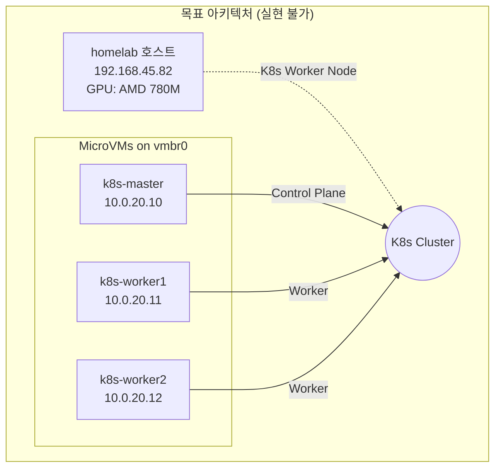
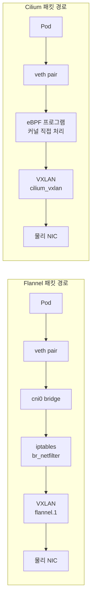
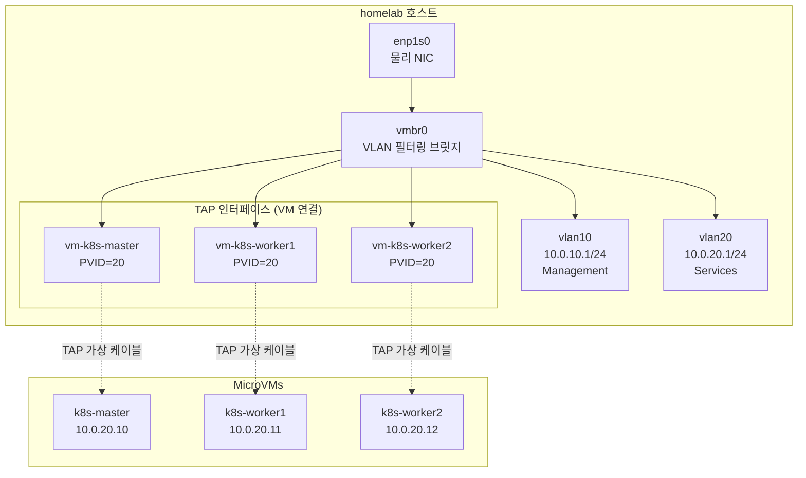
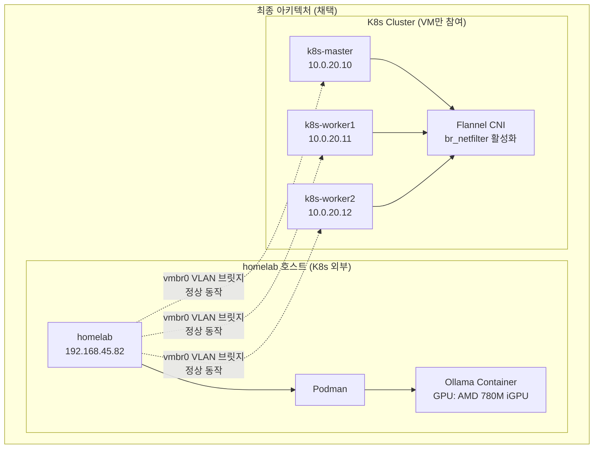

## WHY: 왜 이런 구성을 시도했는가?

### 배경 상황

현재 홈랩 환경은 다음과 같이 구성되어 있습니다:

- **물리 호스트 (homelab)**: AMD 780M iGPU가 장착된 미니 PC
- **MicroVM 3대**: k8s-master, k8s-worker1, k8s-worker2
- **네트워크**: VLAN 기반 브릿지(vmbr0)를 통해 VM들이 통신

원래 목표는 GPU 워크로드(Ollama AI 모델 서빙)를 Kubernetes에서 스케줄링하는 것이었습니다. GPU는 물리 호스트에만 있으므로, 호스트를 K8s 워커 노드로 추가해야 했습니다.

### 문제의 시작: Flannel + br_netfilter 충돌

Flannel CNI는 Pod 간 통신을 위해 **br_netfilter** 커널 모듈을 필요로 합니다. 이 모듈은 Linux 브릿지를 통과하는 패킷을 iptables로 필터링할 수 있게 해줍니다.
문제는 호스트에서 br_netfilter를 활성화하면, VM들이 사용하는 vmbr0 브릿지 트래픽도 iptables를 거치게 된다는 점입니다. NixOS의 기본 방화벽 정책(nixos-filter-forward 체인)이 이 트래픽을 차단하여 **VM 네트워크가 완전히 불통**이 됩니다.

### Cilium 검토 이유

Cilium은 **eBPF(extended Berkeley Packet Filter)** 기반으로 동작하며, br_netfilter 없이도 Pod 네트워킹이 가능합니다. 이론적으로 호스트를 K8s 노드로 추가하면서도 VM 브릿지 네트워크를 유지할 수 있을 것으로 기대했습니다.
하지만 결론적으로, Cilium도 다른 방식으로 호스트 네트워크 전체를 장악하여 VM 브릿지와 충돌했습니다.

### 목표했던 아키텍처



이 구성이 실현되었다면, Kubernetes 스케줄러가 GPU가 필요한 Pod를 자동으로 호스트 노드에 배치할 수 있었을 것입니다.

---

## WHAT: 핵심 문제 - CNI와 VM 브릿지의 충돌

### 근본적인 충돌 원인

단일 서버에서 호스트와 VM을 하나의 K8s 클러스터로 구성할 때, **CNI가 호스트의 네트워크 스택을 변경**하면서 VM 브릿지 네트워크와 충돌이 발생합니다. 이 충돌은 CNI의 종류와 관계없이 발생하며, 그 메커니즘만 다릅니다.

| CNI | 충돌 메커니즘 | 결과 |
| --- | --- | --- |
| **Flannel** | br_netfilter가 모든 브릿지 트래픽을 iptables로 보냄 | VM 트래픽이 방화벽에서 차단됨 |
| **Cilium** | eBPF가 모든 네트워크 인터페이스를 장악 | VM 브릿지 동작 방해 |


### Flannel vs Cilium 기술 비교

| 항목 | Flannel | Cilium |
| --- | --- | --- |
| **기반 기술** | iptables + VXLAN | eBPF |
| **br_netfilter 요구** | 필수 (없으면 Pod 통신 불가) | 불필요 |
| **성능** | 보통 (iptables 오버헤드) | 높음 (커널 직접 처리) |
| **NetworkPolicy** | 미지원 (별도 Calico 필요) | 기본 지원 + L7 정책 |
| **Observability** | 없음 | Hubble 내장 |
| **복잡도** | 단순 | 복잡 |
| **리소스 사용량** | 가벼움 (~100MB) | 상대적으로 무거움 (~500MB) |
| **호스트 네트워크 영향** | br_netfilter로 브릿지 트래픽 변경 | eBPF로 모든 인터페이스 제어 |


### 패킷 처리 방식 비교

두 CNI 모두 Pod 간 통신을 위해 호스트의 네트워크 스택에 깊숙이 개입합니다.



**Flannel의 문제**: br_netfilter 모듈이 활성화되면, **Kubernetes와 무관한** vmbr0 브릿지 트래픽까지 iptables를 거치게 됩니다.
**Cilium의 문제**: Cilium은 호스트의 **모든 네트워크 인터페이스**에 eBPF 프로그램을 attach하여 패킷 경로를 제어합니다. vmbr0를 명시적으로 제외하더라도 완전한 격리가 어렵습니다.

### 현재 네트워크 아키텍처 (homelab 환경)

아래 다이어그램은 현재 homelab의 네트워크 구조입니다. 호스트의 vmbr0 브릿지가 VLAN을 기반으로 VM들에게 네트워크를 제공합니다.



**핵심 포인트**: vmbr0는 VM들의 생명선입니다. CNI가 이 브릿지의 동작을 방해하면 VM들은 네트워크 접근을 완전히 잃게 됩니다.

---

## HOW: 검토 과정 및 실험

### 1. Cilium 설치 시도

Flannel의 br_netfilter 문제를 해결하기 위해 Cilium을 설치해 보았습니다.

```bash
# Helm repo 추가
helm repo add cilium <https://helm.cilium.io/>
helm repo update

# Cilium 설치 (호스트 노드 포함)
helm install cilium cilium/cilium \\
  --namespace kube-system \\
  --set operator.replicas=1 \\
  --set ipam.mode=kubernetes \\
  --set tunnel=vxlan \\
  --set bpf.masquerade=true \\
  --set nodePort.enabled=true

```

### 2. Cilium 설치 후 발생한 문제

설치 직후 호스트에서 VM으로의 모든 네트워크 연결이 끊어졌습니다.

```bash
# 호스트에서 VM ping 시도
$ ping 10.0.20.10
PING 10.0.20.10 (10.0.20.10) 56(84) bytes of data.
From 10.0.20.1 icmp_seq=1 Destination Host Unreachable

```

Cilium이 생성한 인터페이스들을 확인해 보면:

```bash
$ ip link show | grep cilium
cilium_net@cilium_host: <BROADCAST,MULTICAST,UP,LOWER_UP>
cilium_host@cilium_net: <BROADCAST,MULTICAST,UP,LOWER_UP>
cilium_vxlan: <BROADCAST,MULTICAST,UP,LOWER_UP>
lxc_health: <BROADCAST,MULTICAST,UP,LOWER_UP>

```

Cilium이 호스트의 네트워크 인터페이스에 eBPF 프로그램을 attach하여 vmbr0 브릿지의 정상적인 동작을 방해했습니다.

### 3. Cilium 제거 및 Flannel 롤백

VM 네트워크 복구를 위해 Cilium을 완전히 제거해야 했습니다.

```bash
# Cilium 제거 (uninstall만으로는 부족)
cilium uninstall --wait
# 또는
helm uninstall cilium -n kube-system

# 각 노드에서 Cilium이 생성한 인터페이스 수동 삭제
sudo ip link delete cilium_host 2>/dev/null
sudo ip link delete cilium_net 2>/dev/null
sudo ip link delete cilium_vxlan 2>/dev/null
sudo ip link delete lxc_health 2>/dev/null

# CNI 설정 파일 삭제 (이것이 없으면 kubelet이 계속 cilium-cni 사용 시도)
sudo rm -rf /etc/cni/net.d/*cilium*
sudo rm -rf /var/run/cilium

# Cilium이 추가한 iptables 체인 정리
sudo iptables -t filter -F CILIUM_FORWARD 2>/dev/null
sudo iptables -t filter -F CILIUM_INPUT 2>/dev/null
sudo iptables -t filter -F CILIUM_OUTPUT 2>/dev/null
sudo iptables -t nat -F CILIUM_PRE_nat 2>/dev/null
sudo iptables -t nat -F CILIUM_POST_nat 2>/dev/null
sudo iptables -t nat -F CILIUM_OUTPUT_nat 2>/dev/null

# Cilium이 노드에 추가한 taint 제거 (이것이 남아있으면 Pod 스케줄링 불가)
kubectl taint nodes --all node.cilium.io/agent-not-ready:NoSchedule-

# containerd와 kubelet 재시작하여 깨끗한 상태로 복구
sudo systemctl restart containerd
sudo systemctl restart kubelet

# Flannel 재설치
kubectl apply -f <https://github.com/flannel-io/flannel/releases/latest/download/kube-flannel.yml>

```

**중요**: Cilium은 제거 후에도 많은 잔여물(인터페이스, iptables 규칙, taint)을 남깁니다. 이것들을 모두 수동으로 정리해야 네트워크가 정상 복구됩니다.

### 4. NixOS 설정에서 br_netfilter 조건부 활성화

최종적으로 채택한 해결책은 **호스트에서는 br_netfilter를 비활성화**하고, **VM에서만 활성화**하는 것입니다. 이렇게 하면 VM들끼리는 Flannel로 정상 통신하고, 호스트의 vmbr0 브릿지는 영향받지 않습니다.

```nix
# k8s-node.nix에서 isVM 변수로 호스트/VM 구분

# br_netfilter: VM에서만 활성화
# 호스트에서 활성화하면 vmbr0 브릿지 트래픽이 iptables를 거쳐 차단됨
boot.kernelModules =
  ["overlay"]  # containerd에 필요
  ++ lib.optionals isVM ["br_netfilter"];  # VM에서만 로드

# sysctl 설정도 VM에서만 적용
boot.kernel.sysctl =
  { "net.ipv4.ip_forward" = lib.mkForce 1; }  # 모든 노드에 필요
  // lib.optionalAttrs isVM {
    # 이 설정들은 br_netfilter가 로드되어야만 의미가 있음
    "net.bridge.bridge-nf-call-iptables" = 1;
    "net.bridge.bridge-nf-call-ip6tables" = 1;
  };

# Kubernetes 관련 방화벽 포트
networking.firewall = {
  allowedTCPPorts = [
    10250  # kubelet API (kubectl exec, logs 등에 필요)
    10255  # kubelet read-only metrics
    4240   # Cilium health check (Cilium 사용 시)
    4244   # Hubble server (Cilium 사용 시)
    4245   # Hubble relay (Cilium 사용 시)
  ];
  allowedUDPPorts = [
    8472   # VXLAN 터널 (Flannel, Cilium 모두 사용)
  ];
};

```

**결과**: 이 설정으로 호스트는 K8s 클러스터에서 제외되지만, VM들 간의 클러스터는 정상 동작합니다.

---

## TROUBLE SHOOTING: 발생한 문제들과 해결 과정

이 섹션에서는 하이브리드 클러스터 구성 시도 중 겪은 다양한 문제들과 그 해결 방법을 상세히 설명합니다.

### 1. VM 네트워크 완전 불통 (br_netfilter 문제)

이 문제는 호스트에서 Flannel을 실행하려고 할 때 발생했습니다.
**증상:**

```bash
# 호스트에서 VM ping 시도
$ ping 10.0.20.10
PING 10.0.20.10 (10.0.20.10) 56(84) bytes of data.
From 10.0.20.1 icmp_seq=1 Destination Host Unreachable
From 10.0.20.1 icmp_seq=2 Destination Host Unreachable

```

VM들은 SSH 접속도 불가능해지며, 완전히 고립됩니다.
**원인 분석:**
br_netfilter 커널 모듈이 로드되면, Linux 커널은 **모든 브릿지 인터페이스**를 통과하는 패킷을 iptables로 보냅니다. 이는 Kubernetes의 cni0 브릿지뿐만 아니라, VM들이 사용하는 vmbr0 브릿지에도 적용됩니다.
NixOS의 기본 방화벽에는 `nixos-filter-forward` 체인이 있으며, 이 체인은 명시적으로 허용되지 않은 forwarded 트래픽을 DROP합니다. vmbr0를 통한 VM 트래픽은 이 필터에 걸려 차단됩니다.
**진단 방법:**

```bash
# 1. 먼저 ARP 요청이 어디서 멈추는지 확인
# vlan20 인터페이스에서 ARP 요청 모니터링
sudo tcpdump -i vlan20 -n arp
# 결과: VM의 ARP 요청이 보이지 않음

# 2. TAP 인터페이스에서 확인
sudo tcpdump -i vm-k8s-master -n arp
# 결과: VM의 ARP 요청은 TAP까지 도달함

# 이것은 패킷이 TAP → 브릿지 → VLAN 경로에서 차단됨을 의미

# 3. iptables FORWARD 체인 확인
sudo iptables -L FORWARD -v -n
# nixos-filter-forward 체인으로 점프하는 규칙 확인

sudo iptables -L nixos-filter-forward -v -n
# DROP 규칙에 패킷 카운터가 증가하는지 확인

```

**해결 방법:**

1. **권장**: 호스트에서 br_netfilter 비활성화 (호스트를 K8s에서 제외)
2. **대안**: vmbr0 트래픽을 허용하는 iptables 규칙 추가 (복잡하고 유지보수 어려움)

---

### 2. Cilium이 호스트 네트워크 전체를 장악

Flannel 대신 Cilium을 시도했을 때 발생한 문제입니다. Cilium은 br_netfilter가 필요 없지만, 다른 방식으로 네트워크를 장악합니다.
**증상:**
Cilium 설치 후 VM 네트워크가 불통이 됩니다. Flannel과 달리, Cilium을 제거한 후에도 문제가 지속될 수 있습니다.

```bash
# Cilium이 생성한 인터페이스들
$ ip link show | grep -E "cilium|lxc"
5: cilium_net@cilium_host: <BROADCAST,MULTICAST,UP,LOWER_UP> mtu 1500
6: cilium_host@cilium_net: <BROADCAST,MULTICAST,UP,LOWER_UP> mtu 1500
7: cilium_vxlan: <BROADCAST,MULTICAST,UP,LOWER_UP> mtu 1450
8: lxc_health: <BROADCAST,MULTICAST,UP,LOWER_UP> mtu 1500

```

**원인 분석:**
Cilium은 eBPF 프로그램을 사용하여 패킷을 처리합니다. 이 프로그램들은 네트워크 인터페이스의 `tc` (traffic control) 훅에 attach되어 패킷 경로를 직접 제어합니다.
문제는 Cilium이 **호스트의 모든 네트워크 인터페이스**에 이 프로그램들을 attach한다는 점입니다. vmbr0 브릿지와 VLAN 인터페이스도 예외가 아니며, Cilium의 eBPF 프로그램이 이들의 정상적인 패킷 포워딩을 방해합니다.
**진단 방법:**

```bash
# 1. Cilium의 eBPF 프로그램 확인
sudo bpftool prog list | grep -i cilium
# sched_cls 타입의 프로그램들이 보임

# 2. 특정 인터페이스에 attach된 eBPF 확인
sudo tc filter show dev vmbr0 ingress
sudo tc filter show dev vmbr0 egress
# Cilium 관련 필터가 attach되어 있으면 문제

# 3. Cilium 인터페이스 존재 여부 확인
ip link show | grep -E "cilium|lxc"

# 4. Cilium iptables 체인 확인
sudo iptables -L -n | grep -i cilium
sudo iptables -t nat -L -n | grep -i cilium

```

**해결 방법:**
Cilium 완전 제거가 필요합니다. `helm uninstall`만으로는 부족하며, 수동 정리가 필요합니다.

```bash
# 1. kubelet 중지 (Cilium Pod 중지)
sudo systemctl stop kubelet

# 2. Cilium 인터페이스 삭제
sudo ip link delete cilium_host 2>/dev/null
sudo ip link delete cilium_net 2>/dev/null
sudo ip link delete cilium_vxlan 2>/dev/null
sudo ip link delete lxc_health 2>/dev/null

# 3. eBPF 프로그램 정리 (tc 필터 삭제)
for iface in $(ip link show | grep -oP '^\\d+: \\K[^:@]+'); do
  sudo tc filter del dev $iface ingress 2>/dev/null
  sudo tc filter del dev $iface egress 2>/dev/null
done

# 4. iptables 체인 정리
sudo iptables -t filter -F CILIUM_FORWARD 2>/dev/null
sudo iptables -t filter -F CILIUM_INPUT 2>/dev/null
sudo iptables -t filter -F CILIUM_OUTPUT 2>/dev/null
sudo iptables -t nat -F CILIUM_PRE_nat 2>/dev/null
sudo iptables -t nat -F CILIUM_POST_nat 2>/dev/null

# 5. 잔여 파일 삭제
sudo rm -rf /var/run/cilium
sudo rm -rf /etc/cni/net.d/*cilium*

# 6. 서비스 재시작
sudo systemctl restart containerd
sudo systemctl restart kubelet

```

---

### 3. CNI 플러그인이 시스템 명령어를 덮어씀 (bridge 명령 충돌)

NixOS에서 cni-plugins 패키지를 설치했을 때 발생하는 문제입니다.
**증상:**
VLAN 브릿지를 디버깅하려고 `bridge` 명령을 실행하면 엉뚱한 출력이 나옵니다.

```bash
# VLAN 설정을 확인하려고 bridge 명령 실행
$ bridge vlan show
CNI bridge plugin v1.9.0
Usage: bridge add <net_config> <container_id> ...

```

`iproute2`의 `bridge` 명령 대신 CNI의 `bridge` 플러그인이 실행됩니다. 네트워크 디버깅이 불가능해집니다.
**원인 분석:**
NixOS에서 `cni-plugins` 패키지를 `environment.systemPackages`에 추가하면, 패키지의 모든 바이너리가 PATH에 추가됩니다. CNI 플러그인 중 `bridge`라는 이름의 바이너리가 있어서 `iproute2`의 `bridge` 명령을 덮어씁니다.

```bash
# 어떤 bridge가 실행되는지 확인
$ which bridge
/run/current-system/sw/bin/bridge  # CNI의 bridge

# iproute2의 bridge 위치
$ ls /run/current-system/sw/bin/bridge*
# iproute2의 bridge는 숨겨짐

```

**해결 방법 (NixOS):**
`cni-plugins`를 systemPackages에서 제거하고, `/opt/cni/bin`에 심볼릭 링크만 생성합니다. 이렇게 하면 kubelet은 CNI 플러그인을 찾을 수 있지만, PATH에는 추가되지 않습니다.

```nix
# 잘못된 방법: cni-plugins가 PATH에 추가됨
environment.systemPackages = with pkgs; [
  cni-plugins  # 이렇게 하면 bridge 명령 충돌!
];

# 올바른 방법: /opt/cni/bin에만 심볼릭 링크 생성
environment.systemPackages = with pkgs; [
  # cni-plugins 제거됨
];

# kubelet이 찾는 /opt/cni/bin에 필요한 플러그인만 링크
systemd.tmpfiles.rules = [
  "d /opt/cni/bin 0755 root root - -"
  "L+ /opt/cni/bin/loopback - - - - ${pkgs.cni-plugins}/bin/loopback"
  "L+ /opt/cni/bin/bridge - - - - ${pkgs.cni-plugins}/bin/bridge"
  "L+ /opt/cni/bin/host-local - - - - ${pkgs.cni-plugins}/bin/host-local"
  "L+ /opt/cni/bin/portmap - - - - ${pkgs.cni-plugins}/bin/portmap"
  "L+ /opt/cni/bin/flannel - - - - ${pkgs.cni-plugin-flannel}/bin/flannel"
];

```

이제 `bridge vlan show`가 정상 동작하면서도 kubelet의 CNI 플러그인 사용에는 문제가 없습니다.

---

### 4. Flannel Pod가 Error 상태 (br_netfilter 미로드)

VM에서 Flannel을 실행할 때 발생할 수 있는 문제입니다.
**증상:**
Flannel Pod가 시작하자마자 Error 상태가 됩니다.

```bash
$ kubectl get pods -n kube-flannel
NAME                    READY   STATUS    RESTARTS   AGE
kube-flannel-ds-xxxxx   0/1     Error     0          1m

```

**로그 확인:**

```bash
$ kubectl logs -n kube-flannel kube-flannel-ds-xxxxx
Error registering network: failed to check br_netfilter:
stat /proc/sys/net/bridge/bridge-nf-call-iptables: no such file or directory

```

**원인 분석:**
Flannel은 시작할 때 `br_netfilter` 커널 모듈이 로드되어 있는지 확인합니다. 이 모듈이 없으면 `/proc/sys/net/bridge/bridge-nf-call-iptables` 파일이 존재하지 않고, Flannel은 이를 치명적 오류로 처리합니다.
**해결 방법:**

```bash
# 즉시 해결 (재부팅 후 사라짐)
sudo modprobe br_netfilter

# 모듈이 로드되었는지 확인
lsmod | grep br_netfilter
cat /proc/sys/net/bridge/bridge-nf-call-iptables  # 1이면 정상

```

**NixOS 영구 설정:**

```nix
# VM에서만 br_netfilter 활성화
boot.kernelModules = lib.optionals isVM ["br_netfilter"];

# sysctl 설정도 함께 (br_netfilter 로드 후에만 의미 있음)
boot.kernel.sysctl = lib.optionalAttrs isVM {
  "net.bridge.bridge-nf-call-iptables" = 1;
  "net.bridge.bridge-nf-call-ip6tables" = 1;
};

```

**주의**: 호스트에서는 br_netfilter를 활성화하면 안 됩니다 (문제 #1 참조).

---

### 5. Pod가 Pending 상태에서 벗어나지 않음 (Cilium taint 잔존)

Cilium을 제거한 후 발생할 수 있는 문제입니다.
**증상:**
새로운 Pod를 배포하면 Pending 상태에서 영원히 머뭅니다.

```bash
$ kubectl get pods
NAME         READY   STATUS    RESTARTS   AGE
ollama-xxx   0/1     Pending   0          10m

```

**상세 정보 확인:**

```bash
$ kubectl describe pod ollama-xxx
...
Events:
  Type     Reason            Age   From               Message
  ----     ------            ----  ----               -------
  Warning  FailedScheduling  10m   default-scheduler  0/4 nodes are available:
           4 node(s) had untolerated taint {node.cilium.io/agent-not-ready: true}

```

**원인 분석:**
Cilium은 설치될 때 모든 노드에 `node.cilium.io/agent-not-ready:NoSchedule` taint를 추가합니다. 이 taint는 Cilium Agent가 준비되기 전에 Pod가 스케줄링되는 것을 방지합니다.
문제는 Cilium을 제거해도 이 taint가 자동으로 제거되지 않는다는 것입니다. 노드에 taint가 남아 있으면 새 Pod는 스케줄링될 수 없습니다.
**진단:**

```bash
# 노드의 taint 확인
$ kubectl get nodes -o custom-columns=NAME:.metadata.name,TAINTS:.spec.taints
NAME          TAINTS
homelab       [map[effect:NoSchedule key:node.cilium.io/agent-not-ready]]
k8s-master    [map[effect:NoSchedule key:node.cilium.io/agent-not-ready]]
k8s-worker1   [map[effect:NoSchedule key:node.cilium.io/agent-not-ready]]
k8s-worker2   [map[effect:NoSchedule key:node.cilium.io/agent-not-ready]]

# 또는 상세하게
$ kubectl describe node k8s-master | grep -A5 Taints
Taints:             node.cilium.io/agent-not-ready:NoSchedule

```

**해결 방법:**
모든 노드에서 Cilium taint를 수동으로 제거합니다.

```bash
# 모든 노드에서 Cilium taint 제거
kubectl taint nodes --all node.cilium.io/agent-not-ready:NoSchedule-

# 제거 확인
kubectl get nodes -o custom-columns=NAME:.metadata.name,TAINTS:.spec.taints
# TAINTS 열이 <none>이면 정상

# 이제 Pending Pod가 스케줄링됨
kubectl get pods

```

---

### 6. CNI 설정 파일 충돌 (제거된 CNI를 계속 사용)

Cilium에서 Flannel로 전환하거나, CNI를 교체할 때 발생하는 문제입니다.
**증상:**
새 Pod가 생성되지 않고 다음과 같은 에러가 발생합니다.

```bash
$ kubectl describe pod some-pod
...
Events:
  Warning  FailedCreatePodSandBox  kubelet  Failed to create pod sandbox:
    rpc error: code = Unknown desc = failed to setup network for sandbox:
    plugin type="cilium-cni" failed: unable to connect to Cilium agent:
    dial unix /var/run/cilium/cilium.sock: connect: no such file or directory

```

Cilium은 이미 제거했는데 kubelet이 계속 cilium-cni를 사용하려고 합니다.
**원인 분석:**
kubelet은 `/etc/cni/net.d/` 디렉토리에서 CNI 설정 파일을 읽습니다. 파일 이름의 알파벳 순서대로 처리하며, 첫 번째로 찾은 설정을 사용합니다.
Cilium은 `05-cilium.conflist` 같은 이름으로 설정 파일을 생성하고, Flannel은 `10-flannel.conflist`를 사용합니다. Cilium 설정이 먼저 오므로, Cilium이 제거되어도 kubelet은 cilium-cni를 사용하려 합니다.

```bash
# CNI 설정 파일 확인
$ ls -la /etc/cni/net.d/
-rw-r--r-- 1 root root  349 Jan 15 10:00 05-cilium.conflist  # Cilium 잔재
-rw-r--r-- 1 root root  292 Jan 15 12:00 10-flannel.conflist # Flannel

```

**해결 방법:**
Cilium CNI 설정 파일을 삭제하고 서비스를 재시작합니다.

```bash
# Cilium CNI 설정 삭제
sudo rm -f /etc/cni/net.d/*cilium*

# 남은 파일 확인
ls /etc/cni/net.d/
# 10-flannel.conflist만 있어야 함

# containerd와 kubelet 재시작
sudo systemctl restart containerd
sudo systemctl restart kubelet

# 잠시 후 Pod 상태 확인
kubectl get pods -A

```

**예방책:**
CNI를 교체할 때는 항상 다음 순서를 따르세요:

1. 이전 CNI 완전 제거 (helm uninstall 등)
2. `/etc/cni/net.d/`의 설정 파일 삭제
3. `/var/run/<cni-name>` 디렉토리 삭제
4. CNI 관련 인터페이스 삭제 (`ip link delete`)
5. containerd, kubelet 재시작
6. 새 CNI 설치

---

## 결론: 아키텍처 분리가 유일한 해결책

여러 CNI와 설정을 검토한 결과, **단일 서버에서 호스트와 VM을 하나의 K8s 클러스터로 구성하는 것은 현실적으로 불가능**하다는 결론에 도달했습니다.

### 왜 불가능한가?

1. **Flannel**: br_netfilter가 모든 브릿지 트래픽을 iptables로 보내 VM 네트워크 차단
2. **Cilium**: eBPF가 모든 인터페이스를 장악하여 VM 브릿지 동작 방해
3. **Calico, Weave 등 다른 CNI**: 유사한 문제가 예상됨 (모두 호스트 네트워크 스택에 개입)

근본적인 문제는 **CNI가 K8s 노드의 네트워크 스택 전체에 영향을 미친다**는 것입니다. VM 하이퍼바이저가 실행되는 호스트에서는 이것이 VM 네트워킹과 충돌합니다.

### 최종 아키텍처



### 이 아키텍처의 장점

1. **안정성**: VM 네트워크와 K8s 네트워크가 완전히 분리되어 서로 영향 없음
2. **단순성**: Flannel만 사용하여 복잡도 최소화
3. **유지보수성**: 각 계층이 독립적이라 문제 발생 시 원인 파악 용이

### 단점과 대안

**단점**: GPU 워크로드를 K8s 스케줄러가 관리할 수 없음
**대안**:

- GPU 워크로드는 Podman으로 호스트에서 직접 실행
- K8s에서 Ollama API를 ExternalName Service로 노출
- 또는 GPU가 있는 별도 물리 서버를 K8s 워커로 추가 (VM 브릿지가 없는 서버)

---

## 부록: 유용한 명령어 및 참고 자료

### 네트워크 진단 명령어

```bash
# 인터페이스 상태 확인
ip link show                      # 모든 인터페이스 목록
ip addr show                      # 인터페이스별 IP 주소
ip route show                     # 라우팅 테이블

# 브릿지 진단
bridge link show                  # 브릿지에 연결된 인터페이스
bridge vlan show                  # VLAN 설정 확인
bridge fdb show                   # MAC 주소 테이블

# 패킷 캡처
tcpdump -i <interface> -n arp     # ARP 요청/응답 확인
tcpdump -i vmbr0 -n icmp          # ICMP (ping) 패킷 확인
tcpdump -i vlan20 -n              # 특정 VLAN 트래픽 모니터링

# iptables 진단
iptables -L -v -n                 # filter 테이블 규칙
iptables -t nat -L -v -n          # NAT 테이블 규칙
iptables -L FORWARD -v -n         # FORWARD 체인 상세

# eBPF 진단 (Cilium 사용 시)
bpftool prog list                 # 로드된 eBPF 프로그램
tc filter show dev <iface> ingress  # 인터페이스의 tc 필터

```

### Kubernetes 진단 명령어

```bash
# 노드 상태
kubectl get nodes -o wide
kubectl describe node <node-name>
kubectl get nodes -o custom-columns=NAME:.metadata.name,TAINTS:.spec.taints

# Pod 상태
kubectl get pods -A -o wide       # 모든 네임스페이스의 Pod
kubectl describe pod <pod-name>   # Pod 상세 정보
kubectl logs <pod-name>           # Pod 로그

# CNI 진단
ls -la /etc/cni/net.d/            # CNI 설정 파일
ls -la /opt/cni/bin/              # CNI 바이너리

# Flannel 진단
kubectl get pods -n kube-flannel
kubectl logs -n kube-flannel -l app=flannel
cat /run/flannel/subnet.env       # Flannel 서브넷 정보

# Cilium 진단 (사용 시)
cilium status
cilium connectivity test
kubectl get pods -n kube-system -l app.kubernetes.io/part-of=cilium

```

### 참고 자료

**공식 문서:**

- [Flannel GitHub](https://github.com/flannel-io/flannel) - Flannel CNI 공식 저장소
- [Cilium Documentation](https://docs.cilium.io/) - Cilium 공식 문서
- [Cilium eBPF Datapath](https://docs.cilium.io/en/stable/network/ebpf/) - Cilium의 eBPF 구현 상세

**관련 이슈 및 토론:**

- [br_netfilter breaks bridge networking](https://github.com/kubernetes/kubernetes/issues/23324) - br_netfilter와 브릿지 충돌 이슈
- [Cilium device selection](https://docs.cilium.io/en/stable/network/concepts/routing/#native-routing) - Cilium 인터페이스 선택 동작

**NixOS 관련:**

- [NixOS Kubernetes Wiki](https://nixos.wiki/wiki/Kubernetes) - NixOS에서 K8s 구성
- [MicroVM.nix](https://github.com/astro/microvm.nix) - NixOS MicroVM 프레임워크

**추가 학습:**

- [Linux Networking Explained](https://www.tkng.io/) - Linux 네트워킹 심층 설명
- [eBPF.io](https://ebpf.io/) - eBPF 기술 소개 및 학습 자료
