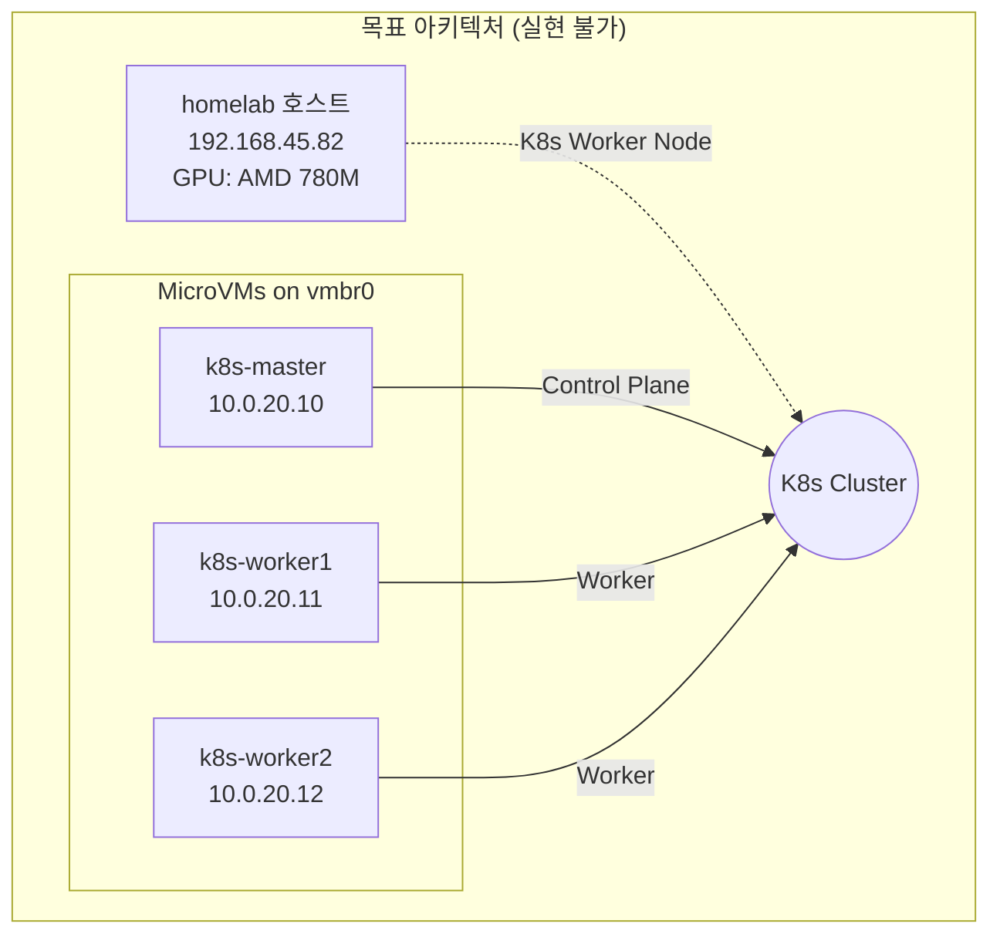
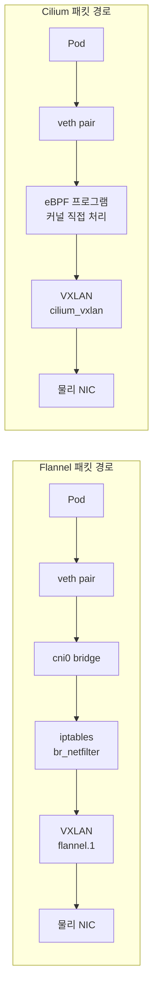
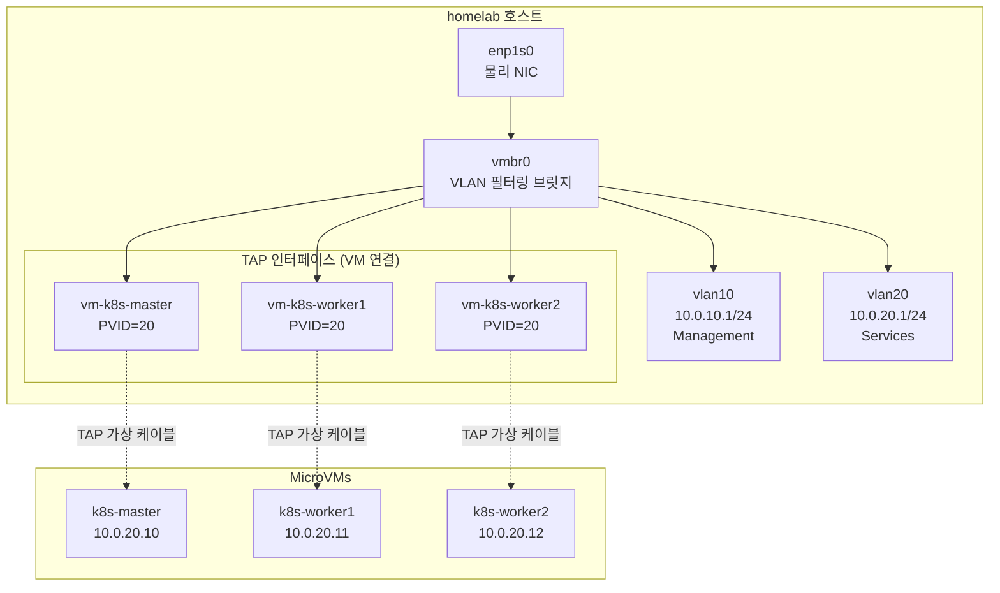
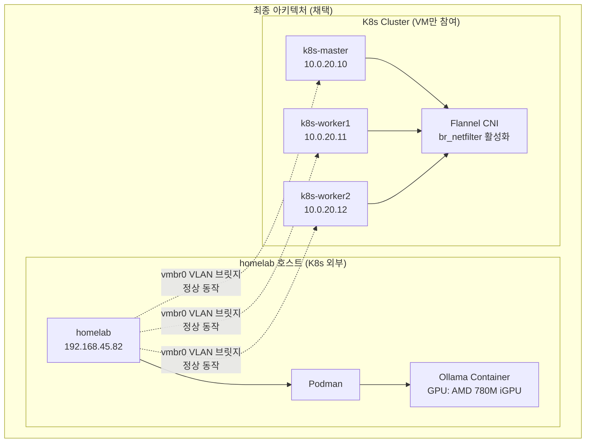

# Why?

홈랩에 GPU 워크로드를 올리고 싶었다. AMD 780M iGPU가 박힌 미니 PC 한 대, 그 위에 MicroVM 3대로 Kubernetes 클러스터를 구성하고 있었다. GPU는 물리 호스트에만 있으므로, Ollama AI 모델 서빙을 K8s 스케줄러로 관리하려면 호스트 자체를 워커 노드로 K8s에 합류시켜야 했다.

그런데 호스트에 Flannel CNI를 올리는 순간 VM 전체의 네트워크가 끊겼다. Cilium으로 바꿔봤지만 더 심각했다. 제거한 후에도 잔여물 때문에 한동안 클러스터가 망가진 상태로 있었다. 이 글은 그 충돌이 왜 일어나는지, 어떻게 진단하고 복구했는지, 그리고 왜 이 구성이 근본적으로 불가능한지를 다룬다.

## 왜 이런 구성을 시도했는가 — GPU가 호스트에 묶여 있어서다 🖥️

현재 홈랩 환경은 다음과 같이 구성되어 있다.

- **물리 호스트 (homelab)**: AMD 780M iGPU가 장착된 미니 PC
- **MicroVM 3대**: k8s-master, k8s-worker1, k8s-worker2
- **네트워크**: VLAN 기반 브릿지(vmbr0)를 통해 VM들이 통신

원래 목표는 GPU 워크로드(Ollama AI 모델 서빙)를 Kubernetes에서 스케줄링하는 것이었다. GPU는 물리 호스트에만 있으므로, 호스트를 K8s 워커 노드로 추가해야 했다. 이 전제가 모든 문제의 시작점이다.

### 문제의 시작 — Flannel + br_netfilter 충돌

Flannel CNI는 Pod 간 통신을 위해 **br_netfilter** 커널 모듈을 필요로 한다[^1]. 이 모듈은 Linux 브릿지를 통과하는 패킷을 iptables로 필터링할 수 있게 해준다.

문제는 호스트에서 br_netfilter를 활성화하면, VM들이 사용하는 vmbr0 브릿지 트래픽도 iptables를 거치게 된다는 점이다. NixOS의 기본 방화벽 정책(nixos-filter-forward 체인)이 이 트래픽을 차단하여 **VM 네트워크가 완전히 불통**이 된다.

### Cilium 검토 이유

Cilium은 **eBPF(extended Berkeley Packet Filter)** 기반으로 동작하며, br_netfilter 없이도 Pod 네트워킹이 가능하다[^2]. 이론적으로 호스트를 K8s 노드로 추가하면서도 VM 브릿지 네트워크를 유지할 수 있을 것으로 기대했다. 하지만 결론적으로, Cilium도 다른 방식으로 호스트 네트워크 전체를 장악하여 VM 브릿지와 충돌했다.

### 목표했던 아키텍처



이 구성이 실현되었다면, Kubernetes 스케줄러가 GPU가 필요한 Pod를 자동으로 호스트 노드에 배치할 수 있었을 것이다.

## 핵심 문제 — CNI가 호스트 네트워크 스택 전체에 개입하기 때문이다 🔥

단일 서버에서 호스트와 VM을 하나의 K8s 클러스터로 구성할 때, **CNI가 호스트의 네트워크 스택을 변경**하면서 VM 브릿지 네트워크와 충돌이 발생한다. 이 충돌은 CNI의 종류와 관계없이 발생하며, 그 메커니즘만 다르다.

| CNI         | 충돌 메커니즘                                       | 결과                          |
| ----------- | --------------------------------------------------- | ----------------------------- |
| **Flannel** | br_netfilter가 모든 브릿지 트래픽을 iptables로 보냄 | VM 트래픽이 방화벽에서 차단됨 |
| **Cilium**  | eBPF가 모든 네트워크 인터페이스를 장악              | VM 브릿지 동작 방해           |

### Flannel vs Cilium 기술 비교

| 항목                     | Flannel                           | Cilium                      |
| ------------------------ | --------------------------------- | --------------------------- |
| **기반 기술**            | iptables + VXLAN                  | eBPF                        |
| **br_netfilter 요구**    | 필수 (없으면 Pod 통신 불가)       | 불필요                      |
| **성능**                 | 보통 (iptables 오버헤드)          | 높음 (커널 직접 처리)       |
| **NetworkPolicy**        | 미지원 (별도 Calico 필요)         | 기본 지원 + L7 정책         |
| **Observability**        | 없음                              | Hubble 내장                 |
| **복잡도**               | 단순                              | 복잡                        |
| **리소스 사용량**        | 가벼움 (~100MB)                   | 상대적으로 무거움 (~500MB)  |
| **호스트 네트워크 영향** | br_netfilter로 브릿지 트래픽 변경 | eBPF로 모든 인터페이스 제어 |

### 패킷 처리 방식 비교

두 CNI 모두 Pod 간 통신을 위해 호스트의 네트워크 스택에 깊숙이 개입한다.



**Flannel의 문제**: br_netfilter 모듈이 활성화되면, **Kubernetes와 무관한** vmbr0 브릿지 트래픽까지 iptables를 거치게 된다. **Cilium의 문제**: Cilium은 호스트의 **모든 네트워크 인터페이스**에 eBPF 프로그램을 attach하여 패킷 경로를 제어한다. vmbr0를 명시적으로 제외하더라도 완전한 격리가 어렵다[^3].

### 현재 네트워크 아키텍처 (homelab 환경)

아래 다이어그램은 현재 homelab의 네트워크 구조다. 호스트의 vmbr0 브릿지가 VLAN을 기반으로 VM들에게 네트워크를 제공한다.



**핵심 포인트**: vmbr0는 VM들의 생명선이다. CNI가 이 브릿지의 동작을 방해하면 VM들은 네트워크 접근을 완전히 잃게 된다.

## 검토 과정과 실험 — 시도할수록 더 깊이 망가졌다 🔬

### Cilium 설치 시도

Flannel의 br_netfilter 문제를 해결하기 위해 Cilium을 설치해 보았다.

```bash
# Helm repo 추가
helm repo add cilium https://helm.cilium.io/
helm repo update

# Cilium 설치 (호스트 노드 포함)
helm install cilium cilium/cilium \
  --namespace kube-system \
  --set operator.replicas=1 \
  --set ipam.mode=kubernetes \
  --set tunnel=vxlan \
  --set bpf.masquerade=true \
  --set nodePort.enabled=true
```

### Cilium 설치 후 발생한 문제

설치 직후 호스트에서 VM으로의 모든 네트워크 연결이 끊어졌다.

```bash
# 호스트에서 VM ping 시도
$ ping 10.0.20.10
PING 10.0.20.10 (10.0.20.10) 56(84) bytes of data.
From 10.0.20.1 icmp_seq=1 Destination Host Unreachable
```

Cilium이 생성한 인터페이스들을 확인해 보면:

```bash
$ ip link show | grep cilium
cilium_net@cilium_host: <BROADCAST,MULTICAST,UP,LOWER_UP>
cilium_host@cilium_net: <BROADCAST,MULTICAST,UP,LOWER_UP>
cilium_vxlan: <BROADCAST,MULTICAST,UP,LOWER_UP>
lxc_health: <BROADCAST,MULTICAST,UP,LOWER_UP>
```

Cilium이 호스트의 네트워크 인터페이스에 eBPF 프로그램을 attach하여 vmbr0 브릿지의 정상적인 동작을 방해했다.

### Cilium 제거 및 Flannel 롤백

VM 네트워크 복구를 위해 Cilium을 완전히 제거해야 했다. `helm uninstall`만으로는 부족하며, 수동 정리가 반드시 필요하다[^4].

```bash
# Cilium 제거 (uninstall만으로는 부족)
cilium uninstall --wait
# 또는
helm uninstall cilium -n kube-system

# 각 노드에서 Cilium이 생성한 인터페이스 수동 삭제
sudo ip link delete cilium_host 2>/dev/null
sudo ip link delete cilium_net 2>/dev/null
sudo ip link delete cilium_vxlan 2>/dev/null
sudo ip link delete lxc_health 2>/dev/null

# CNI 설정 파일 삭제 (이것이 없으면 kubelet이 계속 cilium-cni 사용 시도)
sudo rm -rf /etc/cni/net.d/*cilium*
sudo rm -rf /var/run/cilium

# Cilium이 추가한 iptables 체인 정리
sudo iptables -t filter -F CILIUM_FORWARD 2>/dev/null
sudo iptables -t filter -F CILIUM_INPUT 2>/dev/null
sudo iptables -t filter -F CILIUM_OUTPUT 2>/dev/null
sudo iptables -t nat -F CILIUM_PRE_nat 2>/dev/null
sudo iptables -t nat -F CILIUM_POST_nat 2>/dev/null
sudo iptables -t nat -F CILIUM_OUTPUT_nat 2>/dev/null

# Cilium이 노드에 추가한 taint 제거 (이것이 남아있으면 Pod 스케줄링 불가)
kubectl taint nodes --all node.cilium.io/agent-not-ready:NoSchedule-

# containerd와 kubelet 재시작하여 깨끗한 상태로 복구
sudo systemctl restart containerd
sudo systemctl restart kubelet

# Flannel 재설치
kubectl apply -f https://github.com/flannel-io/flannel/releases/latest/download/kube-flannel.yml
```

**중요**: Cilium은 제거 후에도 많은 잔여물(인터페이스, iptables 규칙, taint)을 남긴다. 이것들을 모두 수동으로 정리해야 네트워크가 정상 복구된다.

### NixOS 설정에서 br_netfilter 조건부 활성화

최종적으로 채택한 해결책은 **호스트에서는 br_netfilter를 비활성화**하고, **VM에서만 활성화**하는 것이다. 이렇게 하면 VM들끼리는 Flannel로 정상 통신하고, 호스트의 vmbr0 브릿지는 영향받지 않는다[^5].

```nix
# k8s-node.nix에서 isVM 변수로 호스트/VM 구분

# br_netfilter: VM에서만 활성화
# 호스트에서 활성화하면 vmbr0 브릿지 트래픽이 iptables를 거쳐 차단됨
boot.kernelModules =
  ["overlay"]  # containerd에 필요
  ++ lib.optionals isVM ["br_netfilter"];  # VM에서만 로드

# sysctl 설정도 VM에서만 적용
boot.kernel.sysctl =
  { "net.ipv4.ip_forward" = lib.mkForce 1; }  # 모든 노드에 필요
  // lib.optionalAttrs isVM {
    # 이 설정들은 br_netfilter가 로드되어야만 의미가 있음
    "net.bridge.bridge-nf-call-iptables" = 1;
    "net.bridge.bridge-nf-call-ip6tables" = 1;
  };

# Kubernetes 관련 방화벽 포트
networking.firewall = {
  allowedTCPPorts = [
    10250  # kubelet API (kubectl exec, logs 등에 필요)
    10255  # kubelet read-only metrics
    4240   # Cilium health check (Cilium 사용 시)
    4244   # Hubble server (Cilium 사용 시)
    4245   # Hubble relay (Cilium 사용 시)
  ];
  allowedUDPPorts = [
    8472   # VXLAN 터널 (Flannel, Cilium 모두 사용)
  ];
};
```

**결과**: 이 설정으로 호스트는 K8s 클러스터에서 제외되지만, VM들 간의 클러스터는 정상 동작한다.

## 발생한 문제들과 해결 과정 — 하나씩 파고들수록 다음 문제가 기다리고 있었다 🛠️

### 문제 1 — VM 네트워크 완전 불통 (br_netfilter 문제)

이 문제는 호스트에서 Flannel을 실행하려고 할 때 발생했다. 증상은 단순하다. 호스트에서 VM으로 ping이 전혀 안 되고, VM들은 SSH 접속도 불가능해지며 완전히 고립된다.

```bash
# 호스트에서 VM ping 시도
$ ping 10.0.20.10
PING 10.0.20.10 (10.0.20.10) 56(84) bytes of data.
From 10.0.20.1 icmp_seq=1 Destination Host Unreachable
From 10.0.20.1 icmp_seq=2 Destination Host Unreachable
```

**원인 분석**: br_netfilter 커널 모듈이 로드되면, Linux 커널은 **모든 브릿지 인터페이스**를 통과하는 패킷을 iptables로 보낸다. 이는 Kubernetes의 cni0 브릿지뿐만 아니라, VM들이 사용하는 vmbr0 브릿지에도 적용된다. NixOS의 기본 방화벽에는 `nixos-filter-forward` 체인이 있으며, 이 체인은 명시적으로 허용되지 않은 forwarded 트래픽을 DROP한다. vmbr0를 통한 VM 트래픽은 이 필터에 걸려 차단된다.

**진단 방법**:

```bash
# 1. 먼저 ARP 요청이 어디서 멈추는지 확인
# vlan20 인터페이스에서 ARP 요청 모니터링
sudo tcpdump -i vlan20 -n arp
# 결과: VM의 ARP 요청이 보이지 않음

# 2. TAP 인터페이스에서 확인
sudo tcpdump -i vm-k8s-master -n arp
# 결과: VM의 ARP 요청은 TAP까지 도달함
# 이것은 패킷이 TAP → 브릿지 → VLAN 경로에서 차단됨을 의미

# 3. iptables FORWARD 체인 확인
sudo iptables -L FORWARD -v -n
# nixos-filter-forward 체인으로 점프하는 규칙 확인

sudo iptables -L nixos-filter-forward -v -n
# DROP 규칙에 패킷 카운터가 증가하는지 확인
```

**해결 방법**: ① (권장) 호스트에서 br_netfilter 비활성화 — 호스트를 K8s에서 제외한다. ② (대안) vmbr0 트래픽을 허용하는 iptables 규칙 추가 — 복잡하고 유지보수가 어렵다.

### 문제 2 — Cilium이 호스트 네트워크 전체를 장악

Flannel 대신 Cilium을 시도했을 때 발생한 문제다. Cilium은 br_netfilter가 필요 없지만, 다른 방식으로 네트워크를 장악한다. Cilium 설치 후 VM 네트워크가 불통이 되며, Flannel과 달리 제거한 후에도 문제가 지속될 수 있다.

```bash
# Cilium이 생성한 인터페이스들
$ ip link show | grep -E "cilium|lxc"
5: cilium_net@cilium_host: <BROADCAST,MULTICAST,UP,LOWER_UP> mtu 1500
6: cilium_host@cilium_net: <BROADCAST,MULTICAST,UP,LOWER_UP> mtu 1500
7: cilium_vxlan: <BROADCAST,MULTICAST,UP,LOWER_UP> mtu 1450
8: lxc_health: <BROADCAST,MULTICAST,UP,LOWER_UP> mtu 1500
```

**원인 분석**: Cilium은 eBPF 프로그램을 사용하여 패킷을 처리한다. 이 프로그램들은 네트워크 인터페이스의 `tc` (traffic control) 훅에 attach되어 패킷 경로를 직접 제어한다. 문제는 Cilium이 **호스트의 모든 네트워크 인터페이스**에 이 프로그램들을 attach한다는 점이다. vmbr0 브릿지와 VLAN 인터페이스도 예외가 아니며, Cilium의 eBPF 프로그램이 이들의 정상적인 패킷 포워딩을 방해한다[^6].

**진단 방법**:

```bash
# 1. Cilium의 eBPF 프로그램 확인
sudo bpftool prog list | grep -i cilium
# sched_cls 타입의 프로그램들이 보임

# 2. 특정 인터페이스에 attach된 eBPF 확인
sudo tc filter show dev vmbr0 ingress
sudo tc filter show dev vmbr0 egress
# Cilium 관련 필터가 attach되어 있으면 문제

# 3. Cilium 인터페이스 존재 여부 확인
ip link show | grep -E "cilium|lxc"

# 4. Cilium iptables 체인 확인
sudo iptables -L -n | grep -i cilium
sudo iptables -t nat -L -n | grep -i cilium
```

**해결 방법**: Cilium 완전 제거가 필요하다. `helm uninstall`만으로는 부족하며, 수동 정리가 필요하다.

```bash
# 1. kubelet 중지 (Cilium Pod 중지)
sudo systemctl stop kubelet

# 2. Cilium 인터페이스 삭제
sudo ip link delete cilium_host 2>/dev/null
sudo ip link delete cilium_net 2>/dev/null
sudo ip link delete cilium_vxlan 2>/dev/null
sudo ip link delete lxc_health 2>/dev/null

# 3. eBPF 프로그램 정리 (tc 필터 삭제)
for iface in $(ip link show | grep -oP '^\d+: \K[^:@]+'); do
  sudo tc filter del dev $iface ingress 2>/dev/null
  sudo tc filter del dev $iface egress 2>/dev/null
done

# 4. iptables 체인 정리
sudo iptables -t filter -F CILIUM_FORWARD 2>/dev/null
sudo iptables -t filter -F CILIUM_INPUT 2>/dev/null
sudo iptables -t filter -F CILIUM_OUTPUT 2>/dev/null
sudo iptables -t nat -F CILIUM_PRE_nat 2>/dev/null
sudo iptables -t nat -F CILIUM_POST_nat 2>/dev/null

# 5. 잔여 파일 삭제
sudo rm -rf /var/run/cilium
sudo rm -rf /etc/cni/net.d/*cilium*

# 6. 서비스 재시작
sudo systemctl restart containerd
sudo systemctl restart kubelet
```

### 문제 3 — CNI 플러그인이 시스템 명령어를 덮어씀 (bridge 명령 충돌)

NixOS에서 cni-plugins 패키지를 설치했을 때 발생하는 문제다. VLAN 브릿지를 디버깅하려고 `bridge` 명령을 실행하면 엉뚱한 출력이 나온다.

```bash
# VLAN 설정을 확인하려고 bridge 명령 실행
$ bridge vlan show
CNI bridge plugin v1.9.0
Usage: bridge add <net_config> <container_id> ...
```

`iproute2`의 `bridge` 명령 대신 CNI의 `bridge` 플러그인이 실행되어 네트워크 디버깅이 불가능해진다.

**원인 분석**: NixOS에서 `cni-plugins` 패키지를 `environment.systemPackages`에 추가하면, 패키지의 모든 바이너리가 PATH에 추가된다. CNI 플러그인 중 `bridge`라는 이름의 바이너리가 있어서 `iproute2`의 `bridge` 명령을 덮어쓴다[^7].

```bash
# 어떤 bridge가 실행되는지 확인
$ which bridge
/run/current-system/sw/bin/bridge  # CNI의 bridge
```

**해결 방법 (NixOS)**: `cni-plugins`를 systemPackages에서 제거하고, `/opt/cni/bin`에 심볼릭 링크만 생성한다. 이렇게 하면 kubelet은 CNI 플러그인을 찾을 수 있지만, PATH에는 추가되지 않는다.

```nix
# 잘못된 방법: cni-plugins가 PATH에 추가됨
environment.systemPackages = with pkgs; [
  cni-plugins  # 이렇게 하면 bridge 명령 충돌!
];

# 올바른 방법: /opt/cni/bin에만 심볼릭 링크 생성
environment.systemPackages = with pkgs; [
  # cni-plugins 제거됨
];

# kubelet이 찾는 /opt/cni/bin에 필요한 플러그인만 링크
systemd.tmpfiles.rules = [
  "d /opt/cni/bin 0755 root root - -"
  "L+ /opt/cni/bin/loopback - - - - ${pkgs.cni-plugins}/bin/loopback"
  "L+ /opt/cni/bin/bridge - - - - ${pkgs.cni-plugins}/bin/bridge"
  "L+ /opt/cni/bin/host-local - - - - ${pkgs.cni-plugins}/bin/host-local"
  "L+ /opt/cni/bin/portmap - - - - ${pkgs.cni-plugins}/bin/portmap"
  "L+ /opt/cni/bin/flannel - - - - ${pkgs.cni-plugin-flannel}/bin/flannel"
];
```

이제 `bridge vlan show`가 정상 동작하면서도 kubelet의 CNI 플러그인 사용에는 문제가 없다.

### 문제 4 — Flannel Pod가 Error 상태 (br_netfilter 미로드)

VM에서 Flannel을 실행할 때 발생할 수 있는 문제다. Flannel Pod가 시작하자마자 Error 상태가 된다.

```bash
$ kubectl get pods -n kube-flannel
NAME                    READY   STATUS    RESTARTS   AGE
kube-flannel-ds-xxxxx   0/1     Error     0          1m
```

**로그 확인**:

```bash
$ kubectl logs -n kube-flannel kube-flannel-ds-xxxxx
Error registering network: failed to check br_netfilter:
stat /proc/sys/net/bridge/bridge-nf-call-iptables: no such file or directory
```

**원인 분석**: Flannel은 시작할 때 `br_netfilter` 커널 모듈이 로드되어 있는지 확인한다. 이 모듈이 없으면 `/proc/sys/net/bridge/bridge-nf-call-iptables` 파일이 존재하지 않고, Flannel은 이를 치명적 오류로 처리한다.

**해결 방법**:

```bash
# 즉시 해결 (재부팅 후 사라짐)
sudo modprobe br_netfilter

# 모듈이 로드되었는지 확인
lsmod | grep br_netfilter
cat /proc/sys/net/bridge/bridge-nf-call-iptables  # 1이면 정상
```

**NixOS 영구 설정**:

```nix
# VM에서만 br_netfilter 활성화
boot.kernelModules = lib.optionals isVM ["br_netfilter"];

# sysctl 설정도 함께 (br_netfilter 로드 후에만 의미 있음)
boot.kernel.sysctl = lib.optionalAttrs isVM {
  "net.bridge.bridge-nf-call-iptables" = 1;
  "net.bridge.bridge-nf-call-ip6tables" = 1;
};
```

**주의**: 호스트에서는 br_netfilter를 활성화하면 안 된다 (문제 1 참조).

### 문제 5 — Pod가 Pending 상태에서 벗어나지 않음 (Cilium taint 잔존)

Cilium을 제거한 후 발생할 수 있는 문제다. 새로운 Pod를 배포하면 Pending 상태에서 영원히 머문다.

```bash
$ kubectl get pods
NAME         READY   STATUS    RESTARTS   AGE
ollama-xxx   0/1     Pending   0          10m
```

**상세 정보 확인**:

```bash
$ kubectl describe pod ollama-xxx
...
Events:
  Type     Reason            Age   From               Message
  ----     ------            ----  ----               -------
  Warning  FailedScheduling  10m   default-scheduler  0/4 nodes are available:
           4 node(s) had untolerated taint {node.cilium.io/agent-not-ready: true}
```

**원인 분석**: Cilium은 설치될 때 모든 노드에 `node.cilium.io/agent-not-ready:NoSchedule` taint를 추가한다. 이 taint는 Cilium Agent가 준비되기 전에 Pod가 스케줄링되는 것을 방지하기 위한 것이다. 문제는 Cilium을 제거해도 이 taint가 자동으로 제거되지 않는다는 것이다. 노드에 taint가 남아 있으면 새 Pod는 스케줄링될 수 없다.

**진단**:

```bash
# 노드의 taint 확인
$ kubectl get nodes -o custom-columns=NAME:.metadata.name,TAINTS:.spec.taints
NAME          TAINTS
homelab       [map[effect:NoSchedule key:node.cilium.io/agent-not-ready]]
k8s-master    [map[effect:NoSchedule key:node.cilium.io/agent-not-ready]]
k8s-worker1   [map[effect:NoSchedule key:node.cilium.io/agent-not-ready]]
k8s-worker2   [map[effect:NoSchedule key:node.cilium.io/agent-not-ready]]
```

**해결 방법**:

```bash
# 모든 노드에서 Cilium taint 제거
kubectl taint nodes --all node.cilium.io/agent-not-ready:NoSchedule-

# 제거 확인
kubectl get nodes -o custom-columns=NAME:.metadata.name,TAINTS:.spec.taints
# TAINTS 열이 <none>이면 정상

# 이제 Pending Pod가 스케줄링됨
kubectl get pods
```

### 문제 6 — CNI 설정 파일 충돌 (제거된 CNI를 계속 사용)

Cilium에서 Flannel로 전환하거나, CNI를 교체할 때 발생하는 문제다. 새 Pod가 생성되지 않고 다음과 같은 에러가 발생한다.

```bash
$ kubectl describe pod some-pod
...
Events:
  Warning  FailedCreatePodSandBox  kubelet  Failed to create pod sandbox:
    rpc error: code = Unknown desc = failed to setup network for sandbox:
    plugin type="cilium-cni" failed: unable to connect to Cilium agent:
    dial unix /var/run/cilium/cilium.sock: connect: no such file or directory
```

Cilium은 이미 제거했는데 kubelet이 계속 cilium-cni를 사용하려 한다.

**원인 분석**: kubelet은 `/etc/cni/net.d/` 디렉토리에서 CNI 설정 파일을 읽는다. 파일 이름의 알파벳 순서대로 처리하며, 첫 번째로 찾은 설정을 사용한다. Cilium은 `05-cilium.conflist` 같은 이름으로 설정 파일을 생성하고, Flannel은 `10-flannel.conflist`를 사용한다. Cilium 설정이 먼저 오므로, Cilium이 제거되어도 kubelet은 cilium-cni를 사용하려 한다.

```bash
# CNI 설정 파일 확인
$ ls -la /etc/cni/net.d/
-rw-r--r-- 1 root root  349 Jan 15 10:00 05-cilium.conflist  # Cilium 잔재
-rw-r--r-- 1 root root  292 Jan 15 12:00 10-flannel.conflist # Flannel
```

**해결 방법**:

```bash
# Cilium CNI 설정 삭제
sudo rm -f /etc/cni/net.d/*cilium*

# 남은 파일 확인
ls /etc/cni/net.d/
# 10-flannel.conflist만 있어야 함

# containerd와 kubelet 재시작
sudo systemctl restart containerd
sudo systemctl restart kubelet

# 잠시 후 Pod 상태 확인
kubectl get pods -A
```

**예방책**: CNI를 교체할 때는 항상 다음 순서를 따른다. ① 이전 CNI 완전 제거 (helm uninstall 등) → ② `/etc/cni/net.d/`의 설정 파일 삭제 → ③ `/var/run/<cni-name>` 디렉토리 삭제 → ④ CNI 관련 인터페이스 삭제 (`ip link delete`) → ⑤ containerd, kubelet 재시작 → ⑥ 새 CNI 설치.

## 결론 — 아키텍처 분리가 유일한 해결책인 이유 🏁

여러 CNI와 설정을 검토한 결과, **단일 서버에서 호스트와 VM을 하나의 K8s 클러스터로 구성하는 것은 현실적으로 불가능**하다는 결론에 도달했다.

### 왜 불가능한가

1. **Flannel**: br_netfilter가 모든 브릿지 트래픽을 iptables로 보내 VM 네트워크 차단
2. **Cilium**: eBPF가 모든 인터페이스를 장악하여 VM 브릿지 동작 방해
3. **Calico, Weave 등 다른 CNI**: 유사한 문제가 예상됨 — 모두 호스트 네트워크 스택에 개입하는 구조이기 때문이다

근본적인 문제는 **CNI가 K8s 노드의 네트워크 스택 전체에 영향을 미친다**는 것이다. VM 하이퍼바이저가 실행되는 호스트에서는 이것이 VM 네트워킹과 충돌한다.

### 최종 아키텍처



### 이 아키텍처의 장단점

**장점**: VM 네트워크와 K8s 네트워크가 완전히 분리되어 서로 영향 없다. Flannel만 사용하여 복잡도를 최소화할 수 있다. 각 계층이 독립적이라 문제 발생 시 원인 파악이 용이하다.

**단점**: GPU 워크로드를 K8s 스케줄러가 관리할 수 없다. 이를 우회하는 대안은 다음과 같다.

- GPU 워크로드는 Podman으로 호스트에서 직접 실행
- K8s에서 Ollama API를 ExternalName Service로 노출
- GPU가 있는 별도 물리 서버를 K8s 워커로 추가 (VM 브릿지가 없는 서버)[^8]

## 부록 — 유용한 진단 명령어 🔧

### 네트워크 진단 명령어

```bash
# 인터페이스 상태 확인
ip link show                      # 모든 인터페이스 목록
ip addr show                      # 인터페이스별 IP 주소
ip route show                     # 라우팅 테이블

# 브릿지 진단
bridge link show                  # 브릿지에 연결된 인터페이스
bridge vlan show                  # VLAN 설정 확인
bridge fdb show                   # MAC 주소 테이블

# 패킷 캡처
tcpdump -i <interface> -n arp     # ARP 요청/응답 확인
tcpdump -i vmbr0 -n icmp          # ICMP (ping) 패킷 확인
tcpdump -i vlan20 -n              # 특정 VLAN 트래픽 모니터링

# iptables 진단
iptables -L -v -n                 # filter 테이블 규칙
iptables -t nat -L -v -n          # NAT 테이블 규칙
iptables -L FORWARD -v -n         # FORWARD 체인 상세

# eBPF 진단 (Cilium 사용 시)
bpftool prog list                 # 로드된 eBPF 프로그램
tc filter show dev <iface> ingress  # 인터페이스의 tc 필터
```

### Kubernetes 진단 명령어

```bash
# 노드 상태
kubectl get nodes -o wide
kubectl describe node <node-name>
kubectl get nodes -o custom-columns=NAME:.metadata.name,TAINTS:.spec.taints

# Pod 상태
kubectl get pods -A -o wide       # 모든 네임스페이스의 Pod
kubectl describe pod <pod-name>   # Pod 상세 정보
kubectl logs <pod-name>           # Pod 로그

# CNI 진단
ls -la /etc/cni/net.d/            # CNI 설정 파일
ls -la /opt/cni/bin/              # CNI 바이너리

# Flannel 진단
kubectl get pods -n kube-flannel
kubectl logs -n kube-flannel -l app=flannel
cat /run/flannel/subnet.env       # Flannel 서브넷 정보

# Cilium 진단 (사용 시)
cilium status
cilium connectivity test
kubectl get pods -n kube-system -l app.kubernetes.io/part-of=cilium
```

[^1]: Flannel은 Pod 간 L3 통신을 위해 br_netfilter 커널 모듈을 필요로 한다. 모듈이 로드되면 Linux는 모든 브릿지 인터페이스의 트래픽을 iptables로 전달한다. [Flannel GitHub](https://github.com/flannel-io/flannel)

[^2]: Cilium은 eBPF 기반으로 동작하므로 iptables나 br_netfilter에 의존하지 않는다. 그러나 모든 네트워크 인터페이스에 tc hook을 attach한다. [Cilium eBPF Datapath](https://docs.cilium.io/en/stable/network/ebpf/)

[^3]: Cilium의 `--devices` 옵션이나 `devices` 설정으로 특정 인터페이스를 제외할 수 있다고 문서에는 나와 있지만, 실제로는 vmbr0 브릿지와 그 하위 인터페이스까지 완전히 격리하는 것은 불안정했다. [Cilium device selection](https://docs.cilium.io/en/stable/network/concepts/routing/#native-routing)

[^4]: Cilium의 잔여물 정리는 공식 문서에도 별도 섹션으로 다뤄질 만큼 까다롭다. iptables 체인, taint, eBPF 프로그램, 가상 인터페이스 모두 수동으로 정리해야 한다.

[^5]: NixOS에서 `lib.optionals`와 `lib.optionalAttrs`를 사용하면 특정 조건에서만 모듈이나 설정을 포함할 수 있다. isVM 변수를 통해 호스트와 VM 설정을 동일한 파일 내에서 분기할 수 있다. [NixOS Module System](https://nix.dev/tutorials/module-system/)

[^6]: eBPF tc 프로그램은 `sched_cls` 타입으로 네트워크 인터페이스의 ingress/egress 큐에 attach된다. 이 프로그램은 패킷을 드롭하거나 리다이렉트할 수 있어, 기존 브릿지 포워딩 로직을 방해할 수 있다. [eBPF.io](https://ebpf.io/)

[^7]: NixOS의 PATH는 `/run/current-system/sw/bin`을 포함하며, systemPackages에 있는 모든 패키지의 바이너리가 이 경로에 심볼릭 링크로 등록된다. 같은 이름의 바이너리가 여러 패키지에 있으면 패키지 우선순위에 따라 하나가 가려진다. [NixOS Packages](https://nixos.org/manual/nixos/stable/#sec-customising-packages)

[^8]: GPU 패스스루를 사용하면 VM 내부에서 GPU에 직접 접근할 수도 있다. AMD iGPU의 경우 VFIO 설정이 필요하며, MicroVM 환경에서는 제약이 있다. 장기적으로는 이 방향이 K8s GPU 스케줄링과 VM 네트워크를 동시에 만족할 수 있는 경로다.
