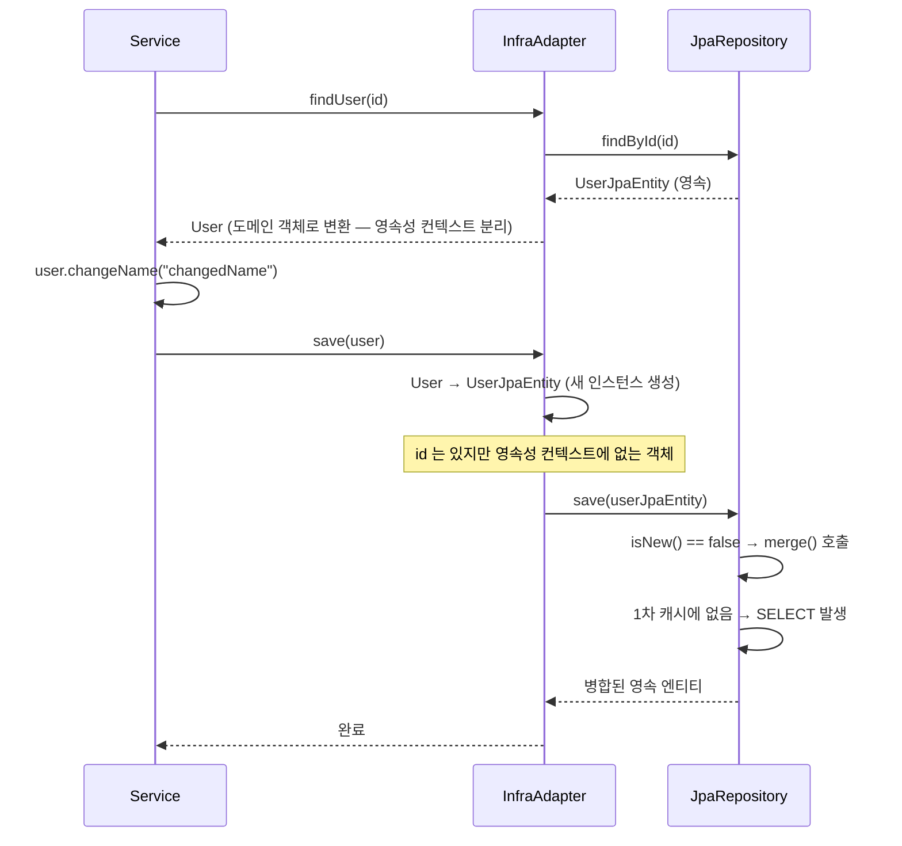

# Why?

사내 코드 아키텍처를 새로 도입하면서 도메인 클래스와 영속성 계층 클래스를 명시적으로 분리했다. 분산 시스템과 비즈니스 로직 간의 의존성을 끊어내는 것이 목표였고, 실제로 인프라 변경이 도메인 로직에 영향을 주지 않게 된다는 점에서 설계상의 이점은 분명했다.

그런데 이 구조를 실제로 적용하면서 한 가지 합리적인 의심이 들었다. "도메인 ↔ JPA 엔티티 변환 과정에서 영속성 컨텍스트가 끊어지는 것 아닐까?" 객체가 새로 생성되는 순간 JPA 가 관리하는 참조가 사라지고, 이후 저장 시 예상치 못한 쿼리가 추가로 발생할 수 있기 때문이다.

이 의심을 해소하기 위해 `SimpleJpaRepository.save()` 부터 Hibernate `DefaultMergeEventListener` 까지 소스 코드를 직접 추적해보았다.

# What?

## JPA 의 save() 가 persist 와 merge 를 갈라치는 이유 💾

`SimpleJpaRepository.save()` 는 내부적으로 `isNew()` 결과에 따라 두 경로로 분기한다. 새로운 객체라면 `persist()` 로 비영속 → 영속 전환을 수행하고, 기존 객체라면 `merge()` 로 준영속 → 영속 전환을 수행한다.

```java
// spring-data-jpa: SimpleJpaRepository
@Repository
@Transactional(readOnly = true)
public class SimpleJpaRepository<T, ID> implements JpaRepositoryImplementation<T, ID> {

    @Transactional
    @Override
    public <S extends T> S save(S entity) {
        Assert.notNull(entity, "Entity must not be null.");

        if (entityInformation.isNew(entity)) {
            em.persist(entity);
            return entity;
        } else {
            return em.merge(entity);
        }
    }
}
```

이 분기의 핵심은 `entityInformation.isNew(entity)` 다. 어떤 기준으로 새 객체를 판별하는지 파악해야 문제의 뿌리가 보인다.

## JPA 가 새 객체를 판별하는 세 가지 전략 🔍

> **TL;DR**
>
> JPA 에서 새로운 객체 판별은 아래 세 가지 전략 중 하나로 처리된다. 본인의 엔티티 생성·수정 전략에 따라 적합한 방식을 선택해야 한다.
>
> 1. **Version-Property / Id-Property 검사 (기본값)**: `@Version` 필드가 있고 그 값이 `null` 이면 새 객체로 간주한다. `@Version` 이 없으면 `@Id` 필드가 `null` 이면 새 객체, 그렇지 않으면 기존 객체로 간주한다.
> 2. **`Persistable` 인터페이스 구현**: 엔티티가 `Persistable` 을 구현하면 Spring Data JPA 는 신규 여부 판단을 `isNew()` 메서드에 완전히 위임한다.
> 3. **`EntityInformation` 커스텀 구현**: `JpaRepositoryFactory` 를 서브클래싱해서 `getEntityInformation()` 을 오버라이드하는 방식으로, 일반적으로 거의 사용되지 않는다.

`entityInformation.isNew(entity)` 에서 `entityInformation` 이 어떤 구현체인지는 `SimpleJpaRepository` 생성 시점에 도메인 엔티티의 상태에 따라 결정된다. 아래 두 케이스로 나뉜다.


```java
// JpaRepositoryFactory — 엔티티가 Persistable 을 구현했는지 여부로 분기
if (Persistable.class.isAssignableFrom(domainClass)) {
    return new JpaPersistableEntityInformation(domainClass, metamodel, persistenceUnitUtil);
} else {
    return new JpaMetamodelEntityInformation(domainClass, metamodel, persistenceUnitUtil);
}
```

`Persistable` 은 `isNew()` 를 직접 override 할 수 있도록 돕는 Wrapper Interface 다. 구현 여부에 따라 아래처럼 분기가 결정된다.

- 도메인 엔티티가 `Persistable` 구현 O → `JpaPersistableEntityInformation.isNew()` 호출
- 도메인 엔티티가 `Persistable` 구현 X → `JpaMetamodelEntityInformation.isNew()` 호출


### JpaPersistableEntityInformation

`Persistable` 의 추상 구현체인 `AbstractPersistable` 에게 위임한다. `id == null` 이면 새 객체, `id != null` 이면 기존 객체로 판별한다.

```java
// JpaPersistableEntityInformation — Persistable 구현체에 isNew() 위임
public class JpaPersistableEntityInformation<T extends Persistable<ID>, ID>
        extends JpaMetamodelEntityInformation<T, ID> {
    ,,,
    @Override
    public boolean isNew(T entity) {
        return entity.isNew();
    }
}

// AbstractPersistable — id null 여부로 신규 판별
@MappedSuperclass
public abstract class AbstractPersistable<PK extends Serializable> implements Persistable<PK> {

    @Id @GeneratedValue private @Nullable PK id;

    @Nullable
    @Override
    public PK getId() {
        return id;
    }

    protected void setId(@Nullable PK id) {
        this.id = id;
    }

    @Transient // DATAJPA-622
    @Override
    public boolean isNew() {
        return null == getId();
    }
}
```

### JpaMetamodelEntityInformation

1. 버저닝 필드에 대한 검증을 먼저 시도한다. `@Version` 필드가 있고 그 값이 `null` 이면 새 객체, `@Version` 필드가 없으면 `super.isNew()` 로 넘긴다.
2. `super.isNew()` 는 `AbstractEntityInformation.isNew()` 를 호출한다. `Id` 타입이 `Object` 면 `null` 일 때 새 객체, `Primitive` 면 `0` 일 때 새 객체로 판별한다. <span style="color:grey">// `Id` 타입이 `Primitive` 가 아니라면 예외 발생</span>

```java
// JpaMetamodelEntityInformation — @Version 유무에 따라 분기
public class JpaMetamodelEntityInformation<T, ID> extends JpaEntityInformationSupport<T, ID> {

    private final Optional<SingularAttribute<? super T, ?>> versionAttribute;
    ,,,

    @Override
    public boolean isNew(T entity) {
        if (versionAttribute.isEmpty()
                || versionAttribute.map(Attribute::getJavaType).map(Class::isPrimitive).orElse(false)) {
            return super.isNew(entity);
        }

        BeanWrapper wrapper = new DirectFieldAccessFallbackBeanWrapper(entity);
        return versionAttribute.map(it -> wrapper.getPropertyValue(it.getName()) == null).orElse(true);
    }
}

// AbstractEntityInformation — id 타입별로 신규 판별
public abstract class AbstractEntityInformation<T, ID> implements EntityInformation<T, ID> {
    ,,,

    @Override
    public boolean isNew(T entity) {
        ID id = getId(entity);
        Class<ID> idType = getIdType();

        if (!idType.isPrimitive()) {
            return id == null;
        }

        if (id instanceof Number n) {
            return n.longValue() == 0L;
        }

        throw new IllegalArgumentException(String.format("Unsupported primitive id type %s", idType));
    }
}
```

## merge() 가 Event-Driven 으로 처리되는 흐름 🔄

> **TL;DR**
>
> `EntityManager.merge()` 는 Event-Driven 구조를 통해 아래 순서로 처리된다.
>
> 1. 세션 검증 및 `MergeEvent` 발행
> 2. 중복 병합 방지
> 3. 식별자를 통해 영속성 컨텍스트 내 존재 여부 검증
> 4. 영속 상태에 따라 영속화 진행

`isNew()` 가 `false` 이면 `em.merge()` 가 호출된다. `EntityManager` 의 자식 인터페이스인 `Session` 을 거쳐, 그 구현체 `SessionImpl` 이 실행된다.

```java
// Session — EntityManager 를 확장한 Hibernate 인터페이스
public interface Session extends SharedSessionContract, EntityManager {
    /**
     * 분리된(detached) 인스턴스의 상태를 동일 식별자의 영속 인스턴스에 복사한다.
     * 현재 세션에 연결된 영속 인스턴스가 없으면 로드하고, 없으면 새로 저장한다.
     */
    <T> T merge(T object);
}
```

```java
// SessionImpl — 세션 열림 여부 확인 후 MergeEvent 발행
public class SessionImpl
        extends AbstractSharedSessionContract
        implements Serializable, SharedSessionContractImplementor, JdbcSessionOwner, SessionImplementor, EventSource,
                TransactionCoordinatorBuilder.Options, WrapperOptions, LoadAccessContext {
    ,,,
    @Override @SuppressWarnings("unchecked")
    public <T> T merge(T object) throws HibernateException {
        checkOpen();
        return (T) fireMerge( new MergeEvent( null, object, this ));
    }
}
```

### 세션 검증 및 MergeEvent 발행 ( SessionImpl.merge() )

`SessionImpl` 은 세션이 열려 있는지 확인(`checkOpen()`)하고, `MergeEvent` 를 발행한다. 이후 등록된 `MergeEventListener` 들이 이벤트를 수신해 실제 병합 처리를 이어간다.

```java
@Override @SuppressWarnings("unchecked")
public <T> T merge(T object) throws HibernateException {
    checkOpen();
    return (T) fireMerge( new MergeEvent( null, object, this ));
}

private Object fireMerge(MergeEvent event) {
    try {
        checkTransactionSynchStatus();
        checkNoUnresolvedActionsBeforeOperation();
        fastSessionServices.eventListenerGroup_MERGE
                .fireEventOnEachListener( event, MergeEventListener::onMerge );
        checkNoUnresolvedActionsAfterOperation();
    }
    catch ( ObjectDeletedException sse ) {
        throw getExceptionConverter().convert( new IllegalArgumentException( sse ) );
    }
    catch ( MappingException e ) {
        throw getExceptionConverter().convert( new IllegalArgumentException( e.getMessage(), e ) );
    }
    catch ( RuntimeException e ) {
        throw getExceptionConverter().convert( e );
    }

    return event.getResult();
}
```

### MergeEvent 수신 ( DefaultMergeEventListener.onMerge() )

프록시 체크 단계다. Hibernate 프록시인지, 바이트코드 향상(Enhancement)으로 인한 프록시인지 판정한다. 초기화되지 않은 프록시라면 `session.load()` 로 실제 엔티티를 로드해 반환하고, 초기화된 경우 프록시 내부의 실제 엔티티를 꺼내 `doMerge()` 로 넘긴다.

```java
@Override
public void onMerge(MergeEvent event, MergeContext copiedAlready) throws HibernateException {
    final Object original = event.getOriginal();
    if ( original != null ) {
        final EventSource source = event.getSession();
        final LazyInitializer lazyInitializer = HibernateProxy.extractLazyInitializer( original );
        if ( lazyInitializer != null ) {
            if ( lazyInitializer.isUninitialized() ) {
                LOG.trace( "Ignoring uninitialized proxy" );
                event.setResult( source.load( lazyInitializer.getEntityName(), lazyInitializer.getInternalIdentifier() ) );
            }
            else {
                doMerge( event, copiedAlready, lazyInitializer.getImplementation() );
            }
        }
        else if ( isPersistentAttributeInterceptable( original ) ) {
            final PersistentAttributeInterceptor interceptor = asPersistentAttributeInterceptable( original ).$$_hibernate_getInterceptor();
            if ( interceptor instanceof EnhancementAsProxyLazinessInterceptor ) {
                final EnhancementAsProxyLazinessInterceptor proxyInterceptor = (EnhancementAsProxyLazinessInterceptor) interceptor;
                LOG.trace( "Ignoring uninitialized enhanced-proxy" );
                event.setResult( source.load( proxyInterceptor.getEntityName(), proxyInterceptor.getIdentifier() ) );
            }
            else {
                doMerge( event, copiedAlready, original );
            }
        }
        else {
            doMerge( event, copiedAlready, original );
        }
    }
}
```

### 중복 병합 방지 ( DefaultMergeEventListener.doMerge() )

이미 병합 처리 중인 엔티티인지 `copiedAlready` 캐시로 검사한다. 캐시에는 있지만 아직 병합 플래그가 없다면 플래그를 설정하고, `event.setEntity()` 후 실제 병합 로직 `merge()` 를 호출한다.

```java
private void doMerge(MergeEvent event, MergeContext copiedAlready, Object entity) {
    if ( copiedAlready.containsKey( entity ) && copiedAlready.isOperatedOn( entity ) ) {
        LOG.trace( "Already in merge process" );
        event.setResult( entity );
    }
    else {
        if ( copiedAlready.containsKey( entity ) ) {
            LOG.trace( "Already in copyCache; setting in merge process" );
            copiedAlready.setOperatedOn( entity, true );
        }
        event.setEntity( entity );
        merge( event, copiedAlready, entity );
    }
}
```

### 식별자를 통해 영속성 상태를 검증하고 상태별로 분기하는 이유 ( DefaultMergeEventListener.merge() )

영속성 컨텍스트에서 해당 엔티티를 관리 중인지 `EntityEntry` 를 조회해 판단한다. 없으면 식별자로 DB 를 조회해 DETACHED / TRANSIENT 를 판정하고, 있으면 이미 `PERSISTENT` 로 판정한다. 판정 결과(DETACHED, TRANSIENT, PERSISTENT, DELETED) 에 따라 서로 다른 처리 메서드로 분기한다.

- `DETACHED` → 기존 DB 레코드와 비교해 값 복사 후 새로운 관리 엔티티로 등록
- `TRANSIENT` → `persist()` 호출
- `PERSISTENT` → 이미 세션에 있으므로 특별한 동기화 없이 반환
- `DELETED` → 삭제 예약 해제 및 DETACHED 로직 혹은 예외 처리

```java
private void merge(MergeEvent event, MergeContext copiedAlready, Object entity) {
    final EventSource source = event.getSession();
    final PersistenceContext persistenceContext = source.getPersistenceContextInternal();
    EntityEntry entry = persistenceContext.getEntry( entity );
    final EntityState entityState;
    final Object copiedId;
    final Object originalId;
    if ( entry == null ) {
        final EntityPersister persister = source.getEntityPersister( event.getEntityName(), entity );
        originalId = persister.getIdentifier( entity, copiedAlready );
        if ( originalId != null ) {
            final EntityKey entityKey;
            if ( persister.getIdentifierType() instanceof ComponentType ) {
                copiedId = copyCompositeTypeId(
                        originalId,
                        (ComponentType) persister.getIdentifierType(),
                        source,
                        copiedAlready
                );
                entityKey = source.generateEntityKey( copiedId, persister );
            }
            else {
                copiedId = null;
                entityKey = source.generateEntityKey( originalId, persister );
            }
            final Object managedEntity = persistenceContext.getEntity( entityKey );
            entry = persistenceContext.getEntry( managedEntity );
            if ( entry != null ) {
                entityState = EntityState.DETACHED;
            }
            else {
                entityState = getEntityState( entity, event.getEntityName(), entry, source, false );
            }
        }
        else {
            copiedId = null;
            entityState = getEntityState( entity, event.getEntityName(), entry, source, false );
        }
    }
    else {
        copiedId = null;
        originalId = null;
        entityState = getEntityState( entity, event.getEntityName(), entry, source, false );
    }

    switch ( entityState ) {
        case DETACHED:
            entityIsDetached( event, copiedId, originalId, copiedAlready );
            break;
        case TRANSIENT:
            entityIsTransient( event, copiedId != null ? copiedId : originalId, copiedAlready );
            break;
        case PERSISTENT:
            entityIsPersistent( event, copiedAlready );
            break;
        default: //DELETED
            if ( persistenceContext.getEntry( entity ) == null ) {
                assert persistenceContext.containsDeletedUnloadedEntityKey(
                        source.generateEntityKey(
                                source.getEntityPersister( event.getEntityName(), entity )
                                        .getIdentifier( entity, event.getSession() ),
                                source.getEntityPersister( event.getEntityName(), entity )
                        )
                );
                source.getActionQueue().unScheduleUnloadedDeletion( entity );
                entityIsDetached(event, copiedId, originalId, copiedAlready);
                break;
            }
            throw new ObjectDeletedException(
                    "deleted instance passed to merge",
                    null,
                    EventUtil.getLoggableName( event.getEntityName(), entity)
            );
    }
}
```

`save()` 호출 시 발생하는 내부 흐름은 여기까지다. 이제 이 흐름이 도메인-엔티티 분리 구조에서 실제로 어떤 문제를 일으키는지 살펴보자.

## DETACHED 상태에서 merge() 가 항상 SELECT 를 유발하는 이유 ⚠️

준영속(detached) 객체를 merge 할 때, Hibernate 는 먼저 영속성 컨텍스트(1차 캐시)를 조회한다. 1차 캐시에 없으면 DB 에 SELECT 를 실행하고, SELECT 결과가 없을 때는 stale / transient 여부를 판정해 예외 혹은 새로 저장 처리한다.

구체적으로 `entityIsDetached()` 가 수행하는 절차는 다음과 같다.

- `originalId` 와 `copiedId` 를 구해서 DB 조회에 사용할 복사된 식별자(`clonedIdentifier`)를 준비
- `source.get(…)` 으로 동일 ID 의 엔티티가 DB 에 존재하는지 확인
  - 존재하지 않으면: `isTransient` 검사 → DB 에 있다가 삭제된 경우 `StaleObjectStateException`, 새 객체라면 `entityIsTransient()` 호출해 새로 저장
  - 존재하면: `copyCache` 에 분리 엔티티 → 세션 관리 엔티티 매핑을 기록하고, cascade 처리 후 실제 속성 값을 관리 엔티티에 복사, 더티(Dirty) 표시 후 반환

```java
// DETACHED 분기 — DB SELECT 가 발생하는 지점
switch ( entityState ) {
    case DETACHED:
        entityIsDetached( event, copiedId, originalId, copiedAlready );
        break;
    ,,,
}
```

```java
protected void entityIsDetached(MergeEvent event, Object copiedId, Object originalId, MergeContext copyCache) {
    LOG.trace( "Merging detached instance" );

    final Object entity = event.getEntity();
    final EventSource source = event.getSession();
    final EntityPersister persister = source.getEntityPersister( event.getEntityName(), entity );
    final String entityName = persister.getEntityName();
    if ( originalId == null ) {
        originalId = persister.getIdentifier( entity, source );
    }
    final Object clonedIdentifier;
    if ( copiedId == null ) {
        clonedIdentifier = persister.getIdentifierType().deepCopy( originalId, event.getFactory() );
    }
    else {
        clonedIdentifier = copiedId;
    }
    final Object id = getDetachedEntityId( event, originalId, persister );
    // MERGE 페치 프로파일을 적용해 Session#get 으로 DB 조회 (= SELECT 발생 지점)
    final Object result = source.getLoadQueryInfluencers().fromInternalFetchProfile(
            CascadingFetchProfile.MERGE,
            () -> source.get( entityName, clonedIdentifier )
    );

    if ( result == null ) {
        LOG.trace( "Detached instance not found in database" );
        final Boolean knownTransient = persister.isTransient( entity, source );
        if ( knownTransient == Boolean.FALSE ) {
            throw new StaleObjectStateException( entityName, id );
        }
        else {
            entityIsTransient( event, clonedIdentifier, copyCache );
        }
    }
    else {
        copyCache.put( entity, result, true );
        final Object target = targetEntity( event, entity, persister, id, result );
        cascadeOnMerge( source, persister, entity, copyCache );
        copyValues( persister, entity, target, source, copyCache );
        markInterceptorDirty( entity, target );
        event.setResult( result );
    }
}
```

## 도메인-엔티티 분리 구조가 항상 DETACHED 를 만드는 이유 🏗️

필자가 구성한 코드 아키텍처에서는 아래와 같이 처리된다.


데이터 수정 흐름을 도식화하면 다음과 같다.



각 변환 단계를 정리하면 다음과 같다.

- 조회: `UserJpaEntity` → `User` (도메인 객체)
- 값 변환: `User` 내부 상태 변경
- 저장: `User` → `UserJpaEntity` (새 인스턴스 생성)

`User` → `UserJpaEntity` 변환 시 `new` 로 객체가 새로 생성된다. **이 때 `id` 가 이미 있으므로 `isNew()` 는 `false` 를 반환하고, `merge()` 가 호출된다. 하지만 영속성 컨텍스트에는 이 인스턴스에 대한 `EntityEntry` 가 없으므로, 결과적으로 SELECT 쿼리가 추가로 발생한다.**

실제로 데이터 변경 유스케이스에 대한 테스트를 실행하면, UPDATE 를 수행하기 위해 SELECT → UPDATE 순서로 쿼리가 나가는 것을 확인할 수 있다.

```java
// 도메인-엔티티 분리 구조에서 수정 유스케이스 테스트 — SELECT + UPDATE 발생 확인
@SpringBootTest
class UserInfraImplTest {

    @Autowired
    private UserInfraImpl userInfra;

    @BeforeEach
    void setUp() {
        userInfra.save(
            User.builder()
                .balance(new Money(BigDecimal.valueOf(100L)))
                .build()
        );
    }

    @Test
    @DisplayName("수정 시 SELECT + UPDATE 두 쿼리가 발생한다")
    void merge() {
        // GIVEN
        List<User> users = userInfra.findUsers();

        // WHEN — 도메인 객체 상태 변경
        User user = users.get(0);
        user.changeName("changedName");

        // THEN — 내부적으로 User → UserJpaEntity 변환 후 save() 호출
        userInfra.save(user);
    }
}
```


## SELECT 를 피할 수 없다면 추가 SELECT 비용을 통제하는 방법 ⚙️

DETACHED 상태에서 Dirty Checking 을 사용할 수 없으므로, `save()` / `merge()` 를 통한 영속화 시 SELECT 가 발생하는 것은 이 아키텍처가 가진 근본적인 트레이드오프다.

한 가지 완화 전략은 **`isUpdated` 플래그 기반 조건부 UPDATE** 다. 엔티티마다 인터페이스를 통해 `isUpdated` 플래그를 구현하고, 플래그가 `true` 일 때만 UPDATE 쿼리가 나가도록 처리한다.

```java
// 예시 — Updatable 인터페이스로 수정 여부 표시
public interface Updatable {
    boolean isUpdated();
}

// UserJpaEntity 에서 플래그 확인 후 save() 호출 여부 결정
if (entity.isUpdated()) {
    repository.save(entity); // SELECT + UPDATE 발생
}
```

UPDATE 범위에 대해서는 두 가지 선택지가 있다.

- `@DynamicUpdate` 를 활용해 변경된 컬럼만 UPDATE[^7]
- 모든 컬럼에 대한 UPDATE 를 그대로 처리

컬럼 수가 많고 변경 빈도가 잦다면 `@DynamicUpdate` 가 유리하지만, 컬럼 수가 적다면 오버헤드 없이 전체 UPDATE 가 단순하다. 서비스의 테이블 구조와 변경 패턴에 따라 선택해야 한다.

# Conclusion

도메인과 JPA 엔티티를 분리하는 구조는 외부 시스템으로부터 비즈니스 로직을 보호하는 명확한 이점이 있다. 그 대가로 객체 변환 과정에서 영속성 컨텍스트가 끊어지고, 수정 유스케이스마다 `isNew() == false` → `merge()` → SELECT 의 추가 쿼리가 발생한다.

이 비용을 받아들일 수 있는지는 도메인이 얼마나 자주 수정되는지, 그리고 그 SELECT 가 전체 응답 시간에서 차지하는 비중이 어느 정도인지에 달려 있다. 단순히 "추가 쿼리가 나간다"는 사실보다, 해당 테이블의 인덱스 구조와 캐시 히트율을 함께 측정해야 실질적인 영향을 판단할 수 있다.

완화 전략으로는 `isUpdated` 플래그 기반 조건부 저장, `@DynamicUpdate` 를 통한 변경 컬럼 최소화가 있다. 구조를 바꾸지 않고도 불필요한 merge 호출 자체를 줄이는 것이 가장 직접적인 최적화다.

[^1]: <https://howisitgo1ng.tistory.com/entry/JPA-JPA%EA%B0%80-Entity%EB%A5%BC-%ED%8C%90%EB%B3%84%ED%95%98%EB%8A%94-%EB%B0%A9%EB%B2%95%EA%B3%BC-save%EC%9D%98-%EB%B9%84%EB%B0%80entityInformationisNewentity>

[^2]: <https://docs.spring.io/spring-data/jpa/reference/jpa/entity-persistence.html>

[^3]: <https://velog.io/@yglee8048/JPA-Persistable>

[^4]: <https://ttl-blog.tistory.com/852>

[^5]: <https://bjwan-career.tistory.com/221>

[^6]: <https://devs0n.tistory.com/113>

[^7]: <https://docs.jboss.org/hibernate/orm/current/userguide/html_single/Hibernate_User_Guide.html#mapping-column-dynamicUpdate>

[^8]: <https://docs.spring.io/spring-data/jpa/reference/jpa/entity-persistence.html#jpa.entity-persistence.saving-entites.strategies>
