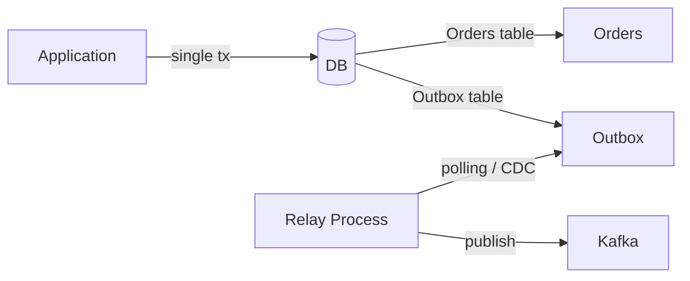
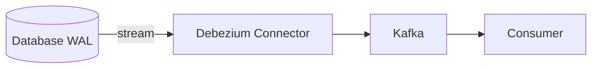
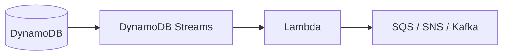
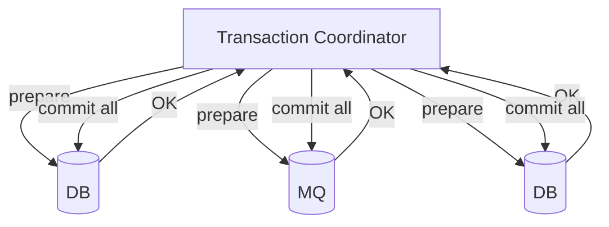
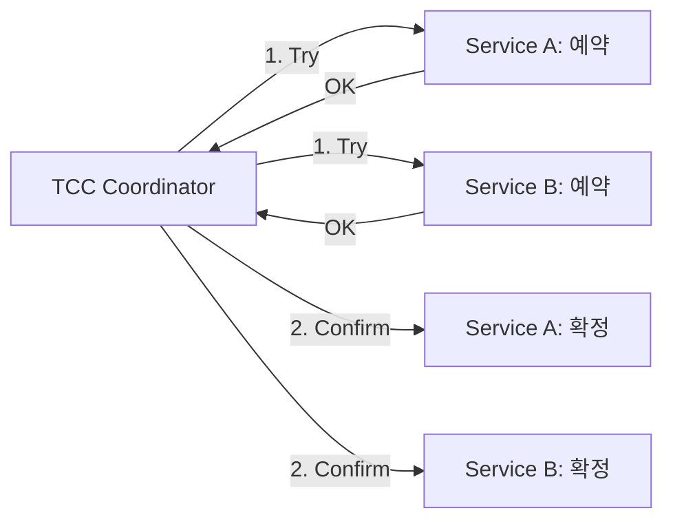
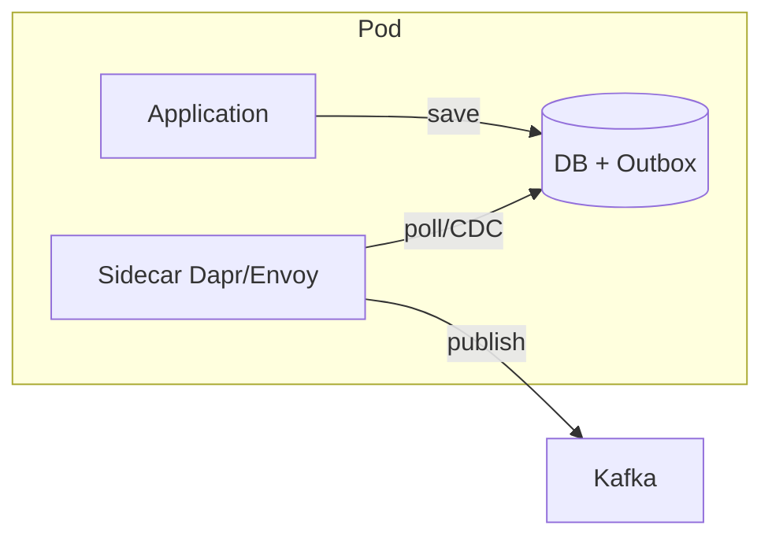
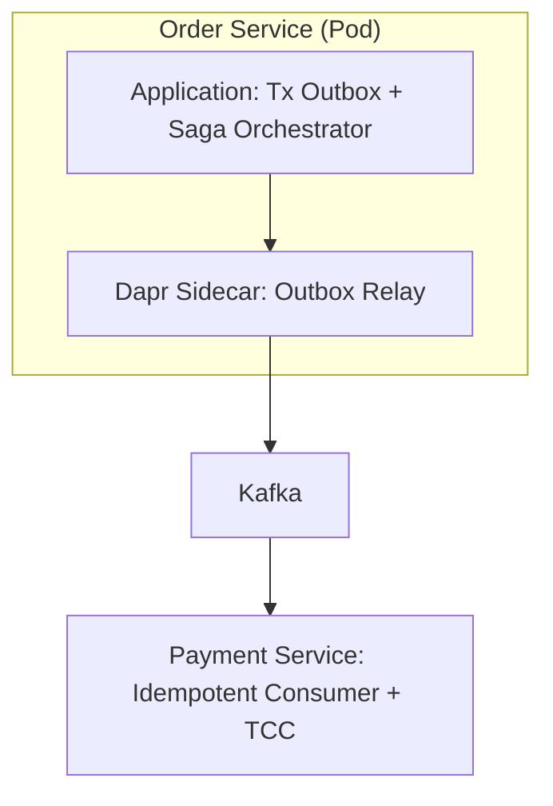

# Why?

전자상거래 시스템을 설계한다고 가정해보자. 고객이 주문을 넣으면, 주문 서비스는 DB에 주문을 저장하고 결제 서비스에 이벤트를 보내야 한다. 모놀리스였다면 하나의 트랜잭션으로 처리할 수 있겠지만, 마이크로서비스 환경에서는 주문 DB와 메시지 브로커가 별도의 시스템이다.

이때 다음과 같이 코드를 작성할 수 있을 것이다.

```java
@Transactional
void createOrder(Order order) {
    orderRepository.save(order);         // 1. DB 저장 성공
    kafka.send(new OrderCreatedEvent()); // 2. 여기서 실패하면?
    // → DB에는 저장됐지만 이벤트는 유실 = 데이터 불일치
}
```

이 구조에는 큰 문제가 숨어 있다. `orderRepository.save()`는 성공했지만 `kafka.send()`가 네트워크 오류로 실패하면, DB에는 주문이 있지만 결제 서비스는 그 사실을 모른다. 반대로 Kafka 전송 후 DB 커밋이 실패하면, 존재하지 않는 주문에 대해 결제가 진행된다.

두 시스템에 대한 쓰기를 하나의 원자적 연산으로 묶을 수 없기 때문에 발생하는 문제이며, 이를 **Dual Write Problem** 이라 한다[^1]. 분산 시스템에서 이 문제는 피할 수 없다. CAP 정리가 증명하듯, 네트워크 파티션이 존재하는 한 일관성과 가용성을 동시에 완벽히 보장할 수 없기 때문이다[^2].

그렇다면 실무에서는 이 문제를 어떻게 우회하는가? 이 글은 Dual Write Problem을 해결하는 7가지 패턴을 다룬다. Outbox처럼 단순한 접근부터, 2PC의 강한 일관성, Saga의 최종 일관성까지 — 각 패턴이 어떤 문제를 풀고, 어떤 트레이드오프를 감수하는지를 비교한다.

# What?

## Transactional Outbox Pattern 📤

가장 단순한 접근이다[^3]. 이벤트를 Kafka에 직접 보내는 대신, 같은 DB 트랜잭션 안에서 **Outbox 테이블**에 이벤트를 기록한다. 별도의 Relay 프로세스가 Outbox 테이블을 폴링하여 Kafka로 전송한다.

DB 저장과 이벤트 기록이 하나의 트랜잭션이므로, 둘 다 성공하거나 둘 다 실패한다.



아래는 Outbox 패턴의 구현 예시이다. `createOrder`에서 주문과 이벤트를 같은 트랜잭션에 저장하고, `relayEvents`가 주기적으로 미발행 이벤트를 Kafka로 전송한다.

```java
@Transactional
void createOrder(Order order) {
    orderRepository.save(order);
    // 같은 트랜잭션 내에서 Outbox 테이블에 이벤트 저장
    outboxRepository.save(new OutboxEvent(
        "OrderCreated",
        toJson(order)
    ));
}

// 별도 프로세스: Outbox Relay
@Scheduled(fixedDelay = 100)
void relayEvents() {
    List<OutboxEvent> events = outboxRepository.findUnpublished();
    for (OutboxEvent event : events) {
        kafka.send(event);
        event.markAsPublished();
    }
}
```

핵심은 로컬 트랜잭션만 사용한다는 점이다. 분산 트랜잭션이 필요하지 않으므로 구현이 단순하다.

| 장점 | 단점 |
|---|---|
| 로컬 트랜잭션만 사용, 단순함 | Polling 방식은 지연 발생 및 DB 부하 |
| 메시지 순서 보장 가능 (sequence 추가) | Outbox 테이블 관리 필요 (정리, 인덱싱) |
| At-least-once delivery 보장 | Relay 프로세스의 고가용성 보장 필요 |

**적합한 상황**: 중소규모 시스템에서 간단한 이벤트 발행이 필요하고, 실시간성 요구가 크지 않은 경우.

그런데 Outbox Relay의 폴링은 주기적으로 DB를 조회하므로 지연이 발생한다. 대규모 시스템에서는 이 지연과 DB 부하가 병목이 될 수 있다. 이 문제를 DB 로그 레벨에서 해결하는 것이 CDC이다.

## CDC (Change Data Capture) 🔄

CDC는 DB의 변경 로그(WAL, Binlog, Oplog)를 읽어서 이벤트를 캡처한다[^4]. 애플리케이션 코드를 수정하지 않고도, DB에 일어난 모든 변경을 실시간에 가깝게 외부 시스템으로 전파할 수 있다.

대표적인 구현체로 세 가지가 있다.

### Debezium (Kafka Connect 기반)



DB의 WAL을 Debezium이 읽고, Kafka 토픽으로 변환하여 발행한다. PostgreSQL은 WAL, MySQL은 Binlog, MongoDB는 Oplog를 사용한다.

### PostgreSQL Logical Replication Slot

Debezium 없이 PostgreSQL 자체 기능으로 CDC를 구현할 수도 있다.

```sql
-- Replication Slot 생성
SELECT pg_create_logical_replication_slot('my_slot', 'pgoutput');

-- 변경 사항 읽기
SELECT * FROM pg_logical_slot_get_changes('my_slot', NULL, NULL);
```

### DynamoDB Streams & Lambda

AWS 환경에서는 DynamoDB Streams가 테이블 변경을 캡처하고, Lambda가 이를 처리한다.



| 장점 | 단점 |
|---|---|
| 실시간에 가까운 이벤트 캡처 | 인프라 복잡도 증가 (Kafka Connect, Debezium 운영) |
| 애플리케이션 코드 변경 불필요 | DB 스키마 = 이벤트 스키마 (강한 결합) |
| 모든 테이블 변경 캡처 가능 | Replication Slot 관리 실패 시 WAL 축적 → 디스크 풀 |

**적합한 상황**: 레거시 시스템 통합, 대규모 실시간 이벤트 스트리밍, 데이터 동기화나 캐시 무효화.

Outbox와 CDC는 모두 **최종 일관성(Eventual Consistency)** 을 제공한다. 그러나 금융 시스템처럼 강한 일관성이 반드시 필요한 경우, 최종 일관성으로는 부족하다. 이때 등장하는 것이 분산 트랜잭션 프로토콜인 2PC이다.

## 2PC / XA Transaction 🔐

2PC(Two-Phase Commit)는 여러 리소스(DB, MQ 등)에 걸쳐 **강한 일관성(Strong Consistency)** 을 보장한다[^5]. Transaction Coordinator가 모든 참여자에게 커밋 가능 여부를 확인한 뒤(Phase 1: Prepare), 전원 동의 시 커밋하고 하나라도 거부하면 전체를 롤백한다(Phase 2: Commit/Rollback).



아래 코드는 JTA/XA를 통해 Oracle DB, PostgreSQL DB, JMS Queue 세 리소스를 하나의 트랜잭션으로 묶는 예시이다.

```java
@Transactional  // JTA Transaction Manager
void transfer(String from, String to, BigDecimal amount) {
    // XA Resource 1: Oracle DB
    accountRepository.debit(from, amount);
    // XA Resource 2: PostgreSQL DB
    accountRepository.credit(to, amount);
    // XA Resource 3: JMS Queue
    jmsTemplate.send(new TransferEvent(...));
    // → 모두 성공하거나 모두 롤백
}
```

ACID를 보장한다는 점이 강점이지만, 동기 블로킹 방식이므로 락을 오래 유지한다.

| 장점 | 단점 |
|---|---|
| ACID 보장, 강한 일관성 | 동기 블로킹, 락 오래 유지 → 성능 저하 |
| 표준화된 프로토콜 (JTA/XA) | 하나의 참여자 장애 시 전체 트랜잭션 블록 |
| 분산 환경에서 원자성 제공 | NoSQL, 대부분의 클라우드 서비스 미지원 |

**적합한 상황**: 금융 시스템에서 절대적 일관성이 필요하고, 참여자 수가 적으며 지연을 허용할 수 있는 경우.

2PC의 긴 락은 고처리량 시스템에서 병목이 된다. 락 시간을 최소화하면서도 일관성을 유지하는 방법이 필요하다. TCC는 "예약"이라는 비즈니스 개념을 활용하여 이 문제를 푼다.

## TCC (Try-Confirm-Cancel) 🎫

TCC는 리소스를 즉시 변경하는 대신 세 단계로 나눈다[^6]. Try에서 리소스를 예약하고, Confirm에서 예약을 확정하며, 실패 시 Cancel로 원복한다.



아래는 재고 서비스의 TCC 구현이다. Try에서 available을 줄이고 reserved를 늘려 예약 상태를 만든다. Confirm이 호출되면 reserved를 sold로 전환하고, Cancel이면 원복한다.

```java
public class InventoryTccService {
    // Try: 재고 예약
    void tryDeduct(String itemId, int qty, String txId) {
        inventory.reserved += qty;
        inventory.available -= qty;
        reservations.put(txId, new Reservation(itemId, qty));
    }

    // Confirm: 예약 확정
    void confirm(String txId) {
        Reservation r = reservations.remove(txId);
        inventory.reserved -= r.qty;
        inventory.sold += r.qty;
    }

    // Cancel: 예약 취소
    void cancel(String txId) {
        Reservation r = reservations.remove(txId);
        inventory.reserved -= r.qty;
        inventory.available += r.qty;
    }
}
```

| 장점 | 단점 |
|---|---|
| 리소스 락 시간 최소화 (Try에서 예약만) | 모든 서비스가 Try/Confirm/Cancel 구현 필요 |
| 2PC보다 유연한 보상 처리 | 도메인 모델에 TCC 개념이 스며듦 |
| 비즈니스 로직으로 일관성 관리 | Cancel 실패 처리 시 멱등성 보장 필요 |

**적합한 상황**: 항공권/호텔 예약처럼 "예약 → 확정" 흐름이 도메인에 자연스러운 경우.

TCC는 각 서비스가 Try/Confirm/Cancel을 모두 구현해야 하므로 비즈니스 침투적이다. 장기 실행 워크플로우에서는 단계 수가 늘어날수록 이 부담이 커진다. Saga 패턴은 각 서비스의 로컬 트랜잭션을 체인으로 연결하고, 실패 시 보상 트랜잭션으로 롤백한다.

## Saga Pattern 🔁

Saga는 분산 트랜잭션을 로컬 트랜잭션의 체인으로 분해한다[^7]. 각 단계가 성공하면 다음 단계로 진행하고, 실패하면 이전 단계들의 보상 트랜잭션을 역방향으로 실행한다.

두 가지 구현 방식이 있다.

### Choreography (이벤트 기반)

각 서비스가 이벤트를 발행하고, 다른 서비스가 이를 구독하여 다음 단계를 실행한다. 중앙 조율자가 없으므로 서비스 간 결합이 느슨하다.

```
Order Service ──(OrderCreated)──▶ Payment Service
                                       │
Payment Service ──(PaymentCompleted)──▶ Inventory Service
                                             │
Inventory Service ──(InventoryReserved)──▶ Shipping Service

// 실패 시 보상 이벤트 역방향 전파
Inventory Service ──(InventoryFailed)──▶ Payment Service ──(RefundIssued)──▶ ...
```

### Orchestration (중앙 조율자)

Saga Orchestrator가 각 단계를 순서대로 호출하고, 실패 시 보상을 관리한다. 흐름이 한 곳에 집중되므로 추적이 쉽다.

아래는 Axon Framework 기반의 Orchestration Saga 예시이다. `OrderCreatedEvent`가 발생하면 결제를 요청하고, 결제가 성공하면 재고를 예약하며, 실패하면 주문을 취소한다.

```java
@Saga
public class OrderSaga {
    @StartSaga
    @SagaEventHandler(associationProperty = "orderId")
    void on(OrderCreatedEvent event) {
        commandGateway.send(new ProcessPaymentCommand(event.orderId, event.amount));
    }

    @SagaEventHandler(associationProperty = "orderId")
    void on(PaymentCompletedEvent event) {
        commandGateway.send(new ReserveInventoryCommand(event.orderId, event.items));
    }

    @SagaEventHandler(associationProperty = "orderId")
    void on(PaymentFailedEvent event) {
        // 보상 트랜잭션
        commandGateway.send(new CancelOrderCommand(event.orderId));
    }
}
```

| 장점 | 단점 |
|---|---|
| 장기 실행 트랜잭션 지원 | 모든 단계에 보상 트랜잭션 필요 |
| 서비스 간 느슨한 결합 | 중간 상태가 외부에 노출될 수 있음 (일관성 윈도우) |
| 로컬 트랜잭션 체인으로 확장성 확보 | Choreography에서 흐름 추적이 어려움 |

**적합한 상황**: 주문→결제→배송 같은 장기 실행 워크플로우, 최종 일관성을 허용할 수 있는 마이크로서비스.

지금까지의 패턴들은 "메시지를 정확히 한 번 발행하는 것"에 집중했다. 그러나 At-least-once 환경에서는 Consumer 쪽에서 **같은 메시지를 두 번 이상 수신**할 수 있다. 이 중복 수신을 처리하는 보조 패턴이 Idempotent Consumer이다.

## Idempotent Consumer (BloomFilter / BitMap) 🎲

Idempotent Consumer는 메시지 ID를 기준으로 이미 처리한 메시지를 걸러낸다[^8]. BloomFilter로 빠르게 1차 필터링하고, 정확한 저장소(Redis, DB)로 2차 확인하는 2단계 구조가 일반적이다.

아래 코드에서 BloomFilter는 False Positive는 가능하지만 False Negative는 불가능하다. 따라서 BloomFilter를 통과한 메시지만 정확한 2차 검사를 수행하면, 대부분의 중복을 O(1)에 걸러낼 수 있다.

```java
public class IdempotentConsumer {
    private final BloomFilter<String> bloomFilter;
    private final Set<String> processedIds;  // Redis, DB

    void consume(Message message) {
        String messageId = message.getId();

        // 1차: BloomFilter (False Positive 가능, False Negative 불가)
        if (bloomFilter.mightContain(messageId)) {
            // 2차: 정확한 체크
            if (processedIds.contains(messageId)) {
                log.info("Duplicate message, skipping: {}", messageId);
                return;
            }
        }

        processMessage(message);
        bloomFilter.put(messageId);
        processedIds.add(messageId);
    }
}
```

메시지 ID가 순차적이라면 BitMap이 더 효율적이다. Redis BitMap으로 10억 개 메시지를 약 125MB로 추적할 수 있다.

```java
// Redis BitMap 활용
public boolean isProcessed(long messageId) {
    return redis.getbit("processed_messages", messageId);
}

public void markProcessed(long messageId) {
    redis.setbit("processed_messages", messageId, 1);
}
```

| 장점 | 단점 |
|---|---|
| BloomFilter: 메모리 효율적, O(1) | BloomFilter: False Positive 존재 |
| BitMap: 순차 ID에서 극도로 효율적 | 분산 환경에서 동시성 제어 필요 |
| At-least-once → Effectively-once 변환 | 의미 있는 Idempotency Key 설계 필요 |

**적합한 상황**: 결제 처리 중복 방지, 재시도가 빈번한 메시징 시스템.

Idempotent Consumer는 수신 측의 보조 패턴이다. 발행 측에서는 여전히 Outbox 패턴이 필요한데, Outbox Relay 로직을 매번 애플리케이션에 구현하는 것은 반복적이다. Kubernetes 환경에서는 이 인프라 관심사를 Sidecar로 분리할 수 있다.

## Sidecar-based Outbox Relay (Dapr, Envoy) 🚐

Sidecar 패턴은 Outbox Relay 로직을 애플리케이션에서 분리하여 별도 컨테이너로 실행한다[^9]. 애플리케이션은 비즈니스 로직에만 집중하고, 폴링·재시도·순서 보장 등은 Sidecar가 처리한다.



아래는 Dapr Sidecar를 사용한 예시이다. 애플리케이션 코드에 Outbox 로직이 전혀 없다. Dapr State Store에 저장하면 Sidecar가 자동으로 이벤트를 발행한다.

```java
// 애플리케이션 코드 - Outbox 로직 없음
@PostMapping("/orders")
void createOrder(@RequestBody Order order) {
    daprClient.saveState("statestore", order.getId(), order);
}
```

| 장점 | 단점 |
|---|---|
| 애플리케이션 코드 단순화 | Sidecar 자체의 운영 관리 필요 |
| 언어/프레임워크 독립적 | Pod 당 추가 컨테이너 → 리소스 오버헤드 |
| 재시도, 순서 보장을 Sidecar가 처리 | 특정 플랫폼(Dapr 등)에 대한 벤더 종속 |

**적합한 상황**: Kubernetes 환경의 마이크로서비스, 다양한 언어가 혼용되는 대규모 조직.

## 패턴 비교 요약 📊

| 패턴 | 일관성 | 복잡도 | 성능 | 적합한 상황 |
|---|---|---|---|---|
| **Tx Outbox** | Eventual | 낮음 | 중간 | 단순한 이벤트 발행 |
| **CDC** | Eventual | 중간 | 높음 | 레거시 통합, 실시간 동기화 |
| **2PC/XA** | Strong | 중간 | 낮음 | 강한 일관성 필수 (금융) |
| **TCC** | Strong* | 높음 | 중간 | 자원 예약 도메인 |
| **Saga** | Eventual | 높음 | 높음 | 장기 실행 비즈니스 프로세스 |
| **Idempotent Consumer** | — | 낮음 | 높음 | 중복 처리 방지 (보조 패턴) |
| **Sidecar Outbox** | Eventual | 중간 | 중간 | K8s 마이크로서비스 |

# How?

실제 시스템에서는 단일 패턴만 사용하는 경우가 드물다. 아래는 주문 시스템에서 여러 패턴을 조합한 구성이다.



Order Service는 Transactional Outbox로 이벤트를 기록하고, Dapr Sidecar가 Kafka로 전송한다. Saga Orchestrator가 전체 워크플로우를 조율한다. Payment Service는 Idempotent Consumer로 중복 수신을 방지하고, TCC로 결제 예약/확정을 처리한다.

패턴 선택의 핵심 기준은 세 가지이다.

- **일관성 요구**: Strong이면 2PC/TCC, Eventual이면 Outbox/CDC/Saga
- **시스템 규모**: 소규모면 Outbox, 대규모면 CDC + Sidecar
- **도메인 특성**: 예약 모델이 자연스러우면 TCC, 장기 워크플로우면 Saga

[^1]: Confluent. Dual Write Problem. <https://developer.confluent.io/courses/architecture/dual-writes/>
[^2]: Brewer, E. (2000). CAP Theorem. <https://en.wikipedia.org/wiki/CAP_theorem>
[^3]: Richardson, C. Transactional Outbox Pattern. <https://microservices.io/patterns/data/transactional-outbox.html>
[^4]: Debezium Documentation — Change Data Capture. <https://debezium.io/documentation/reference/stable/connectors/>
[^5]: Gray, J. & Lamport, L. Consensus on Transaction Commit. <https://www.microsoft.com/en-us/research/publication/consensus-on-transaction-commit/>
[^6]: Atomikos. TCC Pattern for REST Microservices. <https://www.atomikos.com/Blog/TCCForTransactionManagementAcrossMicroservices>
[^7]: Garcia-Molina, H. & Salem, K. (1987). Sagas. ACM SIGMOD. <https://www.cs.cornell.edu/andru/cs711/2002fa/reading/sagas.pdf>
[^8]: Enterprise Integration Patterns — Idempotent Receiver. <https://www.enterpriseintegrationpatterns.com/patterns/messaging/IdempotentReceiver.html>
[^9]: Dapr Documentation — Outbox Pattern. <https://docs.dapr.io/developing-applications/building-blocks/state-management/howto-outbox/>
