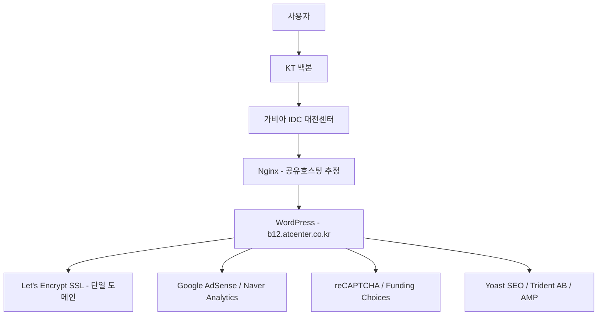

# Why?

Perplexity가 데이터를 스크래핑할 때 간혹 이상한 사이트들에서 수집해오곤 한다. 크롤링만 전문적으로 하는 도메인으로 보여서 수상하여 사이트 분석을 해보았다. 이 글은 분석에 사용한 7단계 방법론과 실제 `atcenter.co.kr` 해부 결과를 함께 정리한다.

# What?

## 도메인 등록 정보로 신원을 파악할 수 있는 이유 🔍

도메인 등록자, 등록일, 만료일, 네임서버 정보는 `whois` 명령 하나로 조회할 수 있다[^1].

```bash
whois atcenter.co.kr
```

| 항목       | 확인 포인트                                                                 |
| ---------- | --------------------------------------------------------------------------- |
| 등록자     | `Registrant Name/Organization` — 개인인지 법인인지                          |
| 등록일     | `Created Date` — 도메인 신뢰도 판단 기준                                    |
| 만료일     | `Expiry Date` — 만료 임박 시 서비스 중단 리스크                             |
| 네임서버   | `Name Server` — 어떤 DNS 서비스를 쓰는지 (Cloudflare, AWS Route53, 자체 등) |
| 등록대행자 | `Registrar` — Gabia, 후이즈, GoDaddy 등                                     |
| 상태 코드  | `Domain Status` — `clientTransferProhibited` 등 잠금 여부                   |

## DNS 레코드로 서버 위치와 메일 운영 여부를 알 수 있는 이유 🌐

`whois`가 도메인 소유 정보라면, `nslookup`과 `dig`는 실제 연결 대상을 드러낸다[^2].

- `whois` — 도메인 등록자, 등록일, 만료일, 네임서버, 등록대행자 확인
- `nslookup` — A, MX, NS, TXT 등 DNS 레코드 조회
- `dig` — 더 세밀한 DNS 조회 (`+short`, `+multiline`, 여러 record type 지원)

### A / AAAA / CNAME 확인

```bash
# 메인 도메인
dig b12.atcenter.co.kr A

# 서브도메인 확인
dig blog.b12.atcenter.co.kr A
dig www.atcenter.co.kr A
```

| 항목     | 확인 포인트                                                           |
| -------- | --------------------------------------------------------------------- |
| A 레코드 | 실제 서버 IP → IP로 호스팅 사업자 역추적 (AWS, Cloudflare, 카페24 등) |
| AAAA     | IPv6 지원 여부                                                        |
| CNAME    | 서브도메인이 가리키는 원본 도메인 (CDN, SaaS 여부 파악)               |
| TTL      | 값이 낮으면 자주 변경되는 인프라 의심                                 |

### MX 레코드 (메일서버) 확인

```bash
dig atcenter.co.kr MX
```

| 항목               | 확인 포인트                                                      |
| ------------------ | ---------------------------------------------------------------- |
| MX 호스트명        | Google Workspace, Microsoft 365, Naver Works 등 메일 서비스 파악 |
| Priority           | 숫자가 낮을수록 우선순위 높음                                    |
| 자체 메일서버 여부 | `mail.도메인` 형태면 직접 운영 가능성                            |

### NS 레코드 (DNS서버) 확인

```bash
dig atcenter.co.kr NS
```

| 항목            | 확인 포인트                                                                |
| --------------- | -------------------------------------------------------------------------- |
| 네임서버 사업자 | `ns1.cafe24.com` → 카페24 호스팅, `*.cloudflare.com` → Cloudflare CDN 사용 |
| 네임서버 수     | 보통 2개 이상 — 1개면 단일장애점(SPOF) 리스크                              |

## 웹 스택 탐지 도구를 써야 하는 이유 🛠

서버 응답 헤더만으로 파악하기 어려운 프론트엔드·분석·광고 스택은 Wappalyzer 계열 도구로 보완할 수 있다[^3].

1. [Wappalyzer](https://www.wappalyzer.com/lookup/b12.atcenter.co.kr/)
2. [BuiltWith](https://builtwith.com/?b12.atcenter.co.kr)
3. [TechnologyChecker](https://technologychecker.io/)
4. [WhatRuns](https://www.whatruns.com/)

## traceroute로 물리적 경로를 추적할 수 있는 이유 🗺

패킷이 어느 국가, 어느 사업자 망을 경유하는지 홉 단위로 확인할 수 있다.

```bash
traceroute -I 49.247.30.200
```

| 항목           | 확인 포인트                                                 |
| -------------- | ----------------------------------------------------------- |
| 홉(Hop) 수     | 경유 라우터 수 — 많을수록 레이턴시 높음                     |
| 중간 경유 IP   | 어느 국가/사업자 망을 통과하는지 (KT, SKT, AWS backbone 등) |
| `* * *` 구간   | 응답 차단된 구간 — 방화벽 또는 보안 정책                    |
| 최종 도달 IP   | A 레코드 IP와 일치하는지 확인 (CDN 경유 시 다를 수 있음)    |
| RTT (응답시간) | 각 홉별 ms — 특정 구간에서 급증하면 병목 지점               |

## Wayback Machine으로 사이트 연령을 추정할 수 있는 이유 📜

도메인 등록일과 실제 서비스 시작일은 다를 수 있다. Wayback Machine의 최초 수집 시점이 실질적인 런치 시점에 가깝다[^4].

| 항목             | 확인 포인트                                      |
| ---------------- | ------------------------------------------------ |
| 최초 수집 시점   | 서비스 시작 시기 추정                            |
| 디자인/구조 변천 | 리브랜딩, 개편 이력                              |
| 과거 노출 정보   | 현재는 삭제된 연락처, 담당자, 가격 정보 등       |
| 기술 스택 변화   | 소스 코드 주석, 메타태그에서 과거 사용 기술 흔적 |

## SSL 인증서로 호스팅 환경과 보안 수준을 파악할 수 있는 이유 🔐

인증서 발급자, 유효기간, Subject CN, SAN은 호스팅 구조와 보안 설정을 동시에 드러낸다[^5].

```bash
# 인증서 발급자·유효기간 확인
echo | openssl s_client -connect b12.atcenter.co.kr:443 2>/dev/null \
  | openssl x509 -noout -issuer -dates -subject

# 응답 헤더 확인
curl -vvI https://b12.atcenter.co.kr
```

| 항목                     | 확인 포인트                                                                                                                                                             |
| ------------------------ | ----------------------------------------------------------------------------------------------------------------------------------------------------------------------- |
| `issuer`                 | Let's Encrypt → 무료/자동 발급 / DigiCert, Sectigo 등 → 유료 상용 인증서                                                                                                |
| `notBefore` / `notAfter` | 유효기간 — 만료 임박 시 HTTPS 경고 리스크                                                                                                                               |
| `subject CN`             | 인증서가 커버하는 도메인명                                                                                                                                              |
| SAN (Subject Alt Name)   | 멀티도메인 커버 여부 — 와일드카드(`*.atcenter.co.kr`)인지 확인                                                                                                          |
| `curl -vvI` 응답 헤더    | `Server`, `X-Powered-By` → 서버 기술 스택 노출 여부 / `Strict-Transport-Security` → HSTS 설정 여부 / `X-Frame-Options`, `Content-Security-Policy` → 보안 헤더 설정 수준 |

## DevTools Network 탭이 필요한 이유 🕵️

TLS 암호화로 인해 `tcpdump`나 Wireshark로는 패킷 내부를 볼 수 없고 헤더·도메인·포트·패킷 크기만 확인된다. 요청/응답 세부 내용을 보려면 Chrome DevTools(F12) → `Network` 탭에서 `XHR`/`Fetch`/`JS`/`Other` 필터를 순서대로 돌리며 외부 도메인 호출 스택을 추적해야 한다[^6].

| 필터               | 확인 포인트                                                     |
| ------------------ | --------------------------------------------------------------- |
| **XHR / Fetch**    | 외부 API 엔드포인트 URL, 요청 파라미터, 응답 데이터 구조        |
| **JS**             | 외부에서 로드하는 스크립트 도메인 (광고, 트래킹, A/B 테스트 등) |
| **기타 도메인**    | `analytics.`, `pixel.`, `cdn.`, `api.` 등 서드파티 호출 목록   |
| **Headers**        | `Authorization`, `Cookie`, `X-API-Key` 등 인증 방식 파악       |
| **Payload**        | POST 요청 body — 어떤 사용자 데이터를 전송하는지                |
| **Timing**         | 느린 요청 파악 — 성능 병목 원인 분석                            |
| **WS (WebSocket)** | 실시간 통신 여부 및 메시지 구조                                 |

# How?

의심 사이트는 `b12.atcenter.co.kr`이다. [피터 린치 매수/매도 타이밍](https://b12.atcenter.co.kr/14869) 포스트 하나만 다루는 줄 알았는데, 알고 보니 다양한 콘텐츠를 크롤링하고 있었다. 위 7단계를 직접 적용해보았다.

## 1단계: 도메인 정보 (`whois`) 🔍

```bash
whois atcenter.co.kr
```

```
도메인이름                  : atcenter.co.kr
등록인                      : 도메인 관리자
등록인 주소                 : 경기도 과천시 과천대로7나길 34
등록인 우편번호             : 13840
책임자 전자우편             : gatcenter.co.kr0709599506@whoisprivacyservices.domains
등록일                      : 2023. 07. 09.
최근 정보 변경일            : 2024. 10. 04.
사용 종료일                 : 2029. 07. 09.
등록대행자                  : (주)가비아(http://www.gabia.co.kr)
DNSSEC                      : 미서명

1차 네임서버 : ns.gabia.co.kr  (43.201.170.100)
2차 네임서버 : ns1.gabia.co.kr (20.200.205.248)
             ns.gabia.net
```

| 항목        | 값                                                  | 분석                                       |
| ----------- | --------------------------------------------------- | ------------------------------------------ |
| 등록자      | Whois Privacy Services by Gabia                     | 실제 등록자 **비공개** 처리됨              |
| 등록일      | 2023. 07. 09                                        | 약 2.5년된 도메인, 신규에 가까움           |
| 만료일      | 2029. 07. 09                                        | 약 3년 이상 남음 — 서비스 중단 리스크 낮음 |
| 최근 변경일 | 2024. 10. 04                                        | 작년에 설정 변경 이력 있음                 |
| 등록대행자  | Gabia (가비아)                                      | 국내 대형 도메인 등록 업체                 |
| 네임서버    | `ns.gabia.co.kr`, `ns1.gabia.co.kr`, `ns.gabia.net` | 가비아 DNS 3중화 구성 ✅                   |
| DNSSEC      | 미서명                                              | DNS 위변조 방어 미적용 ⚠️                  |

## 2단계: DNS 레코드 🌐

### A / AAAA / CNAME

```bash
dig b12.atcenter.co.kr A
# → b12.atcenter.co.kr. 600 IN A 49.247.30.200
```

| 도메인                    | 결과            | 분석                                     |
| ------------------------- | --------------- | ---------------------------------------- |
| `b12.atcenter.co.kr`      | `49.247.30.200` | 메인 서버 IP                             |
| `www.atcenter.co.kr`      | `49.247.47.207` | **다른 IP** — 별도 서버 또는 다른 호스팅 |
| `blog.b12.atcenter.co.kr` | `NXDOMAIN`      | 해당 서브도메인 **존재하지 않음**        |
| AAAA                      | 미확인          | IPv6 레코드 없음으로 추정                |
| TTL                       | 600초 (10분)    | 비교적 짧음 — 인프라 변경 가능성 있음    |

> `b12.atcenter.co.kr`와 `www.atcenter.co.kr`의 IP가 다르다 → b12는 별도 서브 서비스로 분리 운영 중이다.

### MX 레코드 (메일서버)

```bash
dig atcenter.co.kr MX
# → ANSWER 0 (MX 레코드 없음)
```

| 항목       | 결과                | 분석                     |
| ---------- | ------------------- | ------------------------ |
| MX 레코드  | **없음** (ANSWER 0) | 자체 메일 서비스 없음    |
| SOA만 응답 | `ns.gabia.co.kr`    | DNS 권한은 가비아에 있음 |

> 메일 수발신 설정이 없다 → 외부 메일 서비스(Gmail, Naver Works 등) 사용 중이거나 메일 기능 미운영이다.

### NS 레코드 (DNS서버)

```bash
dig atcenter.co.kr NS
```

| 항목 | 값                | 분석                     |
| ---- | ----------------- | ------------------------ |
| NS 1 | `ns.gabia.net`    |                          |
| NS 2 | `ns.gabia.co.kr`  | 가비아 DNS 3중화 구성 ✅ |
| NS 3 | `ns1.gabia.co.kr` |                          |
| TTL  | 21600초 (6시간)   | 표준적인 NS TTL          |

## 3단계: 웹 스택 🛠

Wappalyzer로 조회한 결과이다.

| 카테고리          | 감지된 기술               | 분석                                             |
| ----------------- | ------------------------- | ------------------------------------------------ |
| **CMS**           | WordPress                 | 대중적 CMS, 플러그인 취약점 관리 필요            |
| **웹서버**        | Nginx                     | `curl` 응답 헤더 `server: nginx` 로 교차 확인 ✅ |
| **JS 프레임워크** | AMP                       | 모바일 최적화 페이지 운영 중                     |
| **JS 라이브러리** | core-js                   | 브라우저 폴리필 사용                             |
| **SEO**           | Yoast SEO                 | WordPress SEO 플러그인                           |
| **웹 분석**       | Naver Analytics, Site Kit | 네이버 + Google 이중 분석 도구 사용              |
| **광고**          | Google AdSense            | 광고 수익화 운영 중                              |
| **보안**          | HSTS, reCAPTCHA           | 기본 보안 설정 적용 ✅                           |
| **A/B 테스트**    | Trident AB                | 전환율 최적화 실험 운영 중                       |
| **구조화 데이터** | Open Graph                | SNS 공유 미리보기 최적화                         |
| **쿠키 동의**     | Funding Choices           | Google 쿠키 동의 관리 도구                       |
| **RSS**           | RSS                       | 블로그/뉴스 피드 제공                            |

## 4단계: 네트워크 경로 (`traceroute`) 🗺

```bash
traceroute -I 49.247.30.200
```

```
  1   100.70.221.61   2ms   ← 사용자 측 게이트웨이 (Cloudflare/ISP)
  2   192.168.45.1    2ms   ← 로컬 라우터/NAT
  3   1.237.90.1     10~96ms ← 국내 ISP 상위 백본 (KT/SK/LG)
  ...
  8   211.61.192.218  5ms   ← KT 국내 코어 라우터
  9   211.45.68.25    6ms   ← KT 광역 백본 (서울-대전 구간)
 10   211.45.68.26    5ms
 11   110.46.178.170  6ms   ← 충청권 ISP 연동
 12   103.139.119.206 6ms   ← 가비아 IDC 외부 망
 13   115.68.63.126   6ms   ← 가비아 IDC 대전센터 최종 라우터
 14   115.68.139.46   5ms
 15~  * * *               ← 방화벽 ICMP 차단 (정상)
```

| 홉    | IP                | 분석                                  |
| ----- | ----------------- | ------------------------------------- |
| 1     | `100.70.221.61`   | 사용자 측 게이트웨이 (Cloudflare/ISP) |
| 2     | `192.168.45.1`    | 로컬 공유기 NAT                       |
| 3     | `1.237.90.1`      | 국내 ISP 상위 백본                    |
| 8     | `211.61.192.218`  | KT 국내 코어 라우터                   |
| 9–10  | `211.45.68.*`     | KT 광역 백본 (서울–대전 구간)         |
| 11    | `110.46.178.170`  | 충청권 ISP 연동                       |
| 12    | `103.139.119.206` | 가비아 IDC 외부 망 진입               |
| 13–14 | `115.68.*`        | **가비아 IDC 대전센터** 최종 라우터   |
| 15~   | `* * *`           | 방화벽 ICMP 차단 (정상)               |

**RTT 분석**

| 구간                | 응답시간 | 비고                                     |
| ------------------- | -------- | ---------------------------------------- |
| 로컬 → ISP          | ~2ms     | 정상                                     |
| 홉 3 (`1.237.90.1`) | 10~96ms  | **변동 폭 큼** — 해당 구간 불안정 가능성 |
| 홉 4 이후           | 4~8ms    | 안정적                                   |

> 서버 위치는 **가비아 IDC 대전센터**이며, 국내 KT 백본을 경유하고 CDN은 미사용(직접 연결)이다.

## 5단계: 과거 버전 (Wayback Machine) 📜

| 항목      | 값                      | 분석                           |
| --------- | ----------------------- | ------------------------------ |
| 수집 횟수 | 4회                     | 매우 적음 — 최근 개설된 서비스 |
| 수집 기간 | 2025.08.11 ~ 2025.10.11 | 약 2개월간의 스냅샷만 존재     |

> 2023년 도메인 등록이지만 Wayback Machine 수집은 2025년 8월부터 시작됐다 → 실제 서비스 시작은 **2025년 중반** 추정이다.

## 6단계: SSL 인증서 🔐

```bash
echo | openssl s_client -connect b12.atcenter.co.kr:443 2>/dev/null \
  | openssl x509 -noout -issuer -dates -subject
# issuer= /C=US/O=Let's Encrypt/CN=R13
# notBefore=Mar 10 18:55:01 2026 GMT
# notAfter=Jun  8 18:55:00 2026 GMT
# subject= /CN=apt.aptland.co.kr   ← ⚠️ 다른 도메인의 인증서가 반환됨
```

```bash
curl -vvI https://b12.atcenter.co.kr
# ...
# subject: CN=b12.atcenter.co.kr
# issuer: C=US; O=Let's Encrypt; CN=R12
# SSL connection using TLSv1.3 / TLS_AES_128_GCM_SHA256 / x25519
# HTTP/2 200
# server: nginx
# strict-transport-security: max-age=31536000;
# link: <https://b12.atcenter.co.kr/wp-json/>; rel="https://api.w.org/"
```

| 항목              | openssl 결과        | curl 결과                         | 분석                                                  |
| ----------------- | ------------------- | --------------------------------- | ----------------------------------------------------- |
| 발급자            | Let's Encrypt R13   | Let's Encrypt R12                 | **인증서 2개** — openssl과 curl이 다른 인증서 반환 ⚠️ |
| Subject (openssl) | `apt.aptland.co.kr` | `b12.atcenter.co.kr`              | openssl이 **다른 도메인 인증서**를 반환함             |
| 유효 만료         | Jun 8 2026          | Jun 8 2026                        | 약 3개월 단위 자동 갱신 (Let's Encrypt 정책) ✅       |
| SAN               | —                   | `b12.atcenter.co.kr` 단독         | 와일드카드 없이 단일 도메인 인증서                    |
| 프로토콜          | TLSv1.3             | TLSv1.3                           | 최신 TLS 버전 ✅                                      |
| 암호화 방식       | —                   | `TLS_AES_128_GCM_SHA256 / x25519` | 표준적인 보안 수준 ✅                                 |

**`curl` 응답 헤더 분석**

| 헤더                        | 값                         | 분석                                                    |
| --------------------------- | -------------------------- | ------------------------------------------------------- |
| `server`                    | `nginx`                    | 웹서버 확인                                             |
| `HTTP/2`                    | `200`                      | HTTP/2 지원 ✅                                          |
| `strict-transport-security` | `max-age=31536000`         | HSTS 1년 설정 ✅                                        |
| `link`                      | `wp-json/` rel             | **WordPress REST API 노출** ⚠️ — 버전 정보 등 유출 가능 |
| `X-Powered-By`              | 없음                       | 기술 스택 헤더 노출 차단 ✅                             |
| `X-Frame-Options`           | **없음**                   | Clickjacking 방어 미설정 ⚠️                             |
| `Content-Security-Policy`   | **없음**                   | CSP 미설정 ⚠️                                           |

## 7단계: 트래킹 및 API 호출 스택 (DevTools) 🕵️

Chrome DevTools → Network 탭 → `XHR`/`Fetch`/`JS`/`Other` 필터를 순서대로 확인한다. TLS로 암호화된 환경에서는 이 방법이 유일한 애플리케이션 레이어 분석 수단이다.

# 인프라 요약 및 리스크 포인트

`atcenter.co.kr`의 전체 인프라 구조는 다음과 같다.



| 항목                       | 내용                                  |
| -------------------------- | ------------------------------------- |
| ⚠️ DNSSEC 미적용           | DNS 스푸핑 공격 취약                  |
| ⚠️ MX 레코드 없음          | 도메인 기반 메일 미운영               |
| ⚠️ WordPress REST API 노출 | `/wp-json/` 엔드포인트 접근 가능      |
| ⚠️ 보안 헤더 미흡          | CSP, X-Frame-Options 없음             |
| ⚠️ 공유 호스팅 환경        | 타 도메인과 IP 공유 (인증서에서 확인) |

**결론**: `atcenter.co.kr`은 가비아 공유 호스팅 위의 WordPress 기반 광고 수익화 사이트이다. 2023년 등록됐지만 실서비스는 2025년 중반 시작으로 추정된다. DNSSEC 미적용, CSP 부재, WordPress REST API 공개 노출 등 기초 보안 설정이 미흡하다. Perplexity 같은 AI 검색 엔진이 이런 크롤링 집성 사이트를 출처로 인용할 수 있으므로, 출처 도메인의 연령과 인프라 구조를 직접 검증하는 습관이 필요하다.

[^1]: ICANN WHOIS — 도메인 등록 정보 공개 정책. <https://www.icann.org/resources/pages/whois-2012-02-25-en>
[^2]: RFC 1034/1035 — Domain Names: Concepts, Facilities, and Implementation. <https://datatracker.ietf.org/doc/html/rfc1034>
[^3]: Wappalyzer — Technology Profiler. <https://www.wappalyzer.com/>
[^4]: Internet Archive — Wayback Machine. <https://web.archive.org/>
[^5]: Let's Encrypt — How It Works. <https://letsencrypt.org/how-it-works/>
[^6]: Chrome DevTools — Network Features Reference. <https://developer.chrome.com/docs/devtools/network/reference/>
[^7]: KRNIC WHOIS 서비스 — 한국인터넷진흥원. <https://whois.kisa.or.kr/>
[^8]: DNSSEC Overview — ICANN. <https://www.icann.org/resources/pages/dnssec-what-is-it-why-important-2019-03-05-en>
