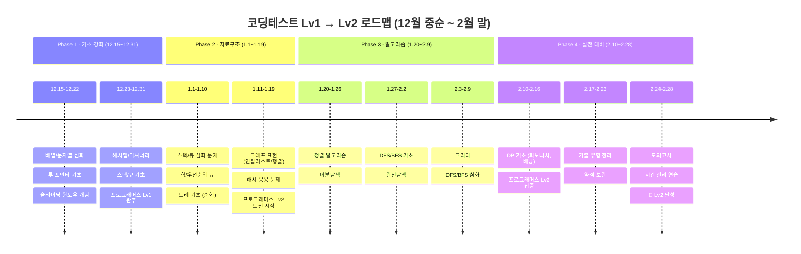
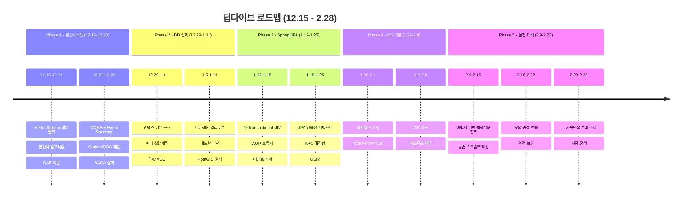
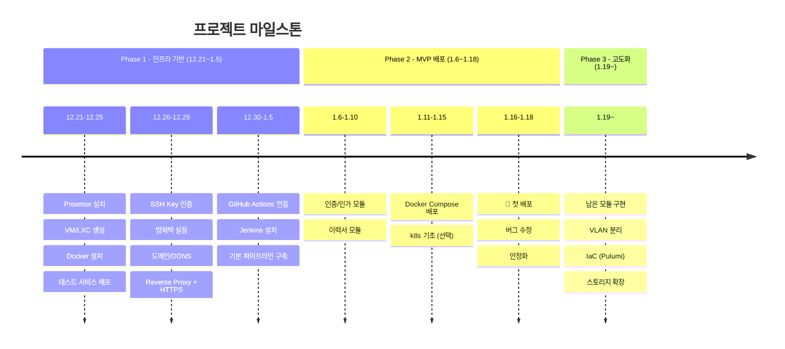
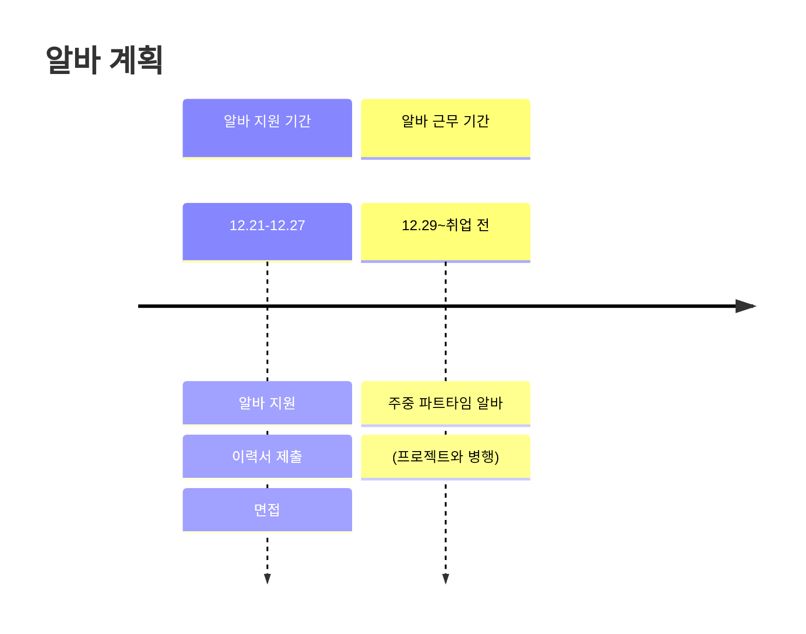

# Why? 왜 배움?

---

선퇴사를 하게 되었다.
내 스스로 부검을 해보니 — 물론 나가기 직전까지 차곡차곡 정리는 해뒀지만 — 퇴사 사유는 아래와 같았다.

1. 비현실적이고 무책임한 일정 운영
2. 과도한 멀티 프로젝트 할당으로 인한 구조적 병목
3. 일정 지연에 대한 비합리적 대응 방식
4. 기술 성장 및 품질 개선을 지원하지 않는 환경
5. 협업과 학습이 단절된 팀 문화

그래서 가고픈 회사를 정하고 이직 준비에 대한 계획을 좀 세워봤다.

# 이직회사 지향점

---

> 💡 [인프런 멘토링](https://www.notion.so/2c319c390290801bade5dca0714fbc1f) 를 참고

- 인원수
- 성장세
- 도메인
- 개인 성장

# 일정(25.12 ~ 26.02)

---

> 💡 TL;DR;

## 대목표

| **코딩테스트** | 프로그래머스 Lv2 안정권 달성 | 2월 말 |
| --- | --- | --- |
| **딥다이브** | 이력서 기반 기술면접 준비 완료 | 2월 말 |
| **프로젝트** | 홈랩 인프라 구축 + MVP 첫 배포 | 1월 중순 |
| **( 알바 )** | 월 100만원 수입 확보 | 12월 말~ |

## 월 별 목표 / 타임라인

## 일일 시간표

**“알바는 2월부터 시작”**

월에 최소 100만원은 필요

필수생활비 30 에 월세,식비 60 잡아 100만원 정도 필요함
근데 무조건 5일은 일해야함

왜 2월 이후부터 알바를 시작하는가?

최소 5일 5시간 이상은 일해야하는데, 그렇게 알바를 뽑는 곳이 없음
더군다나 그렇게 뽑는 곳은 정규직으로 하루 죙일 일하는 곳임

**2025년 최저시급: 10,030원** 기준

| 목표 금액 | 필요 시간/월 | 주 5일 | 주 4일 | 주 3일 |
| --- | --- | --- | --- | --- |
| 100만원 | 약 100시간 | 5시간/일 | 6시간/일 | 8시간/일 |
| 120만원 | 약 120시간 | 6시간/일 | 7.5시간/일 | 10시간/일 |

**현실적인 추천:**

| 옵션 | 근무 패턴 | 예상 수입 | 공부 가능 시간 |
| --- | --- | --- | --- |
| **A (추천)** | 주 5일 × 5시간 | 약 100만원 | 하루 4-5시간 |
| B | 주 4일 × 6시간 | 약 96만원 | 평일 1일 풀 공부 가능 |
| C | 주 3일 × 8시간 | 약 96만원 | 평일 2일 풀 공부 가능 |

| 시간 | 활동 | 시간 |
| --- | --- | --- |
| 08:00-08:30 | 기상 + 준비 | - |
| 08:30-09:00 | 워밍업 (어제 복습) | 0.5h |
| 09:00-12:00 | **코딩테스트** | 3h |
| 12:00-13:00 | 점심 + 휴식 | - |
| 13:00-15:00 | **딥다이브** | 2h |
| 15:00-15:30 | 휴식 | - |
| 15:30-18:30 | **프로젝트/인프라** | 3h |
| 18:30-19:30 | 저녁 + 휴식 | - |
| 19:30-21:30 | **프로젝트/인프라** | 2h |
| 21:30-22:30 | 복습 + 블로그 정리 | 1h |
| 23:00 | 취침 | - |
| **총 공부** |  | **11.5h** |

# 공부로그

---

[커리어멘토링비서 구축기](https://www.notion.so/28a19c39029080778a61dca0284efe4f) 
[이력서 기술 딥다이브](https://www.notion.so/2ce19c39029080ad8026c35ce628b9f2) 
[알고리즘/코딩테스트](https://www.notion.so/2ce19c39029080e4abbfd24b32e9233f) 
[Untitled](https://www.notion.so/2c8a65270d97804bb63eeb932b162fc3) 
[CKA 스터디](https://www.notion.so/2d419c390290801e8e20fbe5d75ef270)
