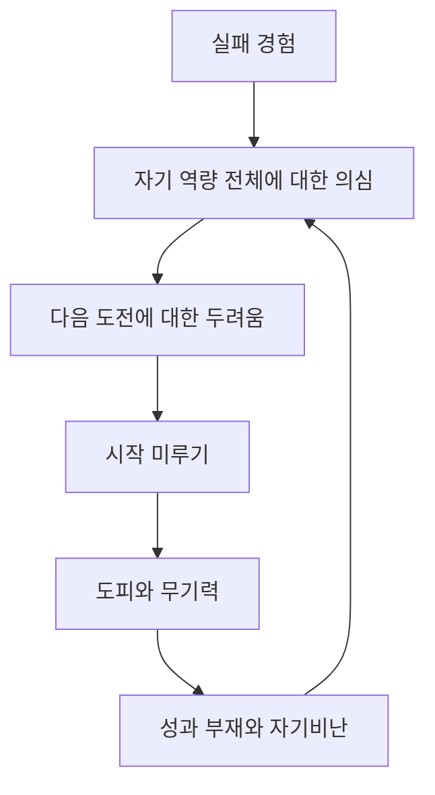
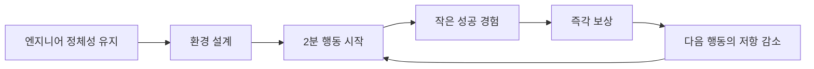

# 다시 움직이기 위해, 지금의 나를 정리해본다

---

12월 말 퇴사 이후 시간이 꽤 흘렀다. 
겉으로 보면 분명히 몇 가지를 하긴 했다. 
홈랩도 구축해봤고, 과제도 봤고, 해커톤도 나갔고, 면접도 봤고, 자격증 시험도 준비했다. 
그런데 이상하게 마음속에 남아 있는 감각은 "나는 지난 몇 달 동안 별로 해낸 게 없다"는 쪽에 더 가깝다.
이렇다할만한 성과가 없기 때문이다.
그래서 요즘의 나는 무엇을 못 해서 힘든 사람이라기보다, 실패와 공백을 해석하는 방식 때문에 점점 더 움직이기 어려워진 사람에 가깝다고 느낀다.

## 지금 내가 서 있는 자리

나는 2년차 백엔드 엔지니어로 일하다가 회사를 나왔다. 퇴사 이유는 단순히 일이 많아서가 아니었다. 
새벽이나 주말 출근을 강요받고, 시니어 없이 주니어에게 시스템 설계부터 에러 수정까지 사실상 모든 책임을 떠넘기는 환경은 오래 버틸 수 있는 구조가 아니었다.
 그 환경에서 나오는 것은 성장보다 소진에 가까웠다. 그래서 퇴사는 필요했다.
하지만 퇴사 이후에는 다른 종류의 압박이 생겼다. 수입이 없는 시간이 5개월 가까이 이어지고 있고, 기술 환경은 빠르게 바뀌고 있으며, 나는 그 변화 속에서 어떤 방향으로 준비해야 할지 확신하지 못하고 있다.
핵심만 적으면 지금의 상태는 이렇다.

- 경제적 여유가 줄어들고 있다.
- 기술 변화 속도를 따라가야 한다는 압박이 있다.
- 무엇을 준비해야 할지 방향 감각이 흐려져 있다.

## 불안이 커진 방식

불안은 현실적인 사정에서만 오지 않는다.
더 큰 문제는, 내가 최근의 실패들을 너무 빠르게 "내 역량 전체에 대한 판결"로 받아들이고 있다는 점이다.
예를 들면 이렇다.

- 버즈빌 과제 실패: 코드 리뷰 역량 부족
- NHN 과제 실패: Java 네트워크 처리 및 웹 서버 구현 역량 부족
- 스파르타 면접 실패: NestJS 경험 부족, 면접 역량 부족
- CKA 2회 실패: Helm, Troubleshooting, Cluster Architecture, Installation and Configuration, Workloads, Templating, Scheduling 역량 부족
- 소크라AI 코딩테스트 실패: 문제 해결 역량 부족

문제는 각각의 실패가 아니라, 이 실패들을 한데 묶어 "결국 나는 기술적으로 부족한 사람"이라는 문장으로 정리해버리는 내 습관이다.
하지만 정말 그런가 생각해보면, 실패가 말해주는 것은 생각보다 제한적이다. 실패는 내 전체를 판결하지 않는다.
그저 지금 어떤 부분이 약한지, 무엇을 더 훈련해야 하는지, 어떤 상황에서 내가 쉽게 무너지는지를 드러낼 뿐이다.
즉, 실패는 판결문이라기보다 진단서에 가깝다. 
그런데 요즘의 나는 그 진단서를 판결문처럼 읽고 있다. 
그래서 새로운 기회를 보면 "이번엔 해낼 수 있을까?"보다 "이것마저 못하면 어떡하지?"가 먼저 떠오른다.

## 요즘 생활이 무너지는 이유

생활 패턴이 무너진 것도 같은 맥락이다.
알람 없이 11시에 일어나고, 낮부터 밤까지 대부분의 시간을 책임 없는 쾌락으로 채운다. 
운동은 하긴 하지만, 하루 전체를 지탱할 만큼 강한 축은 되지 못한다.
지금의 하루는 대략 이런 식이다.

- 11시 기상
- 11시 ~ 18시: 책임 없는 쾌락과 식사
- 18시 ~ 19시: 운동
- 19시 ~ 03시: 다시 책임 없는 쾌락과 식사

해야 할 일이 없는 것은 아니다. 코딩테스트와 역량검사, 자격증 스터디까지 껴있었다.
문제는 해야 할 일이 없어서가 아니라, 해야 할 일이 보일 때마다 그 일이 내 부족함을 증명하는 시험처럼 느껴진다는 것이다.
목표를 세우면 "만약 못하면?"이 따라오고, 그 생각은 금방 "그럼 아예 시작하지 말자"로 이어진다.
겉으로는 게으름처럼 보이지만, 실제로는 실패 회피가 생활 전체를 잠식한 상태에 더 가깝다.

## 그래도 완전히 멈춘 것은 아니었다

한편으로는 스스로를 너무 과하게 몰아세우고 있다는 생각도 든다. 
사실관계만 놓고 보면, 내가 완전히 멈춰 있었던 것은 아니다.

- 12월: 홈랩
- 1월: 버즈빌 과제, 홈랩
- 2월: NHN 과제, OpenAI 해커톤
- 3월: 스파르타 면접, CKA
- 4월: LFCS 자격증 준비

그러니까 문제는 "아무것도 하지 않았다"가 아니다. 
도전은 계속 있었지만, 도전 이후의 해석과 회복 방식이 없었다는 점이 더 정확하다.

# 회고 포인트 : 나는 어떤 것을 잘못하고 있었나?

---

이쯤에서 나는 스스로에게 두 가지 질문을 던지게 된다.

### 1. 기여의 단위를 너무 크게 잡고 있지 않은가

요즘 나는 뭔가를 하더라도 눈에 띄는 결과가 아니면 의미가 없다고 느낄 때가 많다. 
하지만 단 한 줄의 코드, 짧은 기술 메모, 작은 블로그 초안도 누군가에게는 도움이 될 수 있고, 적어도 미래의 나에게는 분명히 도움이 된다. 문제는 그 사실을 모르는 게 아니라, 너무 오랫동안 아무것도 퍼블리싱하지 않다 보니 다시 시작하는 첫 단추가 유난히 크게 느껴진다는 점이다.

### 2. 성과에만 묶어두고 있지 않은가

원래 내가 코딩을 좋아했던 이유는 결과물 때문만은 아니었다.

- 주어진 기한 안에서 치열하게 고민하는 과정
- 모르는 것을 공부하고 해결해 나가는 과정
- 해커톤처럼 몰입해서 무언가를 만드는 경험

나는 이런 과정에서 즐거움을 느끼는 사람이었다. 
그런데 최근에는 그런 종류의 몰입이 거의 사라졌다. 
그러니 노력의 필요성도, 성취의 감각도 함께 흐려질 수밖에 없었다.

## 왜 년별/월별 계획표는 실패하는가

이 지점에서 분명해지는 것이 하나 있다. 
지난 몇 달간 내 인생 전반의 계획표와 그에 따른 세부 월별/주간 계획표를 세웠다.
돌이켜보면 이는 나에게는 맞지 않는 시스템이라고 생각한다.
그 이유는 단순하다.

- 인생은 원래 계획대로 흘러가지 않는다.
- 목표를 하나만 크게 잡아두면 실패했을 때 자존감이 통째로 흔들린다.
- 스케줄이 조금만 무너져도 스트레스가 과하게 올라가고, 결국 "그냥 아무것도 하지 말자"는 방어 전략으로 돌아가기 쉽다.

지금 필요한 것은 큰 목표를 더 잘 세우는 능력이 아니라, 실패하더라도 다음 날 다시 돌아올 수 있는 작은 시스템이다.

## 그래서 필요한 것은 작은 시스템이다

그래서 내가 붙잡으려는 기준은 `Atomic Habits`의 원칙에 가깝다. 
거창한 계획보다 정체성과 환경, 그리고 아주 작은 행동 단위에서 다시 시작하는 방식이다.
먼저 나는 스스로를 단순한 구직자로 정의하지 않으려 한다. 나는 기술의 변화를 즐기고, 사회적 가치를 고민하며, 배운 것을 글로 남기고 싶어 하는 엔지니어다. 이 정체성은 취업 여부와 별개로 유지되어야 한다. 그래야 오늘의 작은 행동이 단순한 스펙 쌓기가 아니라, 내가 어떤 사람인지를 계속 증명하는 행위가 된다.
그다음으로는 의지보다 환경을 믿어야 한다. 인스타그램, 유튜브, 쇼핑처럼 쉽게 빠져드는 자극은 차단 도구로 제한하고, 반대로 몸을 움직이기 쉬운 환경은 미리 만들어둬야 한다. 자기 전에 다음 날 입고 나갈 옷을 준비하고, 수면 시간을 제외하면 집에 오래 머물지 않기로 한 것도 같은 이유다.
그리고 행동의 크기를 비정상적으로 작게 만들어야 한다. 지금의 나는 큰 공부 계획 앞에서 자주 도망친다. 그래서 기준을 "얼마나 많이 했는가"가 아니라 "얼마나 쉽게 시작할 수 있는가"로 바꿔야 한다. `news.hada.io`에서 흥미로운 포스트 하나를 읽는 것, 예전에 정리한 TIL을 다시 펼쳐보는 것, Lv1 문제를 풀어보는 것 정도면 충분하다.
보상도 미뤄두기보다 바로 붙어 있어야 한다. 카페에 가서 2분 루틴을 마친 직후에 좋아하는 커피를 마시고, 하루 루틴을 마치면 작은 보상을 붙인다. 문제를 완벽히 풀지 못해도, 카페에 갔고, Lv1 문제를 풀었고, 글 한 문단을 적었다면 그날은 성공으로 쳐야 한다.
정리하면 시스템의 축은 이렇다.

- 정체성: 나는 단순한 구직자가 아니라 엔지니어다.
- 환경: 집 밖으로 나가고, 유혹은 줄인다.
- 시작 단위: 2분 안에 할 수 있을 만큼 작게 쪼갠다.
- 보상: 즉시 보이게 만든다.

## 하루는 이렇게 굴러가면 된다

이 원칙을 실제 하루에 적용하면 구조는 생각보다 단순하다. 
오전에는 PCCP 준비를 위해 바킹독 실전 알고리즘을 천천히 반복해서 풀고, 
오후에는 완성도가 높지 않아도 좋으니 떠오르는 문제 하나를 잡고 실제로 돌아가는 무언가를 만든다. 
저녁에는 30분 운동을 하고, 22시 전까지는 그날 진행한 내용을 블로그에 짧게라도 남긴다. 
22시 이후에는 자유 시간을 갖고, 자기 전에 다음 날 입고 나갈 옷을 챙긴다.
이후에는 해빗 트래커를 체크하며 오늘 하루와 내일을 점검한다.

- 카페 가기
- PCCP 준비
- 블로그 기고
- 운동

# 결론

---

결국 내가 해결해야 할 문제는 "나는 기술적으로 형편없는가?"가 아니다. 
더 정확한 질문은 "나는 왜 실패를 비관적으로 회피하고, 다음 행동까지 포기하게 되는가?" 에 가깝다.
지금 필요한 것은 인생을 뒤집는 거대한 반전이 아니라, 다음 네 가지다.

- 매일 집 밖으로 나가기
- 2분짜리 기술 행동 시작하기
- 작은 기여를 다시 쌓기
- 결과보다 시스템을 지키기

회복은 대체로 극적인 결심에서 시작되지 않는다. 아주 작은 행동을 다시 반복할 수 있게 만드는 구조에서 시작된다.

# Reference

---

- *Atomic Habits*
