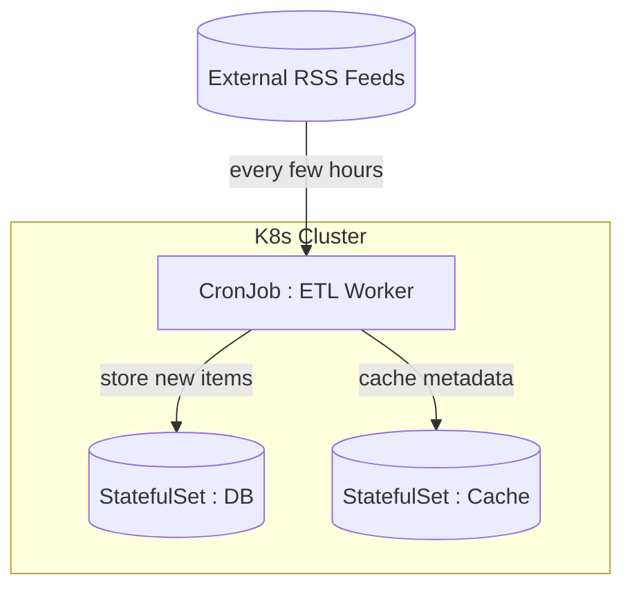

# Why?

왜 배움?

---

---

> ***Jobs represent one-off tasks that run to completion and then stop.***

서버리스 람다 함수와 같이 finite task 를 실행 프로세스를 처리하기 위한 컴포넌트이다.

특정 이미지의 컨테이너를 깨운 뒤, command 에 따른 프로세스 처리 이후 종료한다.

아래와 같은 경우에 사용된다고 한다.

- Example 1: Database Migration Job (PostgreSQL + Flyway)
- Example 2: CronJob for Daily Reports

# What?

뭘 배움?

---

---

## 레플리카셋/디플로이먼트 vs 잡

- 레플리카셋/디플로이먼트
- 잡

## Job

### 잡 기동

```yaml
apiVersion: batch/v1
kind: Job
metadata:
  name: hello
spec:
  template:
    spec:
      containers:
        - name: hello
          image: hello-world
      restartPolicy: Never
  backoffLimit: 4
```

### 잡 파드 확인

```nix
~/dev/k8s-practice master*
❯ kubectl get pods -l job-name=hello
NAME          READY   STATUS      RESTARTS   AGE
hello-svspt   0/1     Completed   0          4m51s
```

### 잡 로그 확인

- 실행 이후 결과 확인 : kubectl logs ${pod이름}
- 실시간으로 확인 : kubectl logs -f ${pod이름}

```nix
~/dev/k8s-practice master*
❯ k logs hello-svspt                

Hello from Docker!
This message shows that your installation appears to be working correctly.

To generate this message, Docker took the following steps:
 1. The Docker client contacted the Docker daemon.
 2. The Docker daemon pulled the "hello-world" image from the Docker Hub.
    (amd64)
 3. The Docker daemon created a new container from that image which runs the
    executable that produces the output you are currently reading.
 4. The Docker daemon streamed that output to the Docker client, which sent it
    to your terminal.

To try something more ambitious, you can run an Ubuntu container with:
 $ docker run -it ubuntu bash

Share images, automate workflows, and more with a free Docker ID:
 https://hub.docker.com/

For more examples and ideas, visit:
 https://docs.docker.com/get-started/
```

### 재시작 정책

- restartPolicy : Never
- restartPolicy : OnFailure

### 플래그

- `spec.parallelism` 
- `spec.completions`
- `spec.backoffLimit` 
- `spec.ttlSecondsAfterFinished`

## CronJob

- k8s 1.4 스케줄잡 → 크롭잡으로 이름 개명
- 크론잡 산하에 여러 잡들이 생겨나고, 각각의 잡들에 대해 파드들이 생성됨
- 템플릿은 거의 비슷하지만 다른 부분이 존재함

### 플래그

- `spec.suspend`
- `spec.concurrencyPolicy`
- `spec.startingDeadlineSeconds` 
- `spec.successfulJobsHistryLimit`
- `spec.startingDeadlineSeconds` 

# How?

어떻게 씀?

---

## 요구사항 : 일일 뉴스 보고

뉴스클리핑 프로젝트를 리뉴얼해보자.

- 몇 시간마다 rss feed 를 스크래핑하여 저장

## 설계

- DB → MongoDB :: 스테이트풀셋, 볼륨
- 캐싱 → Redis :: 스테이트풀셋, 볼륨
- ETL → Airflow pipeline / Go Http :: 크론잡



1.

Create RSS Feed URL
2.

RSS read 를 구현한다.

간간히 진행 중이며 최종 코드는 여기서 확인 가능하다.
[https://github.com/vanillacake369/k8s-practice/tree/master/%EC%BF%A0%EB%B2%84%EB%84%A4%ED%8B%B0%EC%8A%A4%20%EC%9E%85%EB%AC%B8/job/report](https://github.com/vanillacake369/k8s-practice/tree/master/%EC%BF%A0%EB%B2%84%EB%84%A4%ED%8B%B0%EC%8A%A4%20%EC%9E%85%EB%AC%B8/job/report)

[^1]: https://medium.com/coryodaniel/working-with-kubernetes-jobs-848914418 <https://medium.com/coryodaniel/working-with-kubernetes-jobs-848914418>
[^2]: https://kubernetes.io/docs/concepts/workloads/controllers/job/ <https://kubernetes.io/docs/concepts/workloads/controllers/job/>
[^3]: https://kubernetes.io/docs/concepts/workloads/controllers/cron-jobs/ <https://kubernetes.io/docs/concepts/workloads/controllers/cron-jobs/>
