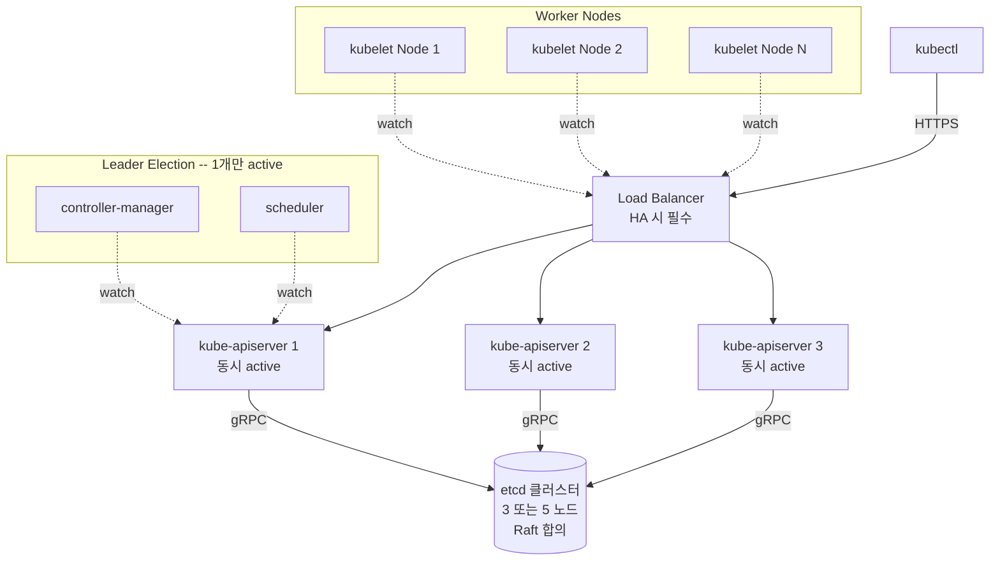
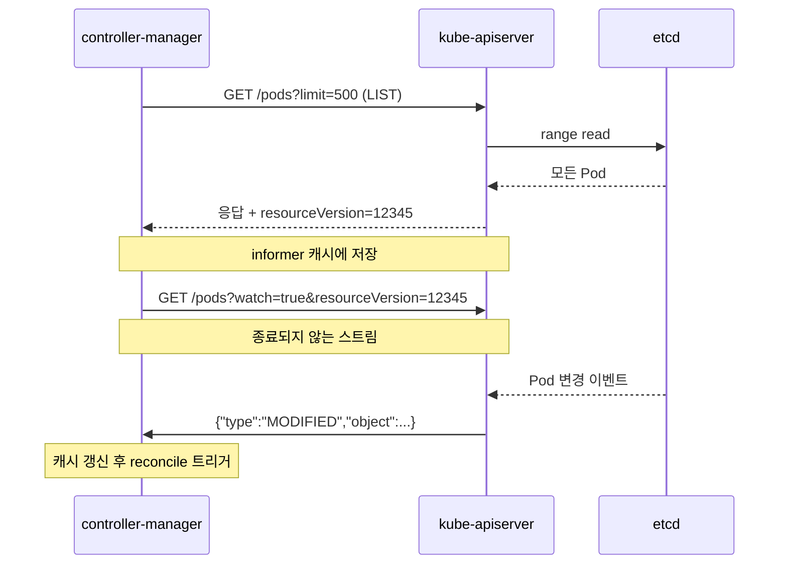
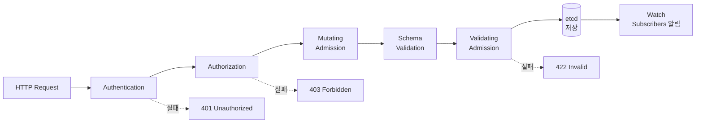
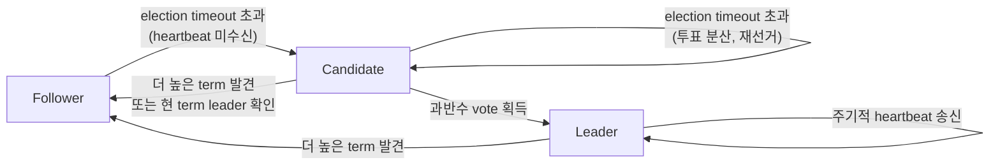
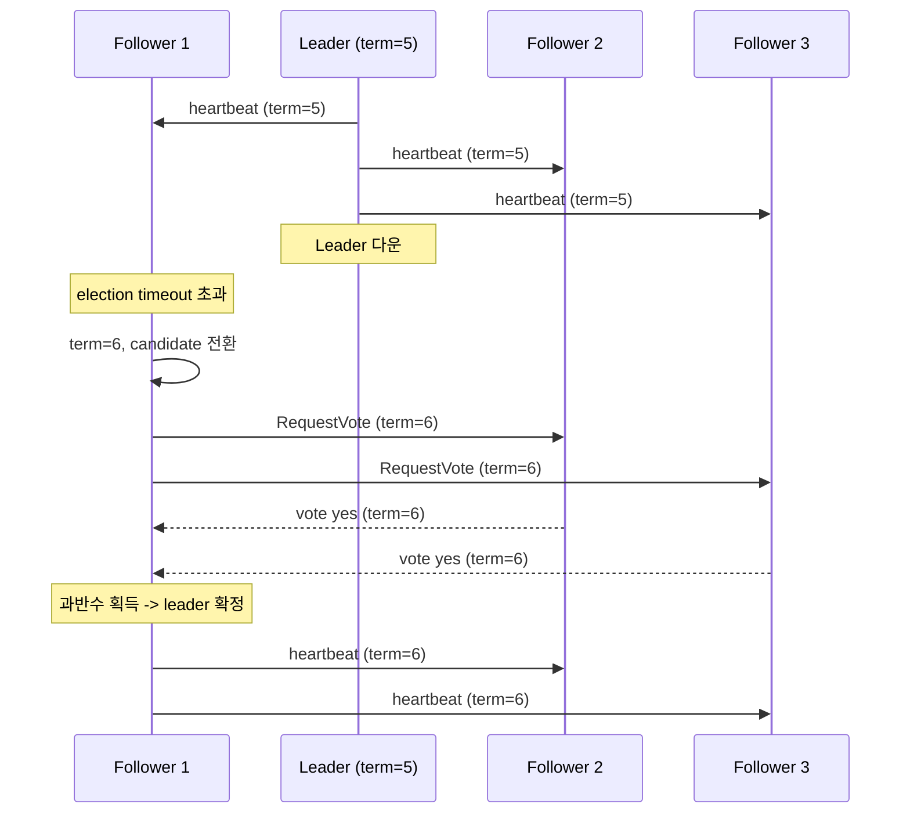
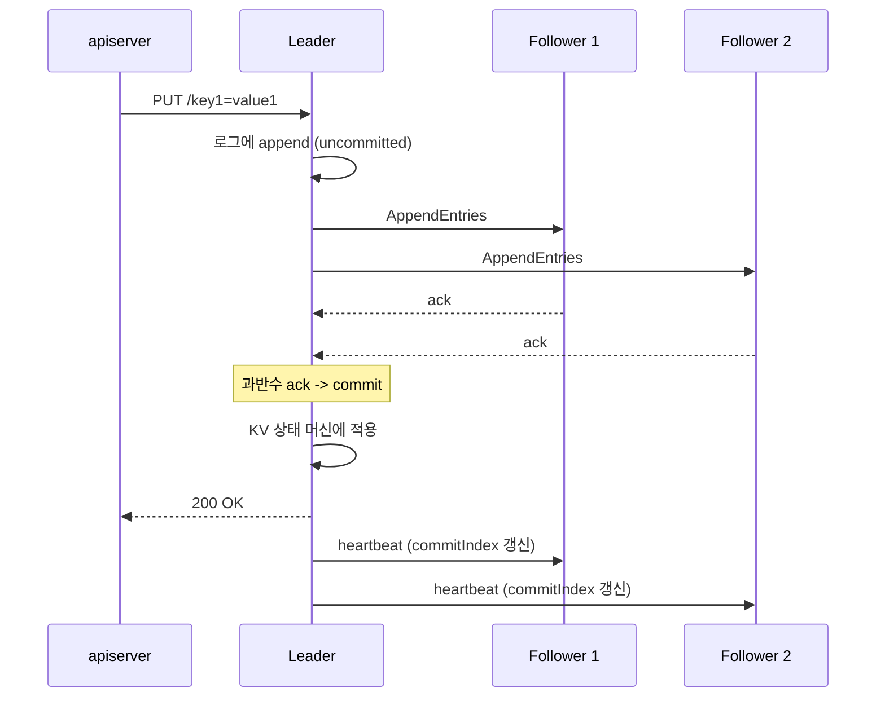
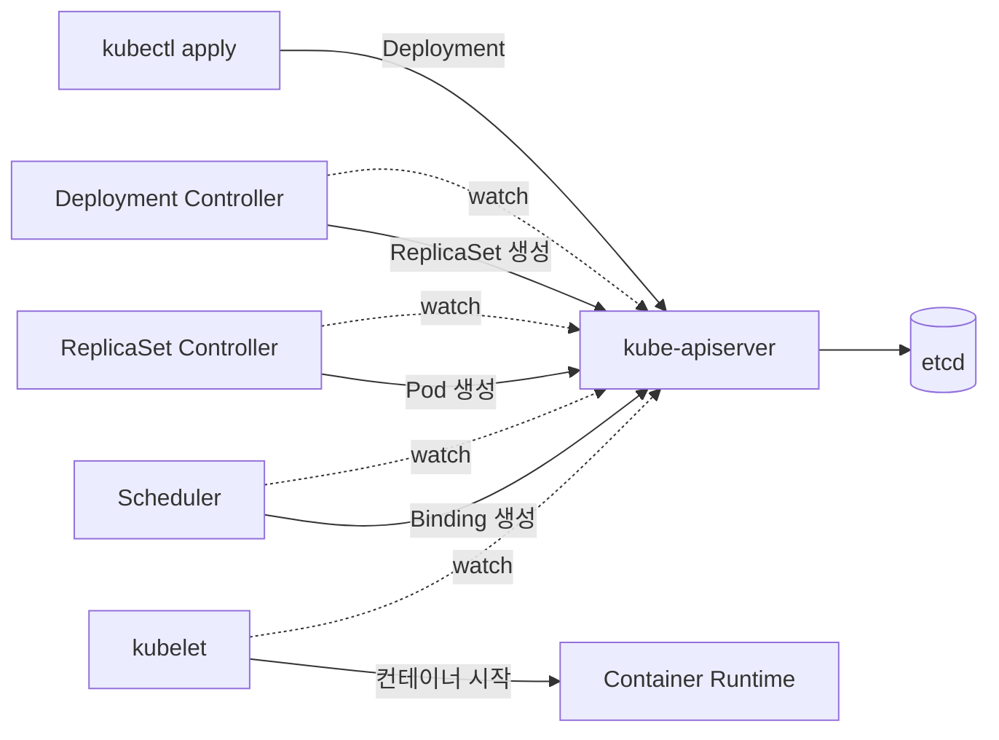
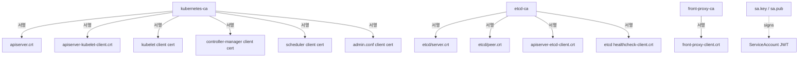

# Why? 왜 배움?

편 2 에서 단일 노드의 kubelet 이 Pod sandbox 를 만들고, ServiceAccount 토큰을 주입하고, 볼륨을 마운트하는 전체 과정을 확인했다.

편 2 의 설명은 이미 존재하는 클러스터를 전제로 했다.

kubelet 이 desired state 를 받아온 경로 — apiserver 와의 watch 연결 — 가 동작하려면 클러스터가 있어야 한다.

그 클러스터는 어떻게 만들어지는가.

여러 노드가 하나의 desired state 를 공유하려면, 그 상태를 _어딘가에 저장하고, 모든 노드가 같은 값을 읽을 수 있어야_ 한다.

네트워크는 끊어지고, 노드는 죽고, 메시지는 늦게 도착하는 환경에서 이것을 보장하는 것이 _분산 합의_ 라는 문제다.

K8s 를 운영하면서 이 문제를 직접 마주하는 순간은 다음과 같다.

- etcd 노드 하나가 죽었는데 클러스터가 _응답을 멈추었다_ — 쿼럼이 깨졌기 때문이다. 3 노드 중 2 노드가 살아있어야 쓰기가 가능한데, 왜 그런지 모르면 복구 판단이 불가능하다.
- `kubeadm certs check-expiration` 을 한 번도 실행하지 않았다가 _어느 날 kubectl 이 갑자기 동작하지 않는다_ — 인증서가 만료되었기 때문이다. 3 개의 CA 중 어떤 CA 의 어떤 인증서가 문제인지 모르면 갱신 대상을 특정할 수 없다.
- HA 구성의 control plane 노드 하나를 내렸는데 _scheduler 가 새 Pod 를 배치하지 않는다_ — leader election 이 아직 완료되지 않았기 때문이다. Lease 객체의 동작을 모르면 얼마나 기다려야 하는지 판단할 수 없다.

이 문제들은 모두 K8s 가 _분산 시스템_ 이라는 사실에서 비롯된다.

분산 시스템에는 세 가지 근본 과제가 있으며, K8s 는 각각에 대해 구체적인 해법을 채택하고 있다.

| 과제                                                       | K8s 의 해법                                  | 이 편에서 다루는 절 |
| ---------------------------------------------------------- | -------------------------------------------- | ------------------- |
| **합의** — 여러 노드가 같은 순서로 같은 결정을 내리는 방법 | etcd 의 Raft 합의 알고리즘                   | etcd 절             |
| **보안** — 컴포넌트 간 통신을 인증하고 암호화하는 방법     | 3 CA 기반 mTLS 인증서 체인                   | 인증서 절           |
| **장애 허용** — 일부 노드가 죽어도 시스템이 유지되는 방법  | apiserver 다중 active + leader election + LB | HA 절               |

### 이 편의 구조

이 편에서는 먼저 K8s 의 hub-and-spoke 통신 설계를 파악한 뒤, apiserver → etcd → scheduler/controller-manager → 인증서 → HA 순서로 각 컴포넌트의 내부를 따라간다.

각 절에서 개념을 다룬 직후 인라인 실습으로 검증하며, How 절에서는 kubeadm 으로 실제 클러스터를 부트스트랩하고 etcd 백업/복구와 leader failover 를 종합적으로 확인한다.

---

# What? 뭘 배움?

## hub-and-spoke — 모든 컴포넌트가 apiserver를 경유하는 통신 설계 🌐

Kubernetes의 동작은 desired state를 선언하는 측과 이를 actual state로 수렴시키는 측의 분업으로 구성된다[^C1].

`kubectl apply -f deployment.yaml`을 실행하면 요청은 다음 경로를 거친다.



위 구조도는 HA 환경을 포함한 전체 모습이다. 단일 control plane이면 LB 없이 apiserver 1개와 etcd 1개로 단순화된다. 핵심은 모든 화살표가 apiserver를 경유한다는 점이다.

모든 화살표가 kube-apiserver와 etcd를 통과한다.
Kubernetes의 모든 컴포넌트는 서로 직접 통신하지 않는다.
대신 모두 kube-apiserver를 거쳐서만 etcd에 기록된 desired state를 watch하고, 자기 영역에 해당하는 변경에 반응한다.
이 구조를 hub-and-spoke 패턴이라 한다[^C2].

hub-and-spoke가 주는 이점은 세 가지다.
첫째, 한 컴포넌트가 죽어도 다른 컴포넌트에 영향이 없다. 왜냐하면 컴포넌트 간에 직접적인 의존이 없기 때문이다.
둘째, 새 컴포넌트 추가가 용이하다. apiserver의 watch만 구독하면 기존 컴포넌트를 수정할 필요가 없기 때문이다.
셋째, 모든 통신이 한 곳에서 감사(audit)된다. 모든 요청이 반드시 apiserver를 통과하므로 apiserver 한 곳에서 로그를 남기면 전체 통신을 추적할 수 있다.

이 패턴의 hub 역할을 하는 것이 control plane의 네 컴포넌트다.

| 컴포넌트                    | 역할                                                           | 실행 위치                                              |
| --------------------------- | -------------------------------------------------------------- | ------------------------------------------------------ |
| **kube-apiserver**          | 클러스터의 단일 진입점. 유일하게 etcd와 직접 통신              | control plane 노드 (HA 시 N개 동시 active)             |
| **etcd**                    | 클러스터 상태 영구 저장소. Raft 합의로 일관성 보장             | control plane 노드 (stacked) 또는 별도 노드 (external) |
| **kube-scheduler**          | Pod의 노드 배치 결정. Filter-Score-Binding 파이프라인          | control plane 노드 (leader election으로 1개만 active)  |
| **kube-controller-manager** | desired/actual state 차이 감지 및 수정. 수십 개 reconcile 루프 | control plane 노드 (leader election으로 1개만 active)  |

네 컴포넌트가 모두 같은 노드에 배치되는 모델이 가장 흔하지만, etcd는 별도 클러스터로 분리할 수 있다.

kube-controller-manager와 kube-scheduler는 HA 환경에서 여러 인스턴스가 동시에 존재해도 leader election을 통해 하나만 active다.
왜일까? 이 둘은 reconcile 루프이므로 두 인스턴스가 동시에 같은 결정을 내리면 중복 생성이나 충돌이 발생하기 때문이다[^C3].
반면 kube-apiserver는 stateless라서 모든 인스턴스가 동시에 active로 트래픽을 처리한다. 요청을 받아 etcd에 전달하는 역할만 하므로 여러 인스턴스가 동시에 동작해도 충돌이 생기지 않는다.

이 네 컴포넌트 중 apiserver가 etcd와 직접 통신하는 유일한 컴포넌트라는 사실이 이후 모든 절의 전제가 된다.
따라서 etcd의 데이터 모델을 이해하려면 먼저 apiserver가 어떤 방식으로 요청을 받고 처리하는지를 알아야 한다.

그렇다면 apiserver는 정확히 무엇을 하는가.

지금까지 hub-and-spoke 구조를 개념적으로 다뤘다. 그러나 apiserver가 내부적으로 어떤 URL을 호출하는지 직접 보지 않으면 watch 메커니즘이 추상으로 남는다. 이 실습에서는 kubectl의 verbosity 옵션을 사용하여 실제 HTTP 요청을 직접 확인한다.

> **실습 1: kubectl -v=8로 API 호출 URL 추적**
>
> 이 실습에서는 kubectl이 실제로 어떤 HTTP 요청을 apiserver에 보내는지 확인한다.
> 우선 클러스터가 정상 동작하는 상태를 확인하자.
>
> ```bash
> kubectl get nodes
> # Ready 상태 확인 후 진행
>
> kubectl get pods -n kube-system -v=8 2>&1 | head -40
> ```
>
> 출력에서 세 가지를 확인한다.
>
> - 어떤 URL을 호출하는가 — `GET https://192.168.x.x:6443/api/v1/namespaces/kube-system/pods`
> - 어떤 헤더를 보내는가 — `Authorization: Bearer ...` 또는 client cert
> - 어떤 응답을 받는가 — JSON 본문의 `resourceVersion` 필드
>
> hub-and-spoke 절에서 다룬 "모든 통신이 apiserver를 경유한다"는 구조가 확인된다.
> `kubectl`은 이 URL들을 호출하는 HTTP 클라이언트에 불과하다.

---

## kube-apiserver — RESTful watch와 admission chain으로 구현한 단일 진입점 🚪

kube-apiserver는 Kubernetes 클러스터에서 유일하게 etcd와 직접 통신하는 컴포넌트다[^C4].
다른 모든 컴포넌트는 반드시 apiserver를 통해서만 etcd 데이터에 접근한다.
이 디자인 덕분에 etcd 스키마 변경, 백엔드 교체, 인증 정책 변경이 apiserver 한 곳에서만 처리된다. 만약 각 컴포넌트가 etcd에 직접 접근한다면 이런 변경마다 모든 컴포넌트를 수정해야 할 것이다.

### HTTPS REST API

kube-apiserver는 RESTful HTTPS 서버다.
Kubernetes의 모든 리소스 종류가 URL 패턴으로 노출된다[^C5].

```bash
GET    /api/v1/namespaces/default/pods               # 모든 Pod 조회
POST   /api/v1/namespaces/default/pods               # Pod 생성
GET    /api/v1/namespaces/default/pods/my-pod        # 특정 Pod 조회
PATCH  /api/v1/namespaces/default/pods/my-pod        # 부분 수정
DELETE /api/v1/namespaces/default/pods/my-pod        # 삭제
GET    /apis/apps/v1/namespaces/default/deployments  # 코어 외 그룹
```

`/api/v1/...`는 코어 그룹(pods, services, configmaps 등)이다.
`/apis/<group>/<version>/...`는 그 외 모든 그룹(apps/v1, networking.k8s.io/v1, CRD 등)이다.
`kubectl`의 모든 명령은 이 URL들을 호출하는 HTTP 클라이언트다.

### Watch — long-polling 기반 변경 알림

REST의 표준 동사만으로는 Kubernetes의 reconcile 구조를 구현할 수 없다.
왜냐하면 각 컴포넌트가 변경을 폴링 없이 즉시 감지해야 하기 때문이다.
이 요구를 충족하기 위해 Kubernetes가 추가한 것이 WATCH 동사다[^C6].

```bash
GET /api/v1/namespaces/default/pods?watch=true&resourceVersion=12345
```

이 요청은 종료되지 않는 HTTP 응답 스트림이 된다.
apiserver는 etcd의 변경 이벤트를 받을 때마다 이 스트림으로 JSON 한 줄을 push한다.
`resourceVersion`은 마지막으로 수신한 버전을 나타내며, 재연결 시 해당 시점부터의 변경만 다시 받을 수 있게 한다. 이 덕분에 네트워크가 잠시 끊어졌다 복구되어도 처음부터 다시 전체 데이터를 받을 필요가 없다.

이 watch 위에 client-go의 informer 캐시가 구축된다.
informer는 최초 1회 LIST + 이후 WATCH를 결합해 클라이언트 메모리에 모든 객체의 최신 버전을 캐싱한다[^C7].
이 설계 덕분에 controller-manager와 scheduler가 수만 개 객체를 매번 apiserver에 질의하지 않고도 빠르게 조회할 수 있다.



### Admission Chain — 쓰기 요청 검증/변형 파이프라인

지금까지 apiserver가 읽기 요청을 처리하는 방식(REST + Watch)을 다뤘다. 그러나 쓰기 요청에는 추가적인 보호가 필요하다. 잘못된 객체가 etcd에 저장되면 클러스터 전체에 영향을 주기 때문이다. apiserver가 받은 쓰기 요청은 다음 4단계의 admission 파이프라인을 거친다[^C8].

1. **Authentication** — 요청자 식별 (TLS 인증서, ServiceAccount JWT, OIDC 등)
2. **Authorization** — 권한 확인 (RBAC, NodeAuthorizer, ABAC 등)
3. **Mutating Admission** — 요청 객체 수정 (예: ServiceAccount admission이 자동 토큰 마운트 추가)
4. **Validating Admission** — 최종 검증 (예: ResourceQuota, PodSecurity, ValidatingWebhook)

모든 단계를 통과한 객체만 etcd에 저장된다. 어느 한 단계라도 실패하면 요청은 즉시 거부되고 etcd에는 아무것도 기록되지 않는다.



Mutating Admission은 Kubernetes 자동화의 핵심 확장 지점이다.
편 2의 ServiceAccount admission, Istio의 sidecar injection, cert-manager의 Certificate approval이 모두 mutating admission으로 구현된다. 이 메커니즘이 있기 때문에 사용자가 명시하지 않은 필드를 Kubernetes가 자동으로 채워넣을 수 있다.

### API Aggregation

apiserver에는 하나 더 중요한 역할이 있다.
`/apis/metrics.k8s.io/` 같은 경로는 apiserver 자체가 처리하지 않고, 별도의 extension API server(예: metrics-server)로 프록시한다[^C9].
이때 apiserver는 front-proxy-client 인증서를 사용해 extension API server에 인증한다.
이 인증서가 front-proxy-ca가 서명하는 것이며, 인증서 체인 절에서 다시 다룬다.

### v1.35 변경점 — Structured Authentication Configuration GA

Kubernetes v1.35에서 Structured Authentication Configuration이 GA 되었다[^C10].
기존 `--oidc-*` 플래그 방식은 OIDC provider 한 개만 지원하고, 변경 시 apiserver 재시작이 필요했다.
새 방식은 별도 YAML config 파일에 여러 provider와 claim mapping을 선언적으로 정의한다.

```yaml
apiVersion: apiserver.config.k8s.io/v1
kind: AuthenticationConfiguration
jwt:
    - issuer:
          url: https://login.example.com
          audiences: [my-app]
      claimMappings:
          username:
              expression: "claims.email"
          groups:
              expression: "claims.groups"
    - issuer:
          url: https://other-idp.example.com
          audiences: [my-other-app]
      claimMappings:
          username:
              expression: "claims.sub"
```

이것은 외부 사용자 인증의 개선이며, 클러스터 내부 ServiceAccount JWT 흐름에는 변경이 없다.

여기까지 apiserver의 역할을 살펴봤다. apiserver는 모든 요청을 받아 검증하고 변형한 뒤 etcd에 기록한다.
그런데 apiserver가 받은 데이터를 어디에 영구 저장하는가. 이 질문에 답하려면 etcd의 데이터 모델과 Raft 합의 알고리즘을 이해해야 하며, 다음 절에서 이를 다룬다.

지금까지 admission chain의 4단계 파이프라인을 개념적으로 다뤘다. 그러나 실제로 어떤 요청이 어떤 단계를 거치는지는 직접 들여다봐야 체감된다. audit log를 활성화하면 apiserver를 통과하는 모든 API 호출을 기록으로 남길 수 있다. 이 실습에서는 audit log를 사용하여 admission chain이 실제로 동작하는 모습을 직접 확인한다.

> **실습 2: audit log 활성화 후 API 호출 기록 확인**
>
> 이 실습에서는 apiserver의 audit log를 활성화해 모든 API 호출이 기록되는 것을 확인한다.
> 우선 audit policy 파일을 작성하자.
>
> ```bash
> sudo mkdir -p /etc/kubernetes/audit
> cat <<EOF | sudo tee /etc/kubernetes/audit/policy.yaml
> apiVersion: audit.k8s.io/v1
> kind: Policy
> rules:
>   - level: Metadata
>     omitStages: [RequestReceived]
> EOF
> ```
>
> `/etc/kubernetes/manifests/kube-apiserver.yaml`에 다음 플래그와 volumeMount를 추가한다.
>
> ```yaml
>     - --audit-policy-file=/etc/kubernetes/audit/policy.yaml
>     - --audit-log-path=/var/log/kubernetes/audit.log
>     - --audit-log-maxage=30
>     volumeMounts:
>     - mountPath: /etc/kubernetes/audit
>       name: audit-policy
>       readOnly: true
>     - mountPath: /var/log/kubernetes
>       name: audit-log
>   volumes:
>   - hostPath:
>       path: /etc/kubernetes/audit
>       type: DirectoryOrCreate
>     name: audit-policy
>   - hostPath:
>       path: /var/log/kubernetes
>       type: DirectoryOrCreate
>     name: audit-log
> ```
>
> 저장하면 kubelet이 static Pod 변경을 감지하고 자동 재시작한다.
>
> ```bash
> sudo tail -f /var/log/kubernetes/audit.log | jq '.verb + " " + .requestURI'
> ```
>
> 다른 터미널에서 `kubectl get pods`를 실행하면 audit log에 `GET /api/v1/.../pods`가 기록된다.
> `kubectl create configmap test --from-literal=k=v`를 실행하면 admission chain 절에서 다룬 Authentication, Authorization, Admission 단계를 거친 POST 요청이 기록된다.
> "apiserver를 통과하는 모든 요청"이 실제로 기록되는 것을 확인할 수 있다[^C11].

---

## etcd와 Raft — leader election, log replication, quorum으로 구현한 분산 합의 🗳️

이 절은 이 편에서 가장 깊이 들어가는 절이다. 앞 절에서 apiserver가 모든 상태를 etcd에 저장한다는 사실을 확인했다. 그렇다면 etcd는 어떻게 여러 노드에 걸쳐 동일한 상태를 안전하게 유지하는가. 이 질문이 분산 합의의 핵심이며, 이 절에서 그 메커니즘을 하나씩 풀어낸다.

### 왜 etcd인가

Kubernetes 설계 시 클러스터 상태 저장소의 요구사항은 다음과 같았다[^C12].

| 요구사항           | 설명                                            |
| ------------------ | ----------------------------------------------- |
| Strong consistency | 어느 apiserver가 읽어도 같은 답을 반환해야 한다 |
| Watch 지원         | 변경을 클라이언트에 즉시 push할 수 있어야 한다  |
| 고가용성           | 일부 노드 장애 시에도 동작해야 한다             |
| Atomic 트랜잭션    | 조건부 쓰기 같은 원자적 동작이 필요하다         |

2014년 당시 이 모든 요구를 만족하면서 운영 부담이 적은 KV 스토어가 etcd였다.
CoreOS가 2013년부터 개발한 etcd는 Raft 합의 알고리즘 기반 분산 strong-consistency KV 스토어다.

### etcd 데이터 모델

etcd의 데이터 모델은 단순한 key-value이며, key는 바이트 문자열이다.
Kubernetes는 모든 리소스를 `/registry/<리소스종류>/<네임스페이스>/<이름>` 패턴의 key로 저장한다[^C13].
value는 protobuf로 인코딩된 Kubernetes 객체다.
이처럼 단순한 KV 모델을 선택한 덕분에, 그 위에 watch, lease, transaction 같은 고수준 기능을 범용적으로 구현할 수 있었다.

etcd는 또한 revision이라는 전역 단조 증가 카운터를 유지한다.
모든 쓰기는 revision을 1 증가시킨다.
apiserver의 `resourceVersion`은 이 etcd revision에서 파생된 값이다.
watch가 특정 resourceVersion 이후의 변경만 받을 수 있는 이유가 바로 이 revision 메커니즘 때문이다. 앞 절에서 다룬 watch의 `resourceVersion` 파라미터가 여기서 etcd revision과 연결된다.

### Raft — 분산 합의 알고리즘

여기까지 etcd가 무엇을 저장하는지를 다뤘다. 그러나 "여러 etcd 노드가 같은 데이터를 같은 순서로 저장한다"는 보장은 어디서 오는가. 이 보장을 제공하는 것이 Raft 합의 알고리즘이다.

분산 시스템에서 여러 노드가 같은 순서로 같은 결정을 내리게 하는 것은 어렵다.
네트워크는 끊어지고, 노드는 죽고, 메시지는 지연된다.

1989년 Lamport의 Paxos가 이 문제의 최초 해법이었지만 이해하기 어렵다는 평이 있었다.
2014년 Stanford의 Ongaro, Ousterhout가 발표한 Raft는 Paxos와 동등한 안전성을 가지면서 이해 가능성을 설계 목표로 삼은 합의 알고리즘이다[^C14].

핵심 설계는 문제를 세 개의 하위 문제로 분리한 것이다.

1. **Leader Election** — 한 노드를 leader로 선출하는 절차
2. **Log Replication** — leader가 follower들에게 동일한 로그를 복제하는 절차
3. **Safety** — 위 두 절차가 어떤 조건에서도 모순을 만들지 않게 보장하는 규칙

이 세 하위 문제를 하나씩 살펴보자.

### 노드 상태와 Term

Raft의 세 상태 간 전이를 구조도로 보면 다음과 같다.



Raft에서 모든 노드는 항상 Follower, Candidate, Leader 셋 중 한 상태에 있다[^C15].
5노드 클러스터라면 정상 상태에서는 1 leader + 4 follower 구성이다.

Raft는 논리적 시간을 term(임기)이라는 단조 증가 정수로 추적한다.
새 leader 선출 시마다 term이 1 증가한다.
자기 term보다 큰 term의 메시지를 받으면 즉시 follower가 된다.
이 규칙이 split brain을 원천 방지한다. 왜냐하면 오래된 leader가 네트워크 분할 후 복귀하더라도, 더 높은 term의 메시지를 받는 순간 자동으로 follower로 전환되기 때문이다.

### Leader Election

Leader는 follower에게 주기적 heartbeat를 보낸다(etcd 기본 100ms)[^C16].
Follower는 election timeout(150-300ms, random) 동안 heartbeat 미수신 시 leader 장애로 판단하고 선거를 시작한다. election timeout을 랜덤으로 설정하는 이유는 여러 follower가 동시에 선거를 시작해 투표가 분산되는 것을 방지하기 위해서다.



선거의 핵심 규칙은 다음과 같다.

- 후보가 과반수의 vote를 받으면 leader가 된다.
- 한 노드는 한 term에 단 한 번만 vote한다.
- 자기보다 짧은 로그를 가진 후보에게는 vote하지 않는다(Safety).

이 세 규칙으로부터 어떤 term에서도 leader는 최대 한 명이라는 안전성이 보장된다[^C17]. 첫 번째 규칙이 과반수를 요구하고, 두 번째 규칙이 한 term에 한 표만 허용하므로, 수학적으로 두 후보가 동시에 과반수를 얻는 것은 불가능하다.

### Log Replication

leader가 선출되면 이제 실제 데이터를 복제하는 단계로 넘어간다.
쓰기 요청은 leader만 수신할 수 있다.
follower에게 보내면 leader로 전달된다.

Leader의 처리 단계는 다음과 같다[^C18].

1. 로컬 로그에 추가(uncommitted)
2. 모든 follower에게 AppendEntries RPC로 복제 요청
3. 과반수 follower ack 수신 시 commit
4. commit된 로그를 상태 머신에 적용
5. apiserver에게 응답
6. 다음 heartbeat에 commit index 전달, follower도 상태 머신에 적용

여기서 핵심은 3단계다. 모든 follower의 ack를 기다리지 않고 과반수만 확인하면 commit한다. 이 덕분에 일부 follower가 느리거나 죽어 있어도 쓰기가 진행된다.



### Quorum — 왜 항상 홀수 노드인가

앞서 leader election에서도, log replication에서도 "과반수"라는 조건이 반복적으로 등장했다. Raft가 쓰기를 commit하려면 과반수 노드의 ack가 필요하다.
이 과반수를 quorum이라 하며 공식은 `floor(N/2) + 1`이다[^C19].

| N   | Quorum | 허용 장애 수 |
| --- | ------ | ------------ |
| 3   | 2      | **1**        |
| 4   | 3      | 1            |
| 5   | 3      | **2**        |
| 7   | 4      | **3**        |

이 표에서 주목할 점은 4노드와 3노드의 허용 장애 수가 동일하다는 것이다.
짝수 노드는 같은 크기의 홀수보다 유리하지 않다.
4노드는 3노드와 같은 가용성을 가지면서 비용만 증가하고, 네트워크 분할 시 2:2 split-brain 위험이 더 크다.
따라서 etcd는 항상 홀수 노드(3, 5, 7)로 운영해야 한다.
가장 흔한 production 구성은 3노드이며, 대규모 클러스터에서만 5노드를 사용한다.
7노드는 거의 사용하지 않는데, 노드가 늘수록 합의 latency가 증가하기 때문이다.
모든 쓰기에 과반수 ack가 필요하므로 노드 수가 늘면 그만큼 대기 시간이 길어진다.

quorum이 깨지면 — 즉 살아있는 노드가 과반수 미만이면 — etcd는 새로운 쓰기를 거부한다.
읽기도 linearizable read의 경우 거부된다.
이 상태에서 Kubernetes는 어떤 상태 변경도 할 수 없다.
Pod 생성, Service 업데이트, ConfigMap 변경이 모두 불가하다.
이미 실행 중인 Pod는 계속 동작하지만, 클러스터 관리 자체가 정지한다.

quorum을 복구하려면 죽은 노드를 살리거나, 불가능한 경우 snapshot에서 새 클러스터를 부트스트랩해야 한다.
이것이 snapshot 백업이 etcd 운영의 가장 기본 책임인 이유다.

### 클러스터 멤버십 변경 — Learner 메커니즘

기존 클러스터에 노드를 추가할 때 한 번에 전환하면 전환 도중 split brain이 발생할 수 있다.
왜일까? 새 노드가 추가되는 순간 quorum 기준이 바뀌는데, 새 노드가 아직 기존 로그를 다 받지 못한 상태에서 투표에 참여하면 일관성이 깨질 수 있기 때문이다.
etcd는 이를 Learner 메커니즘으로 해결한다[^C20].

새 노드는 먼저 learner(vote 권한 없는 follower)로 합류해 로그를 수신만 한다.
충분히 따라잡으면 voting member로 원자적 승격한다.
이 방식 덕분에 learner가 로그를 수신하는 동안에도 기존 quorum에는 영향을 주지 않는다.
Kubernetes v1.35의 kubeadm은 etcd 멤버 추가 시 learner 모드 사용이 GA 되어 있다.

### WAL과 Snapshot — etcd의 내부 저장 구조

지금까지 Raft가 메모리 상에서 로그를 합의하는 과정을 다뤘다. 그러나 노드가 재시작되면 메모리의 데이터는 사라진다. etcd는 이를 방지하기 위해 내부적으로 WAL(Write-Ahead Log)과 snapshot 두 가지를 디스크에 저장한다[^C21].
WAL은 모든 쓰기를 순서대로 기록한 로그이며, snapshot은 특정 시점의 전체 상태를 압축한 파일이다.
etcd는 일정 수의 WAL 항목이 쌓이면 자동으로 snapshot을 생성하고 오래된 WAL을 정리한다. 이렇게 하지 않으면 WAL이 무한히 커져 디스크를 소진하게 된다.

`etcdctl snapshot save` 명령은 이 내부 snapshot과 별개로 운영자가 외부 백업을 만드는 명령이다.
복구 시에는 모든 etcd 노드를 멈추고, snapshot으로 새 data-dir을 생성한 뒤, 모두 동시에 시작해야 한다.
snapshot은 특정 시점의 전체 상태이므로 그 이후의 변경은 유실된다.
이것이 백업 주기를 짧게 가져가야 하는 이유다.

여기까지 etcd의 데이터 모델, Raft 합의, quorum, 저장 구조를 모두 다뤘다. 데이터는 안전하게 저장됐다.
그런데 "데이터가 저장됐다"는 것만으로는 Pod가 실제로 동작하지 않는다. etcd에 기록된 desired state를 읽어서 "Pod를 어디에 배치할 것인가"를 결정하는 컴포넌트가 필요하다. 이 역할을 하는 것이 scheduler와 controller-manager이며, 다음 절에서 이를 다룬다.

지금까지 etcd의 Raft 합의를 개념적으로 다뤘다. 그러나 term, log index, quorum 같은 값이 실제로 어떤 형태로 존재하는지는 직접 들여다봐야 체감된다. 이 실습에서는 etcdctl을 사용하여 멤버 목록, endpoint status, raw KV 데이터, snapshot 백업을 직접 확인한다.

> **실습 3: etcdctl로 멤버 목록, endpoint status, raw KV 데이터, snapshot 백업**
>
> 이 실습에서는 etcd의 내부 상태를 직접 조회하고 snapshot 백업을 수행한다.
> 우선 etcdctl을 설치하고 인증서 환경변수를 설정하자.
>
> ```bash
> ETCD_VER=v3.5.16
> curl -L https://github.com/etcd-io/etcd/releases/download/${ETCD_VER}/etcd-${ETCD_VER}-linux-amd64.tar.gz \
>   -o /tmp/etcd.tar.gz
> sudo tar -xz -C /usr/local/bin --strip-components=1 \
>   -f /tmp/etcd.tar.gz etcd-${ETCD_VER}-linux-amd64/etcdctl
>
> export ETCDCTL_API=3
> export ETCDCTL_ENDPOINTS=https://127.0.0.1:2379
> export ETCDCTL_CACERT=/etc/kubernetes/pki/etcd/ca.crt
> export ETCDCTL_CERT=/etc/kubernetes/pki/etcd/server.crt
> export ETCDCTL_KEY=/etc/kubernetes/pki/etcd/server.key
> ```
>
> 멤버 목록과 endpoint status를 확인한다.
>
> ```bash
> sudo -E etcdctl member list -w table
> sudo -E etcdctl endpoint status -w table
> ```
>
> `endpoint status` 출력의 RAFT TERM과 RAFT INDEX가 Raft 절에서 다룬 term과 log index에 해당한다.
> IS LEADER 컬럼이 true인 노드가 현재 Raft leader다.
>
> Kubernetes는 모든 객체를 `/registry/` prefix의 KV로 저장한다.
>
> ```bash
> sudo -E etcdctl get /registry --prefix --keys-only | head -20
> # /registry/configmaps/...
> # /registry/pods/...
> # /registry/serviceaccounts/...
> ```
>
> etcd 데이터 모델 절에서 다룬 `/registry/<리소스종류>/<네임스페이스>/<이름>` 패턴이 확인된다.
>
> snapshot을 백업하고 상태를 확인한다.
>
> ```bash
> sudo -E etcdctl snapshot save /tmp/etcd-backup.db
> sudo -E etcdctl snapshot status /tmp/etcd-backup.db -w table
> ```
>
> `snapshot status` 출력의 TOTAL KEYS가 클러스터에 저장된 전체 KV 수다.
> production에서는 이 snapshot을 주기적으로 외부 스토리지로 옮겨 보관해야 한다.

---

## scheduler와 controller-manager — desired state를 actual state로 수렴시키는 두 reconcile 루프 🔁

### Scheduler — Filter, Score, Binding

scheduler는 Pod를 생성하는 컴포넌트가 아니다[^C22].
Pod는 user 또는 controller가 생성한다.
scheduler의 역할은 `spec.nodeName`이 비어 있는 Pod를 발견하고, 적합한 노드를 결정해 해당 필드를 채우는 것이다. 다시 말해, scheduler는 "어디에"만 결정하고 "무엇을"은 결정하지 않는다.

이 결정은 두 단계로 이루어진다.

**Filter(predicate)** 단계에서 해당 Pod를 수용할 수 있는 노드를 추린다.
다음 조건 중 하나라도 위배되면 후보에서 제외된다.

| 조건                        | 설명                                               |
| --------------------------- | -------------------------------------------------- |
| 자원                        | 노드의 잔여 CPU/메모리/PID가 Pod requests 이상인가 |
| NodeSelector / NodeAffinity | 노드 label 매치 여부                               |
| Taints/Tolerations          | 노드 taint가 Pod toleration으로 해소되는가         |
| PodAffinity/AntiAffinity    | 동일/상이 Pod 배치 요구 충족 여부                  |
| TopologySpreadConstraints   | 토폴로지 단위별 균등 분포 요구                     |
| Volume 제약                 | PV nodeAffinity 매치 여부                          |

후보가 비어 있으면 Pod는 Unschedulable 상태가 되고 scheduler는 재시도한다.

**Score(priority)** 단계에서 Filter를 통과한 후보가 여럿이면 점수화한다.

| Score 함수         | 기준                                      |
| ------------------ | ----------------------------------------- |
| LeastAllocated     | 자원 사용률이 낮은 노드 선호              |
| MostAllocated      | 자원 사용률이 높은 노드 선호(bin-packing) |
| BalancedAllocation | CPU/메모리 사용률 비율 균형 선호          |
| ImageLocality      | Pod 이미지가 이미 캐시된 노드 선호        |
| InterPodAffinity   | affinity 룰 매치가 강한 노드에 가산점     |

각 score의 가중합으로 최종 점수를 계산하고, 가장 높은 점수의 노드를 선택한다.
동점이면 random으로 선택한다.

**Binding** 단계에서 scheduler는 Pod의 `spec.nodeName`을 직접 수정하지 않고 Binding 리소스를 생성한다.

```yaml
apiVersion: v1
kind: Binding
metadata:
    name: my-pod
target:
    apiVersion: v1
    kind: Node
    name: worker-3
```

왜 직접 수정하지 않고 별도 리소스를 생성할까? Binding을 별도 리소스로 분리하면 admission webhook이 이 바인딩 과정에 개입할 수 있고, apiserver가 원자적으로 처리할 수 있기 때문이다.
Binding 처리 후 Pod의 nodeName이 채워지고, 해당 노드의 kubelet이 watch로 이를 발견해 Pod 시작 작업을 수행한다.
이 시점이 편 2의 시작점이다. 편 2에서 kubelet이 Pod sandbox를 만들고 컨테이너를 시작하는 과정을 다뤘는데, 그 시작의 트리거가 바로 여기서 scheduler가 채운 nodeName이다.

전체 경로를 하나의 그림으로 정리하면 다음과 같다.



각 화살표가 직접 통신이 아니라 etcd를 통한 watch라는 점이 Kubernetes 설계의 핵심이다. 어떤 컴포넌트도 다음 컴포넌트를 직접 호출하지 않으며, 각자가 자기 관심사에 해당하는 상태 변경만 watch하고 반응한다.

### Controller-Manager — reconcile 루프 집합

kube-controller-manager는 수십 개의 controller가 한 프로세스 안에서 동시에 실행되는 컴포넌트다[^C23].
각 controller는 하나의 reconcile 루프이며, 자기가 책임지는 리소스를 watch하면서 desired/actual state 차이를 좁힌다.

| Controller     | Watch 대상      | 생성/수정 대상              |
| -------------- | --------------- | --------------------------- |
| Deployment     | Deployment      | ReplicaSet                  |
| ReplicaSet     | ReplicaSet      | Pod                         |
| StatefulSet    | StatefulSet     | Pod, PVC                    |
| DaemonSet      | DaemonSet, Node | Pod(모든 노드에 하나씩)     |
| Job / CronJob  | Job / CronJob   | Pod / Job                   |
| EndpointSlice  | Service, Pod    | EndpointSlice               |
| Node lifecycle | Node            | NotReady 표시, Pod eviction |
| PV binder      | PVC, PV         | PVC-PV 바인딩               |

### Reconcile Loop 패턴

```go
for {
    obj := workqueue.Get()
    desired := getSpec(obj)
    actual := observeWorld(obj)
    if diff := compare(desired, actual); diff != nil {
        applyChanges(diff)
    }
    workqueue.Done(obj)
}
```

핵심 설계 결정은 level-triggered(현재 상태 비교) 방식이라는 점이다[^C24].
edge-triggered 방식은 "변경 이벤트"에 반응하므로, 이벤트 하나를 놓치면 복구할 수 없다.
반면 level-triggered 방식은 현재 상태와 desired state의 차이만 있으면 다음 루프에서 동일한 결정을 내린다.
따라서 controller가 잠시 죽었다 살아나도, 네트워크가 끊어졌다 붙어도, 결국 같은 결과에 수렴한다.
이 견고함이 Kubernetes가 부분적으로 실패해도 자기 회복하는 핵심 이유다.

### Leader Election — Lease 객체 기반

앞서 hub-and-spoke 절에서 controller-manager는 HA 환경에서도 하나만 active라고 언급했다. 그 메커니즘이 바로 Lease 객체 기반 leader election이다.
Kubernetes는 Lease 객체로 leader election을 구현한다[^C25].

Lease에는 현재 leader ID와 만료 시각이 기록된다.
leader는 주기적으로(기본 2초) 만료를 갱신한다.
leader가 죽으면 만료 경과 후 다른 인스턴스가 etcd의 atomic compare-and-swap으로 Lease를 갱신해 새 leader가 된다.
이 메커니즘은 etcd의 atomic 트랜잭션에 의존하므로, etcd가 정상이어야 leader election도 정상 동작한다.
같은 메커니즘을 scheduler, cloud-controller-manager, 사용자 operator들이 사용한다.

controller 연쇄 동작을 정리하면 다음과 같다.
사용자가 Deployment를 생성하면 Deployment controller가 ReplicaSet을 생성한다.
ReplicaSet controller가 그 ReplicaSet을 watch하고 부족한 수만큼 Pod를 생성한다.
scheduler가 그 Pod를 watch하고 nodeName을 채운다.
kubelet이 그 Pod를 watch하고 컨테이너를 시작한다.
이 네 단계가 모두 독립적인 reconcile 루프이며, 각각이 etcd를 통한 watch로 느슨하게 연결되어 있다. 어떤 단계가 실패해도 다른 단계는 영향을 받지 않으며, 실패한 단계가 복구되면 level-triggered 방식 덕분에 자동으로 다시 수렴한다.

여기까지 컴포넌트들이 어떻게 통신하고, 데이터를 저장하고, 상태를 수렴시키는지를 알았다.
그런데 이 모든 통신은 네트워크를 통해 이루어진다. 네트워크 통신을 보호하지 않으면 누구든 apiserver에 요청을 보내거나 etcd 데이터를 가로챌 수 있다. 이 통신을 누가, 어떻게 보호하는가.

---

## 인증서 체인 — 3 CA가 서명하는 mTLS 신뢰 구조 🔐

Kubernetes 클러스터의 모든 컴포넌트 간 통신은 mTLS로 암호화되고 인증된다[^C26].
mTLS는 양쪽 모두 인증서를 제시하는 TLS이며, server가 client 신원도 검증한다. 일반적인 HTTPS에서는 server만 인증서를 제시하지만, mTLS에서는 client도 인증서를 제시해야 하므로 양방향 신원 확인이 가능하다.

### 세 개의 CA

kubeadm으로 설치된 클러스터는 세 개의 독립 CA를 생성한다. 왜 하나의 CA로 모든 인증서를 서명하지 않을까?

| CA                 | 디렉토리                                       | 서명 대상                                                         |
| ------------------ | ---------------------------------------------- | ----------------------------------------------------------------- |
| **kubernetes-ca**  | `/etc/kubernetes/pki/ca.{crt,key}`             | apiserver, kubelet client, controller-manager, scheduler 등       |
| **etcd-ca**        | `/etc/kubernetes/pki/etcd/ca.{crt,key}`        | etcd peer, etcd server, healthcheck client, apiserver-etcd-client |
| **front-proxy-ca** | `/etc/kubernetes/pki/front-proxy-ca.{crt,key}` | API aggregation용 front proxy client                              |

CA가 분리된 이유는 책임 영역이 다르면 trust scope도 분리해야 하기 때문이다[^C27].
이 분리가 주는 구체적인 보안 이점은 다음과 같다. etcd-ca가 침해되더라도 etcd 클러스터만 위험할 뿐 kubernetes-ca 신뢰 영역은 안전하다.
마찬가지로 front-proxy-ca의 침해가 메인 API 통신에 영향을 주지 않는다.

### ServiceAccount signing key pair

세 CA 외에 `/etc/kubernetes/pki/sa.key`(서명용)와 `sa.pub`(검증용) key pair가 존재한다.
이것은 CA가 아니라 X.509 인증서 없는 raw key pair다.
편 2의 TokenRequest API가 발급한 JWT의 서명에 사용되는 키가 이 sa.key다.
ServiceAccount 토큰은 X.509가 아니라 JWT이므로 CA가 필요 없다.
signing key와 verification key만 있으면 된다. apiserver가 sa.key로 JWT에 서명하고, 검증이 필요한 컴포넌트는 sa.pub로 서명을 확인한다.

### /etc/kubernetes/pki/ 디렉토리 구조

| 경로                                  | 설명                                                    |
| ------------------------------------- | ------------------------------------------------------- |
| `ca.crt / ca.key`                     | kubernetes-ca                                           |
| `apiserver.crt / .key`                | apiserver server 인증서 (kubernetes-ca 서명)            |
| `apiserver-kubelet-client.crt / .key` | apiserver -> kubelet client 인증서 (kubernetes-ca 서명) |
| `apiserver-etcd-client.crt / .key`    | apiserver -> etcd client 인증서 (etcd-ca 서명)          |
| `front-proxy-ca.crt / .key`           | front-proxy-ca                                          |
| `front-proxy-client.crt / .key`       | API aggregation용 (front-proxy-ca 서명)                 |
| `sa.key / sa.pub`                     | ServiceAccount JWT signing key pair                     |
| `etcd/ca.crt / ca.key`                | etcd-ca                                                 |
| `etcd/server.crt / .key`              | etcd server 인증서 (etcd-ca 서명)                       |
| `etcd/peer.crt / .key`                | etcd 노드 간 통신용 (etcd-ca 서명)                      |
| `etcd/healthcheck-client.crt / .key`  | etcd liveness probe용 (etcd-ca 서명)                    |

`/etc/kubernetes/` 아래 kubeconfig 파일들도 존재한다.

| 파일                      | 사용자                 | 용도                       |
| ------------------------- | ---------------------- | -------------------------- |
| `admin.conf`              | kubeadm:cluster-admins | kubectl cluster-admin 접근 |
| `super-admin.conf`        | system:masters         | RBAC 우회(긴급용)          |
| `controller-manager.conf` | controller-manager     | apiserver 호출             |
| `scheduler.conf`          | scheduler              | apiserver 호출             |
| `kubelet.conf`            | 노드 자체              | apiserver 호출             |

### 신뢰 관계 전체도



### 통신 시나리오 — apiserver -> etcd

지금까지 인증서가 어떤 CA에 의해 서명되는지를 살펴봤다. 그렇다면 이 인증서들이 실제 통신에서 어떻게 사용되는가. apiserver가 etcd에 쓰기 요청을 보내는 과정을 예로 들어보자.

1. apiserver가 `apiserver-etcd-client.crt`를 client 인증서로 제시(etcd-ca 서명)
2. etcd server가 서명자가 etcd-ca인지 검증
3. etcd server가 `etcd/server.crt`를 제시
4. apiserver가 서명자가 etcd-ca인지 검증
5. 양방향 검증 완료, 암호화 채널 open
6. gRPC로 쓰기 요청 송신

이 과정은 apiserver 시작 시 한 번 일어나고 이후 connection pool로 재사용된다.
`apiserver-etcd-client.crt`가 침해되면 etcd에 임의 데이터를 쓸 수 있으므로 control plane 노드 외부로 유출되어서는 안 된다.

### 인증서 만료와 갱신

kubeadm 생성 인증서는 기본 1년 만료다[^C28].
만료 시 클러스터 통신이 모두 실패한다. 인증서가 만료되면 mTLS 핸드셰이크 자체가 거부되므로, apiserver와 etcd 간, kubelet과 apiserver 간 통신이 모두 끊어진다.

```bash
sudo kubeadm certs check-expiration       # 만료 확인
sudo kubeadm certs renew all              # 갱신 (CA 유지, leaf 재발급)
```

kubelet 클라이언트 인증서는 Kubernetes 1.17+ 부터 자동 회전된다(`rotateCertificates: true`)[^C29].
control plane 인증서는 자동 회전이 아니므로 운영자가 명시적으로 갱신해야 한다.
이를 잊는 것이 오래된 클러스터에서 가장 흔한 장애 원인 중 하나다.

여기까지 클러스터의 통신 구조, 상태 저장, 스케줄링, 보안을 모두 다뤘다. 그런데 이 모든 컴포넌트가 단일 노드에서만 실행된다면, 그 노드의 장애가 곧 클러스터 전체의 마비를 의미한다. 컴포넌트 하나가 죽으면 어떻게 되는가. 이 질문에 답하려면 HA(고가용성) 구성을 이해해야 하며, 다음 절에서 이를 다룬다.

지금까지 3 CA의 분리 구조를 개념적으로 다뤘다. 그러나 실제로 어떤 인증서가 어떤 CA에 의해 서명되었는지는 직접 들여다봐야 체감된다. 이 실습에서는 openssl을 사용하여 인증서 체인을 직접 추적한다.

> **실습 4: openssl로 인증서 체인 추적, SAN 확인, kubeadm certs check-expiration**
>
> 이 실습에서는 3 CA가 각각 어떤 인증서를 서명했는지 직접 추적한다.
> 우선 모든 인증서 파일을 나열하자.
>
> ```bash
> sudo find /etc/kubernetes/pki -name "*.crt" | sort
> sudo kubeadm certs check-expiration
> ```
>
> 서명 관계를 추적한다.
>
> ```bash
> echo "=== apiserver.crt ==="
> sudo openssl x509 -in /etc/kubernetes/pki/apiserver.crt -noout -issuer -subject
> # Issuer: CN = kubernetes  (kubernetes-ca가 서명)
>
> echo "=== apiserver-etcd-client.crt ==="
> sudo openssl x509 -in /etc/kubernetes/pki/apiserver-etcd-client.crt -noout -issuer -subject
> # Issuer: CN = etcd-ca
>
> echo "=== etcd/server.crt ==="
> sudo openssl x509 -in /etc/kubernetes/pki/etcd/server.crt -noout -issuer -subject
> # Issuer: CN = etcd-ca
>
> echo "=== front-proxy-client.crt ==="
> sudo openssl x509 -in /etc/kubernetes/pki/front-proxy-client.crt -noout -issuer -subject
> # Issuer: CN = front-proxy-ca
> ```
>
> 인증서 체인 절에서 다룬 "3 CA가 각자의 영역을 서명한다"는 구조가 확인된다.
> kubernetes-ca가 서명한 인증서는 etcd에 접근할 수 없고, etcd-ca가 서명한 인증서는 kubelet에 접근할 수 없다.
>
> SAN을 확인한다.
>
> ```bash
> sudo openssl x509 -in /etc/kubernetes/pki/apiserver.crt -noout -text \
>   | grep -A 2 "Subject Alternative Name"
> # DNS:cp1, DNS:kubernetes, DNS:kubernetes.default,
> # DNS:kubernetes.default.svc, DNS:kubernetes.default.svc.cluster.local,
> # IP Address:10.96.0.1, IP Address:192.168.x.x
> ```
>
> apiserver 인증서의 SAN에 클러스터 안에서 apiserver가 알려질 모든 이름과 IP가 들어 있다.
> `kubernetes.default.svc.cluster.local`이 여기 있어야 Pod 안에서 그 이름으로 apiserver를 호출할 수 있다.
>
> kubelet 인증서 자동 회전을 확인한다.
>
> ```bash
> sudo ls -la /var/lib/kubelet/pki/
> # kubelet-client-current.pem -> kubelet-client-2025-XX-XX.pem
> ```
>
> symlink가 가리키는 파일명의 날짜가 kubelet이 마지막으로 인증서를 갱신한 시점이다.

---

## HA — leader election과 LB로 구현한 control plane 이중화 🏗️

### Single control plane의 한계

control plane 노드 1대 + 워커 N대 구성은 학습용에는 충분하지만 production에는 부적합하다[^C30].
왜냐하면 control plane 노드 장애 시 새 Pod 배치, 죽은 Pod 재시작, Service endpoint 갱신, kubectl 명령이 모두 불가하기 때문이다.
이미 실행 중인 Pod는 계속 동작하지만 클러스터 관리 자체가 마비된다.
이 문제를 해결하려면 control plane을 이중화해야 한다. 그러나 각 컴포넌트의 특성이 다르므로 이중화 방식도 다르다.

### kube-apiserver — N개 동시 active

kube-apiserver는 stateless다.
요청 처리에 필요한 모든 상태는 etcd에 있으므로, apiserver 자체는 아무 상태도 보유하지 않는다.
이 덕분에 여러 인스턴스를 동시에 띄우고 앞에 load balancer를 두면 트래픽이 분산된다.

### scheduler / controller-manager — leader election

이 둘은 reconcile 루프이므로 동시 active 시 중복 생성 위험이 있다. 앞서 controller-manager 절에서 다룬 것처럼,
Lease 객체 기반 leader election으로 하나만 active다.
leader 장애 시 standby가 15-30초 내에 이어받는다.

### Stacked vs External etcd 토폴로지

| 토폴로지                  | 구성                                     | 장점                             | 단점                              |
| ------------------------- | ---------------------------------------- | -------------------------------- | --------------------------------- |
| **Stacked**(kubeadm 기본) | 각 cp 노드에 apiserver+scheduler+cm+etcd | 노드 3대로 해결, 부트스트랩 단순 | cp 장애 시 etcd도 손실, 자원 경쟁 |
| **External**              | cp 노드와 etcd 노드 분리                 | 장애 격리, 독립 스케일링         | 6대 이상 필요, 부트스트랩 복잡    |

대부분의 자체 호스트 클러스터는 stacked로 시작하고 규모 증가 시 external로 마이그레이션한다[^C31].
EKS, GKE, AKS는 모두 external 토폴로지의 변형이다. 클라우드 managed Kubernetes에서 사용자가 etcd를 직접 관리하지 않는 이유가 여기 있다. 클라우드 provider가 etcd를 별도 인프라로 분리해 운영하기 때문이다.

### Load Balancer

HA control plane의 모든 클라이언트는 LB를 통해 apiserver에 접근한다. LB가 없으면 클라이언트가 특정 apiserver 인스턴스에 직접 연결하게 되고, 해당 인스턴스가 죽으면 자동 failover가 불가능하다.

| 옵션                 | 설명                                |
| -------------------- | ----------------------------------- |
| HAProxy + keepalived | VRRP VIP + L4 LB. on-prem 표준      |
| 클라우드 LB          | AWS NLB, GCP TCP LB, Azure LB       |
| kube-vip             | Kubernetes 안에서 VIP 관리          |
| DNS 라운드로빈       | 단순하지만 fail-over 느림(TTL 의존) |

`kubeadm init --control-plane-endpoint=cluster.example.com:6443`로 지정하면 모든 인증서가 해당 도메인을 SAN으로 포함한다. 이것이 인증서 체인 절에서 다룬 SAN과 연결되는 지점이다.

### 장애 영향 범위

HA 구성에서 각 컴포넌트 장애의 영향 범위를 정리하면 다음과 같다.

| 장애 컴포넌트             | 즉시 영향                   | 기존 Pod 동작 | 복구 시간                         |
| ------------------------- | --------------------------- | ------------- | --------------------------------- |
| apiserver 1대             | LB가 다른 인스턴스로 라우팅 | 영향 없음     | 즉시(LB health check)             |
| scheduler leader          | 새 Pod 배치 불가            | 영향 없음     | 15-30초(leader election)          |
| controller-manager leader | reconcile 중단              | 영향 없음     | 15-30초(leader election)          |
| etcd 1대(3노드 중)        | quorum 유지, 쓰기 가능      | 영향 없음     | 즉시                              |
| etcd 2대(3노드 중)        | quorum 상실, 쓰기 불가      | 기존 Pod 유지 | 노드 복구 또는 snapshot 복원 필요 |

이 표가 HA 구성의 설계 근거다.
3노드 stacked 구성에서 노드 1대가 죽으면 apiserver는 즉시 failover되고, scheduler/controller-manager는 15-30초 내에 failover되며, etcd는 quorum을 유지한다.
그러나 2대가 동시에 죽으면 etcd quorum이 깨져 클러스터 관리가 정지한다.
이것이 etcd 절에서 다룬 quorum 개념이 실무에서 직접적으로 영향을 미치는 지점이며, external etcd 토폴로지를 선택하는 이유 중 하나다. cp 노드 장애와 etcd 장애를 분리하면 동시 장애 확률을 줄일 수 있기 때문이다.

여기까지 클러스터의 모든 구성 요소를 다뤘다.
다음은 이 클러스터 안에서 트래픽이 어떻게 흐르는가.

---

# How? 어떻게 씀?

## 종합 실습 1: kubeadm으로 single control plane 부트스트랩 (Multipass 3VM)

지금까지 apiserver, etcd, scheduler, controller-manager의 역할과 상호작용을 개념적으로 다뤘다. 이 종합 실습에서는 이 네 컴포넌트가 실제로 뜨는 과정을 처음부터 끝까지 직접 확인한다.
우선 Multipass로 3대의 VM을 생성하자.

### 환경 준비

```bash
multipass launch --name cp1 --cpus 2 --memory 4G --disk 20G 22.04
multipass launch --name w1  --cpus 2 --memory 2G --disk 10G 22.04
multipass launch --name w2  --cpus 2 --memory 2G --disk 10G 22.04
multipass shell cp1
```

각 VM에서 공통 설치를 수행한다.

```bash
sudo apt update && sudo apt install -y apt-transport-https ca-certificates curl gpg jq
sudo apt install -y containerd
sudo mkdir -p /etc/containerd
containerd config default | sudo tee /etc/containerd/config.toml > /dev/null
sudo sed -i 's/SystemdCgroup = false/SystemdCgroup = true/' /etc/containerd/config.toml
sudo systemctl restart containerd

KUBE_VERSION=1.35
curl -fsSL https://pkgs.k8s.io/core:/stable:/v${KUBE_VERSION}/deb/Release.key \
  | sudo gpg --dearmor -o /etc/apt/keyrings/kubernetes-apt-keyring.gpg
echo "deb [signed-by=/etc/apt/keyrings/kubernetes-apt-keyring.gpg] \
  https://pkgs.k8s.io/core:/stable:/v${KUBE_VERSION}/deb/ /" \
  | sudo tee /etc/apt/sources.list.d/kubernetes.list
sudo apt update && sudo apt install -y kubelet kubeadm kubectl
sudo apt-mark hold kubelet kubeadm kubectl

sudo modprobe br_netfilter
sudo sysctl -w net.ipv4.ip_forward=1
sudo sysctl -w net.bridge.bridge-nf-call-iptables=1
```

### Step 1 — control plane 초기화

```bash
sudo kubeadm init --pod-network-cidr=10.244.0.0/16
# 출력의 join 명령을 메모

mkdir -p $HOME/.kube
sudo cp -i /etc/kubernetes/admin.conf $HOME/.kube/config
sudo chown $(id -u):$(id -g) $HOME/.kube/config
```

### Step 2 — CNI 설치

```bash
kubectl apply -f \
  https://github.com/flannel-io/flannel/releases/latest/download/kube-flannel.yml
kubectl get nodes  # Ready 확인
```

### Step 3 — worker join

w1, w2에서 join 명령을 실행한다.

```bash
sudo kubeadm join 192.168.x.x:6443 --token ... --discovery-token-ca-cert-hash ...
```

### Step 4 — static Pod 확인

control plane 컴포넌트는 static Pod로 실행된다.
kubelet이 `/etc/kubernetes/manifests/`의 manifest를 직접 읽어 컨테이너로 띄우므로 apiserver 없이도 시작할 수 있다.
이것이 apiserver 자체가 Pod인데 어떻게 시작되는가라는 부트스트랩 문제의 해법이다. kubelet은 apiserver와의 통신 없이도 로컬 manifest 파일을 읽어 Pod를 실행할 수 있으므로, apiserver Pod가 가장 먼저 뜰 수 있다.

```bash
ls /etc/kubernetes/manifests/
# etcd.yaml  kube-apiserver.yaml  kube-controller-manager.yaml  kube-scheduler.yaml

kubectl get pods -n kube-system | grep -E "etcd|apiserver|controller|scheduler"
```

이것이 바로 hub-and-spoke 절에서 다룬 네 컴포넌트가 실제로 동작하는 형태다.

### Step 5 — 인증서 디렉토리 확인

```bash
sudo find /etc/kubernetes/pki -name "*.crt" | sort
sudo kubeadm certs check-expiration
```

인증서 체인 절에서 다룬 모든 인증서가 실제로 존재하는지 확인한다.

```bash
sudo openssl x509 -in /etc/kubernetes/pki/apiserver.crt -noout -issuer -subject
# Issuer: CN = kubernetes  (kubernetes-ca)

sudo openssl x509 -in /etc/kubernetes/pki/apiserver-etcd-client.crt -noout -issuer -subject
# Issuer: CN = etcd-ca

sudo openssl x509 -in /etc/kubernetes/pki/front-proxy-client.crt -noout -issuer -subject
# Issuer: CN = front-proxy-ca
```

---

## 종합 실습 2: etcd snapshot 백업과 복구 리허설

etcd 절에서 snapshot은 특정 시점의 전체 상태라고 설명했다. 이 실습에서는 그 주장을 직접 검증한다. snapshot을 백업한 후 데이터를 추가하고, snapshot에서 복원하면 추가한 데이터가 사라지는 것을 확인한다.
우선 etcdctl 환경변수를 설정하자.

### Step 1 — 현재 상태 확인

```bash
export ETCDCTL_API=3
export ETCDCTL_ENDPOINTS=https://127.0.0.1:2379
export ETCDCTL_CACERT=/etc/kubernetes/pki/etcd/ca.crt
export ETCDCTL_CERT=/etc/kubernetes/pki/etcd/server.crt
export ETCDCTL_KEY=/etc/kubernetes/pki/etcd/server.key

sudo -E etcdctl endpoint status -w table
sudo -E etcdctl member list -w table
```

### Step 2 — 테스트 데이터 생성

```bash
kubectl create namespace backup-test
kubectl -n backup-test create configmap test-data --from-literal=key=before-backup
```

### Step 3 — snapshot 백업

```bash
sudo -E etcdctl snapshot save /tmp/etcd-backup.db
sudo -E etcdctl snapshot status /tmp/etcd-backup.db -w table
```

### Step 4 — 백업 후 데이터 변경(시뮬레이션)

```bash
kubectl -n backup-test create configmap test-data-2 --from-literal=key=after-backup
kubectl -n backup-test get configmaps
# test-data, test-data-2 둘 다 존재
```

### Step 5 — snapshot 복구 시뮬레이션

실제 복구는 모든 etcd 노드를 멈추고 수행해야 하므로, 여기서는 새 data-dir에 복원하는 것까지만 수행한다.

```bash
sudo -E etcdctl snapshot restore /tmp/etcd-backup.db \
  --data-dir=/tmp/etcd-restored \
  --name cp1 \
  --initial-cluster cp1=https://127.0.0.1:2380 \
  --initial-advertise-peer-urls https://127.0.0.1:2380

ls /tmp/etcd-restored/member/
# snap/  wal/
```

복원된 data-dir로 etcd를 시작하면 test-data-2는 존재하지 않는다.
이것이 바로 etcd 절에서 다룬 "snapshot은 특정 시점의 전체 상태"라는 의미다. snapshot 이후에 생성한 test-data-2가 사라졌으므로, 백업 주기가 곧 최대 데이터 유실 시간임을 알 수 있다.
WAL 절에서 다룬 snap/과 wal/ 디렉토리가 여기서 실체로 드러난다.

---

## 종합 실습 3: leader failover 시뮬레이션 (추가 VM 필요)

Raft 절에서 leader election의 메커니즘을 개념적으로 다뤘고, HA 절에서 장애 영향 범위를 표로 정리했다. 이 실습에서는 실제로 leader를 죽이고 새 leader가 선출되는 과정을 직접 확인한다.
호스트 메모리 16GB 이상일 때 시도하자.

### Step 1 — 추가 VM 준비

```bash
multipass launch --name cp2 --cpus 2 --memory 4G --disk 20G 22.04
multipass launch --name cp3 --cpus 2 --memory 4G --disk 20G 22.04
multipass launch --name lb  --cpus 1 --memory 1G --disk 5G  22.04
```

cp2, cp3에 공통 설치를 수행한다(종합 실습 1의 환경 준비와 동일).

### Step 2 — HAProxy 구성

lb 노드에서 HAProxy를 설치한다. HA 절에서 다룬 load balancer가 여기서 실체화된다.

```bash
sudo apt install -y haproxy
cat <<EOF | sudo tee /etc/haproxy/haproxy.cfg
global
    log /dev/log local0
    daemon
defaults
    log global
    mode tcp
    timeout connect 10s
    timeout client 30s
    timeout server 30s
frontend k8s-api
    bind *:6443
    default_backend k8s-control-plane
backend k8s-control-plane
    balance roundrobin
    option tcp-check
    server cp1 <cp1-IP>:6443 check fall 3 rise 2
    server cp2 <cp2-IP>:6443 check fall 3 rise 2
    server cp3 <cp3-IP>:6443 check fall 3 rise 2
EOF
sudo systemctl restart haproxy
```

### Step 3 — HA init

기존 single-master 클러스터를 정리한 뒤 HA로 init한다.

```bash
sudo kubeadm init \
  --control-plane-endpoint "<lb-IP>:6443" \
  --upload-certs \
  --pod-network-cidr=10.244.0.0/16
```

`--upload-certs`는 인증서를 임시 Secret에 저장해 다른 cp 노드가 join 시 자동 수신하게 한다.
출력의 `--control-plane` 포함 join 명령으로 cp2, cp3를 join한다.

CNI를 설치한다.

```bash
mkdir -p $HOME/.kube
sudo cp -i /etc/kubernetes/admin.conf $HOME/.kube/config
sudo chown $(id -u):$(id -g) $HOME/.kube/config
kubectl apply -f \
  https://github.com/flannel-io/flannel/releases/latest/download/kube-flannel.yml
```

### Step 4 — 클러스터 확인

```bash
kubectl get nodes  # cp1, cp2, cp3 control-plane role
sudo -E etcdctl member list -w table
sudo -E etcdctl endpoint status --cluster -w table
```

3개 endpoint 중 IS_LEADER=true인 노드가 현재 Raft leader다.

### Step 5 — leader 죽이기

```bash
sudo -E etcdctl endpoint status --cluster -w table | grep true  # leader 확인
multipass stop cp2  # leader 노드 중단 (예시)
# 15-30초 후
sudo -E etcdctl endpoint status --cluster -w table  # 새 leader, term +1
kubectl get nodes  # LB가 살아있는 노드로 라우팅
```

Raft 절에서 다룬 leader election이 실제로 동작하는 것을 확인할 수 있다.
term이 1 증가했고, 새 leader가 새 term의 heartbeat를 보내고 있다.
HA 절의 장애 영향 범위 표에서 "etcd 1대 — quorum 유지"가 여기서 검증된다. 노드 하나가 죽었지만 나머지 두 노드가 quorum을 유지하므로 클러스터는 정상 동작한다.

### 정리

```bash
multipass delete cp1 cp2 cp3 w1 w2 lb && multipass purge
```

---

이 편의 종합 실습을 모두 수행하면 control plane은 더 이상 추상이 아니다.
`/etc/kubernetes/pki`의 디렉토리 구조, etcd의 Raft term과 log index, audit log에 기록된 모든 API 호출, openssl로 추적한 인증서 체인, 그리고 leader가 바뀌는 순간 — 이것이 여러 노드가 하나의 클러스터로 동작하는 메커니즘의 전부다.

그러나 클러스터가 동작한다는 것만으로는 Pod 간 통신이 보장되지 않는다. 다음 편에서는 이 클러스터 안에서 Pod들이 서로 통신하는 방법 — CNI, kube-proxy, Service — 를 다룬다.

---

# Reference

[^C1]: Kubernetes Documentation -- Components of Kubernetes. <https://kubernetes.io/docs/concepts/overview/components/>

[^C2]: Kubernetes Documentation -- Kubernetes Architecture. <https://kubernetes.io/docs/concepts/architecture/>

[^C3]: Kubernetes Documentation -- Leader Election (Leases). <https://kubernetes.io/docs/reference/access-authn-authz/leases/>

[^C4]: Kubernetes Documentation -- kube-apiserver. <https://kubernetes.io/docs/reference/command-line-tools-reference/kube-apiserver/>

[^C5]: Kubernetes Documentation -- Kubernetes API Overview. <https://kubernetes.io/docs/reference/using-api/>

[^C6]: Kubernetes Documentation -- Efficient detection of changes (Watch). <https://kubernetes.io/docs/reference/using-api/api-concepts/#efficient-detection-of-changes>

[^C7]: client-go Documentation -- Informer pattern. <https://pkg.go.dev/k8s.io/client-go/informers>

[^C8]: Kubernetes Documentation -- Controlling Access to the Kubernetes API. <https://kubernetes.io/docs/concepts/security/controlling-access/>

[^C9]: Kubernetes Documentation -- API Aggregation Layer. <https://kubernetes.io/docs/concepts/extend-kubernetes/api-extension/apiserver-aggregation/>

[^C10]: KEP-3331 -- Structured Authentication Configuration (GA in v1.35). <https://github.com/kubernetes/enhancements/issues/3331>

[^C11]: Kubernetes Documentation -- Auditing. <https://kubernetes.io/docs/tasks/debug/debug-cluster/audit/>

[^C12]: etcd Documentation -- Why etcd. <https://etcd.io/docs/latest/learning/why/>

[^C13]: etcd Documentation -- Data Model. <https://etcd.io/docs/latest/learning/data_model/>

[^C14]: Diego Ongaro, John Ousterhout. In Search of an Understandable Consensus Algorithm (Raft paper). <https://raft.github.io/raft.pdf>

[^C15]: Raft Visualization -- interactive demo. <https://raft.github.io>

[^C16]: etcd Documentation -- Tuning (heartbeat interval, election timeout). <https://etcd.io/docs/latest/tuning/>

[^C17]: Raft paper Section 5.2 -- Leader election safety property. <https://raft.github.io/raft.pdf>

[^C18]: etcd Documentation -- Raft internals (log replication). <https://etcd.io/docs/latest/learning/api/>

[^C19]: etcd Documentation -- FAQ (why odd number of members). <https://etcd.io/docs/latest/faq/>

[^C20]: Kubernetes Documentation -- kubeadm join (etcd learner mode). <https://kubernetes.io/docs/reference/setup-tools/kubeadm/kubeadm-join/>

[^C21]: etcd Documentation -- Disaster recovery (WAL and snapshot). <https://etcd.io/docs/latest/op-guide/recovery/>

[^C22]: Kubernetes Documentation -- Kubernetes Scheduler. <https://kubernetes.io/docs/concepts/scheduling-eviction/kube-scheduler/>

[^C23]: Kubernetes Documentation -- Controllers. <https://kubernetes.io/docs/concepts/architecture/controller/>

[^C24]: James Bornholt. Level-triggered and edge-triggered reconciliation in Kubernetes. <https://hackingdistributed.com/2018/01/12/level-triggered-and-reconciliation/>

[^C25]: Kubernetes Documentation -- Leases. <https://kubernetes.io/docs/concepts/architecture/leases/>

[^C26]: Kubernetes Documentation -- PKI certificates and requirements. <https://kubernetes.io/docs/setup/best-practices/certificates/>

[^C27]: Kubernetes Documentation -- Best practices for Kubernetes secrets. <https://kubernetes.io/docs/concepts/security/secrets-good-practices/>

[^C28]: Kubernetes Documentation -- Certificate Management with kubeadm. <https://kubernetes.io/docs/tasks/administer-cluster/kubeadm/kubeadm-certs/>

[^C29]: Kubernetes Documentation -- TLS bootstrapping (certificate rotation). <https://kubernetes.io/docs/reference/access-authn-authz/kubelet-tls-bootstrapping/>

[^C30]: Kubernetes Documentation -- Creating Highly Available Clusters with kubeadm. <https://kubernetes.io/docs/setup/production-environment/tools/kubeadm/high-availability/>

[^C31]: Kubernetes Documentation -- Set up a High Availability etcd Cluster with kubeadm. <https://kubernetes.io/docs/setup/production-environment/tools/kubeadm/setup-ha-etcd-with-kubeadm/>
